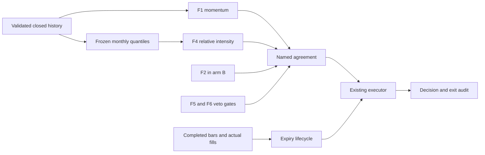

# Confluence Chain Design

Spec: `.specs/features/confluence-chain/spec.md`. Status: Draft, not approved.
All new names and interfaces below are proposals. Current source was inspected
at `6568120`; the planning source baseline is now merged `35a0dc9` (PR #87).
No code, runtime test, model or experiment was executed for this design.

The user-supervised Claude story is primary and remains unchanged. This design
is a reviewable implementation proposal, not its replacement. Resolve D1–D11
before dependent code work, especially the source's bar-open timing versus the
proposed completed-bar/next-event exit. Preserve the source spec, checked progress
and current evidence hash recorded in `context.md`.

## Architecture Overview

Extend the current chain collaborators. Retain `FilterChain.run`'s veto
short-circuit, the closed-bar clock, F5 risk math, F6 sizing and the existing order
executor. Pure helpers calculate history snapshots and expiry state; only the
integration lane connects them to native events and persistent artifacts.

This diagram shows information flow. Runtime filter order remains
F1 → F4 → optional F2 → F5 → F6 → agreement. A veto prevents terminal evaluation.
Expiry manages an existing trade independently of whether the current chain votes
HOLD, is warming up, or produces no new entry.

## Code Reuse Analysis

Paths in this table are relative to `algo-suite/algo-backtest/src/algo_backtest/`.

| Existing component | Current evidence | Proposed use |
| --- | --- | --- |
| `chain/model.py` | `Filter`, `TerminalDecision`, `FilterResult`, `FilterChain.run` | Keep protocols and NO_TRADE veto semantics |
| `chain/terminal.py:48` | F7 terminal and named last-filter terminal | Add agreement collaborator alongside existing terminals (T1) |
| `chain/filters/f1_trend.py:85` | Three-feature trend vote with conflict veto; result name `F1_trend` | Add selectable momentum behavior; leave original default behavior intact (T2) |
| `chain/filters/f4_news_context.py:350` | Threshold directions plus `intensity_sign: -1` swap | Add relative mode using validated snapshots, retain static/sentiment modes (T4) |
| `chain/filters/f6_capital_mgmt.py:134` | Typed config, ATR stop, explicit empty targets, trail and sizing | Add optional bar-count contract without a new sizing model (T5) |
| `perception/bar_clock.py:16` | Complete UTC buckets only; output timestamp is bucket start | Count emitted candles using start/end times; no partial-bar flush |
| `engine/chain_algorithm.py:361` | Minute management, closed-bar chain, actual order callbacks | Integration connects history and exit lifecycle (T13) |
| `engine/trade_plan.py:374` | Planned position and existing `hold_elapsed` | Reuse entry/trade identity; new pure expiry helper does not rewrite plan math |
| `chain/decision_recorder.py:19` | Fill-based trade IDs cleared at flat | Capture closing ID before clear and serialize separate exit records (T14) |
| `chain/audit.py:45` | Decision schema and filter metadata/enrichment serialization | Preserve decision shape; own additive exit-sidecar schema/serializer (T15) |
| `strategies.py:116` | Typed sections and parameter provenance | Integration validates new keys and reports them in `explain-strategy` (T11) |
| `chain/wiring.py:225` | Terminal and filter builders | Integration dispatches approved options and maps canonical voter names (T12) |

Analysis reuses `algo-suite/algo-analyze/src/algo_analyze/portfolio.py` for strict
producer-bound daily returns and `significance.py` for `paired_block_test`.
Story 20's scripts are read-only examples of registration and cell production;
do not copy their “untouched” labels, glob-latest selection or permissive legacy
CSV inference into new results.

## Components and Interfaces

### Agreement and identity (CC-01–CC-05)

Proposed `AgreementTerminalDecision(required_filters, voter_name_map)` implements
`decide(ExecutionState) -> Decision`. Configuration uses canonical lower-case YAML
IDs. Integration constructs a closed mapping to runtime result IDs, including
`f1_trend` → `F1_trend` and `f2_indicator` → `F2_indicator`; do not
silently lowercase arbitrary unknown names. Validate configured voters against
the strategy's direction-emitting filters. F5/F6 cannot be required voters.

Reject empty/duplicate/unknown required names and duplicate or missing required
results. Require every named voter to emit the same BUY or SELL. Optional
ABSTAIN/NEUTRAL are ignored; optional HOLD blocks; another directional vote in the
chain must agree. All abstentions produce HOLD. Risk-veto tests go through the
real `FilterChain.run`, proving that the terminal is not invoked after a veto.

### Momentum context (CC-06–CC-08)

T2 extends the existing F1 module with a typed momentum configuration and a pure
bounded history object or equivalent callable. Proposed inputs are ordered
completed bars, integer `lookback_bars`, and explicit coverage/warmup status.
Use L=480 for H1 and L=120 for H4, requiring L+1 closes. Compute the sign of
`last_close / lagged_close - 1`. Zero emits NEUTRAL; this variant never vetoes.
Do not inherit the original cross-timeframe trend conflict veto for momentum.

Integration feeds mid closes from the same `ClosedBarClock` used by the decision
path. A chronological buffer preserves only L+1 closes and their UTC close times.
Normal initial collection is WARMUP, not missing-data recovery. Once coverage is
expected, an absent interval or malformed quote hard-fails. Old trend mode and
its three-feature contract remain unchanged when the variant is absent.

### Intensity history and relative F4 (CC-09–CC-14)

New proposed `chain/intensity_history.py` holds a pure snapshot calculator.
Input record: `bar_closed_at`, `available_at`, finite `intensity`, and source
identity/hash. For month-start M use one observation per completed H1/H4 bar with
close in `[M-30d, M)` and `available_at < M`. Exclude a bar closing exactly at M.
Use the point-in-time intensity known at that bar close, not a revised final
daily value backfilled across its day. Current trigger input likewise requires
availability no later than the decision timestamp.

Sort finite sample values for linear interpolation at index `(n-1)*q`, q=.10/.90.
History timestamps themselves must arrive ordered and unique; sorting values
for quantiles is not permission to repair malformed event order. Require complete
coverage of the expected closed-bar grid for that interval after excluding
documented market closures. An empty or unexpectedly incomplete archive fails.
Initial valid streaming collection exposes WARMUP until a full window exists;
registered March runs must preload enough history to begin ready.

Snapshot fields: `cutoff`, `window_start`, `clock_minutes`, `q_low`, `q_high`,
`sample_count`, `max_closed_at`, `max_available_at`, `source_hash`, and quantile
method/version. Cache by pair, clock and month; freeze through the month. A
mid-month start computes the same snapshot. A changed source after freezing is
reported as a mismatch, never silently recalibrated. No outcome labels enter this
calculator.

T4 adds `direction_source: intensity_relative`. Proposed registered sign is -1:
I ≥ q90 → SELL; I ≤ q10 → BUY; interior → NEUTRAL. Test equal quantiles first:
q10=q90 → HOLD regardless of I. Preserve existing static and sentiment branches.
Explicit disabled news-veto configuration follows the existing rule template;
F5/F6 retain priority. Enrichment carries snapshot provenance and vote reason.

Availability is a blocking future data gate, not a solved schema assumption.
`algo-suite/algo-score/src/algo_score/events/models.py` currently has no
`available_at`. A Story 21 script can ingest a provenance sidecar or source release
ledger without changing that shared model. If neither can prove availability,
T9 fails and the main agent decides whether to authorize an upstream data change.
Do not infer availability from minute expansion timestamps or replace missing
news with zero. PR #87 already records the January/trading-year outlier analysis;
T9 consumes that report without redoing it or changing its checked progress item.
Its separate population ledger must reconcile calendar-expanded hours (January's
744 rows), actual complete H1/H4 decision bars, warmup, documented closures and
missing expected days/minutes. File sizes and `.done` markers do not establish
these row counts or availability, nor causal attribution to events named in the
archive. Missing proof remains a future gate failure, not a reason to overwrite
the user-supervised report.

### F6 and expiry lifecycle (CC-15–CC-22)

T5 extends `CapitalMgmtConfig` with optional positive integer `exit_after_bars`;
absence retains legacy behavior. Registered time arms explicitly use `targets: []`,
`trail_stops: []`, no minimum reward/risk target veto, risk .03, ATR period 14 and
multiplier 2. Existing spread, stop-floor and sizing rules still apply. The base
2×ATR distance is not a promise that every effective broker-adjusted stop equals it.

New `chain/time_exit.py` is independent of LEAN. Its lifecycle accepts the
actual filled entry identity/time, each distinct completed candle's start/end,
and actual order status/fills. It emits an expiry intent, never a synthetic fill.
Accepted timing (D5, user decision 2026-09-28, source wording): let t be the
signal bar during which the entry filled. The exit is at the open of bar t+N.
Expiry becomes due at the close of bar t+N-1 (which is the open of t+N); submit
on the first delivered tradable event whose timestamp is at or after that open,
after stop reconciliation. The fill price/time comes from the executor and may
be later still. Bar t counts even when the fill happened mid-bar.

Example: entry filled 10:00:30 UTC on H1 during bar 10:00–11:00 (t). Bars t..t+3
close at 11, 12, 13 and 14:00. Mark due at 14:00 (open of t+4) and submit on the
first actual event at or after 14:00; never assign the historical 14:00 bar open
as a fill. If the next quote arrives Monday, wait for it. H4 counts the same
number of bars but spans sixteen scheduled hours.

State: trade ID, entry fill time, last counted bar identity, completed count,
due time, pending order ID/status, final reason. Same-side signals do not reset
it. Flat clears it; a filled reversal starts a new identity. Full stop fill wins
over expiry; partial stop leaves only residual quantity eligible. Duplicate
events do not increment or resubmit. A live close order prevents a second close;
a confirmed rejection/cancellation allows retry on a later real event and is
audited. End-of-run pending trades stay visibly unresolved if no event follows.

T13 must prove native event ordering. Proposed priority is stop reconciliation,
expiry submission, configured veto closure, then new signal handling. Suppress
entry on an expiry-submission event. `close_on_veto` remains explicit and unchanged;
pending-close guards prevent duplicate veto closure. Register `min_hold_bars: 4`
for time arms so early opposite votes do not defeat the planned horizon. These
semantics are the accepted D5/D6/D11 decisions, not an assertion about current
LEAN behavior; T13 proves them natively.

### Drift controls and cell manifest (CC-23–CC-24, CC-28)

T7 adds a small explicit constant-direction filter, no F7 or artificial intensity
thresholds. It uses existing `FilterResult` and the named terminal. Both controls
enter whenever flat and eligible after risk/warmup rules; they share costs and
the time exit with A. M-only and both controls require no news input.

T10 proposes a single generator at
`algo-suite/experiments/confluence-chain/make_cells.py`, following the existing
`experiments/heikin-ashi-signals/strategies/` layout. It produces a deterministic
manifest and one config per cell under a caller-selected job directory. No
generated configs or jobs are created during planning.

| Arm | Direction voters | Exit | Count |
| --- | --- | --- | --- |
| A | F1 momentum, F4 relative; both required | Time + ATR | 2 clocks |
| B | F1 momentum, F4 relative, F2; all required | Time + ATR | 2 clocks |
| A-plan | Same as A | Pinned Heikin-Ashi H4 reference plan: 4R/6R and trail | 2 clocks |
| T-only | F4 relative required | Time + ATR | 2 clocks |
| M-only | F1 momentum required | Time + ATR | 2 clocks |
| always-short | Constant SELL required | Time + ATR | 2 clocks |
| always-long | Constant BUY required | Time + ATR | 2 clocks |

F5 remains daily loss .05, weekly loss .15, max concurrent 2, leverage 30 and
portfolio risk .18. Every cell uses EUR/USD, one USD 10,000 account, pinned OANDA
costs and 2016-03-01..2017-02-28 inclusive. A-plan is an exit-policy comparison;
pin all inherited stop, target, trail and hold settings before describing what it
isolates. No new candlestick, support/resistance, activity-veto or adaptive-model
arm is added. Disable unneeded inherited F3/F7/volume filters explicitly.

## Audit and Data Models (CC-31)

Reuse filter metadata/enrichment for momentum lag, snapshot and vote explanations.
Proposed exit sidecar `exit-events.json` has schema version 1 and records trade ID,
event sequence, clock minutes, N, completed bars, due time, submitted time, order
ID/status, fill time/quantity/price, and reason. Fields not yet observed are null
with an explicit lifecycle status, never invented prices. T15 defines and tests
this contract; T14 captures the trade ID before the existing recorder clears it.
The integration owner can accept a no-change decision-schema review while adding
the sidecar; no global schema migration is assumed.

Preserve `decisions.parquet`, `trade-plans.json` and `run.json` consumers. Existing
viewer decision reasons remain usable. A new viewer UI is outside scope; inability
to round-trip metadata or link artifacts becomes a reported integration failure.

## Exact Integration Handoffs

All paths below are future integration-lane work, never concurrent worker edits.
Backtest source/test paths use the prefix `algo-suite/algo-backtest/`.

| Task | Shared target | Story 21 payload / acceptance evidence |
| --- | --- | --- |
| T11 | `src/algo_backtest/strategies.py` | Typed momentum/relative/expiry/required-voter options, control registry, legacy rejection rules, provenance; `tests/features/strategy_config_artifact.feature`, `strategy_explain.feature`, corresponding step files |
| T12 | `src/algo_backtest/chain/wiring.py` | Factories for T1–T7, explicit result-name mapping, injected snapshots; `chain_wiring.feature` + steps, no F7 requirement for these cells |
| T13 | `src/algo_backtest/engine/chain_algorithm.py` | Closed-history feed and actual-fill expiry lifecycle; new `confluence_engine.feature` + steps with native integration tag; regress `closed_signal_parity`, `bar_clock`, `order_executor`, `trade_plan` |
| T15 | `src/algo_backtest/chain/audit.py` | Exit sidecar contract and additive serializer; preserve decision schema; `audit.feature` + steps and new sidecar scenarios |
| T14 | `src/algo_backtest/chain/decision_recorder.py` | Close-time ID capture and idempotent lifecycle recording; `decision_recorder.feature` + steps and sidecar round-trip scenarios |
| T20 | `monografia/chapters/04-experimental-evaluation.tex` | Pre-run registered protocol and inclusion point for T19's validated result fragment; no results claimed in advance |
| T21 | `monografia/chapters/05-conclusion.tex` | Qualified horizon lesson including null/unavailable outcomes |
| T22 | `algo-suite/algo-backtest/SPEC.md` | Public config, causal execution and additive audit contract documentation |

`algo-suite/algo-core/src/algo_core/config/schema.py`,
`algo-suite/algo-analyze/src/algo_analyze/resultsdb/schema.py`, shared fixtures,
`engine/trade_plan.py`, and any upstream score schema also belong to integration
if required. Preferred design does not modify them. A discovered need is handed
to the main agent as a concrete path/contract/test delta before scope expands.
The main agent determines the global merge order with Stories 19/22; Story 21
only requires T1–T10 contracts before its integration work and registration plus
data/native gates before any of its runs.

## Error Handling Strategy

| Condition | Outcome |
| --- | --- |
| Valid initial collection | Explicit WARMUP; HOLD; no fabricated observation |
| Unexpected missing/malformed history or invalid config | Raise with interval/key, cause and remediation; CLI boundary logs once |
| Missing availability proof, NAS input or native runtime | Preflight unavailable; no cell launch |
| Equal quantiles | HOLD, reported as degenerate snapshot; not a configuration error |
| Duplicate vote/bar/fill | Reject malformed vote/history; idempotently ignore an exact repeated lifecycle event |
| Failed cell or absent inference contract | Keep its manifest row, label failure; no zero-return substitution |

## Validation and Research Protocol

T8 re-derives the old H1 table into a new report with source hashes, joins,
normalized-return units and true EUR/USD price pips. It does not rerun or edit
archived cells. T9 validates price warmup, expected complete bars, news release
availability, all monthly snapshots and the reconciled population before runs.
The outlier analysis is already recorded in PR #87; no new causal event attribution
is inferred from its file-size evidence.
The availability gate may legitimately fail with the current archives.

T16 writes the registration README, copied unchanged into a later job. T17 builds
the bounded launch harness; it runs no cells during its implementation tests.
T20 places the protocol paragraph in Chapter 4 before T19 can execute exactly
14 cells through that harness, subject to separate runtime authorization and gates.
D7 proposes H1 A versus T-only as primary exploratory
contrast on Nov–Feb (already inspected), paired daily net portfolio returns,
stationary bootstrap block 4 / sensitivity 2, 999 resamples, seed 42, alpha .05.
H4's matching contrast is secondary. Other secondary contrasts are A versus
A-plan, B versus A and A versus each drift control. M-only remains a reported
ablation, not a basis for selecting a new winning cell. Record the fixed 14-cell
family and all prior exploratory looks; do not claim multiplicity-corrected or
confirmatory inference from a single nominal p-value.

Prediction endpoint uses next four completed closes on decisions that would
enter under that arm's position/risk policy. Report n, hits, zero-return misses,
and incomplete-forward-horizon exclusions for each cell. Do not treat overlapping
horizons as independent confidence-interval samples. Trade-based equity and
prediction hit rate remain distinct endpoints. Daily inference uses current
producer contracts and exact run IDs, not a latest-directory glob. Full-year and
Mar–Oct descriptions are exploratory; no unseen result is invented now.

## Risks & Concerns

| Concern | Location | Impact | Mitigation |
| --- | --- | --- | --- |
| Runtime name differs from config name | `chain/filters/f1_trend.py:91` | Required votes appear absent | T11/T12 explicit mapping with BDD mismatch cases |
| No news availability field | `algo-score/src/algo_score/events/models.py:46` | Apparent causal quantiles can leak daily future information | T9 provenance gate; stop if unprovable |
| Calendar population labeled decision bars | PR #87 evidence, monthly table | 744 January rows can overweight closures or conceal missing days | T9 independent population ledger; preserve archive and checked progress |
| Minute execution and closed-signal timing differ | `engine/chain_algorithm.py:361` | Synthetic open fills or stop/expiry double close | T6 event table plus T13 native ordering scenarios |
| Bar index advances only after indicators ready | `engine/chain_algorithm.py:378` | Reusing it blindly miscounts expiry | Count distinct emitted complete bars independently in T6/T13 |
| Recorder clears identity at flat | `chain/decision_recorder.py:60` | Exit loses trade link | T14 capture closing ID before clearing; T15 sidecar |
| Existing target defaults are nonempty | `chain/filters/f6_capital_mgmt.py:386` | A supposed time-only cell gets a profit target | T5/T10 explicit empty targets and resolved-config checks |
| Historical inference described an untouched window | Story 20 registration and paired script | False confirmatory claims | T16/T18 use corrected labels and current portfolio reader |
| Broad CodeGraph anchors include stale QA worktrees | Index search results | Plans point to wrong paths | Ground every gate in current workspace files |
| Shared-file collision with Stories 19/22 | Integration targets above | Concurrent changes overwrite contracts | Path leases and main-agent serialized integration |

## Tech Decisions

D1–D11 are feature-local draft assumptions in the spec. No STATE decision or
shared architecture convention is changed. No new external library is required
by the proposal. Host and native Gherkin gates, Makefile checks and the documentation
validators are detailed in `tasks.md`; only the last category runs this turn.
