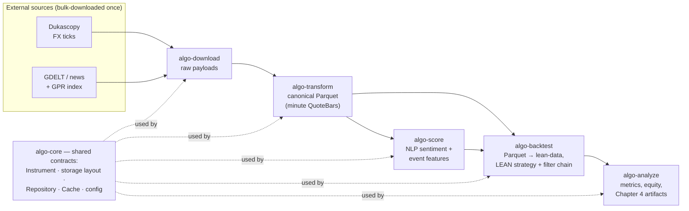

# TCC — Algorithmic Trading Enhanced by AI

Final research project (Trabalho de Conclusão de Curso) for the MBA in Artificial
Intelligence and Big Data (MBAIAe, ICMC/USP).

**Title:** *Algorithmic Trading Enhanced by AI: Using News, Geopolitical Events
and NLP-Based Sentiment in Forex Decision-Making*

**Author:** Wellington Souza
**Submission track:** TCC normal (Track a): Introduction, Theoretical Foundation,
Methodology/Proposal, Experimental Evaluation, Conclusion.
**Timeline:** intermediate methodology delivery **2026-05-25 (done)**; final
submission **2026-09-01**; scope freeze ~late August 2026.

This repository holds two things side by side: the **written thesis**
(`monografia/`) and the **software** that produces its empirical results
(`algo-suite/`). This README is the entry point for a collaborator: what the
project is, how the repo is laid out, how to set each part up, and how to work in
it.

---

## Premise

The project revisits a Forex day-trading system the author worked on around 2010
(MetaTrader, technical analysis only) and rebuilds it with modern tooling. The
hypothesis (H1): price-only models miss the informational forces (wars,
sanctions, supply-chain shocks, policy shifts) that increasingly drive FX, and
LLM-era NLP can supply that missing context. H1 is a falsifiable conjecture to be
tested, not a promised result; a rejection is itself a reportable contribution.

The empirical work develops and evaluates a **hybrid strategy** combining
technical indicators, NLP-derived sentiment (FinBERT + a Loughran–McDonald
baseline) and geopolitical/event context (GDELT, the GPR index), against a
price-only baseline.

- **Currency pairs:** EUR/USD and USD/JPY.
- **Window:** 2015-02-19 → 2024-12-31 (~10 years).
- **Data architecture:** bulk-download once, query locally. No live APIs in the
  hot path; backtests read Parquet from local/NAS storage via DuckDB and replay
  on a local LEAN engine.

---

## How the software works

`algo-suite/` is a **uv workspace of six `algo-*` tools** sharing one library
(`algo-core`). It is a linear pipeline: each tool reads the previous stage's
durable artifact and writes its own, so any stage can be re-run in isolation.



The guiding principle is **agentic perception, deterministic execution**:
non-deterministic models (LLM-era NLP sentiment, event scoring) are precomputed
*once* into features that are read deterministically at backtest time, while the
trade-decision layer is a rule-based, fully audited filter chain. Two strategies
are compared under the same protocol — a price-only **baseline** and a **hybrid**
that adds the news/sentiment feature family — and the headline result is the
**deflated, permutation-tested hybrid − baseline delta**, not the absolute level.

Canonical **Parquet is the single source of truth**; the LEAN-native `lean-data/`
store and the feature cache are *derived* (materialized once, reused across a
sweep). See [`algo-suite/docs/algo-suite-design.md`](algo-suite/docs/algo-suite-design.md).

---

## Repository layout

```
tcc/
├── README.md            # you are here
├── PRD.md               # product source of truth: vision, scope, roadmap, phases
├── monografia/          # LaTeX thesis (USPSC/abntex2, English-only body)
├── related-work/        # reference PDFs of prior art (read-only; git-lfs submodules)
└── algo-suite/          # the software: a uv workspace of algo-* tools
    ├── docs/                  # design corpus: algo-suite-design · parquet-evaluation · experiments · technical-debt
    ├── algo-core/  algo-download/  algo-transform/
    ├── algo-score/ algo-backtest/  algo-analyze/   (each holds its own SPEC.md)
    │   └── algo-download/reference-impl/   # legacy GDELT downloader, parked for migration (TD-12)
    ├── conf/   data/   pyproject.toml   Makefile
    └── README.md              # software setup + per-tool guide
```

The per-tool technical specs are **colocated** with the code as
`algo-suite/algo-<tool>/SPEC.md`, and the design corpus lives under
`algo-suite/docs/`. Only the product-level `PRD.md` stays at the repo root.

---

## Getting started

The two parts are independent; set up whichever you are working on.

### The software (`algo-suite/`)

Prerequisites: [uv](https://docs.astral.sh/uv/) (≥ 0.10), Python 3.11 (pinned),
Docker (later, for the LEAN engine).

```bash
cd algo-suite
make install      # uv sync --all-packages → one .venv at the workspace root
make check        # ruff + mypy(strict) + pytest (BDD)
uv run algo-download --help
```

See [`algo-suite/README.md`](algo-suite/README.md) for the pipeline, per-tool
guide, configuration and data model.

### The thesis (`monografia/`)

Toolchain: `latexmk` + `pdflatex` + `bibtex` (not biber) + `makeindex`.

```bash
cd monografia
make            # incremental build → build/tcc.pdf
make watch      # rebuild on save
make verify     # page count + undefined-citation scan
make pt-scan    # list leftover Portuguese-accented words (body is English-only)
```

Do **not** modify files under `monografia/classe/` (vendored USPSC class). The
body is English; the `Resumo` is the one pt-BR section (required by ABNT).

### Reference PDFs (`related-work/`)

These are **git-lfs** submodules. Install git-lfs (`sudo apt install git-lfs &&
git lfs install`) before touching them, or LFS-tracked files will not check out.

---

## Documentation map

| Read this | For |
|---|---|
| `PRD.md` | product scope, currency pairs, window, roadmap/phases, timeline |
| `algo-suite/docs/algo-suite-design.md` | architecture, stack, conventions, spec template |
| `algo-suite/docs/parquet-evaluation.md` | storage and compute model (Parquet source of truth, durable `lean-data/`, read-through cache) |
| `algo-suite/docs/experiments.md` | how experiments map to Chapter 4 artifacts |
| `algo-suite/docs/technical-debt.md` | deferred-debt ledger (blocker + unblock trigger per item) |
| `algo-suite/algo-<tool>/SPEC.md` | the contract for each tool |
| `monografia/Final Research Project.pdf` | the original assignment brief |

---

## Conventions (please follow when contributing)

- **New code lives under `algo-suite/`**, each tool a workspace member. Do not
  add tools to `algo-download/reference-impl/` (legacy, parked for migration).
- **Every test is BDD — no exceptions**: Gherkin `.feature` + pytest-bdd step
  definitions under each tool's `tests/features/` / `tests/steps/`. Write the
  scenario first; never a plain `def test_…()` (not even for unit/pure logic).
- **Convention over configuration**: the suite runs zero-config; `conf/*.yaml`
  files exist only to override a default. Precedence: env (`ALGO_*`) >
  `conf/<tool>.yaml` > `conf/algo.yaml` > defaults. One `data_root`
  (`ALGO_DATA_ROOT`, default `algo-suite/data/`).
- **Code style**: SOLID, clean code, single-return value objects, no magic
  numbers, GoF patterns only where they remove duplication (design doc §13).
  `make check` (ruff + mypy strict + pytest) must pass.
- **Prose style**: no mid-sentence em-dash "asides" in the thesis, decks or docs
  (use commas/parentheses/colon); the thesis body is English-only, in **American
  English** (spelling: `-ize`/`-ization`, `-or`, `artifact`, `analyze`, `center`,
  `license`, `modeling`) across prose, docs, comments and docstrings.
- **Bulk-download once, query locally**: no live API calls on the hot path.

---

## Working together

- Branch off `master` for every change and open a PR; the maintainer reviews and
  merges. Do not commit feature work straight to `master`.
- Keep each change scoped to one concern; update the colocated `SPEC.md` and the
  tool README when behavior changes.
- The author commits the thesis and merges; coordinate before large refactors of
  shared contracts in `algo-core` (they ripple across every tool).
- **Status (2026-05-25):** `algo-core` (shared library + storage layout, Repository
  and Cache ports, config loader), `algo-download` (Dukascopy `.bi5` ingestion) and
  `algo-transform` (ticks → minute `QuoteBar` Parquet) are implemented and gated.
  `algo-backtest` has the canonical-Parquet → `lean-data` materializer and a
  testcontainers LEAN integration that nailed the UTC/START-indexed forex timezone;
  its strategy/backtest path is next. `algo-score` and `algo-analyze` are stubs. The
  current goal is the first end-to-end EUR/USD baseline backtest (Chapter 4).
