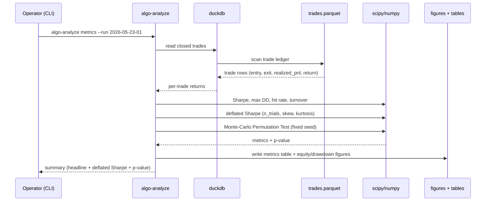
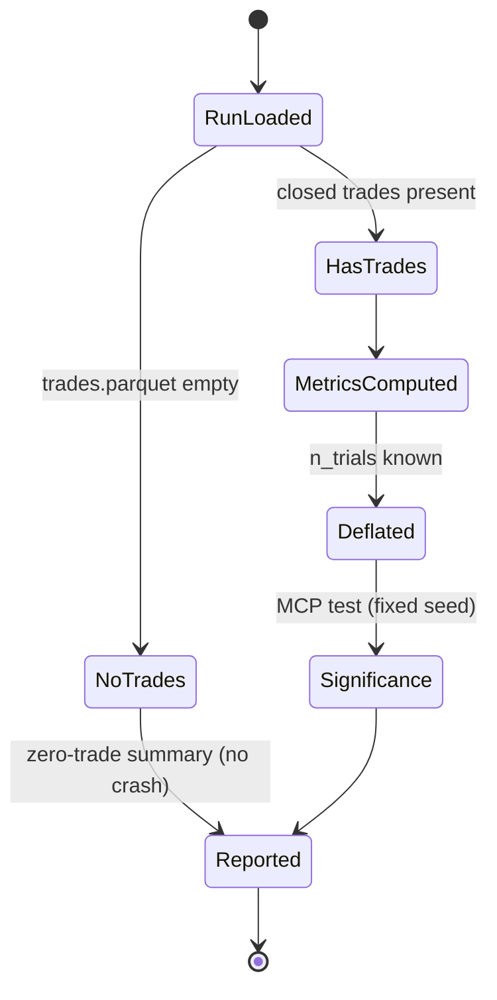

# Spec — algo-analyze

## 1. Purpose & scope

`algo-analyze` is the final pipeline stage: it reads a backtest **run directory**
(results + `decisions.parquet` audit trail) and produces the **evaluation
artifacts** — performance metrics, the deflated Sharpe ratio, the Monte-Carlo
Permutation Test, ablation comparison tables, and the figures the thesis needs.

It is read-only over run outputs; it never trades, scores or transforms. It
turns runs into the numbers and figures of the experimental chapter (§3.11 of
the methodology) and the audit-trail forensics (§11.3.4).

Out of scope: producing runs (that is `algo-backtest`); live monitoring.

## 2. Inputs & outputs

| Direction | Item | Form |
|---|---|---|
| In | run directory | `runs/<run-id>/` (`trades.parquet`, `decisions.parquet`, equity, `parameters.txt`) |
| In | one or many runs | for ablation / cross-run comparison |

Per-trade metrics are computed from **`trades.parquet`** (the trade ledger,
entry↔exit linked with realized PnL — `algo-backtest` §6.1), **not** by filtering
`decisions.parquet`. `decisions.parquet` (bar-level chain audit) is used only for
**forensics** (per-filter contribution on losing trades), joined to trades by
the **`trade_id` foreign key** carried in the audit trail — not a fragile
timestamp+pair match. This is the fix for the prior contract gap: `HOLD`/
`NO_TRADE` rows are bar events, not trades.
| Out | metrics table | per run: Sharpe, deflated Sharpe, max drawdown, hit rate, holding time, turnover |
| Out | significance result | MCP test p-value / percentile per strategy variant |
| Out | ablation table | filter/feature-family contribution across runs |
| Out | figures | equity curves, drawdown, coverage, ablation bars (for the thesis) |

## 3. Architecture & libraries

- **duckdb** — the analytical spine: read `trades.parquet` for per-trade metrics;
  read `decisions.parquet` and join to trades on `trade_id` for per-filter
  forensics.
- **numpy** / **scipy** — deflated Sharpe (Bailey–López de Prado), Monte-Carlo
  Permutation Test (Aronson), distribution stats.
- **pandas** — small result frames for matplotlib interop.
- **matplotlib** — equity curve, drawdown, coverage matrix, ablation bars;
  outputs sized for the LaTeX thesis.
- **algo-core** — DuckDB helpers, layout, logging.

```
algo_analyze/
├── cli.py             # algo-analyze summary [--out] (impl.); metrics|significance|… (planned)
├── config.py          # IMPLEMENTED — load_analyze_config(): data_root via shared resolve
├── summary.py         # IMPLEMENTED (F2) — discover_experiment_manifests/load_summary_rows/
│                       #   write_summary_csv: union experiment.json manifests → summary.csv
├── metrics.py         # Sharpe, max DD, hit rate, holding time, turnover (planned)
├── deflated.py        # deflated Sharpe ratio + minimum-backtest-length bound (planned)
├── permutation.py     # Monte-Carlo Permutation Test over rule outputs (planned)
├── ablation.py        # cross-run filter/feature-family contribution (planned)
├── audit.py           # forensic queries over decisions.parquet (planned)
└── figures.py         # matplotlib renderers for the thesis (planned)
```

### 3.3 Implemented: F2 result aggregation (`summary.py`)

The first implemented analyze stage unions the **experiment manifests** that
`algo-backtest experiment run` writes (`runs/experiments/*/experiment.json`, one flat row
per run) into one canonical Chapter-4 CSV. It reads the manifests only — not the per-run
artifacts — because the manifest is already the row contract. Closed-schema, fail-fast
validation (corrupt manifest; an experiment with both a manifest and an error artifact;
missing/unknown/wrong-typed columns) **plus producer/consumer integrity**: a row's
`experiment` must match its manifest's name, every aggregated run must be successful
(`success=true`), and `(experiment, run_id)` must be unique across the whole summary.
Deterministic + atomic write, so the CSV is byte-stable across re-runs and
thesis-importable. Failed-only experiments are skipped.
Columns: `experiment, run_id, strategy, symbol, from, to, success, closed_trades,
total_return, sharpe, max_drawdown, hit_rate, run_dir`. The deflated-Sharpe / MCP /
ablation surfaces below are later work and will read the richer `trades.parquet` /
`decisions.parquet` once those exist.

## 4. Diagrams

### 4.1 Sequence — evaluate a run and emit metrics + significance



### 4.2 State — analysis run lifecycle



## 5. CLI surface

```
algo-analyze summary      [--out <path.csv>]         # IMPLEMENTED (F2) — union experiment
                                                     #   manifests → Chapter-4 summary CSV
algo-analyze metrics      --run <id>                 # headline + supplementary metrics (planned)
algo-analyze significance --run <id> [--trials N]    # deflated Sharpe + MCP test (planned)
algo-analyze ablation     --runs <id1> <id2> ...     # cross-run contribution table (planned)
algo-analyze audit        --run <id> --query <...>   # forensic decisions queries (planned)
algo-analyze figures      --run <id> --out <dir>     # thesis figures (PDF/PNG) (planned)
```

## 6. Data contracts

- Reads `runs/<id>/trades.parquet` (trade ledger, schema per `algo-backtest`
  §6.1) for per-trade metrics, `runs/<id>/decisions.parquet` (schema per
  `algo-backtest` §6.2) for forensics, and `parameters.txt`.
- Metrics output: a tidy Parquet/CSV table, one row per run, columns =
  {sharpe, deflated_sharpe, max_drawdown, hit_rate, avg_holding, turnover,
  mcp_pvalue, n_trades, n_trials}.
- Figures: PDF (vector, for LaTeX `\includegraphics`) + PNG.

## 7. Error handling

- Empty `trades.parquet` (no closed trades) → zero-trade summary, not a crash.
- Deflated Sharpe with `n_trials < 2` → report undeflated with an explicit note.
- MCP test → **fixed permutation seed**; result reproducible; the seed is
  recorded with the output.
- Missing `trades.parquet` or `decisions.parquet` → clear error naming the run id.
- Drawdown on zero open positions → defined as 0, not NaN.

## 8. Test scenarios (Gherkin)

```gherkin
Feature: Performance metrics
  Background:
    Given a run directory with trades.parquet and decisions.parquet

  Scenario: Headline metrics from the trade ledger
    When I run "algo-analyze metrics --run R1"
    Then Sharpe, max drawdown, hit rate, holding time and turnover are computed
    And they are computed from trades.parquet (closed trades), not from decisions.parquet

  Scenario: Empty trade ledger does not crash
    Given a run whose trades.parquet has no closed trades
    When I run metrics
    Then a zero-trade summary is produced
    And the command exits 0

  Scenario: Forensics join uses decisions, metrics use trades
    When I query which filter was most often wrong on losing trades
    Then losing trades come from trades.parquet
    And per-filter contributions come from decisions.parquet joined by trade_id

Feature: Deflated Sharpe ratio
  Scenario: Deflation penalises many trials
    Given an observed Sharpe and 50 independent trials
    When the deflated Sharpe is computed
    Then it is lower than the observed Sharpe
    And it accounts for return skew and kurtosis

  Scenario: Too few trials reports undeflated with a note
    Given only 1 trial
    When deflation is requested
    Then the undeflated Sharpe is reported with an explicit caveat

Feature: Monte-Carlo Permutation Test
  Scenario: Reproducible significance under a fixed seed
    Given a fixed permutation seed and 1000 permutations
    When I run significance twice
    Then both runs report the same p-value
    And the seed is recorded with the result

  Scenario: Significant only above the 95th percentile
    Given a strategy whose observed Sharpe is below the 95th percentile of the null
    When significance is computed
    Then the strategy is reported NOT significant

Feature: Ablation
  Scenario: Cross-run feature-family contribution
    Given runs for baseline and hybrid (+news)
    When I run "algo-analyze ablation --runs baseline hybrid"
    Then a table shows the marginal contribution of the news family
    And metrics are aligned per run

Feature: Audit forensics
  Scenario: Which filter was most often wrong on losing trades
    Given a decisions.parquet with filter_results per trade
    When I query losing trades
    Then I can aggregate per-filter recommendation accuracy in one query
```

Edge cases (this tool's §8 themes): deflated Sharpe with `<N` trials; MCP
reproducibility (fixed seed recorded); empty run; NO_TRADE-only run; drawdown
on zero positions; cross-run alignment for ablation; forensic per-filter
aggregation.

## 9. Acceptance criteria

- Metrics, deflated Sharpe and the MCP test computed for a run; significance
  reproducible under a fixed seed.
- Ablation table compares baseline vs hybrid and reports marginal contribution.
- Figures render as thesis-ready PDFs.
- Phase 5 demo: full evaluation of the numbered experiments (§3.11).

## 10. Open items

- Whether to adopt a tearsheet library (e.g. quantstats) or keep custom
  matplotlib (default: custom, to control thesis figure styling).
- Exact deflated-Sharpe trial-count accounting across the ablation set
  (tie to the minimum-backtest-length bound).
- Figure style pack shared with the LaTeX thesis (fonts, sizes, palette).
