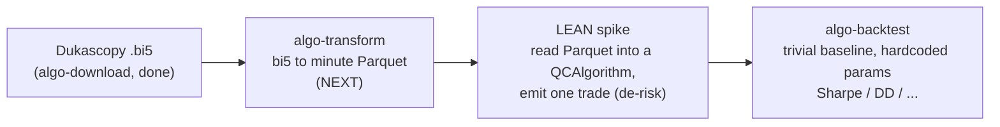

# Chapter 04 deliverables → tool → status

The critical path to thesis results. Each Chapter 04 section (see
`monografia/chapters/04-experimental-evaluation.tex`) maps to the artifact it
needs, the tool that produces it, and whether that tool exists yet. **Building
tools is the critical path, not more architecture.** Update the status column as
the pipeline comes up.

Legend: ✅ ready · 🟡 partial · ❌ blocked (tool not built).

| Ch04 § | Deliverable | Needs (tool) | Status |
|---|---|---|---|
| §4.1 Experimental Setup | Which adapters/scorers/strategies run end-to-end; exact data spans | narrative over all tools | ❌ |
| §4.2 Data Coverage | News coverage matrix over the window; empirical training span (coverage rule) | `algo-download` (GDELT + Dukascopy) → `algo-transform` | ❌ GDELT not built |
| §4.3 **Baseline** | Price-only EUR/USD (USD/JPY if time): **Sharpe, max drawdown, hit rate, avg holding time, turnover** | `algo-download` (Dukascopy ✅) → `algo-transform` → `algo-backtest` (LEAN) | ❌ transform + backtest not built |
| §4.4 Hybrid | Same metrics with sentiment/events | + `algo-score` → `algo-backtest` | ❌ |
| §4.5 Ablations | price-only / +sentiment / +events / full hybrid | all tools | ❌ |
| §4.6 Zhang comparison | Sharpe & drawdown side-by-side vs `zhang2025macroalpha` | §4.3 + §4.4 results | ❌ |
| §4.7 Threats to validity | Discussion specialized to observed results | §4.3–§4.6 results | ❌ |

## The first real number (current focus — vertical slice)

The shortest path to **one** Ch04 table (§4.3 baseline) is the price-only chain,
no news:

Reaching this unblocks §4.3 and kills the highest technical risk (LEAN
integration) before any sentiment work. GDELT/score/hybrid (§4.2, §4.4, §4.5)
come **after** the price-only chain produces a number.
