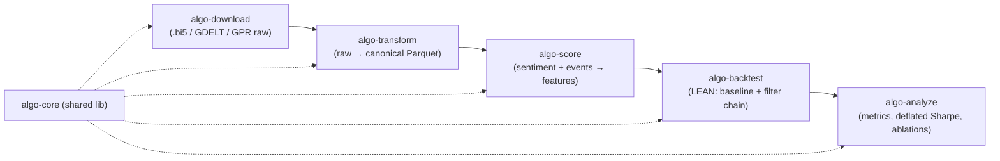
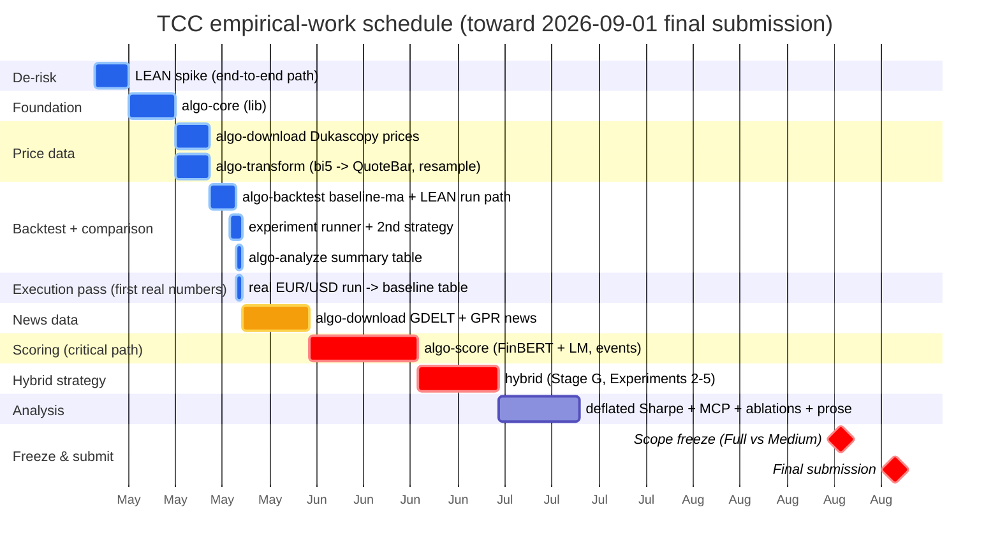

# PRD — Algorithmic Trading Enhanced by AI

**Product Requirements Document** for the empirical work of the TCC
*"Algorithmic Trading Enhanced by AI: Using News, Geopolitical Events and
NLP-Based Sentiment in Forex Decision-Making"* (MBA in Artificial Intelligence
and Big Data, ICMC/USP).

This document is the **product-level** source of truth: vision, scope, currency
pairs, time window, the tool suite at a glance, the delivery roadmap, data
sources, onboarding, and what is out of scope. **Technical design lives in
[`algo-suite/docs/algo-suite-design.md`](algo-suite/docs/algo-suite-design.md); per-tool specs live
beside each tool as `algo-suite/algo-<tool>/SPEC.md`.** Detailed dated architectural history is
preserved in `specs.md` (archive).

---

## At a glance (1-page summary)

- **What:** test whether adding NLP sentiment + geopolitical/event context to a
  price-only Forex baseline improves risk-adjusted return after costs
  (hypothesis **H1**), on **EUR/USD** and **USD/JPY**, over **2015–2024**.
- **How:** a modular pipeline of five tools, each named for its step —
  `algo-download → algo-transform → algo-score → algo-backtest → algo-analyze`
  (shared lib `algo-core`) — communicating through a canonical Parquet
  filesystem contract, with a deterministic, auditable filter chain on top of a
  LightGBM meta-learner (LEAN engine).
- **Phases (each produces a showable artifact):** 1 data → 2 features →
  3 price-only baseline → 4 hybrid vs baseline → 5 analysis (deflated Sharpe,
  significance, ablations). Phase 6 (paper trading via OANDA) is a post-freeze
  stretch.
- **Timeline:** intermediate methodology delivery (2026-05-25) **done**;
  empirical work runs to the **2026-09-01** final submission (~3 months), scope
  freeze ~late August (Full vs Medium).
- **Key result test:** **hybrid − baseline delta**, deflated and
  permutation-tested — not the absolute baseline level (a flat/negative
  unleveraged-FX baseline is expected).
- **Top risks:** LEAN integration (**retired** — a testcontainers suite validates
  the Parquet→lean-data→engine path and the UTC/START-indexed timezone), Dukascopy
  single-source (yfinance fallback), FinBERT cost (Loughran–McDonald fallback).
- **Reproducibility:** every Chapter-4 number traces to a `run-id`, its command,
  `parameters.txt` and `features_hash`.

---

## 1. Vision & hypothesis

Price-only models miss the informational forces — wars, sanctions, supply-chain
shocks, policy shifts — that increasingly drive FX. The product develops and
evaluates a **hybrid algorithmic trading strategy** that fuses:

- traditional technical indicators on Forex price data,
- sentiment signals extracted from textual sources via NLP (FinBERT-class +
  a Loughran–McDonald baseline),
- contextual geopolitical/event signals (GDELT, the GPR index).

**Hypothesis (H1):** a hybrid strategy that adds NLP-derived sentiment and
geopolitical/event context to a price-only baseline improves risk-adjusted
return after realistic transaction costs, on major Forex pairs, under a
walk-forward, purged-cross-validation protocol.

The commercial intent beyond the TCC shapes the engineering: a modular,
containerized tool suite whose hot-path modules can later be re-implemented in a
faster language without redesign (see design doc §13).

**Strategy model (baseline vs hybrid — one unambiguous definition).** Both the
baseline and the hybrid are **ML strategies**: each feature family is scored by a
LightGBM sub-model, and a logistic **meta-learner** combines the sub-model
outputs into a probability `p̂ₜ`; a **deterministic filter chain** then converts
`p̂ₜ` into the trade decision. The two differ only in feature families:
**baseline** uses the price-derived families (TA, indicators, patterns,
market-activity); **hybrid** adds the news family. The "reference trend strategy"
named in the specs is the **filter-chain (execution-layer) configuration** — the
deterministic rules wrapping `p̂ₜ` — **not** an alternative to the meta-learner.
So: perception/fusion = LightGBM sub-models → logistic meta-learner; execution =
deterministic filter chain; baseline vs hybrid = news family excluded vs included.

**Scope of generality.** The *architecture* is asset-class agnostic — the
`Instrument` value object, the data/filesystem contracts and the filter chain
carry no Forex assumption (design doc §6.1; monografia Ch.5). The *current
implementation scope is Forex-first*: this TCC implements and evaluates only FX
(EUR/USD, USD/JPY). Equities, commodities and crypto are supported by the design
(a new `AssetSpec` + adapters) but are **not** built or evaluated here — they are
future work. Where this PRD and the specs say "Forex", "pip", "currency pair",
that is the current implementation, not a limit of the architecture.

## 2. Scope & timeline

- **Submission track:** TCC normal (Track a) — Introduction, Theoretical
  Foundation, Methodology/Proposal.
- **Intermediate delivery (DONE):** methodology/proposal (Chapters 1–3),
  submitted **2026-05-25**. This deliverable is complete.
- **Final submission:** **2026-09-01** (~3 months of runway). The empirical
  work (the `algo-*` suite and the experimental chapter) is built toward this
  date — there is no 2-day constraint.
- **Delivery target:** **Full** (methodology + ingestion + baseline backtest +
  at least one hybrid backtest with sentiment) with **Medium** as the fallback
  (methodology + ingestion + baseline; hybrid documented as future work).
- **Scope freeze:** ~1 week before final submission (late August 2026, exact
  date TBC). If the hybrid backtest is not running cleanly by the freeze, scope
  freezes at Medium.

## 3. Currency pairs

- **Now:** **EUR/USD** and **USD/JPY** (USD per euro; yen per US dollar).
- Two pairs (not one) force a clean `Instrument` abstraction — JPY breaks single-pair
  assumptions (pip at 0.01 vs 0.0001, price magnitudes, carry-trade regime).
- **Future:** if the approach validates, simulate across all major FX pairs
  (the pair universe is configuration-driven, so scaling is config, not code) —
  which also strengthens the volume/currency-strength signal.

## 4. Time window

- **Target:** **2015-02-19 → 2024-12-31** (~10 years). GDELT 2.0 starts
  2015-02-19 (earliest practical bound); 2025 is left unobserved as
  out-of-sample data for follow-up work.
- **Coverage rule (data-driven):** computed after ingestion; the coverage matrix
  is published as a thesis figure, making the window defensible and reproducible
  rather than arbitrary.
  - **MVP (phase-1 sources: GDELT only as a news corpus):** the binding corpus is
    **GDELT** (starts 2015-02), so the window is the largest contiguous span
    where GDELT covers ≥ 80 % of months. GPR is a continuous macro **index**, not
    a news corpus, so it does not count toward a corpus quorum; it is a feature
    available across the window.
  - **When ≥ 2 news corpora are ingested** (FNSPID, CC-News, central-bank,
    Reddit — incremental/future), the rule tightens to the largest contiguous
    span where **≥ 2 news corpora** each cover ≥ 80 % of months. The
    single-corpus MVP rule is the special case until then.
- Walk-forward split is roughly 2015–2022 train / 2023 validation / 2024 test,
  subject to the coverage rule.

## 5. The tool suite at a glance

A modular pipeline of self-describing `algo-<action>` tools; the name signals the
step and the next tool. Each is an independent, containerized package
communicating through the canonical Parquet filesystem contract. Parquet is the
source of truth; the LEAN-native `lean-data/` execution store and the feature
cache are *derived* and read-through — materialized once on first miss and reused
across the backtest sweep, never recomputed per run (`algo-suite/docs/parquet-evaluation.md`).

| Tool | Responsibility | Spec |
|---|---|---|
| `algo-core` | shared lib: `Instrument`, Parquet layout, DuckDB, config, Repository + Cache ports | [algo-core](algo-suite/algo-core/SPEC.md) |
| `algo-download` | bulk fetch per source (Dukascopy, GDELT, GPR) → raw | [algo-download](algo-suite/algo-download/SPEC.md) |
| `algo-transform` | raw → canonical Parquet; minute QuoteBars; coverage + currency-strength | [algo-transform](algo-suite/algo-transform/SPEC.md) |
| `algo-score` | FinBERT + LM sentiment (per-currency) + events → feature Parquet | [algo-score](algo-suite/algo-score/SPEC.md) |
| `algo-backtest` | LEAN engine, deterministic filter chain, risk/sizing, audit trail | [algo-backtest](algo-suite/algo-backtest/SPEC.md) |
| `algo-analyze` | metrics, deflated Sharpe, MCP test, ablations, thesis figures | [algo-analyze](algo-suite/algo-analyze/SPEC.md) |

## 6. Delivery roadmap — demoable phases

Each phase produces a showable artifact, so there is always a complete slice to
present to the advisor, and the Full/Medium freeze has a clean fallback.

| Phase | Tools | Demo artifact | Methodology § |
|---|---|---|---|
| **0** | `algo-core` | (foundation — not a demo) | §3.4 |
| **1** | `algo-download` + `algo-transform` | price + GDELT + GPR in Parquet + **coverage-matrix figure** | §3.5, §3.6 |
| **2** | `algo-score` | per-currency sentiment + event features aligned to price | §3.7 |
| **3** | `algo-backtest` (baseline) | **price-only Sharpe + equity curve** (Experiment 1) | §3.8, §3.10 |
| **4** | `algo-backtest` (filter chain) | **hybrid vs baseline** (Experiments 2–5) | §3.8 |
| **5** | `algo-analyze` | ablations, deflated Sharpe, MCP test (Experiments 6–9) | §3.11 |
| **6** *(stretch)* | `algo-backtest` (live mode) | **paper execution** against OANDA demo via LEAN's Oanda brokerage — same deterministic chain, live data feed | future / post-freeze |

**Phase 6 is a stretch goal, off the TCC freeze critical path.** The architecture
already supports it: LEAN's `Lean.Brokerages.Oanda` adapter (Apache 2.0) lets the
same deterministic filter chain run against a live OANDA demo feed with no engine
change — only a brokerage/config switch. It demonstrates the path from backtest
to paper trading; **real-money execution stays out of scope.** It is pursued only
after the Full deliverable (phases 1–5) is secured, so it never endangers the
2026-09-01 final submission.

**Progress (2026-05-26).** Built somewhat out of original order: the LEAN run path,
backtest infrastructure and the Chapter-4 aggregation are **done ahead of `algo-score`**.
`algo-core`, `algo-transform`, Dukascopy download, the `algo-backtest` baseline + LEAN run
path, the reproducible **experiment runner** (F1), a **second price-only strategy** +
multi-strategy comparison (F3), and the **`algo-analyze` summary table** (F2) are complete
**as code (built + tested on unit/integration fixtures)**. The **execution pass is now
done**: the whole price chain ran on real Dukascopy EUR/USD 2024-06 data and produced the
**first real baseline numbers** — both price-only baselines lose (as expected for naive
rules paying the spread); see `algo-suite/docs/first-baseline-results.md`. So the entire
**price side + comparison is complete on real data**. The **critical path to the hybrid** is
now news ingestion (GDELT/GPR) → `algo-score` (sentiment/features) → the real news-aware
hybrid strategy (Stage G). No price-only result is labelled "hybrid".

**Correction (2026-09-25).** Phase 5 (`algo-analyze`) is now fully built and
tested (metrics + deflated Sharpe + MCP significance + ablation + figures +
summary, PR #21, 73/73 tests green), not just the F2 summary table. Phase 2
(`algo-score`) and the GDELT/GPR side of Phase 1 are also built (code-level,
tested on fixtures) — `algo_download/adapters/{gdelt,gpr}/` and the full
`algo_score` module set are real, not stubs. Phase 4 (`algo-backtest` filter
chain) is landed for F1/F2/F3/F5/F6 + the order executor + audit trail; only
F4 (news-context) and F7 (meta-learner) remain. **The critical path is now a
data-materialization run, not more tool-building**: `algo-download` →
`algo-transform` → `algo-score` have never been run against the real NAS data
root (only `forex/` price data exists there), which is what blocks F4/F7 and
therefore the hybrid strategy. See `docs/stories/00-PLAN.md` §1 for detail.

If a phase runs hot, incremental work (extra news adapters, ablation variants)
is deferred to future work without blocking the freeze.

## 7. Data sources

Built most-relevant-to-Forex first, until time runs out.

| Order | Source | Coverage | Phase |
|---|---|---|---|
| 1 | Dukascopy tick data (price, primary) | full window | 1 (blocking) |
| 1b | **yfinance daily FX (price fallback)** | full window | 1 (de-risk) |
| 2 | GDELT 2.0 (events/news) | 2015-02 → present | 1 (adapter exists) |
| 3 | GPR index (Caldara & Iacoviello) | full window | 1 (one file) |
| 4 | Central-bank releases (FOMC/ECB/BOJ) | full window | incremental |
| 5 | FNSPID, CC-News, Reddit Pushshift | varies | incremental / future |

**Price-source fallback.** Dukascopy is the primary (tick) source; if its
datafeed is unavailable for a given month, a lightweight **yfinance daily FX**
adapter keeps the pipeline from stalling (daily resolution). Crucially, a
daily-only month is **never interpolated up to minute bars** — that would inject
synthetic intrabar structure and bias the backtest. Instead, months covered only
by the fallback are **flagged in the coverage matrix and excluded from the
minute-resolution backtest** (they may still inform daily-level sanity checks).
The pipeline never blocks on a single source, and the backtest never runs on
fabricated minute bars.

**Excluded:** Twitter/X live (API restrictions after 2023 make bulk historical
retrieval infeasible). Recorded as a citeable scoping decision, not a gap;
Reddit and central-bank corpora substitute.

**Planned adapters for other asset classes (post-TCC, not built here).** The
sources above are the FX set. The same registry+factory adapter pattern admits,
without touching the orchestrator, the per-asset-class sources a multi-asset
expansion would use — recorded so the path is explicit:

| Asset class | Price (primary / fallback) | News / sentiment |
|---|---|---|
| Equities | Alpaca / Yahoo Finance | SEC EDGAR filings, earnings calls + FinBERT |
| Commodities | IBKR / Yahoo Finance | EIA, USDA, GPR (partial) |
| Crypto | Binance, CCXT / CoinGecko | crypto-specific news APIs |

These are future work (no implementation or evaluation in the TCC).

## 8. Onboarding & accounts

| Account / tool | Why | When |
|---|---|---|
| Dukascopy historical datafeed | tick data (EUR/USD, USD/JPY) via direct HTTP download (raw `.bi5`) — **public, no account/credentials** | phase 1 |
| Docker + LEAN CLI | backtester runtime | phase 3 |
| OANDA demo (credentials) | paper execution via LEAN's Oanda brokerage (Phase 6 stretch) | after phase 5 |

The Dukascopy historical datafeed is public, so the dataset is built with **no
account or API key**. Credentials appear only for the optional OANDA live
brokerage (Phase 6).

**Not required:** QuantConnect account (LEAN runs locally in Docker); paid
market-data subscriptions (all sources are free); MetaTrader/JForex GUIs (the
Dukascopy historical datafeed is reached programmatically).

**Zero local install goal:** every tool ships a Dockerfile and a root
`docker-compose.yml` wires the pipeline — running a stage needs only Docker
(see design doc §11.6).

## 9. Out of scope (deferred cleanly)

- **Real-money live trading** — out of scope (risk). Paper/demo execution against
  a broker **is** in scope as a stretch deliverable (see Phase 6, §6).
- Tick-level backtesting — Parquet retains ticks (Parquet-only, not materialized
  to `lean-data/`); backtests run at minute resolution.
- Cloud (S3/BigQuery) as a runtime dependency — bulk-download once, query
  locally remains the architecture.
- Twitter/X live ingestion — excluded with rationale (§7).
- A full multi-pair (all majors) study — future work; the architecture supports
  it via configuration.

## 10. Risks & mitigations

| Risk | Mitigation |
|---|---|
| **LEAN integration is the most complex/risky dependency** (Docker + Python.NET + materializing canonical Parquet into the durable `lean-data/` execution store) | **RETIRED (2026-05-25).** The spike de-risked the path; the materializer (`algo-backtest/leandata.py`) and a **testcontainers** suite (`tests/integration/`, pinned `quantconnect/lean:17748`, no `lean` CLI / no QC account) now prove Parquet → lean-data → engine end-to-end and empirically nail the timezone (**UTC, START-indexed** — not the spike's initial NY/END guess). The pure-Python-backtester pivot is no longer needed. |
| **Dukascopy single point of failure** | yfinance daily-FX fallback adapter (§7) keeps the pipeline from stalling. |
| **FinBERT inference cost without GPU** | the Loughran–McDonald dictionary scorer (deterministic, no GPU, already specified) is the fallback; FinBERT is the upgrade, not a hard requirement. |

## 11. Open items

- `news-downloader` is an untested scaffold, not a working asset: lift its GDELT
  adapter into `algo-download` and remove the old directory (no parallel-parity
  gate needed).
- Coverage-matrix figure drives the final window decision (after phase 1).
- Sentiment model variant (ProsusAI vs yiyanghkust FinBERT) decided after the
  week-1 corpus inventory.
- Volume/currency-strength filter parameters and recommended ranges.
- Bibliography additions already verified are tracked in the monografia.

## 12. References

- Technical design: [`algo-suite/docs/algo-suite-design.md`](algo-suite/docs/algo-suite-design.md)
- Per-tool specs: `algo-suite/algo-<tool>/SPEC.md` (colocated with each tool)
- Experiment plan (tool outputs → Chapter 4 tables/figures): [`algo-suite/docs/experiments.md`](algo-suite/docs/experiments.md)
- Methodology (target pipeline): `monografia/chapters/03-methodology.tex`
- Architectural history (archive): `specs.md`
