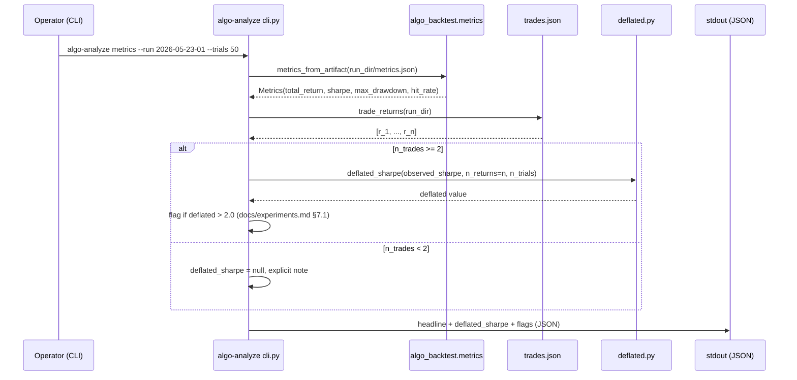
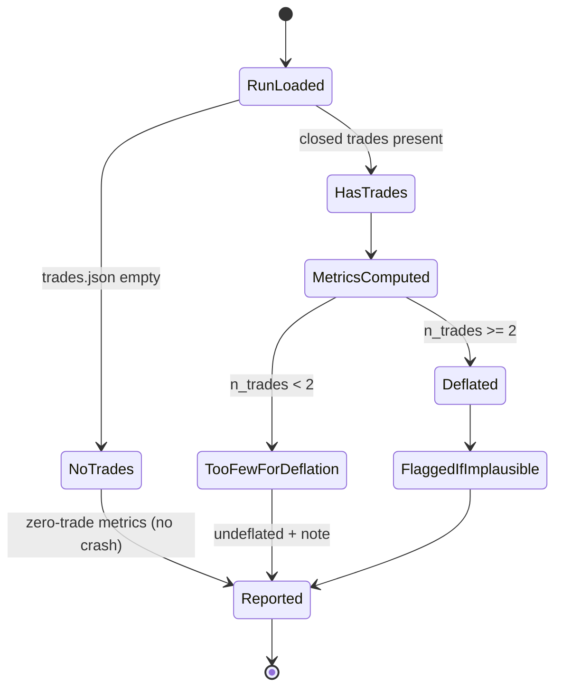

# Spec — algo-analyze

## 1. Purpose & scope

`algo-analyze` is the final pipeline stage: it reads `algo-backtest` run artifacts and
`algo-backtest experiment run` manifests, and produces the evaluation artifacts Chapter 4
of the thesis cites — headline + deflated Sharpe, the Monte-Carlo Permutation Test,
ablation comparison tables, thesis figures, and the cross-experiment summary CSV.

It is read-only over run outputs; it never trades, scores or transforms. It turns runs
into the numbers and figures the experimental chapter needs, per `docs/experiments.md`
(the authoritative experiment → command → Chapter-4-artifact contract).

Out of scope: producing runs (that is `algo-backtest`); live monitoring; the
`decisions.parquet`/`trade_id` forensics join (per-filter contribution on losing trades —
not built yet; the `algo-backtest` filter chain and `decisions.parquet` it needs now exist,
see §10).

## 2. Inputs & outputs

| Direction | Item | Form |
|---|---|---|
| In | one run | `<data_root>/runs/<run-id>/` (`run.json` manifest, `trades.json` ledger, `metrics.json`) |
| In | many runs | for `ablation`/`significance`, each under its own `<data_root>/runs/<run-id>/` |
| In | experiment manifests | `<data_root>/runs/experiments/<experiment>/experiment.json` (or `experiment-error.json` for a failed experiment) |
| Out | `summary` | one CSV row per successful run across every experiment (Stage F2) |
| Out | `metrics` | headline metrics (`algo_backtest.metrics.Metrics`) + deflated Sharpe + plausibility flags, one run |
| Out | `significance` | Monte-Carlo Permutation Test p-value between two runs' trade-return samples |
| Out | `ablation` | per-run contribution table (total-return delta against a baseline), optionally a bar-chart PDF |
| Out | `figures` | equity-curve and drawdown-curve vector PDFs for one run |

Headline metrics come from `<run-id>/metrics.json` (`algo_backtest.metrics.metrics_from_artifact`),
not by recomputing from the trade ledger. Per-trade fractional returns (used by
`metrics`'s deflation, `significance`'s two-sample test, and `figures`'s curves) come from
`<run-id>/trades.json`, read by the single shared reader `algo_analyze._trades.trade_returns`
— one implementation, reused everywhere a run's return series is needed, so the three
callers can't drift on what counts as a valid trade return.

## 3. Architecture & libraries

- **algo_backtest.metrics** — headline `Metrics` (total_return, sharpe, max_drawdown,
  hit_rate) and its artifact readers; `algo-analyze` reuses these rather than
  recomputing them.
- **typer** / **structlog** — CLI + structured logging, mirroring every other tool's
  `cli.py`/`config.py` shape (`algo_core.config.resolve` for the data root, logs to
  stderr via `algo_core.logging.configure_logging`).
- **Pure stdlib (`math`, `statistics.NormalDist`)** — the deflated Sharpe closed-form
  correction (`deflated.py`) and the Monte-Carlo Permutation Test (`significance.py`)
  need no numerical-computing dependency.
- **matplotlib** — equity curve, drawdown curve, ablation bars; vector PDF output sized
  for the LaTeX thesis (`\includegraphics`), shared style pack in `_style.py`.
- **algo-core** — config resolution, data-root layout, atomic writes, shared logging.

```
algo_analyze/
├── cli.py          # algo-analyze summary|metrics|significance|ablation|figures — IMPLEMENTED
├── config.py       # IMPLEMENTED — load_analyze_config(): data_root via shared resolve
├── summary.py      # IMPLEMENTED (F2) — union experiment.json manifests → summary.csv
├── deflated.py      # IMPLEMENTED — Bailey–López de Prado deflated Sharpe (pure function)
├── significance.py  # IMPLEMENTED — Aronson-style Monte-Carlo Permutation Test
├── ablation.py       # IMPLEMENTED — cross-run total-return contribution table
├── figures.py         # IMPLEMENTED — equity/drawdown/ablation-bars vector PDF renderers
├── _trades.py           # IMPLEMENTED — shared trades.json → fractional-return reader
├── _style.py              # IMPLEMENTED — shared matplotlib style pack
└── audit.py                # NOT BUILT — trade_id forensics join over decisions.parquet (§10)
```

## 4. Diagrams

### 4.1 Sequence — `algo-analyze metrics`



### 4.2 State — a run's evaluation lifecycle



## 5. CLI surface

```
algo-analyze summary      [--out <path.csv>]
algo-analyze metrics      --run <id> [--trials N]
algo-analyze significance --runs <a> --runs <b> [--permutations N] [--seed N]
algo-analyze ablation     --runs <id1> --runs <id2> ... [--baseline <id>] [--figure] [--out <path.pdf>]
algo-analyze figures      --run <id> [--out <dir>]
```

`--runs` is a repeatable single-value option (Click/Typer's native idiom — one `--runs`
per value, e.g. `--runs baseline --runs hybrid`), not a single flag taking multiple
space-separated values. `docs/experiments.md`'s example commands use this exact syntax.

## 6. Data contracts

- `run.json` (`algo_backtest.artifacts.RunManifest`): `strategy`, `symbol`, `start`,
  `end`, `params`, `success`, `closed_trades` — `ablation.py` requires `strategy`,
  `symbol`, `start`, `end` to be non-empty strings.
- `metrics.json`: `total_return`, `sharpe`, `max_drawdown`, `hit_rate` (all floats).
- `trades.json`: a JSON list of closed-trade objects, each with a `return` field
  (fractional; `algo_backtest.artifacts._normalize_trade` computes it from
  `profitLoss / abs(entryPrice * quantity)` when the raw fields support it).
- `experiment.json` (F2 summary): `{"experiment": str, "runs": [SummaryRow, ...]}`,
  where each `SummaryRow` has exactly `summary.SUMMARY_COLUMNS`.
- Figures: vector PDF only (no PNG — `\includegraphics` in the LaTeX thesis takes PDF
  directly).

## 7. Error handling

- Empty `trades.json` → `figures`/`significance` proceed with an empty return series
  where that's meaningful (an empty equity curve is a single point at 1.0); `metrics`
  reports `n_trades: 0`, `deflated_sharpe: null` with the same "fewer than 2 closed
  trades" note as any undersized sample.
- `metrics` with fewer than 2 closed trades → undeflated headline Sharpe reported with
  an explicit `note`, never a crash.
- `significance` → fixed permutation seed (`--seed`, default 42); the seed is recorded
  in the output JSON. Requires exactly two `--runs` values — fails fast naming the count
  otherwise.
- Missing `run.json`/`metrics.json`/`trades.json` → `FileNotFoundError` naming the run id
  and the missing artifact's path; every CLI command catches `FileNotFoundError`/
  `ValueError` at the boundary and exits 2 with the message on stderr (`_fail` in
  `cli.py`) — never a raw traceback.
- Drawdown on zero open positions is 0, not NaN (guaranteed by `_drawdown_curve`'s peak
  seeded at `equity[0]`).

## 8. Test scenarios (Gherkin)

Covered today, one `.feature` per concern under `tests/features/`:

- `deflated_sharpe.feature` — golden-value deflation, single-trial no-op, zero-variance
  failure, determinism, invalid-input matrix, raw-returns inference, boundary/non-zero-skew
  cases.
- `significance.feature` — reproducible p-value under a fixed seed, significant vs.
  not-significant cases, minimum-permutation-count and input-validation failures.
- `ablation.feature` — known delta against a named baseline; missing baseline, missing
  run, missing metrics/manifest artifact, incomplete manifest.
- `figures.feature` — valid equity/drawdown/ablation-bar PDFs; zero-trade run; malformed
  or missing `trades.json` in every shape (null return, non-numeric, non-finite, wrong
  JSON type, absolute-PnL-only trade).
- `summary.feature` — two experiments aggregate sorted and deterministic; failed
  experiments excluded; every producer/consumer-integrity failure mode (both-artifacts,
  corrupt manifest, wrong columns, mismatched experiment label, unsuccessful run,
  duplicate identity); byte-identical re-run.
- `cli.feature` — end-to-end wiring for `metrics`/`significance`/`ablation`/`figures`
  through the actual CLI (not just the underlying library call): deflation happening,
  the too-few-trades note, the implausible-Sharpe flag, the two-run requirement for
  `significance`, the ablation delta + figure output, both figure PDFs, and the
  fail-fast paths for missing artifacts.

## 9. Acceptance criteria

- `metrics`, `significance`, `ablation`, `figures`, `summary` all exist and match
  `docs/experiments.md` §2/§3's command surface exactly.
- Deflated Sharpe and the MCP test implemented per Bailey–López de Prado / Aronson, with
  the `docs/experiments.md` §7.1 plausibility-band flag wired into `metrics`'s output.
- Ablation table works against real completed runs; `--figure` renders a bar-chart PDF.
- Figures render as vector PDF, thesis style pack applied.
- `make check` (ruff incl. `C901` max-complexity 8, mypy strict, pytest) and `make audit`
  green.

## 10. Open items

- **`audit.py` / `trade_id` forensics join** — per-filter contribution analysis on
  losing trades, joining `decisions.parquet` to `trades.json`/`trades.parquet` on the
  `trade_id` key (not timestamp+pair — the prior contract gap this join exists to fix).
  Unblocked: `algo-backtest`'s `baseline`/`hybrid` chain runs now write
  `decisions.parquet` (schema: `algo-backtest` SPEC.md §6.2, `chain/audit.py`) whose
  `trade_id` is LEAN's `orderIds[0]` of the `trades.json` trade open at that row (Spec
  04h); the join *mechanism* can be built and tested against it without waiting for
  statistically meaningful hybrid runs.
- **Empirical skew/kurtosis for deflated Sharpe** — `metrics` currently deflates using
  the normal-distribution defaults (skew 0, kurtosis 3) `deflated_sharpe` itself
  defaults to; estimating the trade-return series's own skew/kurtosis is a later
  refinement once a numerical-computing dependency is justified elsewhere in the tool.
- **Multi-run sweep figures** (`docs/experiments.md` Exp 7–8, threshold/sensitivity
  sweeps) — not built; `figures` today covers one run's equity/drawdown curves and
  ablation's own bar chart, not an arbitrary multi-run parameter sweep.
- Whether to adopt a tearsheet library (e.g. quantstats) or keep custom matplotlib
  (current default: custom, for control over thesis figure styling).
