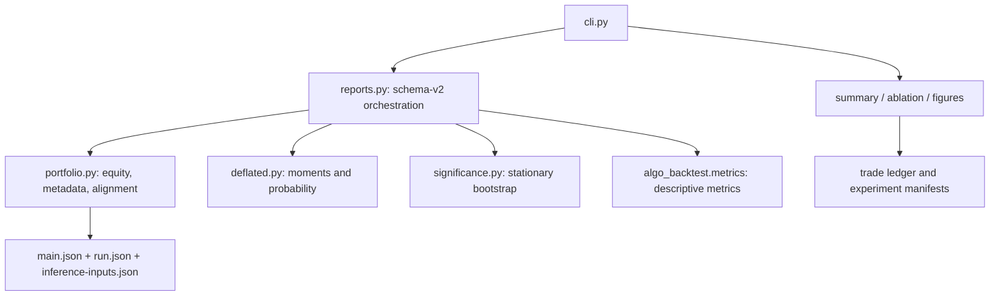

# Spec — algo-analyze

## 1. Purpose and scope

Read completed backtest artifacts and experiment manifests to produce descriptive
metrics, probability-valued DSR, paired mean-return inference, ablation tables,
trade-sequence figures and summary CSV. Run artifacts and frozen models are read-only.
The [experiment plan](../docs/experiments.md) maps reports to Chapter 4; statistical
software completion alone does not authorize empirical claims.

Schema 2 replaces the legacy Sharpe adjustment and default pooled-trade shuffle.
Historical outputs remain exploratory and are never relabeled as corrected.
The [README](README.md) defines exact JSON input examples and usage.

## 2. Inputs and outputs

| Command | Inputs | Output |
| --- | --- | --- |
| `metrics` | `metrics.json`, actual engine `main.json`, `run.json`, explicit `inference-inputs.json`, optional selection manifest | Schema-v2 descriptive metrics, daily moments, `deflated_sharpe_probability`, provenance or unavailable reason |
| `significance` | Two runs with compatible portfolio contracts, declared primary/sensitivity block lengths and rule | Schema-v2 paired mean effect, compatible confidence interval, p-value and resampling metadata for every setting |
| `inference-inventory` | Saved `runs/**/metrics.json` | Correctability inventory with missing prerequisites; no writes to historical artifacts |
| `summary` | `experiment.json` manifests | One deterministic CSV row per successful run |
| `ablation` | Completed run manifests and metrics | Total-return differences against a baseline, optionally a vector PDF |
| `figures` | `trades.json` per-trade notional returns | Descriptive trade-sequence equity/drawdown PDFs, not portfolio return sources |

Headline metrics use `algo_backtest.metrics.metrics_from_artifact`. Their annualized
Sharpe and trade counts never enter inferential moments. Unequal trade counts do not
prevent a valid paired portfolio comparison.

## 3. Architecture



Numerical modules contain no CLI, backtest or filesystem dependencies. The portfolio
reader has no reporting or CLI dependency. Reports compose readers and numerical
methods; the CLI resolves configuration, catches diagnostics and serializes output.
`make check-inference` (this tool's Makefile) enforces these boundaries with the
dependency, coverage and CRAP gate in `tools/inference_quality.py`; it is a separate
target, not part of the default `make check`.

Libraries: NumPy for resampling; stdlib `statistics.NormalDist` for the classical
DSR expression; Typer/structlog for CLI/logging; matplotlib for vector figures;
`algo-core` for shared configuration. Legacy IID testing lives only in explicitly
opt-in `legacy_iid.py`; it is never selected by the inference CLI.

## 4. Portfolio-return contract

The explicit contract records main.json source, calendar-day frequency, UTC timezone,
365 periods/year, zero daily risk-free return, cost convention, pair and complete
run window. Start is the initial midnight endpoint; end is the midnight immediately
after the inclusive `run.json` end date. Successful run identity must match.

Read actual marked-to-market `charts/Strategy Equity/series/Equity/values`, using
line values or candle close values. Require ordered unique finite positive equity
and every exact daily boundary, including recorded flat periods. Derive simple net
portfolio returns, reject nonfinite derived values, and align by timestamps plus
pair/window/cost conventions. No imputation, trade-index pairing or array truncation.
Missing endpoints make inference unavailable. Simulation reruns may be necessary
when engine export is insufficient; model retraining is not required for analysis
correction alone. Record source, manifest and metadata SHA-256 hashes.

## 5. Statistical methods

DSR implements Bailey–López de Prado (2014), Eq. 2:

`Phi((SR-SR0)*sqrt(T-1)/sqrt(1-skew*SR+(kurtosis-1)*SR*SR/4))`.

SR is mean divided by sample SD (ddof1). Skew and Pearson kurtosis are uncorrected
central moments m3/m2^1.5 and m4/m2^2 from that same daily return series. T is its
length. SR0 uses across-trial nonannualized Sharpe SD and registered effective
independent-trial count. Preserve actual variants, interim looks and provenance;
never default missing history to one trial. Explicit N=1 uses PSR against zero,
including 0.5 at SR=0. Invalid moments/counts/variance fail. Classical DSR assumptions
do not establish validity under arbitrary serial dependence.

The default comparison is the Politis–Romano (1994) stationary bootstrap of paired,
null-centered daily return differences, challenger minus baseline. Geometric block
lengths have declared expectation; circular within-block ordering and common indices
preserve pairing. The estimand is mean net return, null zero, two-sided. The plus-one
absolute-tail p-value and symmetric confidence interval invert the same empirical
error distribution. They do not test Sharpe superiority. Require at least 30 returns
and ten expected blocks. Constant differences yield unavailable uncertainty.

Register primary and sensitivity block lengths before examining evaluation outcomes;
record all outcomes, block rule, seed, resamples, observations and expected blocks.
Stationarity, weak dependence and finite moments remain explicit assumptions.
[Story 11](../docs/stories/done/11-statistical-inference-corrections/method-design.md)
contains primary sources, independent references and a registered simulation study.

## 6. CLI

```sh
algo-analyze summary [--out path.csv]
algo-analyze metrics --run ID [--selection selection.json]
algo-analyze significance --runs BASE --runs CHALLENGER --block-length 20 \
  --block-length 10 --block-length 40 --block-rule registered-development-rule \
  --resamples 999 --seed 42
algo-analyze inference-inventory
algo-analyze ablation --runs BASE --runs CHALLENGER [--baseline BASE] [--figure] [--out path.pdf]
algo-analyze figures --run ID [--out directory]
```

Repeat `--runs` and `--block-length` once per value. The first block length is primary;
the others are sensitivity settings. Examples are not a registration for a new
experiment. Store corrected stdout in new v2 report files and retain legacy outputs.
There is no default trial count, normal-moment assumption, or DSR plausibility band.

## 7. Error handling and acceptance

Incomplete equity/selection history, zero variance and insufficient blocks report
`status: unavailable` with a reason. Invalid data or incompatible windows produce
an actionable CLI error (exit 2); they are never silently repaired. Descriptive
metrics remain available when inference is unavailable. Missing `metrics.json`
is an input error. Logging goes to stderr; JSON goes to stdout.

Gherkin/pytest-bdd checks independent DSR fixtures, single-trial probability semantics,
selection effects, portfolio source/frequency, malformed inputs and strict alignment,
seeded block ordering and pairing, degeneracy, metadata, migration immutability and
public CLI behavior. Legacy IID cases are explicitly scoped to the legacy module.
Unchanged summary/ablation/figure acceptance scenarios remain in force.

Acceptance also requires `make check`, dependency audit, gauntlet review and
coverage/complexity/mutation gates, independent simulation validation, saved-run
smoke diagnostics and manuscript build/citation verification. Empirical significance
claims additionally require the experiment-readiness gates.

## 8. Open items

- **`audit.py` / `trade_id` forensics join** — per-filter contribution analysis on
  losing trades, joining `decisions.parquet` to `trades.json`/`trades.parquet` on the
  `trade_id` key (not timestamp+pair — the prior contract gap this join exists to fix).
  Unblocked: `algo-backtest`'s `baseline`/`hybrid` chain runs now write
  `decisions.parquet` (schema: `algo-backtest` SPEC.md §6.2, `chain/audit.py`) whose
  `trade_id` is LEAN's `orderIds[0]` of the `trades.json` trade open at that row (Spec
  04h); the join *mechanism* can be built and tested against it without waiting for
  statistically meaningful hybrid runs.
- **Multi-run sweep figures** (`docs/experiments.md` Exp 7–8, threshold/sensitivity
  sweeps) — not built; `figures` today covers one run's equity/drawdown curves and
  ablation's own bar chart, not an arbitrary multi-run parameter sweep.
- Whether to adopt a tearsheet library (e.g. quantstats) or keep custom matplotlib
  (current default: custom, for control over thesis figure styling).
