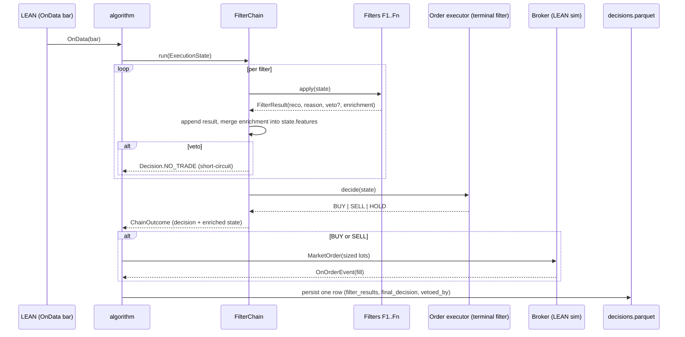
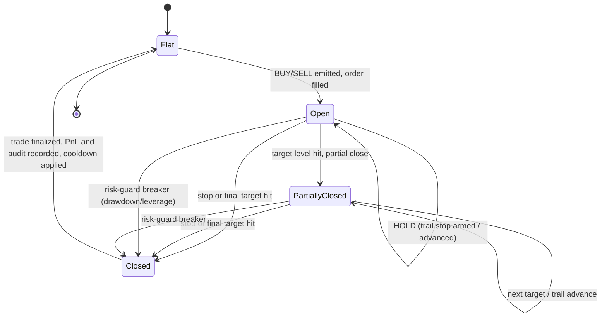

# Spec — algo-backtest

## 1. Purpose & scope

`algo-backtest` runs strategies over the canonical Parquet data and produces
per-run results plus a complete decision audit trail. It contains the
**execution engine integration** (LEAN), the **deterministic filter chain**, the
**risk / money-management / order-management rule modules**, and the
**configuration system** (schema, loader, interactive generator).

It covers two demo milestones within one tool:

- **Baseline** (phase 3): price-only strategy → Sharpe + equity curve.
- **Hybrid** (phase 4): full filter chain incl. the news-context filter →
  hybrid vs baseline.

Out of scope: feature *production* (price features computed natively inside the
engine; text features come pre-computed from `algo-score`); results *analysis*
(that is `algo-analyze`); live broker execution (future work).

The risk, sizing, trailing-stop and partial-close rules implement
**standard, publicly documented FX money-management techniques** (fixed-fractional
risk, ATR-based stops, multi-target scaling-out, drawdown circuit-breakers) as
the project's own design, grounded in the cited literature
(`murphy1999technical`, `chan2013algorithmic`, `lopezdeprado2018advances`).

## 2. Inputs & outputs

| Direction | Item | Form |
|---|---|---|
| In | canonical Parquet | `parquet/{security_type}/{symbol}/…` (forex for the TCC), `parquet/sentiment/…`, `parquet/events/…` |
| In | strategy `config.yaml` | validated by `algo-core` schema/loader |
| In | LEAN execution store | **durable `lean-data/`** (materialized **once** from Parquet, reused across the sweep); optional tmpfs `/dev/shm/lean-data/` copy for hot reads |
| Out | run directory | `runs/<run-id>/` with results, equity curve, `trades.parquet`, `decisions.parquet`, `parameters.txt` |
| Out | trade ledger | `runs/<run-id>/trades.parquet` (one row per **closed trade** — the unit `algo-analyze` measures) |
| Out | audit trail | `runs/<run-id>/decisions.parquet` (one row per chain run — bar-level forensics) |

Two distinct artifacts, by design: **`trades.parquet`** is the trade ledger
(entry↔exit linked, realized PnL — what performance metrics are computed from);
**`decisions.parquet`** is the bar-level chain audit (one row per chain run incl.
`HOLD`/`NO_TRADE` — for forensics). Metrics never reconstruct trades from
`decisions.parquet`; they read `trades.parquet`.

**Implemented today** (the table above is the target contract): `algo-backtest run`
writes `run.json` (manifest), `trades.json` (LEAN's closed-trade ledger, the interim
stand-in for `trades.parquet`), `inference-inputs.json` (the analyzer's portfolio-return
contract: `main.json` source, calendar-day UTC grid, 365 periods, zero daily risk-free,
`costs: brokerage:<resolved adapter>`, symbol and exclusive-end window; its SHA-256 and
the adapter are recorded in `run.json` as `inference_inputs_sha256`/`broker_adapter` so
`algo-analyze` can refuse an edited sidecar) and `metrics.json` next to LEAN's own result
JSON under `runs/<strategy>/<stamp>/` (`artifacts.py`); the chain strategies (`baseline`,
`hybrid`) additionally write `decisions.parquet` there, whose `trade_id` joins
`trades.json` (LEAN's `orderIds[0]` of the trade, flat-to-flat grouping). Every run then
ends with `statement.md` and `equity.png` (`statement.py`, story 12 item H): a
retail-FX-style account statement — Closed Transactions (ticket = entry order id, lots =
quantity / `capital_mgmt.lot_notional_units`, S/L and T/P from `trade-plans.json` when
the plan-driven executor wrote one, else "—" with an explicit "no trade plan recorded"
note), Open Trades and Working Orders at the end of the run (from the order events and
`runtimeStatistics`), an A/C Summary (balance = starting deposit + closed P/L after
commission; equity = balance + floating P/L; the engine-reported equity is printed next
to it so a rounding gap is visible; margin is 0.00 when flat, LEAN's `Portfolio Margin`
sample when current, else "n/a"), Performance (LEAN's `statistics` quoted verbatim plus
trade count and median holding minutes) and a Parameters table pairing every resolved
`strategy-config.json` leaf with its `strategy-provenance.json` source — plus a two-panel
equity/drawdown chart from `charts['Strategy Equity']`. Both are pure derivations of the
artifacts above (no LEAN import) and `algo-backtest statement --run <dir> [--out DIR]`
regenerates them for any run on disk. The `trades.parquet` schema (§6.1) and
`parameters.txt` are not built yet.

## 3. Architecture & libraries

- **LEAN** runs in Docker on the pinned image `quantconnect/lean:17748`; Python
  `QCAlgorithm` (CPython 3.11 in the LEAN container — drives the workspace 3.11 pin).
  Each `run_lean()` call gets its own container (no shared mutable state, so
  concurrent runs never corrupt each other's results), but is memory/CPU-capped
  (`LEAN_CONTAINER_MEM_LIMIT`, default `6g`; `LEAN_CONTAINER_CPUS`, default `2`)
  and gated behind a cross-process slot limiter (`LEAN_MAX_CONCURRENT`, default
  `2`) so parallel test workers or overlapping `algo-backtest run` invocations
  can't collectively start more containers than the host can run at once — the
  desktop-freeze root cause class identified 2026-09-24 (unbounded concurrent
  heavy processes), applied here to containers. An OOM-killed run raises with
  the cap and the env var to raise it, never a silent/confusing failure.
  Automated backtests are driven via **testcontainers** (no `lean` CLI, no QC account;
  see `tests/integration/`); the `lean` CLI remains an option for manual runs.
- **TA-Lib** (C lib + wrapper) for `CDL*` candlestick recognition (planned — not a
  dependency yet; F3's pattern input is never populated, TD-51); LEAN-native
  indicators (`self.RSI`, `self.ATR`, …) for the rest.
- **lightgbm** + **scikit-learn** + **numpy** for F7 training on the host; the model
  is persisted as JSON (`chain/filters/f7_model_io.py`) because the LEAN image ships
  older sklearn/LightGBM/numpy than the workspace, so a pickled model would not load.
- **pydantic v2** config models; **typer** config-generator CLI; **algo-core** for
  schema/loader/`Instrument`/layout/DuckDB.
- **pyarrow** to write the audit trail; the parquet→LEAN-native materializer.

```
algo_backtest/
├── cli.py                  # algo-backtest version|materialize|lean-smoke|run [--model PATH]|metrics|
│                           #   experiment run (IMPLEMENTED)
├── config.py               # IMPLEMENTED — backtest schema (markets.oanda.data_tz=UTC) + typed
│                           #   load_backtest_config() over algo_core.config.resolve()
├── materialize.py          # IMPLEMENTED — materialize_month(): canonical Parquet → lean-data/,
│                           #   config-resolved data_tz, idempotent (skips existing day-zips)
├── leandata.py             # IMPLEMENTED — canonical Parquet → durable lean-data/ day-zips
│                           #   (UTC/START-indexed, config-injected data_tz, fail-fast); see §3.1
├── lean_runner.py          # IMPLEMENTED — run_lean(): the pinned LEAN container (testcontainers),
│                           #   secret-free launcher config, 4 mounts (data overlays per run; hybrid
│                           #   adds only parquet/events/_features [+ parquet/sentiment] under
│                           #   /Lean/Data/news); copies engine/ + algo_backtest/algo_core/algo_score
│                           #   and optional algo_files (e.g. a --model override) next to main.py
├── results.py              # IMPLEMENTED — parse_results(): LEAN /Results → RunResult(success,
│                           #   closed_trades, raw_results_path); minimal (metrics deferred to Slice E)
├── run.py                  # IMPLEMENTED — STRATEGIES registry + validate_run_inputs() + run_strategy():
│                           #   per-strategy param validator (closed key set), run a registered algo on
│                           #   lean-data, parse_results. Params are strategy-specific (generic dict).
│                           #   Also --model validation (F7 families vs the strategy's config) and
│                           #   news_coverage_errors(): hybrid's pre-flight that every minute of the
│                           #   decision window (through end+1 00:00 UTC) has GDELT event features,
│                           #   failing with the `algo-score events` command to build them
├── algos/smoke_trade/      # IMPLEMENTED — bundled one-shot algo (explicit entry+exit) for lean-smoke
├── algos/baseline_ma/      # IMPLEMENTED — fast/slow SMA crossover (trend), long-only, fixed sizing
├── algos/baseline_meanrev/ # IMPLEMENTED — SMA mean-reversion (counter-trend), long-only, fixed sizing
├── algos/experiment_zero/  # IMPLEMENTED — buyhold/random/perfect_foresight known-answer algos (Spec 04h)
├── algos/baseline/         # IMPLEMENTED — real F1+F2+F3+F5+F6+F7 chain (no F4/news), Spec 04h;
│                           #   ~20-line subclass of engine/chain_algorithm.py + its F7 model
│                           #   f7_meta_learner.json (portable, provenance embedded)
├── algos/hybrid/           # IMPLEMENTED — real F1-F7 chain incl. F4/news, Spec 04h; same shape,
│                           #   plus a multi-month NewsContextIndex (f4 load_news_context_window)
├── container_paths.py      # IMPLEMENTED — /Lean/Data, /Results, news mount + decisions.parquet
│                           #   paths shared by lean_runner/run.py (host) and algos (container)
├── months.py               # IMPLEMENTED — BAR_DURATION (bar start → decision time) + months_between():
│                           #   year=/month= partitions of a window
├── training.py             # IMPLEMENTED — F7 training-data assembly for scripts/train_*: multi-
│                           #   month loads; rows over LEAN's delivered bar stream (market hours +
│                           #   fill-forward, lean_bar_stream) with LEAN-identical EMA/RSI/MACD —
│                           #   price-feature and F4 news-lookup parity (to 9 decimals) proven in
│                           #   real LEAN by feature_parity.feature; news keyed at decision time;
│                           #   labels carry label_time so walk_forward_split purges rows whose
│                           #   horizon crosses a span boundary; save_model() (JSON). Used by
│                           #   scripts/train_{baseline,hybrid}_meta_learner.py (--from/--train-end/
│                           #   --validation-end/--test-end; train fits the family models, validation
│                           #   the logistic combiner, test is never fit on)
├── market_hours.py         # IMPLEMENTED — lean_delivers(): LEAN's Forex-oanda-[*] market hours
│                           #   (lean_market_hours_forex_oanda.json, copied from the pinned image)
├── artifacts.py            # IMPLEMENTED — write_run_artifacts(): pure persistence of run.json
│                           #   (manifest, incl. inference_inputs_sha256 + broker_adapter) +
│                           #   trades.json (ledger) + inference-inputs.json (analyzer contract)
│                           #   + metrics.json; metrics.json last
│                           #   as the completeness marker (Slices E1+E2). Each trades.json entry
│                           #   gains a normalized fractional `return` field (profitLoss / abs(
│                           #   entryPrice * quantity)) when those raw LEAN fields are present and
│                           #   the cost basis is non-zero; otherwise the trade is left unchanged
│                           #   (Spec 05f) — see algo-analyze's figures.py, the consumer contract.
├── metrics.py              # IMPLEMENTED — metrics_from_results()/extract_metrics(): the four
│                           #   Chapter-4 metrics (total return, Sharpe, max drawdown, hit rate) from
│                           #   LEAN portfolioStatistics; fail-fast on incomplete results (E2)
├── statement.py            # IMPLEMENTED — story 12 item H: broker-style end-of-run statement
│                           #   (statement.md) + equity/drawdown chart (equity.png, matplotlib Agg)
│                           #   built purely from the run directory's artifacts (run.json,
│                           #   trades.json, main.json, main-order-events.json, strategy-config/
│                           #   provenance, optional trade-plans.json); direction 0=buy/1=sell is
│                           #   cross-checked against each entry fill; write_statement() is called
│                           #   at the end of `run` and by `algo-backtest statement --run`
├── experiment.py           # IMPLEMENTED — Run/Experiment value objects, load_experiment() (closed
│                           #   schema, fail-fast), run_experiment() (injected runner): deterministic
│                           #   runs/experiments/<experiment>/<run_id>/ + row-oriented experiment.json
│                           #   manifest; fail-fast → experiment-error.json (Stage F1)
├── engine/
│   ├── algorithm.py        # IMPLEMENTED (Spec 04a) — ExecutionAlgorithm(QCAlgorithm): init_execution
│   │                       #   (brokerage-adapter selection + OrderExecutor wiring), on_order_event.
│   │                       #   Container-only (imports AlgorithmImports); excluded from ruff/mypy like
│   │                       #   algos/, proven via tests/features/order_execution.feature (real LEAN).
│   ├── chain_algorithm.py  # IMPLEMENTED (Spec 04h) — ChainAlgorithm(ExecutionAlgorithm): the shared
│   │                       #   per-bar LEAN glue for config.yaml-driven F1-F7 strategies (indicators,
│   │                       #   features via chain/wiring.py, chain run, order routing, decisions
│   │                       #   audit, <TAG>_MODEL_SHA256 log). Container-only like algorithm.py
│   │                       #   (mypy-excluded); proven via run_{baseline,hybrid}_chain.feature.
│   ├── order_executor.py   # IMPLEMENTED (Spec 04a) — Decision/SizingContext/FillRecord + OrderExecutor:
│   │                       #   Decision + sizing in, places the order (calculate_order_quantity →
│   │                       #   market_order), consumes OnOrderEvent, returns a normalized fill.
│   │                       #   Unit-tested against a fake algorithm double (LEAN types imported lazily).
│   └── brokerage/          # IMPLEMENTED (Spec 04a) — BrokerageAdapter ABC + REGISTRY/build_brokerage_
│                           #   adapter (mirrors algo_download's adapter registry); oanda.py the first
│                           #   concrete adapter (LEAN's OANDA margin brokerage model). Config-selected
│                           #   via config.py's broker.adapter (Impact.TRADING, no default — a missing/
│                           #   unknown adapter is a hard stop before the first bar).
├── chain/
│   ├── model.py            # FilterResult, ExecutionState, Decision, ChainOutcome, FilterChain (run → ChainOutcome)
│   ├── filters/            # IMPLEMENTED — all seven: f1_trend.py, f2_indicator.py,
│   │                       #   f3_pattern.py, f4_news_context.py (Spec 04e), f5_risk_guard.py,
│   │                       #   f6_capital_mgmt.py, f7_meta_learner.py (Spec 04g); plus
│   │                       #   f7_model_io.py — portable pickle-free F7 model JSON (LightGBM text
│   │                       #   boosters + logistic coefficients + provenance), family check.
│   ├── terminal.py         # IMPLEMENTED — F7TerminalDecision (Spec 04h): FilterChain's
│   │                       #   TerminalDecision, F7's FilterResult -> chain.model.Decision.
│   ├── decision_recorder.py # IMPLEMENTED — DecisionRecorder (Spec 04h): per-run trade_id
│   │                       #   bookkeeping from filled orders' position transitions (on_fill),
│   │                       #   matching the flat-to-flat (FIFO) ledger ChainAlgorithm configures
│   │                       #   (LEAN's default is fill-to-fill) — proven by trade_grouping.feature.
│   ├── wiring.py           # IMPLEMENTED — LEAN-free chain wiring: build_filters(), price/account
│   │                       #   features contract, PnlWindows, smoke-test placeholder economics.
│   └── audit.py            # IMPLEMENTED — DecisionRow/FilterResultRow, decision_row_from_outcome(),
│                           #   write_decisions(): decisions.parquet audit trail (specs.md §11.3.4)
├── rules/
│   ├── risk_math.py        # IMPLEMENTED — fixed-fractional lot sizing (Spec 04d)
│   ├── strategy_math.py    # NOT BUILT — stop-level stretch (target ladder + trail-stop landed in
│   │                       #   trail_stop.py, Spec 04d)
│   ├── trail_stop.py       # IMPLEMENTED — target / trail-stop-arm / trail-stop-destination
│   │                       #   level math (Spec 04d). Sign convention + `spread`-term formula
│   │                       #   for all three functions confirmed against the real fx-manager/
│   │                       #   spockfx-engine source in Spec 04i (docs/stories/done/2026-09-26-
│   │                       #   trail-stop-formula-fix/spec.md §2/§4) — treat that story, not the
│   │                       #   older ambiguous "±" wording in the archived root specs.md §14.5/
│   │                       #   §14.7, as current for this module's formulas.
│   ├── close_portion.py    # IMPLEMENTED — partial-close laddering (Spec 04d)
│   └── risk_guard.py       # IMPLEMENTED — portfolio caps, drawdown breakers, leverage cap;
│                           #   the five caps are the strategy config.yaml `risk_guard` section
│                           #   (`parse_risk_guard_caps`, 2026-09-27 amendment); drawdown
│                           #   limits are PnL floors (<= 0, e.g. -0.05) — a positive one is rejected
├── config/                 # NOT BUILT
│   ├── generator.py        # interactive CLI (typer)
│   └── (schema/loader live in algo-core)
├── strategies.py           # IMPLEMENTED — load a strategy's config.yaml, single-level `extends:`
└── strategies/
    └── <name>/config.yaml  # hand-written, version-controlled (baseline, hybrid extends baseline)
```

### 3.1 LEAN-native materializer (`leandata.py`) — not a black box

LEAN does not read Parquet; it reads its own on-disk format. The materializer
turns canonical Parquet into the **durable `lean-data/` execution store**,
**read-through**: built on the first cache miss, persisted, and reused across the
whole sweep — never regenerated per run (`../docs/parquet-evaluation.md`, refined
decision 2026-05-24). The optional tmpfs `/dev/shm/lean-data` copy is staged from
it for hot reads. It is explicitly specified so the temporal-alignment risk is
visible:

- **Resolution:** writes **minute** data directly (LEAN supports a `minute`
  resolution; no synthetic ticks are fabricated from minute bars).
- **Format:** one zip per pair per day under the LEAN Forex folder, containing a
  CSV with LEAN's fixed Forex **quote** schema (`millis-since-midnight,
  bidO,bidH,bidL,bidC, bidVol, askO,askH,askL,askC, askVol`; both sides retained,
  volumes 0 for FX); file/dir naming follows LEAN's convention, mapped from the
  `Instrument` asset class (`forex/<market>/minute/<symbol>/YYYYMMDD_quote.zip` for
  FX; LEAN uses `equity/<market>/minute/<symbol>.zip`, `future/...`, etc. for other
  classes — a deterministic per-asset-class mapping, forex for the TCC). Implemented
  in `leandata.py` (`write_lean_minute`).
- **Timezone (empirically nailed 2026-05-25):** canonical Parquet is UTC. LEAN stores
  forex (OANDA) minute data in **UTC**, **START-indexed** (`ms` = bar start since
  midnight in the configured data tz; file-day = start's date), so the materializer
  writes the bar start directly. The data tz is **injected from config** (UTC for
  OANDA → identity conversion), never hard-coded. With the algorithm tz set to UTC,
  `self.UtcTime` at delivery == the bar's UTC end, so each Parquet bar maps to exactly
  one LEAN bar, DST-invariant. Proven by a containerized round-trip test
  (`tests/integration/test_timezone_roundtrip.py`, summer EDT + winter EST) — not the
  spike's earlier (disproven) "NY / END-indexed" guess.
- **Gaps:** minutes with no tick have **no bar** (not forward-filled); LEAN
  tolerates missing minutes. Forward-filling here would fabricate prices.
- **Durability + idempotence:** day-zips are written atomically (temp file + rename),
  so an interrupted run never leaves a truncated zip; `materialize_month` skips days
  whose zip already exists and **fails fast on a missing or empty** canonical Parquet
  (an empty month partition is a bad upstream artifact, not "already done").
- **Volume:** tick-count volume is carried through; it is an activity proxy
  (FX has no consolidated volume), consumed only by the market-activity feature.
- **Quote side:** bid/ask are both retained in Parquet; the converter emits the
  side LEAN uses for fills, and the transaction-cost model reads the spread from
  the same Parquet so backtest costs and the quote stream are consistent.

The **week-1 spike** validated the core path (engine runs locally, lean-data format,
bar timing) before anything was built on it; see `spikes/lean/README.md` for the
de-risking breakdown. Its findings are now superseded by committed code: the
materializer (`leandata.py`, unit-tested) and a **testcontainers integration suite**
(`tests/integration/`) that runs the pinned `quantconnect/lean:17748` image with no
QC account and no `lean` CLI — a smoke backtest plus the timezone round-trip that
empirically established the UTC/START-indexed convention. Integration tests carry the
`integration` mark and are **excluded from `make check`** (the image is ~10 GB); run
them with `uv run pytest -m integration`. The `/dev/shm` acceleration remains optional
and out of scope here.

**Backtest↔live parity.** The feature and sentiment computation is one
mode-agnostic engine (vectorized over history in backtest, one bar at a time in
live) behind the `algo-core` `Cache` port in read-through + write mode. The same
code and same cache run in both modes, so the deployed model never sees inputs it
was not trained on (no train/serve skew). Each bar is computed **exactly once**
the first time it exists; every later access — the rest of a sweep, or a live
restart's warmup — is a cache hit. In live, only the just-closed bar misses
(it never existed before); the trained model is loaded, never retrained.

## 4. Diagrams

### 4.1 Sequence — one bar through the filter chain to an order



### 4.2 State — position / trade lifecycle



`Closed` is a transient finalization state (record PnL, write the trade's audit
rows, apply the one-trade-per-candle / cooldown dedup) distinct from `Flat`
(idle, eligible to open a new position). Every exit path — stop, final target,
or risk-guard breaker — converges on `Closed` before returning to `Flat`.

### 4.3 State — config parameter loading (delegated to algo-core)

See `algo-core` §4.2; `algo-backtest` consumes that policy: a missing
trading-impactful parameter is a hard stop before the first bar.

## 5. CLI surface

Target surface below; **implemented today** is `version`, `materialize --symbol
--year --month`, `lean-smoke`, `run --strategy --symbol --from --to [--param k=v]...
[--model PATH] [--strategies-dir DIR]`, `explain-strategy NAME [--strategies-dir DIR]`,
`metrics --run DIR` and `experiment run --spec YAML`. Since 2026-09-27 (story 09) a
chain strategy is resolved from its `config.yaml`, not a code registry: `--strategy
<name>` accepts any bundled `strategies/<name>/config.yaml` or one under
`--strategies-dir`; the YAML decides the hosting algorithm (`algos/hybrid` when
`f4_news_context` is listed, else `algos/baseline`) and whether news data is mounted;
`extends:` chains of any depth compose base-first with cycle detection, a variant in an
external directory may extend a bundled base; the resolved document is shipped into the
container as `strategy.yaml`, and each parameter's source (`<name>/config.yaml` or
`default`) is printed at run bootstrap and written to `strategy-provenance.json`. `--cv`, the
`config` generator and read-through materialization inside `run` are not built. F7
models are trained offline by `scripts/train_{baseline,hybrid}_meta_learner.py`.

```
algo-backtest run      --strategy <name> [--symbol ...] --cv <single|cpcv|walkforward>
                       [--folds N --embargo D]        # validation protocol (see below)
algo-backtest config   <name>                                         # interactive generator
algo-backtest config   --upgrade <old.yaml>                           # migrate schema version
algo-backtest materialize --src parquet/{security_type} --dst lean-data/  # parquet → durable LEAN-native (lazy/read-through; forex for the TCC)
algo-backtest lean-smoke                                              # trivial backtest, sanity
```

### 5.1 Validation protocol (CPCV / walk-forward)

The methodology's combinatorial purged k-fold + embargo (Ch.3 §sec:evaluation)
is **driven by `algo-backtest`, not an external script**. `--cv` selects the
protocol; the split is defined in the strategy config (`validation:` block:
`scheme`, `n_folds`, `embargo_days`, the train/validation/test spans). For each
fold the engine purges feature observations whose label horizon overlaps a
validation fold and applies the embargo, runs the backtest per fold, and writes
one `runs/<run-id>/fold=<k>/` set of artifacts plus an aggregate. `--cv single`
runs the single held-out test pass (one evaluation per variant, no iteration on
the test span). `algo-analyze` reads the per-fold `trades.parquet` to compute the
deflated Sharpe across folds. This closes the methodology↔implementation gap:
CPCV is a first-class run mode, configured, not improvised.

## 6. Data contracts

### 6.1 Trade ledger — `runs/<run-id>/trades.parquet`

One row per **closed trade** (LEAN exposes filled `Trade` objects natively;
entry and exit are linked here). This is the unit `algo-analyze` measures.

| Column | Type | Notes |
|---|---|---|
| `trade_id` | string | unique per trade |
| `pair` | string | e.g. `EURUSD` |
| `direction` | string | `LONG` / `SHORT` |
| `entry_ts` / `exit_ts` | datetime (UTC) | fill timestamps |
| `entry_price` / `exit_price` | float | fill prices |
| `size` | float | lots / units |
| `realized_pnl` | float | net of modeled transaction costs |
| `return` | float | per-trade return (for Sharpe, hit rate) |
| `holding_minutes` | int | exit − entry |
| `exit_reason` | string | `stop` / `final_target` / `risk_guard` |
| `max_adverse` / `max_favorable` | float | excursions (optional, for analysis) |

Partial closes are represented as the realized PnL of the closed portion folded
into the trade's final `realized_pnl`, with intermediate closes recorded in
`decisions.parquet`; one `trades.parquet` row is the whole trade's outcome.

### 6.2 Audit trail — `runs/<run-id>/decisions.parquet`

| Column | Type | Notes |
|---|---|---|
| `timestamp` | datetime (UTC) | bar timestamp |
| `pair` | string | e.g. `EURUSD` |
| `features_hash` | string | hash of input feature dict (reproducibility) |
| `filter_results` | list<struct> | accumulated FilterResult list |
| `final_decision` | string | `BUY` / `SELL` / `HOLD` / `NO_TRADE` |
| `vetoed_by` | string \| null | name of vetoing filter, if any |
| `trade_id` | string \| null | the trade this chain run opened or managed; `null` for `NO_TRADE`. **Foreign key to `trades.parquet`** |

One row per chain run (~2 M rows / pair over 10y). This is the **bar-level
forensic** record, not a trade ledger: per-trade metrics come from
`trades.parquet`. The `trade_id` foreign key links each opening (`BUY`/`SELL`)
and each managing (`HOLD`) chain run to its trade, so "which filters preceded a
losing trade?" is an unambiguous join on `trade_id` — never a fragile
timestamp+pair match. `algo-analyze` consumes both: `trades.parquet` for metrics,
`decisions.parquet` joined by `trade_id` for forensics.

### 6.3 Decision semantics

| Decision | Meaning |
|---|---|
| BUY / SELL | open new long / short |
| HOLD | manage an open position (trail, partial close, no-op) |
| NO_TRADE | stand aside; any veto, or no entry and no open position |

### 6.4 Config

YAML, `schema_version` pinned; loaded via `algo-core` (hard-stop on missing
trading-impactful params; `null` = explicit-disable; `extends:` inheritance;
provenance log to `parameters.txt`). Sections: `universe`, `risk_math`,
`strategy_math`, `risk_guard`, `circuit_breakers`, `operational`, and the ordered
`chain` (the filter sequence).

**Filter order is a searched hyperparameter, not a fixed assumption.** The
`chain` list defines the order and presence of filters; since each filter acts on
the state the previous ones accumulated, different orderings yield different
decisions, so the best ordering is found **empirically by simulation**. To stay
honest under the validation protocol (§5.1), the ordering is selected on the
training/validation folds of the combinatorial purged $k$-fold scheme and
**frozen before the single held-out test pass** — it is never tuned on the test
span. The ordering comparison is reported in the monografia's ablation study
(Chapter 4).

**Each filter also reads a configurable timeframe (multi-timeframe analysis).**
A filter entry carries a `timeframe` (MT5 set `m1`…`d1`); the decision is taken on
the finest bar of the grid, but a filter may analyze a coarser one (e.g. a trend
filter on `h4` for an `m1` decision). The bar series for each timeframe is
pre-materialized by `algo-transform` and read through the `algo-core` cache, so a
filter observing a different timeframe is a lookup, not a recomputation. Like the
order, the per-filter timeframe is a hyperparameter: selected on the
training/validation folds and frozen before the test pass, part of the same
ablation.

**Lot units are broker-specific and come from LEAN, not hard-coded.** Risk math
(`risk_math.py`) sizes the position in notional/standard lots using
`Instrument.lot_size` (the universal 100,000-unit standard FX lot). The
**broker-dependent minimum order size and lot step** (OANDA = 1 unit; MT4/MT5 =
0.01-lot steps) are LEAN's `SymbolProperties` for the configured market
(`Instrument.market`), applied when the computed size is rounded into an
executable order. We do not duplicate per-broker lot tables; switching the
brokerage changes only the market, and LEAN supplies the tradable increment.

## 7. Error handling

- Missing trading-impactful config param → hard stop before first bar
  (named param + section + hint).
- `schema_version` mismatch → hard stop with `--upgrade` hint.
- Insufficient margin for computed lot size → capital filter vetoes (NO_TRADE),
  logged; not a crash.
- Risk-guard breach (portfolio cap, drawdown, leverage) → veto / flatten per
  config; logged in audit trail.
- Filter veto → chain short-circuits to NO_TRADE; `vetoed_by` recorded.
- `lean-data/` absent or stale (version mismatch) → `run` materializes it on the
  first miss (read-through), persists, and reuses it for the rest of the sweep;
  the optional tmpfs copy is re-staged from it if cleared.

## 8. Test scenarios (Gherkin)

The scenarios below describe the target-state chain with the real F1-F7 filters
(§11.3.2 of `specs.md`). **All seven are now real** (`chain/filters/`), including
F4 (news-context, Spec 04e — reads real Spec 03 GDELT event-feature Parquet as
its mandatory veto input, per-symbol sentiment best-effort pending TD-48) and F7
(meta-learner, Spec 04g — LightGBM sub-models per feature family + a logistic
combiner into `p̂_t`). `chain/terminal.py`'s `F7TerminalDecision` (Spec 04h)
closes the loop: it runs as `FilterChain`'s `TerminalDecision`, reading F7's own
`FilterResult` back out and mapping it onto `chain.model.Decision`.
`tests/features/filter_chain_mechanics.feature` is the executable proof of the
accumulate / veto-short-circuit / abstain-does-not-veto mechanics **and** (its
newest Rule) of the full real F1-F7 chain reaching a decision end-to-end in
pure Python. As of Spec 04h's closure, `algos/{baseline,hybrid}/main.py`
wire this chain into a real LEAN algorithm and are registered in `run.py`'s
`STRATEGIES`, verified against the real pinned LEAN container (`decisions.
parquet` provably joins `trades.json` by `trade_id`). `src/algo_backtest/
strategies/{baseline,hybrid}/config.yaml` (composed via `algo_backtest/
strategies.py`'s single-level `extends:` loader, `docs/experiments.md` §1)
declare the intended chains; both are still wiring smoke tests, not a
methodology result — see `docs/technical-debt.md`'s TD-51 entry.

**Per-filter parameters (2026-09-27 amendment, story 09).** The same
`config.yaml` carries every configurable filter's own section, parsed by that
filter's `parse_*_config(section, *, strategy)` into a typed value on
`StrategyChainConfig` and handed to the filter by `chain/wiring.py`: `price_features`
(the EMA/RSI/MACD periods F1/F2/F7 share; every key defaults; recorded in the model's
provenance and checked by `run --model`), `indicator` (F2: `rsi_midline`,
`macd_hist_threshold`; defaults), `pattern` (F3: `bullish_patterns`,
`bearish_patterns`; defaults), `news_context`
(F4: `event_intensity_veto_threshold`, `sentiment_direction_threshold`, `null`
disables a half), `risk_guard` (F5: the five caps, `null` disables one),
`capital_mgmt` (F6: `risk_per_trade`, `stop_loss_pips`, `pip_value_per_lot`,
`lot_notional_units`, `assumed_leverage` — the sizing inputs `account_features`
feeds F6) and `meta_learner.theta_high` / `theta_low` / `regime_gate` /
`label_horizon_minutes` (F7; the gate is the dissertation's `r_t` agreement,
switchable; the horizon is the training label's look-ahead, default 15). Sections
with defaults may be omitted; the loader writes the effective values back into the
resolved config so every run's `strategy-config.json` shows what was used. A filter listed without
its section, a section without its filter, a missing key or an out-of-range value
is a hard stop before the first bar, as are an unknown filter name, F7 keys in
`meta_learner` without `f7_meta_learner` listed, and a `schema_version` other than
the integer 2. `hybrid` inherits F5/F6/F7's sections from
`baseline` through `extends:` and adds only `news_context`, so both variants face
identical execution assumptions. The chain strategies take two run parameters,
`--param size=<fraction>` and `--param cash=<starting deposit>`; the LEAN
container no longer reads `conf/backtest.yaml` for any filter value (the former
`load_*_config()` loaders and `chain/wiring.py` constants are gone — TD-43 closed).
`tests/features/strategies.feature`, `chain_wiring.feature` and each filter's own
feature carry the section contracts as Scenario Outlines;
`filter_chain_mechanics.feature` defines its probe strategy as inline YAML.

```gherkin
Feature: Deterministic filter chain
  Background:
    Given a strategy config with filters F1..F7
    And a synthetic ExecutionState for one bar

  Scenario: A veto short-circuits the chain to NO_TRADE
    Given filter F5 (risk guard) vetoes
    When the chain runs
    Then no downstream filter is consulted
    And the final decision is NO_TRADE
    And vetoed_by is "risk_guard"
    And one audit row is written for the bar

  Scenario: Enrichment accumulates downstream
    Given F1 enriches state with trend_score
    When F7 (threshold rule) runs
    Then F7 can read trend_score from state.features
    And the audit row lists every filter's contribution

  Scenario: ABSTAIN does not veto
    Given F3 (pattern) ABSTAINs (no pattern this bar)
    When the chain runs
    Then the chain continues past F3
    And F3 carries no vote weight in the terminal rule

Feature: Fixed-fractional position sizing
  Scenario Outline: lot size from risk, unit value and stop distance
    Given account balance <balance> and risk fraction <risk>
    And stop distance <units> units with unit value <uv>
    When sizing is computed
    Then lot size equals (<balance> * <risk>) / (<uv> * <units>) within tolerance
    # for FX the instrument's unit is the pip; the formula is unit-generic
    Examples:
      | balance | risk | units | uv  |
      | 10000   | 0.02 | 20    | 1.0 |
      | 10000   | 0.02 | 50    | 1.0 |

  Scenario: USDJPY unit_size is honored in sizing
    Given a USDJPY trade (FX, unit "pip")
    Then the stop distance uses unit_size 0.01, not the EURUSD 0.0001

Feature: Trailing stop and partial close
  Scenario: Trail arms at the configured level
    Given a long position and trail-arm factor 0.5
    When price advances halfway to the target distance
    Then the trailing stop is armed at the configured destination

  Scenario: Partial close at a target level
    Given a long position with a target ladder
    When the first target level is hit
    Then the configured fraction is closed
    And the remainder stays open with the trail advanced

Feature: Risk guard
  Scenario: Drawdown breaker flattens and blocks new trades
    Given the daily drawdown limit is breached
    When a new BUY would be emitted
    Then the risk guard vetoes
    And open positions are flattened per config
    And the breaker is recorded in the audit trail

  Scenario: Explicitly disabled leverage cap is logged, not enforced
    Given max_leverage is null in the config
    When the strategy starts
    Then startup logs "EXPLICITLY DISABLED: max_leverage"
    And no leverage cap is enforced

Feature: Reproducibility
  Scenario: Same config + same data ⇒ identical decisions
    Given a fixed config and a fixed cached feature stream
    When the backtest runs twice
    Then both runs produce byte-identical decisions.parquet
    And parameters.txt is identical

  Scenario: Missing required parameter is a hard stop
    Given a strategy config.yaml whose capital_mgmt section lacks risk_per_trade
    When the backtest starts
    Then it refuses to start before the first bar
    And the error names the parameter
```

Edge cases (this tool's §8 themes): veto short-circuit; ABSTAIN vs VETO;
sizing unit_size per instrument; margin-insufficient veto; drawdown/leverage breaker;
audit completeness (one row per chain run incl. NO_TRADE); determinism
(byte-identical reruns, fixed seeds); tmpfs rebuild; schema-version mismatch;
`extends:` variants (a base strategy + a looser-risk variant as a short diff).

## 9. Acceptance criteria

- Baseline (phase 3): price-only strategy runs end-to-end on LEAN over the
  target window; emits Sharpe, max drawdown, equity curve, full audit trail.
- Hybrid (phase 4): news-context filter active; produces a comparable run for
  hybrid-vs-baseline.
- Config policy enforced exactly (hard-stop / default-log / explicit-null /
  provenance log).
- Reruns are byte-identical (determinism).
- Rule modules covered by unit + property tests; chain covered by BDD.
- No identifying third-party expression in code or docs; rules implemented fresh
  from the cited public techniques.

## 10. Open items

- Number of filters in the first chain and their order (config-driven; the
  reference chain is F1 trend → F2 indicator → F3 pattern → F4 news → F5 risk →
  F6 capital → F7 threshold). A **volume/strength context filter** is planned as
  an additional evidence filter (top layer, alongside trend/indicator): it reads
  the daily per-currency `currency_strength` feature from `algo-transform`
  (tick-volume activity proxy) and biases direction toward the day's dominant
  currency. It is added via `config.yaml` like any other filter; its signal
  strengthens as the pair universe expands toward the major pairs (the universe
  is config-driven, so scaling is configuration, not code).
- **Extended filter set F8–F14** (the quality gates of methodology
  §subsec:extended-filters — candlestick confirmation, tradability/ADF, news
  confidence/magnitude gates, sub-model consensus, etc.) are added as further
  filter modules under `chain/filters/`, config-enabled per variant. They are
  exercised by Experiments 6–9 (the filter-ablation study) and the volume filter
  above joins this extended set. Added incrementally; not part of the F1–F7
  baseline chain.
- Ablation variants (single base strategy vs additional variants) — default: one
  base strategy for the TCC; variants via `extends:` if time permits.
- Recommended-range values shown by the config generator for each risk-guard
  parameter.
- Whether TA-Lib `CDL*` runs inside the LEAN algorithm or as a pre-pass (default:
  inside, native indicators preferred; TA-Lib only for candlestick patterns).

### F1 alternative perception source (04k, 2026-09-26)

`StrategyChainConfig.perception` validates `perception_source: ema` (default) or
`double_smoothed_heikin_ashi`. The latter lives in `perception/`: a pure HA
transform, a native `PythonIndicator` composing Wilder(6) and LWMA(2), and a
primary/closed-higher-timeframe wrapper using `TradeBarConsolidator`. Integer
period overrides live under `double_smoothed_heikin_ashi`; higher timeframe
minutes defaults to 60 and must exceed 1. No decision consumes an unready reading.
The exact historical rule is down when smoothed far >= near (ties down), up
otherwise, using direction-reordered extremes rather than HA body buffers.

`baseline-dsha` extends baseline with this selector and shares its model artifact.
It is a frozen-model direction-feature ablation through the existing analyzer;
EMA-gap strength and all other filters remain unchanged. The committed experiment
uses the frozen baseline model and must not be represented as independently trained.
Offline `build_training_rows` accepts the same resolved `PerceptionConfig`; its
host Wilder/HA/LWMA replay gates rows on both timeframes' readiness and consolidates
in OANDA exchange-local wall time. `feature_parity.feature` verifies timestamps
and features against real LEAN for default and custom periods, gaps and ties.
The baseline trainer accepts `--strategy baseline-dsha` with required `--out`
for a separate artifact; hybrid training reads its own resolved config. Both
record the resolved config in model provenance. No replacement model is bundled.

### Resolved strategy config artifact

Chain-driven runs (`baseline`, `baseline-dsha`, `hybrid`) publish
`strategy-config.json` in the run results directory during initialization.
It contains the fully resolved `StrategyChainConfig.raw` mapping, including
inherited settings, serialized as deterministic UTF-8 JSON. It is published via
the shared atomic writer (same-directory temporary file followed by replace).
Unsupported or non-finite JSON values fail explicitly before replacing an
existing artifact. Its presence records configuration, **not successful run
completion**; completed runs still require `run.json`/`metrics.json`.
Ablation QA requires and hashes the engine-written config for both runs.

`make check` includes the offline perception dependency-boundary gate.
`make check-perception` runs the full host/native coverage, CRAP and mutation
gauntlet (requires the pinned LEAN Docker image). Pure perception modules also
belong to the package's standard mutmut scope; native adapters are tested by the
Docker-backed target. See the done story's validation report for measured results.
