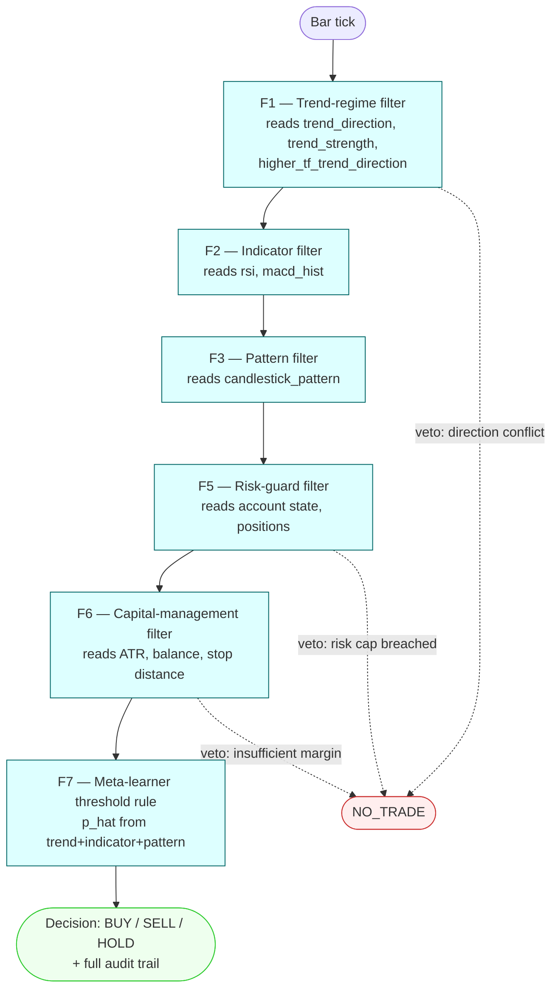

# Strategy: `baseline`

Price-only. Docs/experiments.md Experiment 1: calibrate the price-only baseline on
EUR/USD. Feature families scored by the meta-learner: trend (F1), indicator (F2),
pattern (F3) — no news family. Config: [`config.yaml`](config.yaml).



## Run

```bash
algo-backtest run --strategy baseline --symbol EURUSD --from 2024-06-01 --to 2024-06-30
```

**Status (2026-09-26):** `algo_backtest run --strategy baseline` is now wired and
verified against the real pinned LEAN container (`algos/baseline/main.py`, PR #33) —
**this is a wiring smoke test, not a methodology result**. F3's candlestick pattern is
never populated (no real detector), F5/F6's account-risk features use fixed placeholder
economics (no real ATR/margin model), and F7's meta-learner (`f7_meta_learner.json`,
trained by `scripts/train_baseline_meta_learner.py`) is fit on a short window, not the
full walk-forward split the methodology specifies. See `docs/technical-debt.md`'s TD-51
and `docs/stories/done/2026-09-26-04h-algo-backtest-hybrid-integration/progress.md` for
the full list of known gaps and the `RUNBOOK.md` in that same folder for the execution
workflow (sequence + state diagrams) and exact commands to reproduce.
