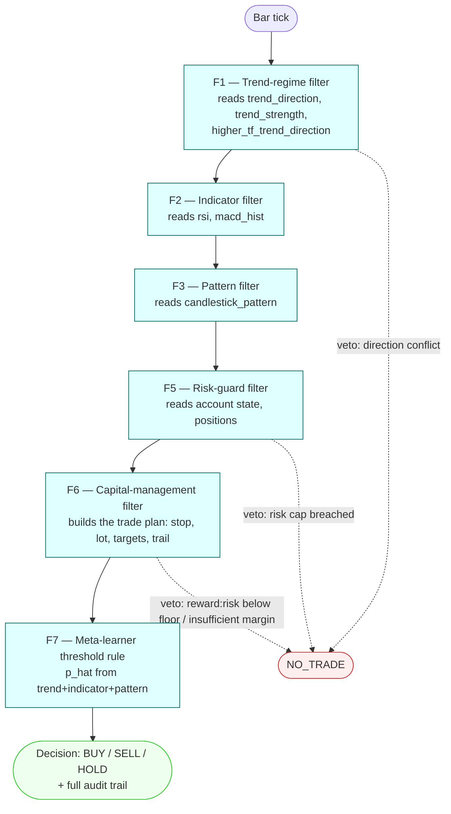

# Strategy: `baseline`

Price-only. Docs/experiments.md Experiment 1: calibrate the price-only baseline on
EUR/USD. Feature families scored by the meta-learner: trend (F1), indicator (F2),
pattern (F3) — no news family. Config: [`config.yaml`](config.yaml).



## Parameters

Every configurable filter owns a section of [`config.yaml`](config.yaml); the run
only takes `--param cash=<starting deposit>` — position size is not a run parameter:
F6's trade plan (`capital_mgmt.risk_per_trade` and the stop distance) sizes every order
and the executor places the plan's stop, take-profit and trailing orders (story 12).
A filter listed without its section, or a section without its filter, fails fast.
Every run records the resolved values, defaults included, as `strategy-config.json`
and `strategy-config.yaml` next to its results (the YAML is ready to seed a variant).

| Filter | Section | Keys |
|---|---|---|
| F1/F2/F6/F7 features | `price_features` | `ema_fast` 3, `ema_slow` 8, `ema_higher_tf` 60, `rsi_period` 14, `macd_fast` 12, `macd_slow` 26, `macd_signal` 9, `atr_period` 14, `swing_lookback_bars` 60 (all optional; recorded in the trained model and checked by `--model`). `atr_period` is the Wilder ATR behind the `atr_pips` feature (the bar's ATR in pips); `swing_lookback_bars` the window behind `swing_low_pips` / `swing_high_pips` (pips from the close down to the window's lowest low / up to its highest high). Pips are the instrument's: LEAN's minimum price variation × 10 live, `Instrument.unit_size` offline (0.0001 on a 5-digit pair, 0.01 on JPY). F6's stop-distance sources |
| F2 indicator | `indicator` | `rsi_midline` 50, `macd_hist_threshold` 0 (optional) |
| F3 pattern | `pattern` | `bullish_patterns`, `bearish_patterns` (optional; default vocabularies) |
| F4 news context (hybrid only) | `news_context` | `event_intensity_veto_threshold`, `sentiment_direction_threshold` (`null` disables a half) |
| F5 risk guard | `risk_guard` | `portfolio_at_risk_cap`, `daily_drawdown_limit`, `weekly_drawdown_limit`, `max_concurrent_trades_per_account`, `max_leverage` (`null` disables one) |
| F6 capital management | `capital_mgmt` | `risk_per_trade`, `stop_loss_pips`, `pip_value_per_lot`, `lot_notional_units`, `assumed_leverage` (required); the A05 trade plan (story 12, all optional): `stop_loss_shrink` 0.0 in [0, 1), `min_stop_pips` 0.0, `min_stop_factor` 1.0 (≥ 1, × `execution.broker_stop_level_pips`), `targets` `[{at_level_ratio: 2.0, close_fraction: 1.0}]` (levels strictly increasing, fractions sum ≤ 1), `trail_stops` `[]` (`at_level_ratio`, `to_level_ratio`), `min_reward_risk` `null` (= off), `stop_distance_source` `fixed`\|`atr`\|`swing`, `atr_multiplier` 2.0. F6 enriches `proposed_lot_size` and `trade_plan` — lot from the wider side's stop, per side the stop pips (shrunk, floored), targets and trail steps in pips with the spread added as `rules/trail_stop.py`, and the first-target reward:risk — and vetoes below `min_reward_risk` or on insufficient margin |
| F7 threshold rule | `meta_learner` | `families`, `theta_high`, `theta_low`, `regime_gate`, `label_horizon_minutes` 15 (optional) |
| Execution (no filter) | `execution` | `spread_pips` 0.0, `commission_per_lot` 0.0, `min_hold_bars` 0, `broker_stop_level_pips` 0.0, `close_on_veto` true (all optional; the fill costs and holding rule the executor applies, story 12; F6 adds the spread to every target/trail level and floors its stop at `min_stop_factor` × the broker stop level; `close_on_veto: false` leaves a vetoed open position to its stop, targets and trailing stop instead of closing it at once) |

`regime_gate: true` is the dissertation's rule (BUY needs F1's bull regime, SELL its
bear regime); `false` trades on p̂ alone. Since 2026-09-27 (story 09) the bundled
configs run with the gate off: the six-month pilot's fitted model was anti-aligned with
F1's regime on every September bar, so the gated rule never fired.

The bundled `capital_mgmt` spells out the fx-manager Strategy A05 plan (specs.md §14.7):
a structural swing stop shrunk 20 % and floored at max(5 pips, 1.2 × the declared broker
stop level), one target at 2 × the stop closing 50 %, a trailing step armed at 0.5 × the
stop moving it to −0.66 × the stop from entry, a 2.0 reward:risk floor; `risk_guard.max_concurrent_trades_per_account` is A05's 2; `execution`
charges a 1-pip spread and no commission. `hybrid` inherits all of it unchanged.

## Variants

A new strategy is a new `strategies/<variant>/config.yaml` (bundled, or in a folder
passed as `--strategies-dir`) that `extends:` this one and states only its diff — no code
change, no registry entry. `algo-backtest explain-strategy <variant>` prints every
resolved parameter with the file that set it.

## Run

```bash
algo-backtest run --strategy baseline --symbol EURUSD --from 2024-06-01 --to 2024-06-30 --param cash=10000
```

**Status (2026-09-26):** `algo_backtest run --strategy baseline` is now wired and
verified against the real pinned LEAN container (`algos/baseline/main.py`, PR #33) —
**this is a wiring smoke test, not a methodology result**. F3's candlestick pattern is
never populated (no real detector), F5/F6's account-risk features use fixed placeholder
economics (no real ATR/margin model), and F7's meta-learner (`f7_meta_learner.json`,
trained by `scripts/train_baseline_meta_learner.py`) is fit on EUR/USD 2015-02-02 →
2015-07-31 (train + validation; 2015-08-01 → 2016-01-31 held out as the test span), not
the full walk-forward split the methodology specifies. See `docs/technical-debt.md`'s TD-51
and `docs/stories/done/2026-09-26-04h-algo-backtest-hybrid-integration/progress.md` for
the full list of known gaps and the `RUNBOOK.md` in that same folder for the execution
workflow (sequence + state diagrams) and exact commands to reproduce.
