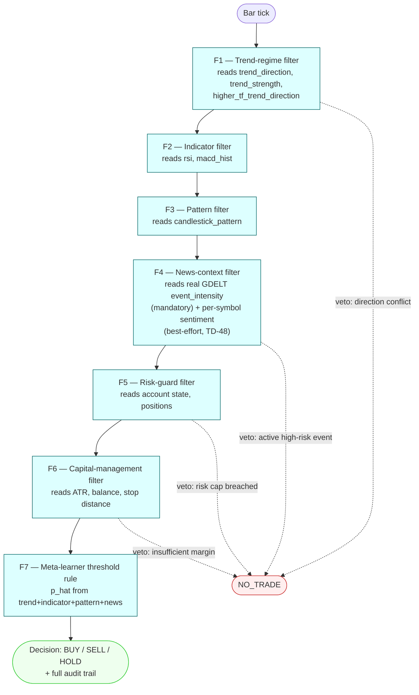

# Strategy: `hybrid`

`extends: baseline`, adding F4 (news-context) and the "news" feature family. Docs/
experiments.md Experiment 2: evaluate full hybrid vs. baseline on EUR/USD — this is the
strategy Hypothesis H1 is tested against. Config: [`config.yaml`](config.yaml).



## Run

```bash
algo-backtest run --strategy hybrid --symbol EURUSD --from 2024-06-01 --to 2024-06-30
```

**Status (2026-09-26):** `config.yaml`, the pure-Python chain, and `algos/hybrid/main.py`
are all real and run against the real pinned LEAN container (Spec 04h) — same wiring
smoke-test caveats as [`baseline`](../baseline/README.md), plus F4's own sentiment half
remaining best-effort pending TD-48 (full-month real article-text ingestion, ~500 GB /
~90 hours at the current adapter's throughput) — the event-veto half is real today. See
`docs/technical-debt.md`'s TD-51 and
`docs/stories/done/2026-09-26-04h-algo-backtest-hybrid-integration/RUNBOOK.md` for the
exact commands to reproduce.
