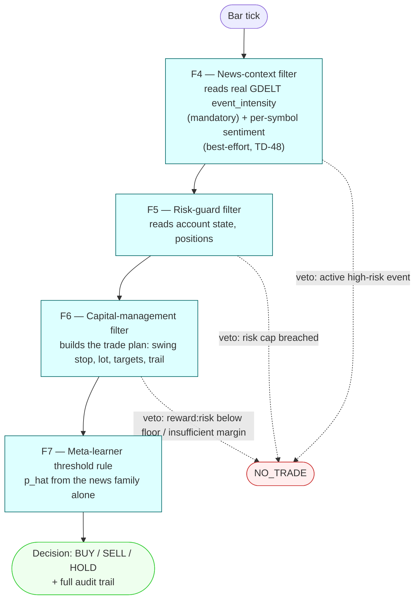

# Strategy: `news-only`

`extends: baseline`, but with no price filter in the chain: the news family alone decides
direction. Docs/experiments.md Experiment 2b: the news-only leg of the baseline / hybrid
comparison on EUR/USD. Config: [`config.yaml`](config.yaml); `news-only-h4` restates only
the H4 clock over it.



## What differs from `hybrid`

| Aspect | `hybrid` | `news-only` |
|---|---|---|
| `filters` | F1 F2 F3 F4 F5 F6 F7 | F4 F5 F6 F7 — F1/F2/F3 absent, their inherited `indicator:` / `pattern:` sections dropped with a top-level `null` |
| `meta_learner.families` | trend, indicator, pattern, news | `[news]`: p̂ comes from `news_event_intensity` (+ `news_sentiment_score` when present) |
| `meta_learner.regime_gate` | false | false, and must stay so — F1's `trend_score` does not exist in this chain |
| Decision bar / label horizon | M1 / 15 min | H1 / 60 min (`news-only-h4`: H4 / 240 min) |
| `risk_guard`, `capital_mgmt` | baseline's A05 plan | the Heikin-Ashi H4 template's values: 18 % account-risk cap, swing stop shrunk 50 %, targets at 4R and 6R closing half each, one trail step armed at 2R to +0.1R, 2.0 reward:risk floor |
| `news_context`, `execution`, `price_features` periods | — | inherited unchanged (F4 thresholds −0.5 / 0.15; 1-pip spread; the swing look-back F6's stop still needs) |

The engine computes the ATR and swing readings on every bar whatever the filter list, so
F6's `stop_distance_source: swing` works without F1–F3 (`chain_wiring.feature`, "A chain
without price filters").

## Train and run

The strategy needs its own F7 model: `run` without `--model` would load the bundled
four-family hybrid model and refuse it (`meta_learner.families` mismatch).

```bash
uv run python algo-backtest/scripts/train_hybrid_meta_learner.py --strategy news-only \
    --from 2015-02-02 --train-end 2015-06-30 --validation-end 2015-07-31 --test-end 2016-01-31 \
    --out algo-backtest/models/news-only/f7_meta_learner.json
uv run algo-backtest run --strategy news-only --symbol EURUSD --from 2015-08-01 --to 2016-01-31 \
    --param cash=10000 --model algo-backtest/models/news-only/f7_meta_learner.json
uv run algo-backtest explain-strategy news-only
```

**Status (2026-09-27):** configuration, wiring and the trainer's family selection are
tested offline; no model has been trained and no LEAN run has been made yet, so there is
no news-only result. The same smoke-test caveats as [`hybrid`](../hybrid/README.md)
apply, and the sentiment half of the news family stays best-effort pending TD-48.
