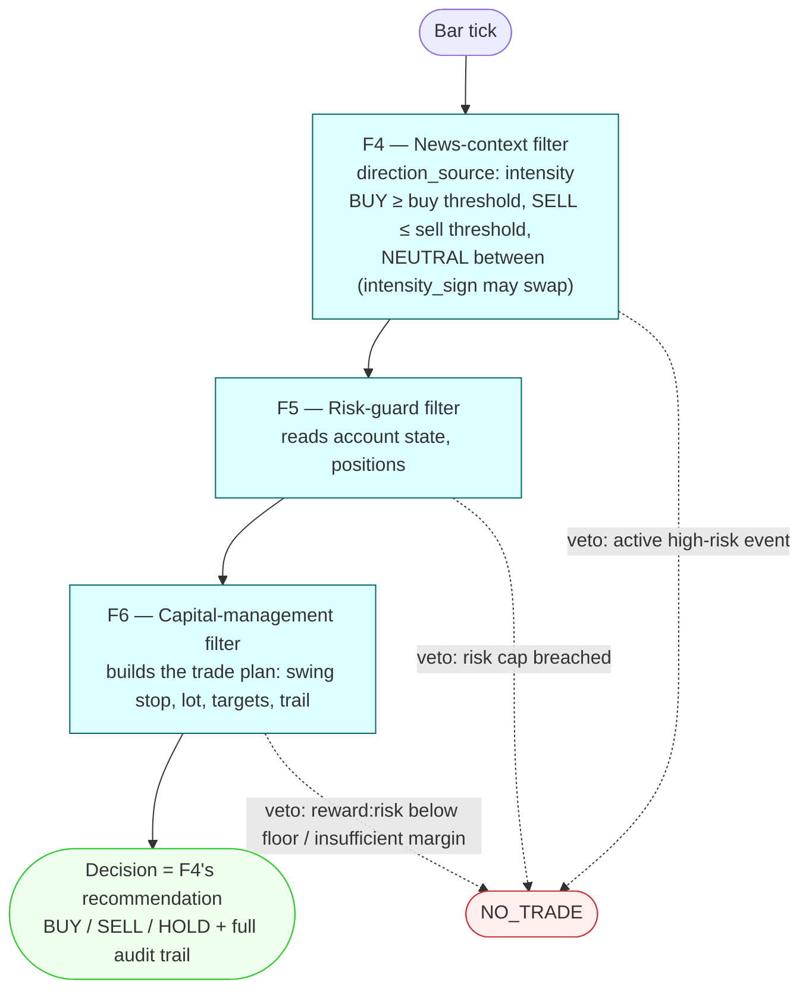

# Strategy: `news-rule`

`extends: news-only`, minus the meta-learner: a rule-only news strategy with no F7 and no
model. F4 decides the direction from the day's GDELT event intensity itself, F5 and F6
gate the trade, and the chain's decision is F4's recommendation (`terminal_filter:
f4_news_context`). Config: [`config.yaml`](config.yaml); `news-rule-h4` restates only the
H4 clock over it.



## The F4 intensity rule

| `news_context` key | `news-rule` value | Meaning |
|---|---|---|
| `event_intensity_veto_threshold` | −0.5 | at or below it F4 vetoes, before any direction is read |
| `direction_source` | `intensity` | the direction comes from the event intensity, not from sentiment |
| `intensity_buy_threshold` | 0.9 (placeholder) | BUY at or above it |
| `intensity_sell_threshold` | 0.3 (placeholder) | SELL at or below it; NEUTRAL (→ HOLD) between the two; buy must be strictly above sell |
| `intensity_sign` | 1 | −1 swaps BUY and SELL, so the Goldstein sign convention is a registered cell rather than a guess |

The two thresholds are placeholders to be overridden per experiment cell: a variant
`extends: news-rule` restating only `news_context.intensity_buy_threshold` /
`intensity_sell_threshold` (and `intensity_sign`). `terminal_filter` names the last
direction-emitting filter; the gates after it (F5, F6) may still veto. A chain without F7
and without `terminal_filter` is refused at load.

## Run

No model is involved: `run` takes no `--model` for this strategy and refuses one.

```bash
uv run algo-backtest run --strategy news-rule --symbol EURUSD --from 2015-08-01 --to 2016-01-31 --param cash=10000
uv run algo-backtest explain-strategy news-rule
```

**Status (2026-09-27):** configuration, F4's intensity rule, the terminal rule and the
run-input validation are tested offline; no LEAN run has been made yet, so there is no
news-rule result. The event-intensity input is real (GDELT, one-day publication lag);
see [`news-only`](../news-only/README.md) and [`hybrid`](../hybrid/README.md) for the
shared caveats.
