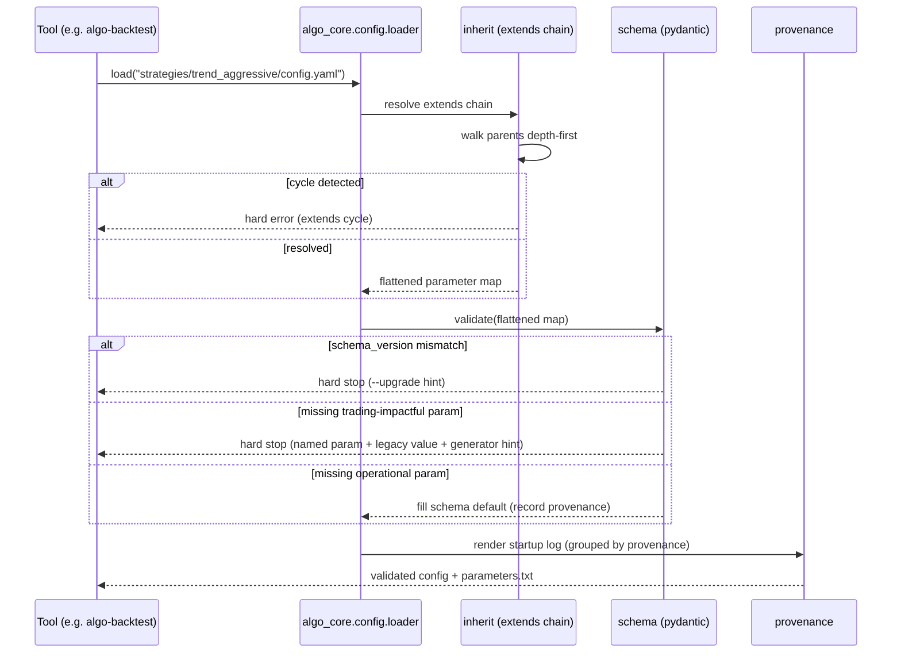
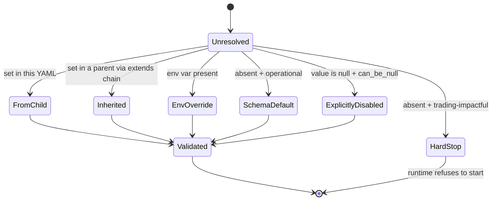

# Spec — algo-core

## 1. Purpose & scope

`algo-core` is the shared library every other `algo-*` tool depends on. It owns the
**cross-cutting contracts** of the suite: the `Instrument` value object, the canonical
Parquet path/partition layout, DuckDB connection helpers, the logging
configuration, and the configuration schema/loader (the `ParameterSpec` model,
the hybrid loader policy and the provenance log).

> **MVP scope note:** the loader **policy** (hard-stop on missing
> trading-impactful params · default-with-log on operational · `null` =
> explicit-disable · schema-version check · provenance log) is a methodology
> contribution and is in scope. **`extends:` strategy inheritance + cycle
> detection are deferred to post-TCC** — the MVP has two flat configs (baseline,
> hybrid) and needs no inheritance. The `inherit.py` module and the
> `extends:`-related scenarios below are kept as the documented future shape, not
> built for the TCC.

It does **not** download, transform, score or backtest anything. It performs no
network I/O. **`algo-core` is a pure library with no CLI and no entry-point
script** — it is imported, never run. The config-validation CLI
(`validate`/`upgrade`/`show`) belongs to the tool that owns strategy configs
(`algo-backtest`), which maps the loader's exceptions to process exit codes.

## 2. Inputs & outputs

| Direction | Item | Form |
|---|---|---|
| In | a parsed config dict + a `ParameterSpec` schema | the caller reads the YAML; the loader validates the dict |
| Out | `Instrument` objects, path strings, DuckDB connections, `Cache`/`Repository` instances | Python API |
| Out | `LoadResult` (resolved values + provenance lines) | value object |
| Out | `ConfigError` (carrying an `exit_code`) | raised on invalid config; a tool's CLI maps it to a process exit |

No Parquet is written by `algo-core`; it only **defines** the layout that other
tools write to. `config.resolve(tool, schema, version)` reads/merges the YAML
files and the env-override layer (`ALGO_*` env > `conf/<tool>.yaml` >
`conf/algo.yaml` > schema defaults) and hands the result to the loader (TD-3).

## 3. Architecture & libraries

Runtime dependencies (actual): **pydantic v2** (value objects + `ParameterSpec`),
**structlog** (logging), **duckdb** (connection + Parquet reads), **pyarrow**
(Parquet read/write in the Repository), **pyyaml** (conf file reading in
`config/resolution.py`, TD-3 resolved). No `typer` (no CLI) and no `ruamel.yaml`.

Internal modules (as implemented):

```
algo_core/
├── instrument.py        # Instrument value object + composed AssetSpec (ForexSpec)
├── layout.py            # canonical Parquet + lean-data path builders / parsers
├── duck.py              # DuckDB connection + Parquet-read helpers
├── logging.py           # structlog config (resolve_level, configure_logging, get_logger)
├── bars.py              # market-data value objects (Timeframe, Tick, QuoteBar)
├── atomicio.py          # atomic file writes (temp file + os.replace)
├── repository/          # __init__ imports DuckDBRepository lazily (PEP 562), so the
│   │                    #   LEAN container (pyarrow, no duckdb) can import ParquetRepository
│   ├── base.py          # Repository[M] ABC: put / read_all / exists (typed value objects)
│   ├── serde.py         # value object <-> Arrow/Parquet (de)serialization
│   ├── parquet.py       # ParquetRepository (pyarrow writer + reader)
│   └── duckdb.py        # DuckDBRepository (DuckDB reader; composes ParquetRepository for writes)
├── cache/
│   ├── base.py          # Cache ABC: read-through get_or_compute
│   ├── lru.py           # LruCache (bounded in-process default)
│   ├── factory.py       # build_cache(name) registry + factory method (Redis/etc. later)
│   └── local.py         # LocalCache (two-tier: memory tier + atomic JSON-on-disk)
└── config/
    ├── paths.py         # conf/ + ALGO_CONF_DIR resolution
    ├── schema.py        # Impact, ParameterSpec
    ├── errors.py        # ConfigError hierarchy (carry exit codes)
    ├── loader.py        # hybrid policy: hard-stop / default-with-log / explicit-null / version
    └── resolution.py    # resolve(): ALGO_* env > conf/<tool>.yaml > conf/algo.yaml > defaults
```

**Deferred / future shape (not built):** `config/inherit.py` (`extends:`
resolution + cycle detection, post-TCC); a startup-log renderer beyond
`LoadResult.provenance`; the `Repository` query/analytical interface (today the
port is `put`/`read_all`/`exists`, see TD-14). There is no `cli.py` — `algo-core` is a library.

The `Repository` ABC speaks in domain value objects (e.g. `QuoteBar`,
`SentimentRow`), not engine rows; query parameters are a typed object, never raw
SQL — so callers are not tied to DuckDB's dialect and a future store is a new
backend, not a rewrite. The `Cache` ABC mirrors the in-house `wise-cache`
contract (pydantic-serialized values, versioned keys) in **read-through + write**
mode (`get_or_compute`); the **default is dependency-free** — an in-process
`LruCache` plus a file-backed `LocalCache`. Any efficient backend (embedded, or a
containerized service such as Redis/Aerospike/Mongo) is an **optional later
performance upgrade** behind the same ABC, not a baseline dependency.

## 4. Diagrams

### 4.1 Sequence — config load with inheritance and provenance



### 4.2 State — a single config parameter's resolution



## 5. CLI surface

**None — `algo-core` is a library.** The config-validation CLI
(`validate`/`upgrade`/`show`) lives in `algo-backtest` (which owns strategy
configs); it wraps the loader and maps `ConfigError.exit_code` to the process
exit. The exit-code contract carried by the library's exceptions:

| exit code | meaning (`ConfigError.exit_code`) |
|---|---|
| 0 | valid |
| 2 | missing trading-impactful param / illegal null |
| 3 | schema-version missing or mismatched |
| 4 | `extends:` cycle (deferred, post-TCC) |

## 6. Data contracts

### 6.1 `Instrument` (common value object + composed per-asset-class `details`)

> **Implementation status:** implemented. The frozen `Instrument` carries
> `symbol`, `security_type` (LEAN `SecurityType` enum), `market` (`oanda` for
> forex), `digits`, `unit`, `unit_size`, `lot_size` (100 000 for forex), and
> `details` (`ForexSpec`). `layout.price_path_for(instrument, …)` and
> `lean_data_dir_for(instrument, …)` derive the path classification from the
> `Instrument` (LEAN-lowercased for `lean-data/`), so callers never pass raw
> `security_type`/`market` strings (TD-15 resolved).

**Composition over inheritance:** one frozen `Instrument` value object holds the
attributes common to every tradable thing, plus a `details` sub-attribute that
is itself a per-asset-class value object named after LEAN's `SecurityType`
(`ForexSpec`, `EquitySpec`, `FutureSpec`, `CfdSpec`, `CryptoSpec`, …). The TCC
implements only `ForexSpec`; another asset class is a new `*Spec` plugged into
the same `Instrument`, with no change to the common object or to its consumers.

**`Instrument` (common to all asset classes):**

| Field / method | Type | Notes |
|---|---|---|
| `symbol` | str | e.g. `EURUSD`, `AAPL`, `BTCUSD` |
| `digits` | int | decimals; min price increment = 10⁻ᵈⁱᵍⁱᵗˢ (used by `round_price()`) |
| `unit` | enum (`pip`, `tick`, …) | name of the price-movement unit |
| `unit_size` | float | price value of one `unit` |
| `lot_size` | float | minimum tradable unit |
| `details` | `AssetSpec` | composed per-asset-class value object (below) |
| `round_price(p)` | method | rounds to `digits` |
| `unit_value(...)` | method | money value of one `unit` (asset-agnostic risk math) |

Price-movement is a **named unit**, not a hard-coded "pip"/"tick": `unit` labels
it and `unit_size` is its value, so `pip ≠ tick` stays honest (same field,
different label per asset class) and risk math is asset-agnostic (stops/targets
in `unit`s via `unit_value()`). The **minimum increment** for rounding is derived
from `digits` and is separate from `unit_size` (e.g. EUR/USD `digits=5` →
increment `0.00001`, while its pip `unit_size` is `0.0001`).

**`details` — per-asset-class value object:**

The `*Spec` names follow LEAN's `SecurityType` taxonomy (ETFs are equities,
commodities are futures in LEAN's model):

| `AssetSpec` (LEAN SecurityType) | Attributes | Example |
|---|---|---|
| `ForexSpec` (forex) | `base`, `quote` (`unit="pip"`) | EURUSD: base EUR, quote USD, unit_size 0.0001; USDJPY: unit_size 0.01 (the §2.2 JPY trap = a different `unit_size`) |
| `EquitySpec` (equity — incl. ETFs) | `exchange`, `currency` (`unit="tick"`) | AAPL: NASDAQ, USD, unit_size 0.01 |
| `FutureSpec` (future — incl. commodities) | `contract`, `exchange`, `contract_size`, `expiry` | — |
| `CfdSpec` (cfd) | `underlying`, `exchange` | — |
| `CryptoSpec` (crypto) | `base_asset`, `quote_asset`, `exchange` | BTCUSD: Binance |

**Realization is an implementation detail, deferred to code time.** What this
spec fixes is the **contract**: the common `Instrument` attributes/methods above,
plus per-asset-class data carried in a typed way. Whether that is a single
polymorphic `details` field, named optional spec slots (one populated per type,
the rest null), or subclasses is equivalent for the contract and chosen when the
code is written — all three port cleanly to a struct + optional/typed field.
Consumers depend only on the common contract, never on the realization. Only the
FX case is implemented for the TCC.

Construction validates the composed `details` (its required attributes); an
unknown `symbol` raises rather than defaulting. Consumers (Repository, filters,
risk math) depend only on the common `Instrument` interface and never branch on
the concrete `details` type — adding an asset class never touches them.

### 6.1.1 Vocabulary aligned with LEAN

The instrument vocabulary deliberately mirrors **LEAN's** (the engine the suite
runs on), so the data model and the engine speak the same language: `symbol` ↔
LEAN `Symbol`; `security_type` ↔ LEAN `SecurityType` (its values —
`forex`, `equity`, `future`, `cfd`, `crypto`, `index`, `option` — are LEAN's);
the project already uses LEAN's `QuoteBar`, `Resolution` (`tick`/`minute`/`daily`)
and `Market`. The only addition beyond LEAN's model is the named price-movement
`unit`/`unit_size` (LEAN exposes a minimum price variation but no "pip"/"tick"
label), which the suite adds for asset-agnostic risk math.

### 6.2 Canonical Parquet layout (owned here, written by other tools)

```
prices:    {data_root}/parquet/{security_type}/{symbol}/year=YYYY/month=MM/data.parquet
           security_type ∈ LEAN SecurityType {forex, equity, future, cfd, crypto, index, option}   (forex for the TCC)
features:  {data_root}/parquet/{feature_domain}/{dataset}/year=YYYY/month=MM/data.parquet
           feature_domain ∈ {news, sentiment, events, features}
           dataset e.g. forex→EURUSD ; news→gdelt ; sentiment→finbert ; events→gpr
```

The price `security_type` is **derived from the `Instrument`** (its `details`
type), not hard-coded — adding equities/crypto is a new value of `security_type`,
no layout change. `layout.py` builds and parses these paths; partition columns
are Hive-style. The TCC writes only `security_type=forex`.

**Parquet is the canonical source of truth.** The other two on-disk stores are
*derived* and read-through (built once on a cache miss, reused; rebuildable from
Parquet — see `../docs/parquet-evaluation.md`):

```
execution store:  {data_root}/lean-data/{security_type}/{market}/{resolution}/{symbol}/...
                  durable LEAN-native files LEAN replays across the sweep
                  (optional RAM-resident copy at /dev/shm/lean-data — accelerator, not source)
feature cache:    via the Cache port (LocalCache, §13.6), keyed by (feature_id, symbol, ts, feature_version)
```

`layout.py` builds and parses the `lean-data/` paths too (the per-asset-class
LEAN convention, mapped from the `Instrument`). Only minute-resolution price and
the consolidated decision features are materialized there; **ticks stay
Parquet-only**.

## 7. Error handling

- Missing **trading-impactful** parameter → hard stop, message names the
  parameter, its section, the reference strategy's value (if any) and a
  `config_generator` hint.
- Missing **operational** parameter → schema default + `USING DEFAULT:` log.
- `null` on a `can_be_null` parameter → accepted, `EXPLICITLY DISABLED:` log.
- `schema_version` mismatch → hard stop with `--upgrade` hint.
- `extends:` cycle → hard error at load.
- Unknown `Instrument` symbol → raise (never default the unit / `details`).

## 8. Test scenarios (Gherkin)

```gherkin
Feature: Configuration loading policy
  Background:
    Given the parameter schema for strategy configs

  Scenario: Missing trading-impactful parameter is a hard stop
    Given a config.yaml without "risk_math.risk_per_trade"
    When the loader validates it
    Then it exits non-zero
    And the error names "risk_per_trade", its section, and the legacy value 0.03
    And the error hints to run config_generator

  Scenario: Missing operational parameter falls back to default with a log
    Given a config.yaml without "operational.log_level"
    When the loader validates it
    Then validation succeeds
    And the startup log contains "USING DEFAULT: log_level=INFO"

  Scenario: Explicit null disables a nullable parameter
    Given a config.yaml with "risk_guard.max_leverage: null"
    When the loader validates it
    Then validation succeeds
    And the startup log contains "EXPLICITLY DISABLED: max_leverage"

  Scenario: Missing and null are not the same for a nullable parameter
    Given a config.yaml that omits "risk_guard.max_leverage" entirely
    And max_leverage is trading-impactful
    When the loader validates it
    Then it exits non-zero (missing is an oversight, null is a choice)

  Scenario: Schema-version mismatch refuses to load
    Given a config.yaml with schema_version 1
    And the current schema is version 2
    When the loader validates it
    Then it exits with code 3 and an "--upgrade" hint

  Scenario Outline: extends resolution overrides per key
    Given parent "trend_base" with portfolio_at_risk_cap 0.06
    And child "trend_aggressive" extends "trend_base" with portfolio_at_risk_cap <child>
    When the loader resolves the child
    Then the effective portfolio_at_risk_cap is <effective>
    And every other trend_base key is inherited unchanged
    Examples:
      | child | effective |
      | 0.10  | 0.10      |
      | null  | disabled  |

  Scenario: extends: cycle is a hard error
    Given "a" extends "b" and "b" extends "a"
    When the loader resolves "a"
    Then it exits with code 4 naming the cycle

  Scenario: Instrument honors per-instrument unit and precision
    Given the Instrument "USDJPY" (FX)
    Then its unit is "pip" with unit_size 0.01 and digits is 3
    And rounding 110.123456 yields 110.123
    And it never uses the EURUSD unit_size 0.0001

  Scenario: Unknown symbol raises rather than defaulting
    When I construct Instrument("XAUUSD") and it is not registered
    Then construction raises, with no silent unit or spec default
```

Edge cases (this tool's §8 themes): missing-vs-null distinction; `extends:`
cycle; schema-version bump; provenance log correctness across all five
provenance categories; `Instrument` equality/precision; Parquet path round-trip
(build→parse→build is identity).

## 9. Acceptance criteria

- The **loader** enforces the §8 policy with the exact log lines (`USING DEFAULT:`,
  `EXPLICITLY DISABLED:`); missing trading-impactful, null-on-non-nullable, and
  missing/mismatched schema-version all raise `ConfigError` with the right exit
  code. (A tool's CLI maps that exit code; `algo-core` has no CLI.)
- `Instrument` round-trips both pairs with correct `unit`/`unit_size`/`digits`.
- `layout` build/parse is identity for the price, feature and lean-data paths.
- ≥ 90 % line coverage (currently 99 %); mypy strict clean; ruff clean (incl. `C901`).
- No network I/O anywhere in the package.

## 10. Open items

- **Resolved:** the catalog is a **closed, typed Python catalog** (`instrument.py`),
  not YAML/config-driven; adding a pair is one reviewed line. (Decision recorded;
  YAML detour rejected.)
- **Resolved:** `algo-core` hosts the config schema/loader; the config *CLI* lives
  in `algo-backtest`.
- **Resolved (TD-15):** `Instrument` is the single source of LEAN identity
  (`security_type`/`market`/`lot_size`); `layout.price_path_for` /
  `lean_data_dir_for` derive from it. (Codex finding; LEAN-alignment.)
