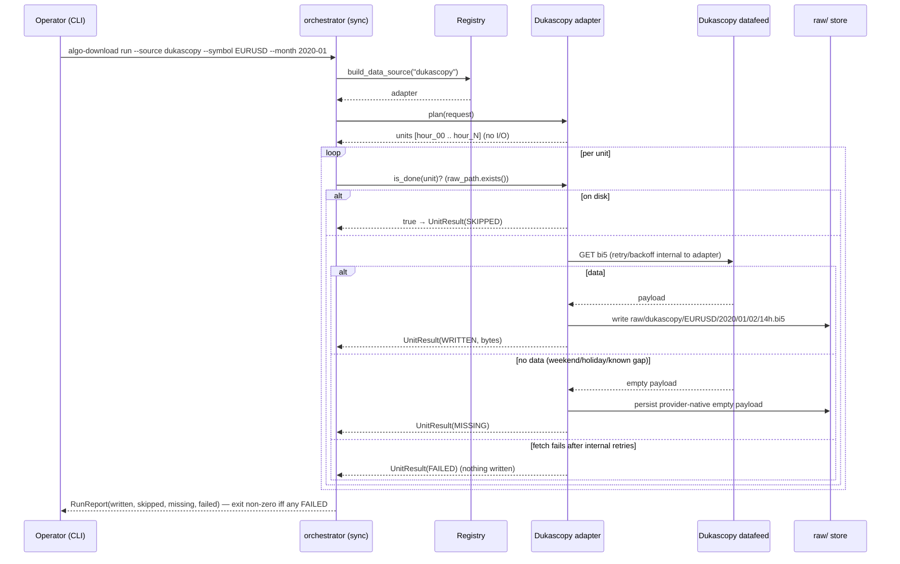

# Spec — algo-download

## 1. Purpose & scope

`algo-download` is the first pipeline stage: **bulk retrieval of raw payloads**
from heterogeneous sources into the `raw/` store, parameterized by `--source`.

It writes **raw payloads only** (provider-native bytes); it does **not** parse,
extract, or produce canonical Parquet — that is `algo-transform`'s job. The split
keeps "fetch" and "normalize" as distinct, separately re-runnable steps. Anything
that decodes a payload belongs in the next stage, never here.

**Phased delivery** — one source proven end-to-end before the next; each is a new
adapter behind the same port, no edits to the others:

| Slice | Source | Kind | Notes |
|---|---|---|---|
| 1 (done) | `dukascopy` | price (primary) | tick `.bi5`, the empirical backbone |
| 2 (done) | `gdelt` | events/news | re-derived as a fresh raw-zip adapter (see §7a) — one unit per 15-min Events slot, no symbol dimension |
| 3 (done) | `gpr` | index | single-file pull, whole window, no date/symbol dimension (see §7a) |
| 4 (spec'd) | `gdelt_ngrams` | article-text source (raw) | GDELT Web News NGrams 3.0, one unit per UTC minute, no symbol dimension (see §7a.3). Unblocks real FinBERT/LM sentiment scoring (reconstruction from NGrams happens in `algo-transform`, not here — TD-28) |
| later | `yfinance` | price (**daily fallback**) | resilience only (PRD §7), not a baseline source |

`yfinance` is a risk-control branch, not part of the primary path: it fetches
**daily** FX bars and tags payloads `resolution=daily, fallback=true` so
`algo-transform` can exclude those months from the minute-resolution backtest
(never interpolate daily → minute). It is built **after** the primary path is
proven, never in slice 1.

Out of scope (future-work adapters, same registry pattern): FNSPID, CC-News,
Reddit Pushshift, central-bank scrapers.

## 2. The port (the contract that must be coherent first)

The orchestrator depends only on the `DataSource` ABC and deals exclusively in
**source-native units** plus **normalized status** — it never assumes a unit's
shape. Each source owns what a unit *is* (Dukascopy = one hour; GDELT = one
15-minute slot file; GPR = the single index file).

```python
class UnitStatus(StrEnum):
    WRITTEN = "written"   # fetched and persisted this run
    SKIPPED = "skipped"   # already on disk (idempotent resume)
    MISSING = "missing"   # provider has no data for this unit (not an error)
    FAILED  = "failed"    # fetch did not complete (retried internally, gave up)

class DownloadUnit(BaseModel):           # frozen; one per source, source-owned
    key: str                             # stable id for log/report (e.g. "EURUSD 2020-01-02 14h")
    raw_path: Path                       # canonical destination, derived from algo-core layout

class UnitResult(BaseModel):             # frozen; what the orchestrator aggregates
    unit: DownloadUnit
    status: UnitStatus
    bytes: int                           # payload size persisted (0 for MISSING/FAILED)

class DataSource(ABC):
    name: ClassVar[str]
    def plan(self, request: DownloadRequest) -> Iterator[DownloadUnit]: ...
    def is_done(self, unit: DownloadUnit) -> bool:    # filesystem-only resume
        return unit.raw_path.exists()
    def fetch(self, unit: DownloadUnit) -> UnitResult: ...   # network + write raw bytes
```

- `plan()` yields source-native units for the request; **no I/O, no network**
  (so `--dry-run` is just `plan()` printed).
- `is_done()` is **filesystem-only**: true iff the unit's raw artifact already
  exists. Default is `raw_path.exists()`; a multi-file source overrides it.
- `fetch()` does the network and writes the raw bytes, returning a normalized
  `UnitResult`. Retry/concurrency live **inside** the adapter, invisible to the
  orchestrator (§3).

**Resume is filesystem-only — there is no machine-managed state.** A definitive
"provider has no data" answer (e.g. a weekend hour) is persisted as the
provider's own (often empty) payload, so the unit is `MISSING` yet on disk and a
re-run `SKIP`s it. A `FAILED` unit writes **nothing**, so the next run retries
it. This is the fail-fast contract: never fabricate data, never delete a
faithful payload, never hide a failure behind a default.

## 3. Architecture & libraries

Reuses the **Registry + Factory / Strategy + Adapter** pattern. The orchestrator
is **synchronous** and source-agnostic: build the adapter, `plan()`, then per
unit `is_done()? → fetch()`, aggregating `UnitResult`s into a report. Concurrency
is an optimization that belongs **inside** an adapter when its access pattern
warrants it (Dukascopy's hourly files may fetch in parallel; GPR is one file);
the orchestrator does not impose an async model on every source.

Libraries are therefore an **adapter's own choice**, not a top-level mandate:

- **algo-core** — `Instrument`, `raw/` path layout, logging, config loader.
- `dukascopy` adapter: a thin `httpx` GET that writes the raw `.bi5` bytes
  **verbatim** (no decompression — that is `algo-transform`'s job). Public feed,
  no credentials (confirmed, §7a). Resilience, all internal to the adapter and
  unit-tested directly (not in BDD, §7):
  - **transient failures** (network error, `429 Too Many Requests`, `5xx`) are
    retried with backoff; other non-2xx (e.g. `403`) become `FAILED` (the run is
    never crashed by one unit — the orchestrator also contains any unexpected
    error as `FAILED`);
  - **politeness throttle** — at least `min_interval` seconds between requests
    (`ALGO_DUKASCOPY_MIN_INTERVAL`, default `0.2`s) so a ten-year bulk pull does
    not look like an attack or trip a ban;
  - **atomic writes** (temp + `os.replace`) so a process killed mid-write leaves
    no partial file that filesystem resume would mistake for complete.
- `gdelt` adapter: same shape as `dukascopy` — thin GET per 15-min slot, raw
  zip bytes verbatim, same transient-failure/backoff and atomic-write
  contract. Its own politeness throttle env var,
  `ALGO_GDELT_MIN_INTERVAL` (default `0.2`s), independent of Dukascopy's (a
  decade-plus backfill is hundreds of thousands of 15-min slots — pacing
  matters here too, §7a.1).
- `gpr` adapter: single GET, one file, no throttle env var needed (one request
  per run) but still atomic-write.
- test HTTP mocking (e.g. `respx`) — offline, deterministic; no live network.

```
algo_download/
├── cli.py            # typer: algo-download run --source ... --symbol ... --month/--from/--to
├── orchestrator.py   # synchronous: plan → is_done? → fetch; aggregate RunReport
├── source.py         # DataSource port (plan / is_done / fetch)
├── registry.py       # REGISTRY + @register + build_data_source (fail-fast on unknown)
├── request.py        # DownloadRequest value object (symbol, months)
├── result.py         # UnitStatus, DownloadUnit, UnitResult, RunReport
└── adapters/
    ├── __init__.py   # import-for-side-effect registration hub
    └── dukascopy/    # slice 1: paths.py (URL/raw-path) + source.py (DukascopySource)
                      #          gdelt/, gpr/, gdelt_ngrams/, yfinance/ added in later slices
```

Adding a source = new subpackage + one import line in `adapters/__init__.py`; no
edits to other adapters.

## 4. Diagrams

### 4.1 Sequence — slice 1 (Dukascopy), synchronous orchestrator



### 4.2 State — one unit of work

```mermaid
stateDiagram-v2
    [*] --> Planned
    Planned --> Skipped: is_done() true
    Planned --> Fetching: is_done() false
    Fetching --> Written: data persisted
    Fetching --> Missing: provider no-data, empty payload persisted
    Fetching --> Failed: fetch incomplete (nothing written; retried next run)
    Written --> [*]
    Skipped --> [*]
    Missing --> [*]
    Failed --> [*]: reported; run continues
```



(Retry/backoff is internal to `fetch()`; it is deliberately absent from this
state machine, which describes only the orchestrator-visible outcomes.)

## 5. CLI surface (slice 1)

```
algo-download run --source dukascopy --symbol EURUSD --month 2020-01 [--dry-run]
algo-download run --source dukascopy --symbol USDJPY --from 2015-02 --to 2024-12
```

- `--dry-run` prints the plan (units that would be fetched) — no network, no writes.
- Exit codes: `0` on success (including `MISSING` gaps); non-zero **iff** a unit
  ended `FAILED` after the adapter's internal retries.

**Per-source flag applicability** (slices 2–3 add sources with fewer dimensions
than Dukascopy — the CLI fails fast rather than silently ignoring an
inapplicable flag):

| Source | `--symbol` | `--month` / `--from`/`--to` |
|---|---|---|
| `dukascopy` | required | required (one of month or range) |
| `gdelt` (global, no symbol) | rejected, non-zero exit naming `--symbol` | required (one of month or range) — one unit per 15-min slot in span |
| `gpr` (whole-window, no symbol, no date) | rejected, non-zero exit naming `--symbol` | rejected, non-zero exit — `--month` alone names `--month`; `--from`/`--to` names `--from`; plan is always the single full-window unit |
| `gdelt_ngrams` (global, no symbol) | rejected, non-zero exit naming `--symbol` | required (one of month or range) — one unit per UTC minute in span |

**No credentials on the critical path.** The Dukascopy historical tick datafeed
is public. (Credentials appear only post-TCC for the optional OANDA live
brokerage — Phase 6, in `algo-backtest`.)

## 6. Config

Config is **optional and read-only** in this tool. With none, convention
defaults apply (symbols/span come from the CLI). A future `conf/download.yaml`
may list sources/symbols/span, and cross-cutting settings (`data_root`, logging)
come from `conf/algo.yaml` / `ALGO_*` env — file/env layering now exists in
`algo-core` (`config.resolve`, TD-3) but this tool does **not** use it yet. `algo-download` does **not**
introduce config loading on its own.

There is **no machine-managed `state:` block**. Operator config is never mutated
by a run. If a run-manifest or coverage ledger is ever wanted, it is an explicit
artifact under `_meta/` (or `runs/`) in the data root — a separate design
(TD-16), never a mutated config file.

## 7. Test scenarios (Gherkin) — artifact-shaped

The invariants that matter are **outputs**: the exact raw path, no duplicate
refetch, deterministic `MISSING` vs `FAILED`, and **no transform side effects**.
Retry/backoff *timing* is verified by narrow unit tests on the adapter, **not**
in BDD (testing the behavior, not the chosen retry library).

```gherkin
Feature: Download Dukascopy tick data (raw only)
  Background:
    Given a writable data root
    And the public Dukascopy datafeed is mocked

  Scenario: Happy path writes raw payloads at the canonical path
    When I run "algo-download run --source dukascopy --symbol EURUSD --month 2020-01"
    Then a raw .bi5 payload exists under raw/dukascopy/EURUSD/2020/01/ for each fetched hour
    And no payload is parsed or written outside the raw/ store
    And the report counts written units and their byte sizes
    And the command exits 0

  Scenario: Resume is a filesystem no-op
    Given EURUSD 2020-01 is already on disk
    When I re-run the same command
    Then every unit is SKIPPED
    And no HTTP request is made
    And the report shows 0 written
    And the command exits 0

  Scenario: Provider no-data is MISSING and durable, not FAILED
    Given the datafeed returns an empty payload for one hour
    When I run the download
    Then that hour is recorded MISSING
    And its provider-native empty payload is persisted (so a re-run SKIPs it)
    And the command exits 0

  Scenario: A failed fetch writes nothing and exits non-zero
    Given the datafeed fails one hour beyond the adapter's retry limit
    When I run the download
    Then that hour is recorded FAILED
    And no file exists for it (so the next run retries it)
    And all other hours are still fetched
    And the command exits non-zero

  Scenario: USDJPY keeps its own identity
    When I run "... --source dukascopy --symbol USDJPY --month 2020-01"
    Then the raw path is derived from the USDJPY Instrument, not EURUSD
    And no price value is scaled or normalized in this stage

  Scenario: Dry run plans without any I/O
    When I run "... --source dukascopy --symbol EURUSD --month 2020-01 --dry-run"
    Then the plan lists the hour units
    And no HTTP request is made
    And no file is written
```

### 7.1 GDELT and GPR (slices 2–3)

Same shape as above (happy path, resume-no-op, `MISSING`-vs-`FAILED`, dry-run)
plus the flag-applicability scenarios in §5. Canonical, mutation-tested source —
not duplicated here to avoid drift:
`tests/features/gdelt.feature`, `tests/features/gpr.feature` (adapter-level),
`tests/features/cli.feature` scenarios `cli-11`–`cli-15` (end-to-end CLI
surface), `tests/features/gdelt_network.feature` and
`tests/features/gpr_network.feature` (`@network`, opt-in).

### 7.2 GDELT NGrams (slice 4)

Same shape again (happy path, resume-no-op, `MISSING`-vs-`FAILED`, dry-run,
URL-guessable, raw-path round-trip):
`tests/features/gdelt_ngrams.feature` (adapter-level), `tests/features/cli.feature`
scenarios `cli-16`–`cli-17`, `tests/features/gdelt_ngrams_network.feature`
(`@network`, opt-in — fixed historical timestamps only, per §7a.3's publish-lag
note).

## 7a. Real-feed validation (confirmed 2026-05-25)

The offline tests mock the datafeed; these facts were confirmed by a **real
fetch** through the adapter and are recorded for the `algo-transform` decoder:

- URL: `https://datafeed.dukascopy.com/datafeed/{SYMBOL}/{YYYY}/{MM-1:02d}/{DD:02d}/{HH:02d}h_ticks.bi5`
  — month **0-indexed**, public, no credentials.
- Payload is **LZMA**-compressed; decompresses to 20-byte big-endian records
  `>IIIff` = (ms-offset-in-hour, ask-points, bid-points, ask-vol, bid-vol).
  Convert points to price with `price_increment = 10^(-digits)` (EUR/USD `1e-5`,
  JPY `1e-3`) — the minimum price increment, **not** `unit_size` (the pip, `1e-4`
  / `1e-2`). Scaling/decoding happens in `algo-transform`, not here.
- A weekend/no-data hour returns empty/404 → persisted as a 0-byte MISSING
  marker; resume then skips it.

Reproduce: `uv run pytest -m network` (opt-in `@pytest.mark.network` smoke test,
excluded from the offline gate).

### 7a.1 GDELT (confirmed 2026-09-22)

- Slot URL is **directly guessable from a timestamp** — no master-file list
  fetch required: `https://data.gdeltproject.org/gdeltv2/{YYYYMMDDHHMMSS}.export.CSV.zip`.
- A real Events-table zip contains **exactly one CSV**, named
  `{YYYYMMDDHHMMSS}.export.CSV`.
- **Scope decision (not a network fact — record for the next reviewer):**
  this slice fetches the **Events table only**, not `.gkg.csv.zip`
  (Global Knowledge Graph). `algo-transform` Spec 02 targets
  `parquet/news/gdelt/` and `parquet/events/gdelt/` — CAMEO event codes,
  actors, `GoldsteinScale`, `AvgTone`, `SOURCEURL`, all Events-table fields —
  and does not ask for GKG's entity/theme extraction. If a later spec needs
  GKG, add it as its own unit kind on this adapter (same URL pattern, `.gkg.`
  infix); do not silently start fetching it here.
- An out-of-coverage slot (GDELT v2 begins 2015-02-18) and a skipped 15-minute
  tick both return an **empty body** at that URL — persisted as a 0-byte
  `MISSING` marker, same `MISSING`-vs-`FAILED` contract as Dukascopy weekends;
  resume then skips it.
- Public feed, no credentials, no master-file index dependency.

### 7a.2 GPR (confirmed 2026-09-22)

- Canonical URL is the authors' own site (Caldara & Iacoviello), not a mirror:
  `https://www.matteoiacoviello.com/gpr_files/data_gpr_export.xls`.
- Single Excel (`.xls`) file, whole window, no per-month partitioning — one
  `DownloadUnit`, written to `raw/gpr/data_gpr_export.xls`.
- Public, no credentials.

Reproduce: `uv run pytest -m network` (opt-in `@pytest.mark.network`, one smoke
test per source, excluded from the offline gate).

### 7a.3 GDELT Web News NGrams 3.0 (confirmed 2026-09-22)

- Minute URL is **directly guessable from a timestamp** — no master-file list
  fetch required: `https://data.gdeltproject.org/gdeltv3/webngrams/{YYYYMMDDHHMMSS}.webngrams.json.gz`
  (seconds are always `00`; the provider publishes at most one file per UTC
  minute).
- Payload is **gzip-compressed, line-delimited JSON** (one record per line),
  fields `date`, `ngram`, `lang`, `type`, `pos`, `pre`, `post`, `url`. This
  adapter writes the gzip bytes **verbatim** — it does not decompress, parse,
  or reconstruct article text (that is `algo-transform`'s job; see TD-28).
- Coverage begins `2020-01-01T00:01:00Z` (first published file); a minute
  before that returns an empty 404 body, confirmed live.
- **Publish lag (new fact, not present for `gdelt`/Events):** a minute within
  roughly the last hour can 404 even though it will be published shortly
  after — this is **not** the same as a genuine no-data minute. Confirmed by
  probing minutes ~5–15 minutes old (consistently 404) versus ~30–47 minutes
  old (consistently 200 with a multi-megabyte payload). Because this tool is a
  bulk historical backfill (§1) and never requests the in-progress UTC month,
  this lag does not corrupt a normal backfill run — but it means a 404 is only
  treated as a durable, adapter-level MISSING for a minute the caller
  requested from a **past, closed** month, never from "now." Do not add a
  clock-based guard inside the adapter for this (out of scope for a raw
  fetch-only stage); instead the CLI/operator convention is to never pass a
  `--month`/`--to` covering the current, still-open UTC month. Tracked as
  TD-30 (`technical-debt.md`) in case a future live/near-real-time consumer
  needs a real guard.
- Public feed, no credentials, no master-file index dependency — same shape as
  `gdelt`'s Events table (§7a.1).

Reproduce: `uv run pytest -m network` (opt-in `@pytest.mark.network`, one smoke
test per source, excluded from the offline gate).

## 8. Acceptance criteria (slice 1)

- EUR/USD and USD/JPY: one month each downloads to the canonical `raw/dukascopy/`
  path; a second run is a pure filesystem no-op.
- `MISSING` (provider no-data) is durable on disk; `FAILED` leaves nothing and is
  retried next run; the two are never conflated.
- The datafeed is fully mocked in tests — no live network in CI.
- Nothing is parsed, extracted, or written outside `raw/` (stage boundary held).
- `algo-core` `layout` owns the **generic raw store root** (`raw/{source}/`); the
  **provider-native sub-path** below it (e.g. `{SYMBOL}/{YYYY}/{MM}/{DD}/{HH}h.bi5`)
  is the adapter's, since raw filenames differ per source. On-disk month is
  1-indexed (matches the `month=` convention); the **Dukascopy URL is 0-indexed
  by month** (`/2020/00/` = January) — the adapter's URL mapper handles that and
  it is unit-tested.

## 9. Reference implementation status (retired)

`reference-impl/` is an **untested scaffold** generated in one earlier session and
**never validated**. It is **not** a migration asset and its abstractions are
**not** to be preserved. Mine it **only** for source-specific facts —
URLs, filename patterns, table names, cadence, date bounds — and re-justify every
behavioral decision against this spec and the `algo-core` contracts. In
particular it downloads, extracts, converts to Parquet, and optionally deletes
raw intermediates inside one object, which **violates this tool's raw-only stage
boundary**. Slice 2 re-derived GDELT fresh as a raw-zip adapter and removed the
scaffold; TD-12 is resolved.

## 10. Open items

- **Slice 1 prerequisite:** add the `raw/` path builder to `algo-core` `layout`
  (test-first), so `algo-download` derives raw paths the same way prices/features
  do. Tracked as the first step of the slice.
- Confirm the Dukascopy bi5 datafeed covers the full 2015–2024 window for both
  pairs at tick granularity (specs-archive §5.2).
- yfinance daily-fallback adapter: built only after the primary path is proven
  (TD-17).
