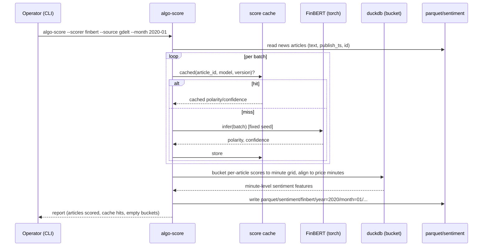
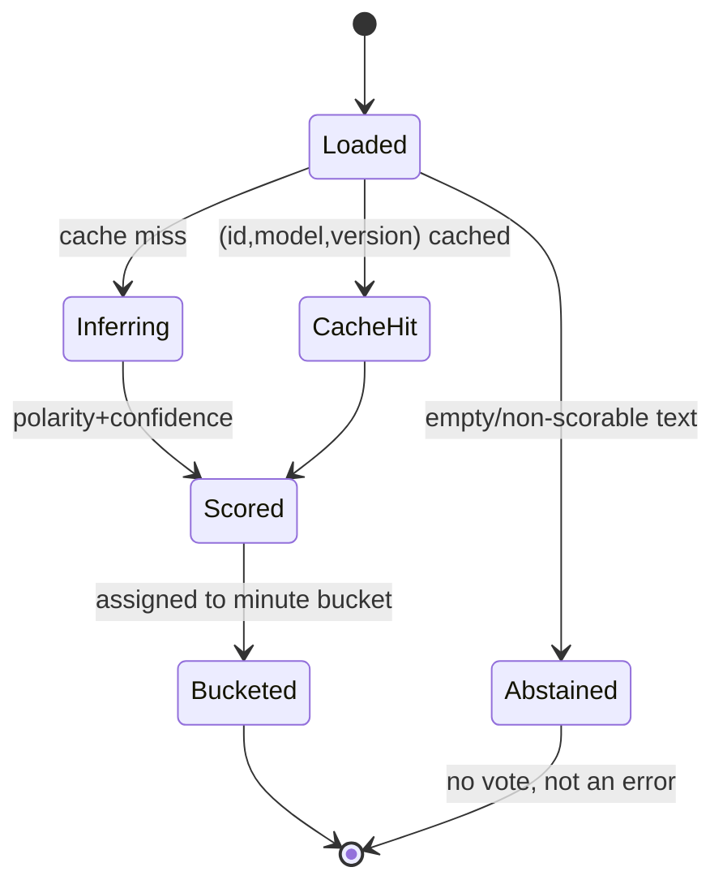

# Spec — algo-score

## 1. Purpose & scope

`algo-score` is the third pipeline stage: it turns the canonical **news/event
Parquet** into **text-derived features** — sentiment scores and event scores —
bucketed onto the minute grid that the backtest consumes. It is the only stage
that runs expensive model inference, so its outputs are **cached as Parquet**;
the backtest replays them deterministically.

Two scorers run side by side:

- **Sentiment**: a FinBERT-class transformer (primary) plus a Loughran–McDonald
  dictionary (transparent baseline) over article text.
- **Events**: GDELT event aggregates and the GPR index, normalized into
  continuous regime/event features.

It does **not** compute price features (TA, indicators, patterns) — those are
computed natively inside the engine at backtest time (`algo-backtest`). It does
**not** make trade decisions.

**The attribution model is pluggable per asset class; for FX it is
per-currency, not per-pair.** Sentiment is attributed to an `entity` and the
backtest consumes a per-symbol stream; the entity→symbol mapping is the
asset-class-specific part. FX uses per-currency attribution (entities EUR, USD,
JPY) and derives the per-pair stream; equities would use per-ticker (entity =
symbol, no derivation); futures per-contract. The rest of this section describes
the FX model. For FX, sentiment is scored and stored per **currency** because a
pair is a ratio of two currencies
and the sentiment *differential* is what drives it (the textual analog of the
interest-rate differential). Each article is attributed to the currencies it
concerns via a rule combining the mentioned currency and its central
bank/country (ECB→EUR, Fed→USD, BOJ→JPY). `algo-score` then **materializes the
per-pair sentiment itself** by combining the two currency streams of each
configured pair — `EURUSD = f(EUR, USD)`, `USDJPY = f(USD, JPY)` (the default
combination is the polarity differential, base minus quote) — so USD-macro news
(e.g. FOMC) feeds both pairs naturally. Both the per-currency and the derived
per-pair sentiment are written as Parquet, so the pair feature is a **versioned
on-disk contract**, not logic hidden in a downstream consumer. A market-wide
stream is still produced from the global GPR index as a risk-regime feature.

## 2. Inputs & outputs

| Direction | Item | Form |
|---|---|---|
| In | news Parquet | `parquet/news/{source}/...` (article text + publish ts) |
| In | event Parquet | `parquet/events/{gdelt,gpr}/...` |
| In | model weights | FinBERT (fetched once); LM master dictionary CSV |
| Out | per-currency sentiment | `parquet/sentiment/{scorer}/...` (EUR/USD/JPY, minute-bucketed) |
| Out | per-pair sentiment | `parquet/sentiment/{scorer}_pair/...` (EURUSD/USDJPY, derived differential) |
| Out | event features | `parquet/events/_features/...` (minute-bucketed, forward-filled) |

## 3. Architecture & libraries

- **transformers** + **torch** — FinBERT inference (ProsusAI/finbert,
  yiyanghkust/finbert-tone). CUDA if available; CPU always works.
- optional **onnxruntime** — faster CPU inference (decision in §10).
- LM master dictionary CSV + a deterministic tokenizer — the baseline scorer.
- **duckdb** — bucket per-article scores to the minute grid; align to price.
- **pyarrow** — cache writes; **algo-core** — layout, DuckDB, logging.

```
algo_score/
├── cli.py               # algo-score --scorer lm [--source ...] [--month/range]; algo-score events
│                        #   --kind gdelt|gpr [--month/range] (finbert not built yet)
├── scoring.py           # orchestrates LM scoring → bucketing → per-currency attribution
├── attribution.py       # per-currency + derived pair (EURUSD/USDJPY) sentiment features
├── storage.py / paths.py # sentiment inputs, score cache (algo-core LocalCache), output paths
├── scorers/
│   ├── models.py        # scoring value objects (NewsArticle, ArticleScore, *SentimentFeature)
│   ├── base.py          # NOT BUILT — Scorer ABC
│   ├── finbert.py       # NOT BUILT — transformer inference (batched, cached)
│   └── lexicon.py       # Loughran–McDonald dictionary scorer
├── events/
│   ├── build.py         # build [from, to] feature partitions; merges into existing months
│   ├── grid.py          # minute grid + forward fill with one-day PUBLICATION_LAG
│   ├── features.py / readers.py / models.py / paths.py
│   ├── gdelt.py         # event aggregation features
│   └── gpr.py           # GPR continuous regime feature
└── bucket.py            # per-article scores → minute grid
# score caching uses algo-core's Cache port (keyed by article_id, model, version);
# data access uses algo-core's Repository — algo-score adds no storage of its own
```

Caching and persistence are **not** implemented here: `algo-score` uses
`algo-core`'s `Cache` port (default in-process `LruCache` / file-backed
`LocalCache`, versioned by `model_version`) for FinBERT scores and `algo-core`'s
`Repository` for reading news and writing features. Swapping the cache backend
(to any efficient backend later for performance — embedded, or a containerized
service such as Redis / Aerospike / Mongo) or the store needs no change in
`algo-score`.

## 4. Diagrams

### 4.1 Sequence — score news with caching and minute bucketing



### 4.2 State — an article's scoring lifecycle



## 5. CLI surface

```
algo-score --scorer <finbert|lm> [--source gdelt|...] [--month 2020-01]
         [--from --to] [--device cpu|cuda] [--rebuild] [--config path]
algo-score events --kind <gdelt|gpr> [--month/range]    # event-feature build
algo-score models-fetch                                  # download FinBERT weights once
```

Deterministic: fixed seed; same input + same model version ⇒ identical scores
(so the backtest is reproducible).

## 6. Data contracts

### 6.1 Sentiment features (`parquet/sentiment/{scorer}/...`)

| Column | Type | Notes |
|---|---|---|
| `timestamp` | datetime (UTC) | minute bucket |
| `entity` | string | the attributed entity — a **currency** for FX (`EUR`/`USD`/`JPY`); a **ticker** for equities (`AAPL`); a **contract** for futures. Asset-class-neutral key |
| `polarity` | float | net sentiment in [-1, 1] |
| `confidence` | float | mean confidence in [0, 1] |
| `n_articles` | int | articles in the bucket (0 ⇒ ABSTAIN) |
| `scorer` | string | `finbert` / `lm` |
| `model_version` | string | for cache invalidation + reproducibility |

`algo-score` also writes the **derived per-symbol sentiment** to
`parquet/sentiment/{scorer}_symbol/...` (same columns, keyed by `symbol` instead
of `entity`), computed for FX as the base-minus-quote polarity differential of
the two currency streams. The backtest reads this per-pair Parquet directly — the
combination is owned and serialized here, not left to a downstream consumer. An
article may be attributed to more than one currency (it then contributes to
each); a multi-currency, opposite-tone headline is attributed with **low
confidence**.

### 6.2 Event features (`parquet/events/_features/...`)

| Column | Type | Notes |
|---|---|---|
| `timestamp` | datetime (UTC) | daily, forward-filled to minute |
| `gpr` | float | GPR index level |
| `event_intensity` | float | GDELT aggregate — the **unweighted mean of `goldstein_scale`** across all `GdeltEvent` rows sharing the same `event_date` (confirmed by the user 2026-09-22; `avg_tone` is not folded in, kept available for a possible future scorer-side use) |

Daily-resolution event aggregates are **forward-filled** onto the minute grid
(consistent with the methodology) with a **one-day publication lag**: day D's
aggregate summarizes the whole UTC day, so it first appears at 00:00 UTC on D+1
and every minute of D itself carries D-1's value (`events/grid.py`'s
`PUBLICATION_LAG`). Exposing D's aggregate on D would leak up to 24h of future
information into every backtest bar and F7 training label that reads it. Residual
caveat: `event_date` is GDELT's `SQLDATE` (when the event happened), not
`DATEADDED` (when it was reported); events reported more than a day late still
land in an already-published day — see `docs/technical-debt.md` TD-59. Sentiment is bucketed by article publish
time, not forward-filled across empty minutes. Neither `gpr` nor
`event_intensity` fabricates a value before its series' first observation —
minutes before the first daily value are absent (null), not zero.

A build over [from, to] rewrites only those days' minutes: each touched monthly
partition keeps its existing rows outside the range (`events/build.py`
`_merge_outside`), so a partial-month build — e.g. `algo-backtest run`'s remediation
reaching one day into the next month — never truncates an already-built month.

## 7. Error handling

- Empty / non-English / non-scorable text → **ABSTAIN** (no vote), not a crash.
- Empty minute bucket → `n_articles = 0`, feature is ABSTAIN downstream.
- Model weights missing → `models-fetch` hint; do not silently use a random init.
- Non-determinism guard → fixed seed; fail loudly if a non-deterministic op is
  detected in the inference path.
- Cache version bump → re-score on `model_version` change; never mix versions in
  one output partition.
- Article with no attributable currency → dropped from per-currency output,
  counted in the report (not an error).
- Multi-currency opposite-tone headline → attributed to each currency with
  reduced confidence, never forced onto one side.

## 8. Test scenarios (Gherkin)

```gherkin
Feature: Score financial news sentiment
  Background:
    Given news articles with text and UTC publish timestamps

  Scenario: Happy path — articles get polarity and confidence
    When I run "algo-score --scorer finbert --source gdelt --month 2020-01"
    Then each article has polarity in [-1,1] and confidence in [0,1]
    And minute buckets aggregate net polarity and article count
    And the output records the model_version

  Scenario: Empty batch abstains, does not crash
    Given a minute bucket with no articles
    When scoring runs
    Then that bucket has n_articles 0
    And it is treated as ABSTAIN downstream, not an error

  Scenario: Deterministic scoring
    Given a fixed seed and a fixed model_version
    When I score the same articles twice
    Then the polarity and confidence are identical both times

  Scenario: Cache hit avoids re-inference
    Given an article already scored at the current model_version
    When I re-run scoring
    Then the cached score is used
    And no new inference is performed for that article

  Scenario: Model-version bump invalidates cache
    Given articles scored at model_version v1
    When I score at model_version v2
    Then they are re-scored
    And no partition mixes v1 and v2 scores

  Scenario: Non-English text abstains
    Given an article whose text is not English
    When scoring runs
    Then it abstains rather than producing a spurious polarity

  Scenario: Multi-currency headline ambiguity is flagged
    Given a headline mentioning two currencies with opposite tone
    When scoring runs
    Then the article is marked ambiguous (low confidence), not forced to a side

Feature: Per-currency attribution
  Scenario Outline: route an article to the currency it concerns
    Given an article about <subject>
    When attribution runs
    Then it contributes to currency <currency>
    Examples:
      | subject               | currency |
      | the ECB raising rates | EUR      |
      | an FOMC decision      | USD      |
      | BOJ intervention      | JPY      |

  Scenario: USD-macro news feeds both pairs
    Given an FOMC article attributed to USD
    When the feature layer forms pair features
    Then both EURUSD and USDJPY consume the USD sentiment stream

  Scenario: Article with no attributable currency is dropped
    Given an article concerning none of EUR, USD, JPY
    When attribution runs
    Then it is excluded from per-currency output
    And it is counted in the run report, not raised as an error

  Scenario: Missing model weights gives a clear hint
    Given FinBERT weights are not present
    When I run scoring
    Then it exits non-zero with a "run models-fetch" hint
    And it never falls back to a randomly initialized model

Feature: Event features
  Scenario: GPR is forward-filled onto the minute grid
    Given a daily GPR series
    When I build event features
    Then each minute carries the most recent prior daily GPR value

  Scenario: LM baseline runs alongside FinBERT
    When I run "algo-score --scorer lm --source gdelt --month 2020-01"
    Then a transparent dictionary polarity is produced
    And it is stored under scorer=lm for comparison with finbert
```

Edge cases (this tool's §8 themes): empty/non-English/ambiguous text → ABSTAIN;
deterministic inference (fixed seed); cache hit/miss + version invalidation;
missing weights (no random fallback); minute-bucket alignment with no price bar;
GPR forward-fill vs sentiment non-fill.

## 8.1 Known limitations (documented, carried into Ch.3 threats)

These are acknowledged up front rather than discovered late; none is a blocker,
but each is a known source of measurement noise to report honestly:

- **Attribution maps the currency, not the direction.** Mapping an article to a
  currency (ECB→EUR, Fed→USD, BOJ→JPY) is the easy part; the hard part is the
  *polarity toward that currency* — a dovish FOMC is short-term USD-negative but
  context-dependent. FinBERT returns document tone, not a calibrated
  currency-direction signal; the per-currency polarity is therefore a noisy
  proxy, and the LM baseline is even coarser. The hybrid-vs-baseline delta, not
  any single article's score, carries the claim.
- **Training-distribution mismatch.** GDELT is largely headlines/snippets;
  FinBERT (ProsusAI) was trained on full Reuters articles (2006–2008) and
  Loughran–McDonald was built for 10-K filings — both differ from 2015–2024 FX
  news snippets, so absolute scorer accuracy on this corpus may be below
  published benchmarks. This motivates running the two scorers in parallel and
  comparing, rather than trusting either in isolation.
- **Publish-time vs event-time.** Articles are bucketed by publication
  timestamp, which lags the underlying event (an FOMC decision at 14:00 may
  surface in an article at 14:02, after the market has already moved). Sentiment
  can therefore appear lagging or contrarian on fast events; the minute-level
  bucketing preserves arrival order but does not reconstruct the event instant.

## 9. Acceptance criteria

- FinBERT and LM scorers both produce minute-bucketed sentiment Parquet for a
  month of GDELT news; outputs reproducible under a fixed seed/version.
- GPR + GDELT event features built and forward-filled correctly.
- Cache avoids re-inference; version bump invalidates correctly.
- Phase 2 demo: sentiment/event features aligned to price minutes for both pairs.

## 10. Open items

- onnxruntime for CPU inference — adopt or stay on torch CPU (decide on corpus
  size / latency after the week-1 inventory).
- FinBERT variant choice (ProsusAI vs yiyanghkust finbert-tone) — bench both;
  default ProsusAI.
- Article→pair attribution rule (market-wide vs per-pair) for multi-currency
  text.
- Whether to escalate to a larger foundation model (FinGPT/BloombergGPT class) —
  out of scope for the TCC; future work (ch.05 Tier A).
