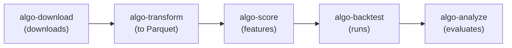
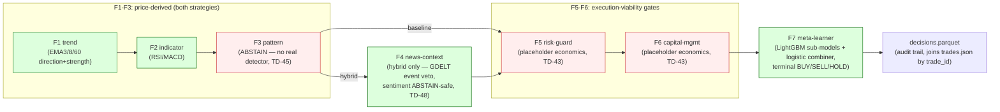
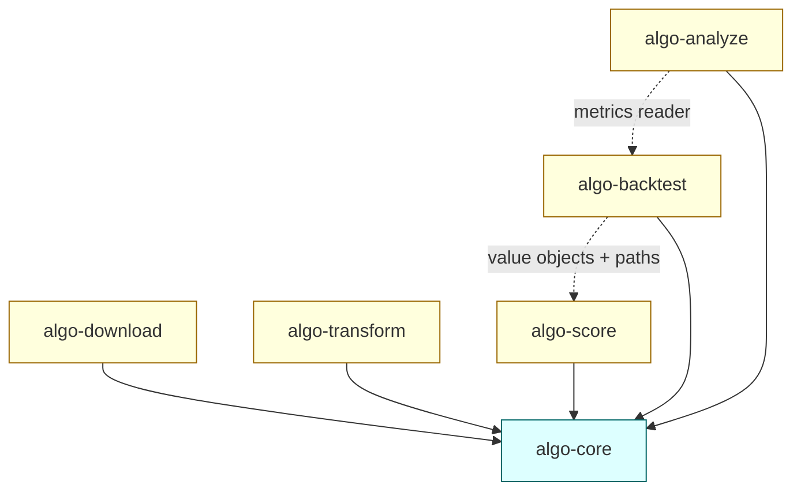
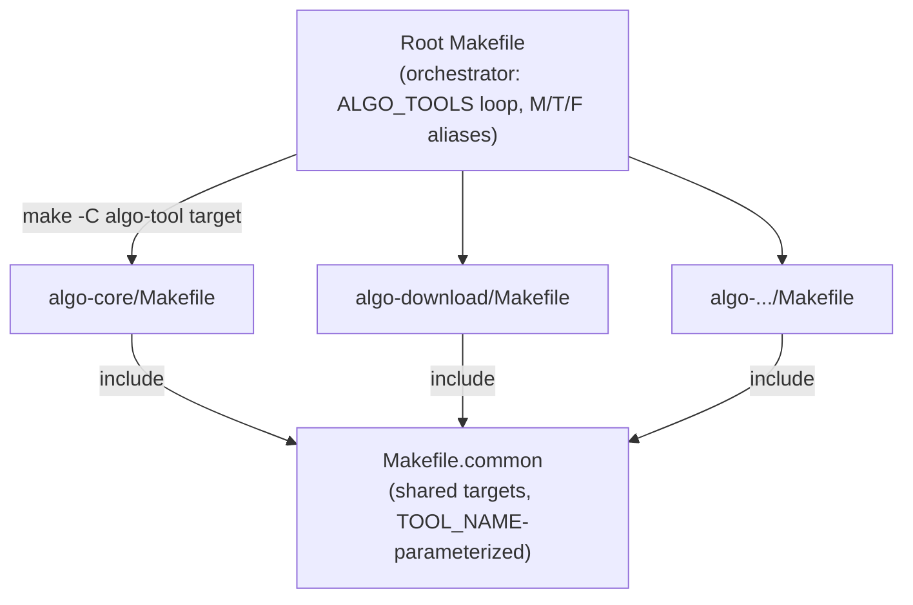
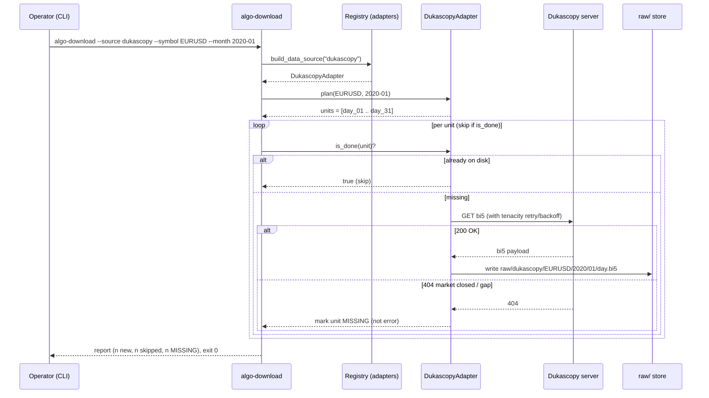
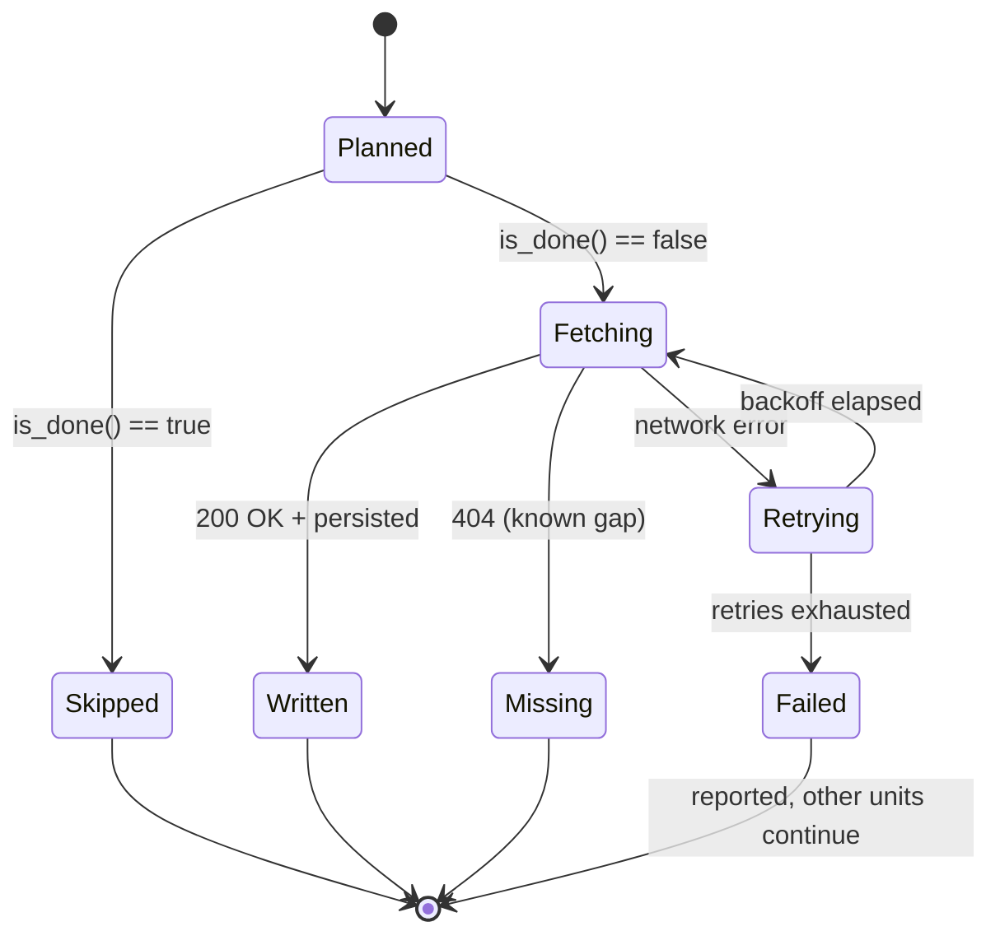

# Design — `algo-*` tool suite and PRD/spec restructuring

**Date:** 2026-05-23
**Status:** Approved (brainstorming session)
**Scope:** Restructure the TCC empirical work from a single 1527-line `specs.md`
into a product-level `PRD.md` plus per-tool technical specs, and scaffold a
modular suite of `algo-<action>` Python tools under a uv workspace.

---

## 1. Context

The empirical work of the TCC (*Algorithmic Trading Enhanced by AI: Using News,
Geopolitical Events and NLP-Based Sentiment in Forex Decision-Making*) is
currently specified in one sprawling `specs.md` (1527 lines) that mixes three
levels: product/scope/timeline, per-tool technical design, and legacy-port
reference. (At design time only `news-downloader/` existed as code.)

> **Status update (2026-05-25):** `algo-core` is now implemented — `Instrument`
> + catalog, storage `layout`, the `cache` stack (port · LRU · factory ·
> two-tier `LocalCache`), the `config` loader, `logging`, `duck`, and the
> `Repository` (Parquet writer + DuckDB reader, composed) — with 41 BDD
> scenarios, 99% coverage, fail-fast throughout. The `algo-*` pipeline tools are
> next. Deferred items are tracked in `technical-debt.md`.

The work must also become a **commercial product** after the TCC, so the tool
structure is chosen for long-term modularity, not just thesis delivery.

The methodology chapter (ch.03) defines the target pipeline, already drawn as
**Figure 1 (System pipeline)**: sources → adapters → Parquet → feature space →
sub-models → meta-learner → deterministic filter chain → decision → audit trail.
The code structure mirrors that figure so a reader can map either to the other.

## 2. Goals

- A **modular pipeline** whose tool names make the workflow self-evident and
  signal which tool comes next: `algo-download → algo-transform → algo-score →
  algo-backtest → algo-analyze`.
- **Demoable phases**: each tool produces a showable artifact, so there is
  always a complete slice to present to the advisor; maps to the Full/Medium
  scope freeze (~late August 2026) ahead of the 2026-09-01 final submission.
- **Separate tools**, not a monolithic CLI (a single CLI grows unwieldy when it
  must carry every stage).
- Standard Python packaging: **uv** + `pyproject.toml`, **Makefile** build,
  **pytest-bdd** (Cucumber/Gherkin) automated tests.

## 3. Naming decision

**Functional prefix `algo-<action>`**: each tool is named for its pipeline step,
so the workflow and "what runs next" are obvious from the names. The functional
names are asset-class agnostic and sit below the commercial brand; tool ≠ brand.

Tool CLIs read as an ordered sequence:



## 4. Tool suite (uv workspace)

The code lives under a single **`algo-suite/`** root (the uv workspace), keeping
the repo root clean (thesis vs software separated). `monografia/` stays at the
repo root; `PRD.md` and the design corpus live under `algo-suite/`.

```
tcc/
├── monografia/               # LaTeX thesis (unchanged)
└── algo-suite/               # CODE ROOT = uv workspace
    ├── PRD.md                # product: vision, scope, roadmap, phases
    ├── specs.md              # superseded dated-decision archive (split into PRD + SPECs)
    ├── pyproject.toml        # virtual workspace root: [tool.uv.workspace] members + dev tooling
    ├── .python-version       # 3.11 (LEAN container pin)
    ├── Makefile              # orchestrates all members (install/lint/type/test/check/cov/audit)
    ├── README.md
    ├── docs/                 # design corpus
    │   ├── algo-suite-design.md  # this design doc
    │   ├── parquet-evaluation.md # storage/compute decision
    │   ├── experiments.md        # experiment → Chapter 4 mapping
    │   └── technical-debt.md     # deferred-debt ledger (blocker + trigger per item)
    ├── conf/                 # OPTIONAL overrides (convention over configuration)
    │   ├── algo.yaml         # global overrides (data_root, log_level)
    │   └── <tool>.yaml       # per-tool overrides (e.g. download.yaml, backtest.yaml)
    ├── data/                 # data root by convention (gitignored content)
    │   ├── raw/ parquet/ lean-data/ runs/
    │   └── README.md
    ├── algo-core/            # shared lib: Instrument, layout, DuckDB, config loader, Repository + Cache ports (no CLI)
    ├── algo-download/        # download --source dukascopy|gdelt|gpr
    ├── algo-transform/       # raw → canonical Parquet
    ├── algo-score/           # FinBERT/LM sentiment + events → feature Parquet
    ├── algo-backtest/        # LEAN: parquet→lean-data materializer + baselines + filter chain;
    │                         #   strategy configs in src/algo_backtest/strategies/<name>/config.yaml
    └── algo-analyze/         # metrics, deflated Sharpe, MCP test, ablations
```

Each tool dir also holds its own **`SPEC.md`** (the technical spec, colocated
with the code it describes) and a `tests/` tree with Gherkin features.

Each tool follows the per-tool layout of §5 (`src/algo_<name>/`, `tests/`, own
`pyproject.toml` + `Makefile`). One shared `.venv` at `algo-suite/` (uv
workspace). **Configuration is convention over configuration** (§11.3a): the
suite runs with no files in `conf/`; a file exists only to override a default.
Resolution order (highest wins): environment > `conf/<tool>.yaml` >
`conf/algo.yaml` > defaults. Env always wins, so a container overrides anything;
the `data_root` (`ALGO_DATA_ROOT`) and `conf/` (`ALGO_CONF_DIR`) are mounted
volumes in Docker.

### Tool responsibilities

| Tool | Responsibility | Demo phase | Methodology § |
|---|---|---|---|
| `algo-core` | shared abstractions: `Instrument`, Parquet layout, DuckDB helpers, config schema/loader (§14.9) | (base) | §3.4 |
| `algo-download` | bulk download per source via registry+factory adapters (dukascopy, gdelt, gpr, …) → raw | 1 | §3.5, §3.6 |
| `algo-transform` | raw payloads → canonical Parquet (`year=YYYY/month=MM/`); coverage matrix | 1 | §3.6.3, §7 |
| `algo-score` | sentiment (FinBERT + Loughran–McDonald) + event scores → minute-bucketed feature Parquet | 2 | §3.7 |
| `algo-backtest` | Parquet→`lean-data/` materializer (durable; optional `/dev/shm` accel), LightGBM sub-models + logistic meta-learner, deterministic filter chain (the "reference trend strategy" = the chain config), config generator | 3 (baseline = price families), 4 (hybrid = + news family) | §3.8, §3.10 |
| `algo-analyze` | per-run metrics, deflated Sharpe, Monte-Carlo Permutation Test, ablation tables, audit-trail queries | 5 | §3.11, §11.3.4 |

### Key structural decisions

- **One feature/scorer engine; all reusable features precomputed once
  (read-through), not recomputed inside LEAN per run.** A single mode-agnostic
  engine produces every reusable derived feature — price-derived (TA, indicators,
  patterns, market-activity) and text-derived (sentiment, events) — and caches
  them through the `Cache` port into the durable `lean-data/` execution store and
  feature cache, reused across the whole sweep. The replay path reads precomputed
  features; it does not recompute them per run. LEAN-native incremental
  indicators (`self.RSI`, `self.ATR`) are used **only** where a feature is
  genuinely cheaper to carry live than to materialize; TA-Lib `CDL*` patterns are
  computed by the engine, not in the replay loop. Consistent with §11.3 (split
  storage) and §13.6 (read-through cache).
- **`algo-backtest` is one tool**, internally modular (`engine/`, `config/`,
  `strategies/`). Demo phases 3 (baseline) and 4 (filter chain / hybrid) are
  milestones within it, not separate tools.
- **Rule modules** split by phase: `risk_math` / `strategy_math`
  (sizing) land in the baseline; trail-stop, partial-close and the full
  reference filter chain land in the hybrid milestone.
- **Extra news sources** (FNSPID, CC-News, Reddit, central-bank scrapers) are
  incremental `algo-download` adapters, off the critical path, future-work
  eligible if phase 1 runs hot.

## 5. Per-tool standard layout

```
algo-download/
├── pyproject.toml          # uv; [project.scripts] algo-download = "algo_download.cli:main"
├── Makefile                # install / lint / test / bdd / build / docker-build
├── Dockerfile              # multi-stage, uv-based, python:3.11-slim — runnable standalone
├── README.md               # first block = mermaid of this stage (maps to a Figure 1 box)
├── scripts/                # helper scripts the Makefile dispatches to
├── src/algo_download/
│   ├── cli.py              # entry point (typer)
│   ├── adapters/           # registry + factory (dukascopy, gdelt, gpr) — proven pattern
│   └── ...
└── tests/
    ├── features/           # .feature files only (Gherkin)
    ├── steps/              # pytest-bdd step implementations (scenarios("../features/x.feature"))
    └── unit/               # plain pytest unit / property tests
```

Each `SPEC.md` is colocated in the tool dir. Tests are pytest-bdd: the BDD
report is Allure (`allure-pytest` dev dep + `make report`; the `allure` CLI is a
documented prerequisite).

The root `Makefile` orchestrates all members (`make test` runs every tool's
suite); each tool's `Makefile` runs its own.

## 6. PRD vs spec split (from the 1527-line `specs.md`)

- **`PRD.md`** (root) ← §1 (track/timeline/freeze), §2 (pairs), §3 (window),
  §9 (open items), §10 (out of scope), §15 (diagram pipeline), §16
  (onboarding/accounts), plus the 5-phase roadmap.
- **`algo-suite/algo-download/SPEC.md`** ← §4 (news sources), §5 (Dukascopy), part of §7.
- **`algo-suite/algo-transform/SPEC.md`** ← §7 (storage / Parquet / `/dev/shm`), conversion.
- **`algo-suite/algo-score/SPEC.md`** ← §3.7 feature layer (sentiment / events).
- **`algo-suite/algo-backtest/SPEC.md`** ← §6 (LEAN), §11 (perception/execution chain),
  the risk/sizing rule logic, §17 (config YAML).
- **`algo-suite/algo-analyze/SPEC.md`** ← §11.3.4 (audit trail), §3.11 (validation /
  deflated Sharpe / MCP test).
- **`algo-suite/algo-core/SPEC.md`** ← shared abstractions + §14.9 (config schema/loader).

The original `specs.md` stays in place at the repo root as the dated
architectural archive (its "amend, never overwrite" history is kept); the PRD
and per-tool specs supersede it as the working source of truth, but it is not
deleted.

## 7. Technical choices

- **Tests:** `pytest-bdd` (Cucumber/Gherkin on the pytest runner — single
  runner, integrates coverage). `behave` was the considered alternative.
- **CLI:** `typer` (type-hint-driven CLI).
- **Build:** per-tool `Makefile` (`make install|lint|test|bdd|build`); root
  `Makefile` orchestrates the workspace.
- **Packaging:** uv workspace; each tool an independent installable package with
  its own entry point.

## 8. Suggested skills per project

| Tool | Skills |
|---|---|
| algo-core | `python-patterns`, `domain-driven-design`, `clean-code`, `pytest` |
| algo-download | `python-patterns`, `bash-linux`, `cucumber-gherkin`, `pytest` |
| algo-transform | `python-patterns`, `database-design`, `pytest` |
| algo-score | `python-patterns`, `python-packaging`, `pytest`, `systematic-debugging` |
| algo-backtest | `architecture`, `solid`, `domain-driven-design`, `cucumber-best-practices`, `pytest` |
| algo-analyze | `python-patterns`, `database-design`, `pytest` |

## 9. Out of scope for this restructuring

- No strategy logic is implemented in this effort — scaffolding + specs only.
- LEAN integration internals are specified, not built here.
- The monografia LaTeX is untouched except where a future amendment is needed to
  reflect the pipeline (none required by the current design).

## 10. Open items

- ~~`news-downloader` is an untested scaffold (not a proven asset): lift its GDELT
  adapter into `algo-download` and remove the old directory — no parallel-parity
  gate needed.~~ Done (TD-12): GDELT re-implemented in `algo-download`, old copy retired.
- ~~**Week-1 LEAN spike** before building `algo-backtest`: validate
  Parquet → LEAN-zip → `/dev/shm` → run → `trades.parquet` end-to-end with a
  trivial strategy; pivot to a pure-Python backtester if it fails (PRD §10).~~ Done:
  the LEAN path is proven by `algo-backtest`'s testcontainers integration suite.
- Decide whether `algo-core` hosts the config schema/loader or `algo-backtest` does
  (current design: `algo-core`, since the schema is shared tooling).
- Recommended-range values for `RiskGuard` parameters (deferred to config
  generator implementation, per §14.8/§14.11).

---

## 11. Architecture & technology stack (for architect review)

### 11.1 Language & runtime

- **Python 3.11 workspace-wide.** Driven by the hard constraint: LEAN's Docker
  image embeds CPython **3.11** via Python.NET (pythonnet). `algo-backtest`
  algorithm code must run there, so pinning 3.11 across all packages avoids a
  split-version workspace and guarantees `algo-core` imports cleanly inside the
  LEAN container. (3.12 would only buy minor speedups; not worth the mismatch.)
- **uv** for environment, dependency resolution and the workspace
  (`[tool.uv.workspace]`). Lockfile `uv.lock` committed at the root.
- One virtualenv for the whole workspace in dev; each package still publishes an
  independent `pyproject.toml` with its own `[project.scripts]` entry point.

### 11.2 Cross-cutting libraries (all tools)

| Concern | Library | Why |
|---|---|---|
| CLI | **typer** | type-hint-driven, subcommands, good `--help` |
| Terminal output | **rich** | tables, progress bars during long downloads/scoring |
| Config models & validation | **pydantic v2** | the `ParameterSpec`/schema (§14.9) as typed models; fast validation |
| YAML round-trip | **ruamel.yaml** | preserves comments + machine-managed `state:` blocks (already used by news-downloader) |
| Logging | **structlog** | structured logs; the §14.9.6 provenance log is structured output |
| Lint + format | **ruff** | single fast tool, replaces flake8+isort+black |
| Types | **mypy** (strict) | architect-grade type safety |
| Tests | **pytest**, **pytest-bdd**, **pytest-cov**, **hypothesis** | Gherkin BDD + property tests (pip/lot math) |
| Pre-commit | **pre-commit** | ruff+mypy gate before commit |

### 11.3 Storage & data engine

**No RDBMS.** The project's data architecture is *bulk-download once, query
locally* (TCC `CLAUDE.md`). Storage is file-based:

| Layer | Tech | Notes |
|---|---|---|
| Canonical store | **Apache Parquet** via **pyarrow** | partitioned Hive-style `year=YYYY/month=MM/`; `zstd` compression |
| Query / join engine | **DuckDB** (embedded) | sentiment↔price minute-join, coverage matrix, audit-trail analytics — all one-file, zero-server |
| Heavy reshaping | **polars** | tick→minute resampling on 5–10 GB tick data; lazy, memory-efficient, faster than pandas here |
| Light dataframes | **pandas** | small tabular work, matplotlib interop in `algo-analyze` |
| Execution store | **durable `lean-data/`** (filesystem) | LEAN-native files **materialized once** from Parquet and **reused across the whole backtest sweep**; price + precomputed reusable derived series (indicators, consolidated decision features). Never recomputed per run |
| Replay accel (optional) | **tmpfs `/dev/shm/lean-data`** | optional RAM-resident *copy* of the execution store for hot reads; re-stageable from the durable store; **not** the source of truth |
| Data root | NAS mount (e.g. `/volume1/tcc`) | `raw/`, `parquet/`, `lean-data/`, `runs/` gitignored |

DuckDB reads Parquet directly (no load step) and is the analytical spine. No
server database in the **baseline** runtime; the only opt-in exception is a future
containerized cache backend purely for performance (§13.6), never a baseline
dependency.

**Split storage by reuse, not one format for everything** (see
`parquet-evaluation.md`). The two stores serve different consumers and must
not be forced into one format:

- **Parquet** remains the *canonical source of truth* for analytical/portable
  data — ingest, normalize, join, score, aggregate, audit, export — and the
  language-neutral interchange boundary for a future Go/Rust port.
- **`lean-data/`** is a *durable materialized execution store*: the
  execution-facing derived data LEAN replays is built **once** from Parquet,
  persisted on the filesystem, and reused across the many backtests of a
  parameter/ablation sweep. It is still *derived* (rebuildable from Parquet, so
  Parquet stays the source of truth), but it is **not** regenerated per run —
  that per-run reconvert/recompute was the avoidable CPU+I/O tax. Truly transient
  data stays volatile; only **reusable** derived data (price-derived indicators,
  the consolidated decision stream) earns a durable slot.

### 11.4 Per-tool stack

| Tool | Key libraries / tech | Notes |
|---|---|---|
| **algo-core** | pydantic v2, pyarrow, duckdb, structlog | `Instrument` value object; Parquet path/layout contract; config schema + loader; **no I/O side effects** |
| **algo-download** | **httpx** (thin HTTP GET of Dukascopy `.bi5`; decompression + retry internal to each adapter), zipfile/csv (GDELT) | registry+factory adapters; synchronous orchestrator; writes `raw/<source>/` (raw bytes only); HTTP mocked in tests via **respx** |
| **algo-transform** | **polars**, **pyarrow**, `lzma`+`struct` (decode Dukascopy `.bi5`), duckdb (coverage matrix) | raw → canonical Parquet; tick→minute QuoteBar resampling |
| **algo-score** | **transformers** + **torch** (FinBERT: ProsusAI/finbert, yiyanghkust/finbert-tone), LM master dictionary CSV, duckdb | optional CUDA; optional **onnxruntime** for faster CPU inference; scores cached to Parquet keyed by article id+timestamp |
| **algo-backtest** | **LEAN** via `lean` CLI + Docker, **TA-Lib** (C lib + wrapper) for `CDL*` patterns/indicators, pydantic v2 (config), typer (config generator) | filter chain = plain dataclasses (§11.3); audit trail → Parquet; converter parquet→LEAN-zip |
| **algo-analyze** | duckdb, pandas, **numpy**/**scipy** (deflated Sharpe, Monte-Carlo Permutation Test), **matplotlib** | figures feed the monografia (equity curves, coverage matrix, ablation tables) |

**As built (2026-09-26)** — the table above is the planned stack; the declared
runtime dependencies today are leaner: `algo-core` pydantic, pyarrow, duckdb,
pyyaml, structlog; `algo-download` httpx, typer; `algo-transform` pyarrow,
gdeltnews, xlrd, typer; `algo-score` pyarrow, typer (LM lexicon only — no
transformers/torch, FinBERT not built); `algo-backtest` LEAN run via
**testcontainers** (no `lean` CLI), lightgbm, scikit-learn, numpy, pyarrow,
pyyaml, typer, plus `algo-score` (no TA-Lib); `algo-analyze` matplotlib, typer
(statistics in the standard library), plus `algo-backtest`.

### 11.4a `algo-backtest` filter chain — as actually wired (2026-09-26, Spec 04h)

The generic `F1..Fn` sequence diagram in `algo-backtest/SPEC.md` §4.1 is the
spec-level contract; this is the concrete chain the two shipped strategies build
from `chain/wiring.py` + `strategies/{baseline,hybrid}/config.yaml` (`extends:`
composition), run in the pinned LEAN container via `algos/{baseline,hybrid}/main.py`:



`baseline`'s meta-learner is trained on the `{trend, indicator, pattern}` feature
families; `hybrid`'s adds `news`. Both are smoke-test-verified end to end in the
real LEAN container, not yet a methodology result (see `ch04-deliverables.md`).

### 11.5 Dependency boundaries (architecture invariant)



- **Every tool depends on `algo-core`; tool-to-tool imports are the exception.**
  Two exist today (dotted edges): `algo-backtest` imports `algo-score`'s event/
  sentiment value objects and path builders so F4 and F7 training read the
  feature Parquet through the producer's own contract (the package is also copied
  into the LEAN container), and `algo-analyze` imports
  `algo_backtest.metrics.metrics_from_artifact` to read a run's `metrics.json`.
  Neither calls the other tool's pipeline; data still flows through files.
- Tools communicate **through the Parquet filesystem contract**, not Python
  imports. `algo-transform` reads what `algo-download` wrote on disk; it does not
  import `algo_download`. This keeps each stage independently runnable, testable
  and replaceable, and lets the pipeline run as discrete CLI invocations.
- `algo-core` owns the **only** shared code: the `Instrument` value object, the Parquet
  path/partition contract, DuckDB connection helpers, and the config
  schema/loader. It performs no I/O of its own beyond reading config.

### 11.6 Infrastructure & runtime

- **Docker** for LEAN only (via the `lean` CLI, which manages its own
  container). **No `--privileged`, no host `/dev`,`/sys`,`/proc` bind-mounts**
  (workstation global rule). LEAN's CLI container runs unprivileged.
- **Durable `lean-data/`** on the data root (NAS/SSD): the canonical execution
  store, materialized once and reused across the sweep. An optional **tmpfs**
  mount `/dev/shm/lean-data` (size ~2 GB) holds a RAM-resident copy for hot
  reads, re-staged from the durable store — an accelerator, not the source.
- **Credentials:** none for the data pipeline — the Dukascopy historical
  datafeed is public, GDELT/GPR are public files. The only credential is the
  OANDA token for the optional Phase 6 paper-trading, via env var or gitignored
  `config.yaml`, never committed.
- **GPU** optional for `algo-score` (CUDA torch); CPU path always works
  (onnxruntime fallback).

#### Containerization — zero local install

**Goal: anyone can run any tool with nothing installed but Docker.** Each
subproject ships its own `Dockerfile` that bundles every dependency (Python
3.11, the package, plus native deps like TA-Lib's C library for `algo-backtest`
and torch for `algo-score`), so there is no local `uv`/`pip`/system-lib setup.

**Priority:** containerization is a **product goal and convenience, not a TCC
blocker.** The primary development and thesis path is **local `uv`** (each tool
installs and runs from its `pyproject.toml`); the Dockerfiles are produced
alongside but no phase depends on them. They must never become an extra platform
problem on top of LEAN/Torch/TA-Lib/data plumbing during the deadline — if a
Dockerfile lags, the local `uv` path still delivers the phase.

- **Per-tool `Dockerfile`** — multi-stage: a build stage resolves deps with
  `uv` from `pyproject.toml`/`uv.lock`; a slim `python:3.11-slim` runtime stage
  copies only the installed env + source. Entry point is the tool's CLI, so
  `docker run algo-download --source dukascopy ...` just works.
- **`algo-score`** offers a CUDA base variant for GPU; the slim CPU image is the
  default.
- **`algo-backtest`** bundles TA-Lib; it drives LEAN, which runs its own
  container via the `lean` CLI — handled by mounting the Docker socket
  (docker-out-of-docker), **never `--privileged`** and never host
  `/dev`,`/sys`,`/proc` mounts (workstation global rule).
- **Root `docker-compose.yml`** wires the pipeline: one service per tool, a
  shared volume for `data_root` (`raw/`, `parquet/`), and env for any
  credentials (none for the data pipeline; OANDA token only in Phase 6).
  Running a stage is `docker compose run --rm algo-download --source dukascopy ...`
  with zero local install; the next stage reads the same volume.
- Images are the deployment unit for the future Go/Rust port too: a re-implemented
  tool ships the same CLI in its own image, drop-in on the same compose graph.

### 11.7 Testing & CI strategy

- **pytest-bdd** feature files per tool under `tests/features/`, describing the
  stage's behavior in Gherkin (e.g. *"Given the public Dukascopy datafeed, When
  I download EURUSD for 2020-01, Then a raw payload exists for each trading
  day"*).
- **Unit tests** for pure logic (pip math, lot sizing, resampling, schema
  validation). **hypothesis** for property tests on numeric math.
- **HTTP mocking** with **respx** — unit/behavior tests for `algo-download` run
  offline and deterministic against mocked endpoints.
- **Any external service is integration-tested with `testcontainers`, in the
  same development cycle as the integration** (mirrors `wise-cache`) — never
  deferred to "after it works". This is mandatory for **Redis, MongoDB,
  PostgreSQL, an SMTP/email service, a signal simulator, a message broker, or any
  other external dependency**: the integration test spins an ephemeral container
  in a session-scoped fixture (e.g. `MongoDbContainer("mongo:8.0")`,
  `PostgresContainer`, `RedisContainer`) and runs against the **real service,
  never a mock**. The test ships with the feature that introduces the dependency.
- **The file-based defaults need no container.** Parquet/DuckDB/LocalCache are
  tested directly on a tmp data root, so the current MVP — which has no external
  service — does not spin any service container. If/when an external-service
  backend is introduced, its `testcontainers` integration test is written as part
  of that work, not later.
- **LEAN integration is testcontainers-based** (`algo-backtest/tests/integration/`,
  the first concrete use of `testcontainers` in the suite): it runs the pinned
  `quantconnect/lean:17748` image directly via a `DockerContainer` fixture —
  **no `lean` CLI and no QuantConnect account** — replicating the launcher's mounts
  and a secret-free `lean-config.json`. It proves the Parquet→lean-data→engine
  round-trip (materializer encoding + the UTC/START-indexed timezone, summer + winter)
  and skips cleanly when Docker is unavailable.
- **Opt-in marks excluded from the default gate.** Slow/heavy tests carry a pytest
  mark and are deselected by `addopts` (`-m 'not network and not integration'`):
  `network` (hits a real external feed, e.g. Dukascopy) and `integration` (spins a
  real container; the ~10 GB LEAN image). Run on demand: `uv run pytest -m integration`.
  Throwaway `spikes/` are excluded from `ruff`/`mypy`.
- **Rule-module regression suite** (`algo-backtest`): golden input feature streams
  + expected decisions; rule-equivalence, not bit-equivalence.
- **CI**: per-tool `make test` + `make bdd`; root `Makefile` runs all. CI runner
  (GitHub Actions / Forgejo Actions) optional — gate is `ruff` + `mypy` +
  `pytest` green. Test deps: `pytest`, `pytest-bdd`, `pytest-cov`, `hypothesis`,
  `respx`, and `testcontainers>=4.14.0` (now an active dev dep — used by the
  `algo-backtest` LEAN integration; also any future external-service integration).

### 11.8 Build system — three-tier Makefile (mirrors the odoo-oikofy-addons pattern)

The reference layout (`~/workspace/odoo-dev-18.0/extra-addons/odoo-oikofy-addons`)
uses a proven three-tier Makefile structure, replicated here with the algo-suite
toolchain (uv workspace, ruff + mypy, pytest-bdd):

1. **`Makefile.common`** (workspace root) — shared, parameterized by `TOOL_NAME`:
   auto-generated `help` (grep `## ` docstrings), the bootstrap chain
   `ensure-uv → ensure-venv → ensure-deps`, and `test`, `test-coverage`,
   `test-specific`, `test-debug`, `bdd`, `lint` (ruff), `format` (ruff format),
   `typecheck` (mypy), `check` (format-check + lint + typecheck + test), `clean`.
2. **Root `Makefile`** (orchestrator) — declares `ALGO_TOOLS := algo-core algo-download
   algo-transform algo-score algo-backtest algo-analyze`; `M=`/`T=`/`F=` short aliases;
   each target either delegates to one tool (`$(MAKE) -C algo-$(M) test`) or loops
   over all tools aggregating pass/fail/coverage into one summary.
3. **Per-tool `Makefile`** — two lines:
   ```makefile
   TOOL_NAME := algo-download
   include ../Makefile.common
   ```

Differences from the odoo reference: no Odoo/DB/mailpit infra targets;
`algo-backtest` adds a `lean-smoke` target (trivial LEAN backtest) and a
`tmpfs-mount` target (§16.6); `algo-score` adds a `models-fetch` target
(download FinBERT weights). Tool-specific targets live in that tool's own
`Makefile` after the `include`.

**Keep Makefiles thin — push logic into scripts.** Any target whose body is
more than a couple of commands calls a helper script under `scripts/` (shell or
small Python), exactly as the reference projects do. The Makefile target is a
one-line dispatch (`@./scripts/<name>.sh`), so the build logic is readable,
testable and reusable outside make (e.g. tmpfs mount, LEAN-zip conversion,
testcontainer lifecycle, coverage aggregation). Makefiles stay declarative;
scripts hold the procedure.



### 11.9 Open architecture questions for your review

1. **polars vs pandas** as the primary dataframe lib in `algo-transform` (I lean
   polars for tick volume; pandas only in `algo-analyze` for matplotlib interop).
2. **TA-Lib (C lib) vs LEAN-native indicators vs `pandas-ta` (pure Python)** for
   pattern/indicator features. LEAN-native avoids the C dependency for anything
   computed at backtest time; TA-Lib only where `CDL*` candlestick recognition
   is needed. Confirm the split.
3. **onnxruntime** for FinBERT CPU inference — worth the extra dependency, or
   plain `torch` CPU is enough for the corpus size?
4. **DuckDB as the only query engine** — confirm no need for a server DB at any
   phase (I see none).
5. **Python 3.11 pin** workspace-wide to match LEAN — acceptable, or do you want
   tools on 3.12 and only `algo-backtest` on 3.11?
6. **uv workspace (single repo)** vs splitting tools into separate repos —
   monorepo recommended for the TCC; multi-repo is a post-TCC option.

---

## 12. Per-tool spec template (mandatory shape)

Every `algo-suite/algo-*/SPEC.md` follows this structure. The architect validates each spec
before its tool is implemented. The **Test scenarios** section is first-class:
it specifies the Gherkin features, the assertions, and the edge cases the BDD
suite must cover, so the spec doubles as the acceptance contract.

```
# Spec — algo-<tool>

## 1. Purpose & scope            # one paragraph; what it does, what it does NOT
## 2. Inputs & outputs           # exact paths, formats, schemas (the on-disk contract)
## 3. Architecture & libraries   # internal modules + the libs from §11.4
## 4. Diagrams                   # sequence diagram (main flow) + state diagram (unit/lifecycle) ← NO ASCII
## 5. CLI surface                # commands, flags, exit codes, env vars
## 6. Data contracts             # Parquet schema (columns, types, partitioning); upstream/downstream
## 7. Error handling             # failure modes, retries, partial-state recovery
## 8. Test scenarios (Gherkin)   # feature files: happy path + assertions + edge cases  ← FIRST-CLASS
## 9. Acceptance criteria        # the demo artifact for the phase; what "done" means
## 10. Open items
```

**Diagram rule: all diagrams are Mermaid, never ASCII art.** Every spec MUST
include at least one `sequenceDiagram` (the tool's main runtime flow across its
collaborators) and one `stateDiagram-v2` (the lifecycle of a unit of work or the
tool's run states). More diagrams (flowchart, ER for Parquet schema) as needed.

### Example — `algo-download` sequence diagram (illustrative)



### Example — `algo-download` unit state diagram (illustrative)



### 12.1 Example depth — `algo-download` (Dukascopy), illustrative

```gherkin
Feature: Download Dukascopy tick data
  As the algo-download tool
  I bulk-fetch historical tick data per pair and month into the raw store

  Background:
    Given a writable data root
    And the public Dukascopy datafeed is mocked

  Scenario: Happy path — one month of EURUSD
    When I run "algo-download --source dukascopy --symbol EURUSD --month 2020-01"
    Then a raw payload exists for every trading day of 2020-01
    And no payload exists for weekends (market closed)
    And the command exits 0
    And the run is logged with byte counts per day

  Scenario: Resume — re-running skips completed units
    Given EURUSD 2020-01 was already downloaded
    When I run the same command again
    Then no day is re-fetched
    And the command exits 0 with "0 new units" reported

  Scenario: Edge — partial day already on disk, server returns 404 for one hour
    Given EURUSD 2020-01-15 has hours 00–11 on disk
    And the Dukascopy server returns 404 for hour 12
    When I run the download
    Then hours 13–23 are still fetched
    And hour 12 is recorded as MISSING in the run report, not as an error
    And the command exits 0 (a known data gap is not a failure)

  Scenario: Edge — USDJPY pip/precision convention differs from EURUSD
    When I download "USDJPY --month 2020-01"
    Then USDJPY uses its own precision (FX unit_size 0.01), not the EURUSD 0.0001
    And no price is silently divided by the EURUSD scale

  Scenario: Failure — network flaps mid-download
    Given the server drops the connection after 3 requests
    When I run the download
    Then tenacity retries with backoff up to the configured limit
    And on exhaustion the failed unit is reported, completed units are kept
```

Assertions to enforce in steps: exit codes; per-unit idempotency (resume);
weekend/holiday absence; per-instrument precision correctness; MISSING vs ERROR
distinction; retry/backoff bounds. Edge cases to cover per tool will be
enumerated in each spec's §7.

### 12.2 Edge-case themes by tool (to be expanded in each spec)

- **algo-download**: resume/idempotency, weekend/holiday gaps, 404 vs error,
  per-instrument unit/precision, retry exhaustion, rate-limit fallback (public datafeed, no credentials).
- **algo-transform**: corrupt/truncated `.bi5`, DST boundary in resampling,
  missing minutes (no ticks → no bar vs forward-fill), tz normalization to UTC,
  duplicate ticks, schema drift.
- **algo-score**: empty article batch (ABSTAIN, not crash), non-English text,
  multi-currency headline ambiguity, model determinism (fixed seed), score
  caching hit/miss, minute-bucket alignment with no price bar.
- **algo-backtest**: missing required config param = hard stop (§14.9.1), `null`
  explicit-disable vs missing, schema-version mismatch, filter veto
  short-circuit, audit-trail completeness (one row per chain run), tmpfs cache
  rebuild, LEAN determinism across runs.
- **algo-analyze**: deflated Sharpe with <N trials, MCP test reproducibility
  (fixed permutation seed), empty run, NO_TRADE-only run, drawdown on zero
  positions.
- **algo-core**: `Instrument` equality/precision, Parquet path round-trip, config
  provenance log correctness, `extends:` cycle detection (§14.9.5).

---

## 13. Implementation conventions (all tools)

These conventions are binding on every `algo-*` package; each spec inherits them
and need not restate them.

### 13.0 Portability intent (why these conventions exist)

**Python is the experimentation / reference language.** A future port is not a
committed plan — the system may well stay in Python. But if performance ever
warrants re-implementing part of it in a faster language (e.g. **Go or Rust**),
the conventions below keep that road open: the port stays mechanical rather than
a redesign. They cost little now and preserve the option.

**Per-tool substitution is the unit of porting.** Because the tools are separate
packages that communicate through the Parquet filesystem contract (not Python
imports) and each ships as a container exposing a CLI, **a single tool can be
re-written in a faster language as a drop-in** — same CLI, same input/output
Parquet contract, same image in the compose graph — without touching its
siblings. The whole suite need never be ported at once.

Candidate languages per tool:

- **C# is the strongest candidate for `algo-backtest`**, because **LEAN is itself
  C#**: a C# port runs natively in the LEAN runtime, dropping the Python.NET
  (pythonnet) bridge and its per-bar overhead, and can read the canonical
  Parquet directly via **Parquet.Net** (fully managed) or **ParquetSharp**
  (Arrow/C++-backed) — potentially removing the parquet→LEAN-zip conversion step
  altogether. Library coverage for the filters is actually a strength here:
  LEAN ships the indicators (`QuantConnect.Indicators`) and the candlestick
  patterns (`QuantConnect.Indicators.CandlestickPatterns`, ports of TA-Lib's
  `CDL*`) natively in C#, so trend/indicator/pattern filters need no external
  library; the filter chain, sizing, risk math and audit trail are plain code.
- **Go or Rust** suit CPU-bound bulk tools like `algo-transform` (tick resampling)
  where a compiled language and tight memory control win; both have mature
  Parquet/Arrow libraries.
- **ML-heavy tools stay Python.** `algo-score` (FinBERT/transformers) is *not* a
  port candidate — that is where Python's library ecosystem is irreplaceable.
  The per-tool split is precisely what lets the ML stage stay in Python while an
  execution hot path moves to C#: each tool sits in the language with the right
  libraries for its job.

The §13 conventions (single-return value objects → structs/records, ports/ABCs →
interfaces/traits, no raw SQL, no Python magic) are what make any of these ports
mechanical rather than a redesign.

- **Single-return value objects** (§13.3) map one-to-one onto Go/Rust/C structs.
- **Small ABCs / ports** (`DataSource`, `Scorer`, `Filter`, `Repository`,
  `Cache`) map onto Go interfaces / Rust traits; each has a clear contract that
  a port can re-implement and test against unchanged.
- **No raw SQL strings** crossing boundaries (queries are typed objects) so the
  data layer is not welded to one engine's dialect.
- **Dependency inversion onto `algo-core` contracts** keeps engine/library choices
  (pyarrow, duckdb, torch, LEAN) behind seams a port can replace per language.

The Python reference implementation therefore reads like a typed, struct-based
program, not idiomatic-but-unportable Python.

### 13.1 SOLID

- **Single responsibility** — one class/module, one reason to change (adapters
  fetch; decoders decode; scorers score; filters decide one thing).
- **Open/closed** — extend by adding an adapter/filter/scorer via the
  registry, never by editing existing ones (the proven `@register` pattern).
- **Liskov** — every adapter/scorer/filter is substitutable behind its ABC;
  tests run against the ABC contract.
- **Interface segregation** — small ABCs (`DataSource`, `Scorer`, `Filter`),
  no fat god-interfaces.
- **Dependency inversion** — orchestrators depend on the ABC, not concretes;
  `algo-core` defines the contracts, tools depend on `algo-core` only.

### 13.2 Clean code

- Small, focused functions; intention-revealing names; no magic numbers (every
  threshold/factor comes from config, per the config policy).
- Type hints everywhere; `mypy --strict` clean; `ruff` clean.
- No commented-out code; comments explain *why*, not *what*.
- Errors are explicit and named (no bare `except`, no silent failure).

### 13.3 Single-return rule (no tuples) — for cross-language portability

**Every public function and method returns exactly one value.** Never return a
tuple of multiple values. When a call must yield more than one piece of
information, return a single **value object** (a frozen `dataclass` or pydantic
model) whose fields name each piece.

Rationale: the value object is the Python equivalent of a **C `struct`** — a
named record of fields. A single typed return maps one-to-one onto a struct in
C, Go and Rust, so the Python reference implementation ports without reshaping
signatures. Tuple returns are an idiomatic-Python convenience that becomes
friction in a future C/Go/Rust port.

Applied across the suite:

| Instead of | Return |
|---|---|
| `score(texts) -> (polarity, confidence)` | `score(texts) -> ScoreResult` (fields: `polarity`, `confidence`) |
| `chain.run(state) -> (Decision, ExecutionState)` | `chain.run(state) -> ChainOutcome` (fields: `decision`, `state`) |
| `plan() -> (units, errors)` | `plan() -> PlanResult` (fields: `units`, `errors`) |

Internal/private helpers may unpack locally, but anything crossing a module or
ABC boundary returns one value object. Multiple **inputs** are fine; this rule
is about **outputs** only.

#### Other non-portable Python idioms to avoid

The single-return rule is one case of a wider principle: **avoid Python "magic"
that has no clean equivalent in Go/Rust/C.** Across module and ABC boundaries:

- **No tuple returns / tuple unpacking** as an interface — use a value object.
- **No `dict` as an ad-hoc struct** — define a typed `dataclass`/pydantic model
  with named fields, not free-form dicts passed between layers.
- **No `*args` / `**kwargs`** in public signatures — list explicit, typed
  parameters.
- **No duck typing across boundaries** — depend on an ABC, not "any object that
  happens to have method X".
- **No metaclasses, monkeypatching, or runtime attribute injection** in the
  domain/logic layers (acceptable only in test fixtures).
- **No magic strings for enumerable states** — use `Enum` (maps to Go iota /
  Rust enum), e.g. `Decision`, `Recommendation`.
- **No dynamic/implicit returns** (a function returning different types by path)
  — one function, one return type.

Idiomatic Python that *does* port (comprehensions, context managers, decorators
used conventionally) is fine. The test is always: *would this survive a
mechanical translation to a statically typed language?*

### 13.4 Consequences already reflected in the specs

- `algo-score`: `Scorer.score(...) -> ScoreResult` (not a tuple).
- `algo-backtest`: `FilterChain.run(...) -> ChainOutcome` (not a tuple); each
  filter returns one `FilterResult`.
- `algo-download`: `DataSource.plan(...) -> PlanResult`.

### 13.5 Persistence abstraction — Repository pattern (no DB lock-in)

Data access is **never** coupled to a concrete storage engine. `algo-core`
defines a `Repository` ABC; concrete backends implement it. Tools depend on the
ABC, so swapping Parquet/DuckDB for another store (or adding one) is a new
implementation, not a rewrite.

```
Repository (ABC, algo-core)          # get / put / query / exists, over a dataset
 ├── ParquetRepository             # canonical store: pyarrow write, partitioned
 └── DuckDBRepository              # analytical reads/joins over the same Parquet
```

- The ABC speaks in **domain value objects** (e.g. `QuoteBar`, `SentimentRow`),
  not engine rows; serialization lives in the backend.
- Query parameters are passed as a typed object, not raw SQL strings, so callers
  are not tied to DuckDB's dialect.
- This keeps the "bulk-download once, query locally" architecture while leaving a
  clean seam for a future server-backed store if the product needs one.
- **TCC scope:** only the **file-based backends** (`ParquetRepository`,
  `DuckDBRepository`) are built. A server-backed backend is a thin future
  implementation of the same ABC — **not implemented in the TCC**. The ABC is
  cheap (it is needed anyway to decouple pyarrow/duckdb); it does not pull any
  server dependency into phase 0.

### 13.6 Cache abstraction — Cache port (mirrors the wise-cache shape)

Expensive, cacheable outputs (notably FinBERT scores in `algo-score`) go through a
`Cache` **port**, not a hardcoded store — mirroring the in-house `wise-cache`
design (`Cache` ABC + pluggable backend). The **default is dependency-free**
(in-process / embedded-file, no external service), keeping the no-server-DB
architecture of §11.3 for the TCC. **Any efficient backend** can replace it behind
the same port — in-process, embedded, or a **containerized service** (e.g. Redis,
Aerospike, MongoDB, or any cache that profiles well) — as an **optional
performance upgrade**, plugged without touching callers. Opt-in, not required by
the baseline; the choice is left open precisely because the port absorbs it.

```
Cache (ABC, algo-core)               # get / set / has / get_or_compute / invalidate, TTL-aware, pydantic-serialized
 ├── LruCache                      # default: simple in-process LRU (already implemented, zero deps) — in-run hot path
 ├── LocalCache                    # default: embedded/file-backed (Parquet or embedded KV), keyed by (id, model, version) — durable cross-sweep reuse
 └── (optional later: any efficient backend — incl. a containerized service e.g. Redis/Aerospike/Mongo — opt-in perf upgrade)
```

- **Mechanism is an open item** — deliberately. The port is what defers it: start
  with a **simple in-process LRU** (already written, zero new deps) plus a
  file/Parquet-backed `LocalCache` for the durable cross-sweep reuse — both
  dependency-free. If profiling later justifies it, **any efficient backend** — in
  process, embedded, or a **containerized service** (the project already runs
  Docker) — is a drop-in for higher performance, plugged behind the same ABC
  without touching any caller. The baseline does **not** require one.
- A containerized cache backend, **if** introduced, brings its `testcontainers`
  integration test in the same cycle (§11.7), and runs unprivileged (workstation
  rule).
- Keys are explicit and versioned (`model_version` busts the cache).
- Values are pydantic v2 models (same serialization contract as `wise-cache`),
  so a backend swap is transparent to callers.
- Default backend is in-process LRU / local-file (consistent with the no-server-DB
  architecture); any efficient backend — including a containerized service — is an
  opt-in performance upgrade behind the same port, not a baseline dependency.
- **TCC scope:** `LruCache` + `LocalCache` (file-backed) only, so the MVP spins no
  service container and adds no external dependency. A containerized cache backend,
  if introduced for performance, is a drop-in implementation of the same ABC **and
  its `testcontainers` integration test is written in the same cycle** (§11.7) —
  not after.

**Read-through, used identically in backtest and live.** The Cache port runs in
read-through + write mode: `get_or_compute(key, fn)` — a hit returns the cached
value, a miss computes, stores, and returns. The cached `fn` is **one
mode-agnostic feature/scorer engine** (a pure function of `bar + rolling state`),
vectorized over history in backtest and one bar at a time in live — a *single*
implementation, so the deployed model never sees inputs it was not trained on
(no train/serve skew). Consequences (`parquet-evaluation.md`, 2026-05-24):

- **Each bar is computed exactly once**, the first time it exists. Every later
  access is a hit — the rest of a backtest sweep (same history, varying
  filters/thresholds), or a live restart's warmup.
- **Live computes only the just-closed bar** (it never existed before — its
  first-and-only compute, not a recompute); warmup/restart/historical bars are
  hits. The model is loaded, never retrained — training is always offline-batch.
- The durable `lean-data/` execution store is materialized the same way: built
  once on first miss, persisted, reused (§11.3).

### 13.7 Design patterns (GoF) and the abstraction/simplicity/performance balance

Apply Gang-of-Four patterns **where they remove duplication or decouple a real
seam** — not decoratively. Used deliberately across the suite:

| Pattern | Where | Why |
|---|---|---|
| Strategy | scorers, strategies | swap algorithm behind a stable interface |
| Adapter | `algo-download` sources | adapt each external feed to one `DataSource` |
| Registry + Factory Method | `@register` + `build_*` | add a source/filter without editing others |
| Chain of Responsibility | the filter chain | ordered filters, veto short-circuit |
| Repository | `algo-core` persistence | decouple from the storage engine |
| Value Object | `Instrument`, `*Result`, `*Outcome` | immutable, struct-like, portable |
| Template Method / Coordinator | orchestrators | fixed skeleton, pluggable steps |

**The balance rule.** Three forces are in tension — abstraction, simplicity and
performance — and the design optimizes for all three, not one:

- **Abstraction only at proven seams.** A port/ABC exists where there is a real
  second implementation or a real migration boundary (sources, scorers, storage,
  cache, engine). No speculative interfaces for things with one implementation
  and no foreseen second (**YAGNI**).
- **Simplicity beats cleverness.** Prefer a plain function or dataclass to a
  pattern when the pattern adds indirection without removing duplication. A
  pattern that makes the code harder to read than the problem is wrong here.
- **Performance is a first-class constraint.** Hot paths (tick resampling,
  per-bar chain execution, score inference) stay flat and allocation-aware;
  abstractions must not impose per-bar overhead. Where an abstraction would cost
  measurable throughput on the hot path, it is pushed to the edges (setup/IO),
  not the inner loop.

In short: pattern when it earns its keep, keep it simple otherwise, and never
let either harm hot-path performance.

### 13.8 Performance — per-phase bottlenecks and mitigations

Each phase has a characteristic bottleneck (CPU, I/O, or model inference). The
design attacks each with the right technique — caching, memoization / dynamic
programming, vectorization, or columnar/RAM I/O — to minimize CPU and I/O.

| Phase / tool | Dominant bottleneck | Mitigations |
|---|---|---|
| `algo-download` | **network I/O** (many small requests, latency-bound) | async concurrency (httpx) + connection reuse; **idempotent resume** skips completed units (no redundant I/O); backoff avoids wasted retries; not CPU-bound |
| `algo-transform` | **CPU + I/O** (decode `.bi5` LZMA, resample 5–10 GB ticks) | **polars lazy/streaming**, fully vectorized resampling (no Python per-tick loop); columnar Parquet + zstd; **incremental**: only transform new partitions (skip written = DP over partitions); chunked to bound memory |
| `algo-score` | **model inference** (FinBERT over ~1 M articles) | **score cache = memoization** keyed by `(article_id, model_version)` — the dominant win, avoids re-inference; **dedupe identical texts by hash before inference**; batched inference; optional GPU/onnxruntime |
| `algo-backtest` | **per-bar CPU** (~2 M bars × pairs through the chain) + LEAN data I/O | **all reusable derived data precomputed once** into the durable `lean-data/` store (price-derived indicators + consolidated decision features) → **zero recompute and zero reconvert per run** across the sweep; **perception cached as Parquet** → zero model calls in the loop; optional **tmpfs `/dev/shm`** copy → RAM I/O for hot reads; incremental/rolling indicators only where a feature is genuinely cheaper live than materialized; flat, allocation-aware inner loop |
| `algo-analyze` | **scan + resampling** (2 M-row audit trail, 1000× permutation test) | DuckDB columnar **predicate pushdown** (filter `NO_TRADE` before load); vectorized numpy for the permutation test; cache intermediate aggregates; load only engaged trades |
| `algo-core` | not a hot path | config loaded once at startup; helpers are thin |

Principles applied: **cache/memoize** anything expensive and reused
(scores, derived features); **dynamic programming / incremental state** instead
of recomputation (rolling indicators, partition-incremental transform);
**vectorize** over Python loops (polars/numpy) on bulk data; keep the **hot path
in RAM and columnar** (tmpfs, Parquet, predicate pushdown). Optimize only where a
measurement shows a bottleneck — no speculative micro-optimization.
