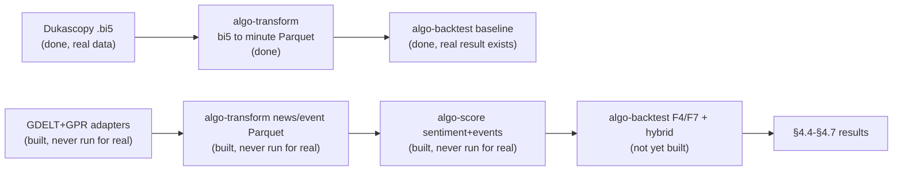

# Chapter 04 deliverables → tool → status

The critical path to thesis results. Each Chapter 04 section (see
`monografia/chapters/04-experimental-evaluation.tex`) maps to the artifact it
needs, the tool that produces it, and whether that tool exists yet. **Building
tools is the critical path, not more architecture.** Update the status column as
the pipeline comes up.

Legend: ✅ ready (tool built + real result exists) · 🟡 partial (tool built,
result missing or incomplete) · ❌ blocked (tool not built, or result needs a
blocked tool). **Updated 2026-09-25** — most of this table predates the
`algo-download`/`algo-transform`/`algo-score`/`algo-backtest`/`algo-analyze`
work landing; see `docs/stories/00-PLAN.md` §1/§2 for the authoritative
current tool-by-tool status. The remaining real gap is narrower than this
table used to imply: it's that `algo-score`'s pipeline has never been *run*
against real NAS data (only `forex/` price data exists there), which is what
blocks F4/F7 in `algo-backtest` and therefore §4.4–§4.7 below.

| Ch04 § | Deliverable | Needs (tool) | Status |
|---|---|---|---|
| §4.1 Experimental Setup | Which adapters/scorers/strategies run end-to-end; exact data spans | narrative over all tools | 🟡 tools exist; prose not yet written |
| §4.2 Data Coverage | News coverage matrix over the window; empirical training span (coverage rule) | `algo-download` (GDELT + GPR adapters ✅ merged) → `algo-transform` (✅ built) | 🟡 tools ready; coverage matrix not yet run against real NAS data |
| §4.3 **Baseline** | Price-only EUR/USD (USD/JPY if time): **Sharpe, max drawdown, hit rate, avg holding time, turnover** | `algo-download` (Dukascopy ✅) → `algo-transform` (✅) → `algo-backtest` (✅ price-only baselines) → `algo-analyze` (✅ `metrics`, Spec 05) | ✅ tools + pipeline ready; a real result already exists for EUR/USD 2024-06 (see `docs/first-baseline-results.md`) — widening to the full 10-year window is a nice-to-have, not a blocker |
| §4.4 Hybrid | Same metrics with sentiment/events | + `algo-score` (✅ built, never run against real data) → `algo-backtest` F4/F7 (❌ not built) | ❌ blocked on materializing real sentiment/event Parquet, then F4/F7 |
| §4.5 Ablations | price-only / +sentiment / +events / full hybrid | all tools (`algo-analyze ablation` ✅ built, Spec 05) | 🟡 tooling ready; blocked on §4.4's hybrid runs existing to ablate |
| §4.6 Zhang comparison | Sharpe & drawdown side-by-side vs `zhang2025macroalpha` | §4.3 + §4.4 results | 🟡 §4.3 half exists (partial window); §4.4 blocked |
| §4.7 Threats to validity | Discussion specialized to observed results | §4.3–§4.6 results | ❌ needs §4.4–§4.6 first |

## Current bottleneck: run the pipeline against real data

The tool-building critical path from the original diagram below is **done** —
Dukascopy → Parquet → LEAN → price-only baseline → `algo-analyze metrics` all
work end-to-end on real data today. The actual remaining bottleneck is a data
step, not a build step: `algo-download`'s GDELT/GPR adapters and `algo-score`
have never been run against the real NAS data root, so there's no sentiment/
event Parquet for F4 (news-context filter) or F7 (meta-learner) to consume.

Unblocking §4.4 onward is one data-materialization run (`algo-download` →
`algo-transform` → `algo-score` against the real NAS data root), not more
tool-building.
