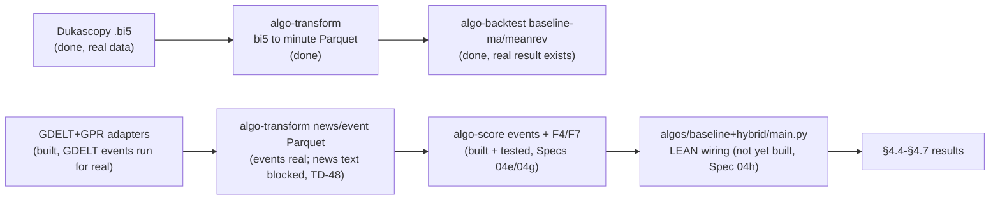

# Chapter 04 deliverables → tool → status

The critical path to thesis results. Each Chapter 04 section (see
`monografia/chapters/04-experimental-evaluation.tex`) maps to the artifact it
needs, the tool that produces it, and whether that tool exists yet. **Building
tools is the critical path, not more architecture.** Update the status column as
the pipeline comes up.

Legend: ✅ ready (tool built + real result exists) · 🟡 partial (tool built,
result missing or incomplete) · ❌ blocked (tool not built, or result needs a
blocked tool). **Updated 2026-09-25 (Specs 04e/04g/04h)** — F4 (news-context
filter) and F7 (meta-learner) are now real and tested against real Spec 03
event-feature Parquet (`algo-score events --kind gdelt`, run for real: 44640
rows for pilot month 2020-01). The remaining gap for §4.4 is narrower still:
(a) F4's per-symbol *sentiment* half is best-effort pending TD-48 (real
article-text ingestion is ~500 GB / ~90 hours for one month at the current
`gdelt_ngrams` adapter's throughput — the event-veto half is real today), and
(b) `baseline`/`hybrid` are config-driven (`algo-backtest/strategies/`,
Spec 04h) but **not yet wired to a real LEAN algorithm** — `algos/baseline/
main.py` and `algos/hybrid/main.py` (reading live LEAN-native indicators for
F1-F3 + a persisted meta-learner artifact + the news Parquet) do not exist yet
and are not in `run.py`'s `STRATEGIES` registry. See `docs/technical-debt.md`'s
Spec 04h entry for the exact remaining scope.

| Ch04 § | Deliverable | Needs (tool) | Status |
|---|---|---|---|
| §4.1 Experimental Setup | Which adapters/scorers/strategies run end-to-end; exact data spans | narrative over all tools | 🟡 tools exist; prose not yet written |
| §4.2 Data Coverage | News coverage matrix over the window; empirical training span (coverage rule) | `algo-download` (GDELT + GPR adapters ✅ merged) → `algo-transform` (✅ built) | 🟡 tools ready; coverage matrix not yet run against real NAS data |
| §4.3 **Baseline** | Price-only EUR/USD (USD/JPY if time): **Sharpe, max drawdown, hit rate, avg holding time, turnover** | `algo-download` (Dukascopy ✅) → `algo-transform` (✅) → `algo-backtest` (✅ price-only baselines) → `algo-analyze` (✅ `metrics`, Spec 05) | ✅ tools + pipeline ready; a real result already exists for EUR/USD 2024-06 (see `docs/first-baseline-results.md`) — widening to the full 10-year window is a nice-to-have, not a blocker |
| §4.4 Hybrid | Same metrics with sentiment/events | `algo-score` events (✅ run for real, pilot month) + F4/F7 (✅ built + tested, Specs 04e/04g) → `baseline`/`hybrid` LEAN wiring (❌ not built, Spec 04h remainder) | ❌ blocked on `algos/{baseline,hybrid}/main.py` (real LEAN indicator + meta-learner-artifact wiring) — the filter chain itself is done |
| §4.5 Ablations | price-only / +sentiment / +events / full hybrid | all tools (`algo-analyze ablation` ✅ built, Spec 05) | 🟡 tooling ready; blocked on §4.4's hybrid runs existing to ablate |
| §4.6 Zhang comparison | Sharpe & drawdown side-by-side vs `zhang2025macroalpha` | §4.3 + §4.4 results | 🟡 §4.3 half exists (partial window); §4.4 blocked |
| §4.7 Threats to validity | Discussion specialized to observed results | §4.3–§4.6 results | ❌ needs §4.4–§4.6 first |

## Current bottleneck: wire the filter chain into a real LEAN algorithm

The tool-building critical path from the original diagram below is now
**mostly done**: Dukascopy → Parquet → LEAN → price-only baseline →
`algo-analyze metrics` work end-to-end on real data; GDELT event-feature
Parquet is real (pilot month); F1-F7 (the full filter chain, including F4's
real-Parquet veto and F7's LightGBM+logistic meta-learner) are built and
proven in pure Python (`chain/terminal.py`'s `F7TerminalDecision` closes the
loop to `Decision`); `baseline`/`hybrid` `config.yaml` + the `extends:`
composition loader (`algo_backtest/strategies.py`) are real. What's left is
the LEAN-container integration layer: `algos/baseline/main.py` and `algos/
hybrid/main.py` need to read a strategy's `config.yaml`, populate
`ExecutionState.features` each bar from LEAN-native indicators (F1-F3),
`self.portfolio` (F5/F6), the real news Parquet (F4), and a persisted
meta-learner artifact (F7), run `FilterChain.run()`, and call `OrderExecutor`
via `chain/terminal.py`'s bridge — then be registered in `run.py`'s
`STRATEGIES` and verified against the real pinned LEAN container.

Unblocking §4.4 is the LEAN-container wiring above, not more filter-chain
engineering — F1-F7 and the config/terminal-decision layer are done and
tested; only the perception-layer-to-LEAN-indicators glue remains.
