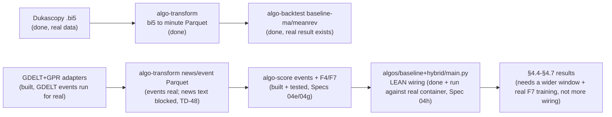

# Chapter 04 deliverables → tool → status

The critical path to thesis results. Each Chapter 04 section (see
`monografia/chapters/04-experimental-evaluation.tex`) maps to the artifact it
needs, the tool that produces it, and whether that tool exists yet. **Building
tools is the critical path, not more architecture.** Update the status column as
the pipeline comes up.

Legend: ✅ ready (tool built + real result exists) · 🟡 partial (tool built,
result missing or incomplete) · ❌ blocked (tool not built, or result needs a
blocked tool). **Updated 2026-09-26 (Spec 04h closure)** — `algos/baseline/
main.py` and `algos/hybrid/main.py` now exist, are registered in `run.py`'s
`STRATEGIES`, and have both been run against the real pinned LEAN container
over real materialized 2015-02 data, producing `decisions.parquet` that
verifiably joins `trades.json` by `trade_id`. **This is a wiring smoke test,
not a methodology result yet**: F3's candlestick pattern is never populated
(no real detector), F5/F6's account-risk features use fixed placeholder
economics (no real ATR/margin model), and F7's meta-learner is trained by
`scripts/train_{baseline,hybrid}_meta_learner.py` on EUR/USD 2015-02-02 →
2015-07-31 (train + validation; 2015-08-01 → 2016-01-31 held out) with purged
split boundaries and train/serve feature parity proven in real LEAN — leak-free
and mechanically valid, not yet the methodology's full walk-forward window.
F7 models are portable JSON (`f7_meta_learner.json`, provenance embedded;
`algo-backtest run --model PATH` swaps one in). F4's per-symbol *sentiment*
half remains best-effort pending TD-48 (real article-text ingestion is
~500 GB / ~90 hours for one month at the current `gdelt_ngrams` adapter's
throughput); only the event-veto half is real (GDELT event features with a
one-day publication lag, so no bar sees a same-day aggregate). What's left for §4.4's real
result is widening the backtest window and training F7 on a statistically
meaningful span, not further LEAN-container engineering. See
`docs/technical-debt.md`'s TD-51 entry for the full closure detail.

| Ch04 § | Deliverable | Needs (tool) | Status |
|---|---|---|---|
| §4.1 Experimental Setup | Which adapters/scorers/strategies run end-to-end; exact data spans | narrative over all tools | 🟡 tools exist; prose not yet written |
| §4.2 Data Coverage | News coverage matrix over the window; empirical training span (coverage rule) | `algo-download` (GDELT + GPR adapters ✅ merged) → `algo-transform` (✅ built) | 🟡 tools ready; coverage matrix not yet run against real NAS data |
| §4.3 **Baseline** | Price-only EUR/USD (USD/JPY if time): **Sharpe, max drawdown, hit rate, avg holding time, turnover** | `algo-download` (Dukascopy ✅) → `algo-transform` (✅) → `algo-backtest` (✅ price-only baselines) → `algo-analyze` (✅ `metrics`, Spec 05) | ✅ tools + pipeline ready; a real result already exists for EUR/USD 2024-06 (see `docs/first-baseline-results.md`) — widening to the full 10-year window is a nice-to-have, not a blocker |
| §4.4 Hybrid | Same metrics with sentiment/events | `algo-score` events (✅ run for real) + F4/F7 (✅ built + tested, Specs 04e/04g) → `baseline`/`hybrid` LEAN wiring (✅ built + run against real container, Spec 04h) | 🟡 wiring done and verified end-to-end; F7 needs a statistically meaningful training window before citing a real result |
| §4.5 Ablations | price-only / +sentiment / +events / full hybrid | all tools (`algo-analyze ablation` ✅ built, Spec 05) | 🟡 tooling ready; blocked on §4.4's hybrid runs existing to ablate |
| §4.6 Zhang comparison | Sharpe & drawdown side-by-side vs `zhang2025macroalpha` | §4.3 + §4.4 results | 🟡 §4.3 half exists (partial window); §4.4 blocked |
| §4.7 Threats to validity | Discussion specialized to observed results | §4.3–§4.6 results | ❌ needs §4.4–§4.6 first |

## Current bottleneck: a statistically meaningful hybrid result, not more wiring

The tool-building critical path is now **complete end to end**: Dukascopy →
Parquet → LEAN → price-only baseline → `algo-analyze metrics` work on real
data; GDELT event-feature Parquet is real; F1-F7 (the full filter chain,
including F4's real-Parquet veto and F7's LightGBM+logistic meta-learner) are
built and proven in pure Python; `baseline`/`hybrid` `config.yaml` + the
`extends:` composition loader are real; and — as of Spec 04h's closure —
`algos/baseline/main.py`/`algos/hybrid/main.py` read a strategy's
`config.yaml`, populate `ExecutionState.features` each bar from LEAN-native
indicators (F1-F3), `self.portfolio` (F5/F6), the real news Parquet (F4), and
a persisted meta-learner artifact (F7), run `FilterChain.run()`, call
`OrderExecutor` via `chain/terminal.py`'s bridge, and are registered in
`run.py`'s `STRATEGIES` — verified against the real pinned LEAN container,
including a `decisions.parquet`-to-`trades.json` `trade_id` join proof.

Unblocking a *citable* §4.4 result now means widening the backtest window and
training F7 on a statistically meaningful span — not LEAN-container
engineering, which is done.
