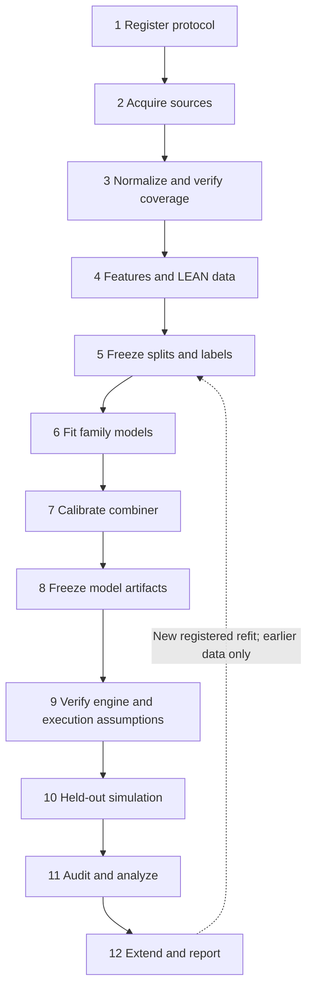

# Experimental workflow: from source data to reported evidence

The five tool names describe software boundaries, not the full research
workflow. Training, calibration, model freezing, simulation, and result review
are separate stages even when they share `algo-backtest` code. A merged tool is
not evidence that its stage has run on the selected data.

This document defines the execution stages and their exit evidence.
[The global plan](stories/00-PLAN.md) tracks work;
[the experiment catalog](experiments.md) maps comparisons to commands;
[Chapter 4 deliverables](ch04-deliverables.md) tracks reportable artifacts.
Per-tool specifications continue to govern implementation.

## Stages and required evidence

| Stage | Work and owner | Evidence required before proceeding |
|---|---|---|
| 1. Register the experiment | Operator: pair, strategies, feature families, dates, label, costs, risk settings, comparison, trial count, and pilot/final designation | Dated protocol and resolved configuration. Freeze decisions before inspecting evaluation returns. |
| 2. Acquire source data | `algo-download` or the documented GDELT BigQuery export | Raw/canonical input inventory, provenance, checksums where supported, and completion records. A partial Parquet file is not a completed month; the current exporter uses `.done`. |
| 3. Normalize and check coverage | `algo-transform` plus coverage review | Canonical prices/events, timestamp conventions, missing-day and corrupt-row report, overlap across required sources. The existing coverage command still needs reconciliation with the BigQuery export. A reduced pilot window is an explicit exception, not a passed full-window coverage gate. |
| 4. Prepare features and execution data | `algo-score`, price feature replay, `algo-backtest materialize` | Complete feature minutes and LEAN price days for the selected spans, publication-to-use alignment, warmup, and train/serve parity. Include the final bar's next-day decision time. Missing sentiment or pattern detection must be recorded as absent. |
| 5. Freeze chronological splits and labels | Offline trainer and operator | Separate family fitting, combiner calibration, and held-out dates; forward label horizon; boundary-purge rule; row/class counts. CPCV folds, embargo, and rolling refits require additional orchestration and evidence. |
| 6. Fit family models | `train_baseline_meta_learner.py` / `train_hybrid_meta_learner.py` | LightGBM models fitted only on the training rows, configuration, seed, and successful fitting log. Baseline and hybrid use identical dates and shared price features. |
| 7. Calibrate the combiner | Same offline trainers | Logistic coefficients fitted on later calibration rows using the family models' out-of-sample predictions. These rows are in-sample for the combined system and cannot be its test set. Candidate/threshold selection, if introduced, also needs a declared development protocol. |
| 8. Freeze and verify models | Trainer persistence and operator | Separate model JSON per pair/variant, input SHA-256 hashes, code revision, package versions, split/row metadata, and model hash. Check loading and feature/config compatibility. Do not silently replace a model between compared runs. |
| 9. Verify simulation assumptions | Engine controls and execution review | Known-answer buy-and-hold/random/oracle checks, data/clock verification, order and decision audit, broker, spread/slippage, size, stop, margin, and leverage assumptions. A pilot can diagnose failures here; it does not certify economic realism. Oracle results are controls, never strategies. |
| 10. Run held-out simulation | `algo-backtest run --model ...` on frozen models | Baseline/hybrid run IDs, identical pair/dates/execution assumptions, successful LEAN exits, actual replay coverage, resolved configs, model hashes, trades, equity, and decisions. No fitting during this replay. |
| 11. Audit and analyze | Operator + `algo-analyze` | Check actual dates, no unexpected gaps, decisions-to-trades joins, zero-trade explanations, and costs. Then produce metrics, equity/drawdown figures, paired differences, applicable ablations, significance, and deflated Sharpe with the actual trial count. Short-window estimates retain their limitations. |
| 12. Extend, reproduce, and report | Experiment operator + monograph | Additional held-out windows with the frozen models, or separately registered rolling refits using only earlier data; artifact/command manifest; limitations and omitted stages; Chapter 4 tables/figures linked to run IDs; manuscript build and reference checks. |

Data acquisition can continue in parallel over later months. It must not mutate
the inputs of an active experiment. Long tasks need a durable log, PID/status,
exit status, separate outputs, and an explicit restart point. A launched or
queued process is not a completed stage.

## Current pilot: first six months, then September

The user selected this sequence on September 26, 2026. It is a fixed-model pilot,
not the proposed 2015–2024 rolling/CPCV study.

| Role | EUR/USD dates | Treatment |
|---|---|---|
| Family fitting | February 2–June 30, 2015 | Fit the price families and, for hybrid, the event/news family. |
| Combiner calibration | July 1–31, 2015 | Fit logistic stacking; do not call July out of sample for the combined model. |
| Trainer's held-out partition | August 1–31, 2015 | Existing scripts require a nonempty test partition; these rows do not fit either model layer. This is not an August simulation result. |
| First simulation | September 1–30, 2015 | Load the frozen model. Hybrid waits for the completed September event month. |
| Later evaluation | Subsequent completed months | Reuse the frozen model; register any retraining as a new experiment. |

Training starts on February 2 because the event feature has a one-day lag.
The current label is a fifteen-minute midpoint direction, not a realized
cost-adjusted trade outcome. The scripts purge labels crossing split boundaries.
They load August to construct held-out rows; loading is distinct from fitting.
For the pilot, price-only baseline uses trend/indicator/pattern families and
hybrid adds the news family, currently supplied by GDELT event intensity with
sentiment missing. F3 has no real pattern detector. DSHA retraining is separate.

[Task 09](stories/done/09-six-month-training-september-pilot/progress.md)
records the exact running job, commands, artifacts, failure history, and current
status. The job uses the local checkout's data root; historical NAS snapshots
must not be mistaken for its current state.

## Scientific review findings

The review applied `experimental-design` and `scientific-critical-thinking` to
source code, existing tests, the manuscript, and pilot logs. It confirms useful
engineering safeguards: chronological fitting/calibration separation, purged
split-boundary labels, model provenance, and train/serve parity checks. These
safeguards do not by themselves validate profitability or H1.

Three interpretive limits need explicit tracking. First, repeated minute rows
and overlapping fifteen-minute labels are not independent replications. Second,
the hybrid changes both the news-family input and F4's event gate, so its delta
measures their joint effect unless separate ablations isolate each component.
Third, inspecting pilot outcomes to tune later configurations makes that pilot
development data; it cannot remain an untouched confirmation set.

[Story 11](stories/done/11-statistical-inference-corrections/spec.md) provides
schema-v2 inference: probability-valued DSR from consistent daily portfolio
moments and declared search history, plus a paired stationary bootstrap of mean
return differences. Register expected block lengths before evaluation and report
all sensitivity results, effect intervals, source hashes and unavailable reasons.
The classical DSR expression does not itself correct serial dependence. Archived
Sharpe adjustments and pooled-trade p-values remain legacy/exploratory; never
relabel them as corrected results. Trade-sequence figures remain descriptive.

Before analysis, supply audited equity/cost metadata and actual trial history.
Daily equity boundaries must be recorded; missing boundaries cannot be filled
from trades or interpolated. Inventory old runs and regenerate to new output
files only where inputs suffice. A simulation rerun is needed if the original
engine artifacts lack the grid; a statistical correction alone does not require
model retraining. Keep all original runs and model hashes.

Story 11 archives independent formula checks and a registered synthetic
calibration/power study. These validate specified software behavior; they do not
establish power for the trading experiment. No causal market claim, profitability
claim, or rejection of H1 follows. The earlier review used the procedures described in
[Kassis et al. (2026), Scientific Agent Skills](https://doi.org/10.48550/arXiv.2609.00065);
the skills organize review and are not independent empirical validation.

## Remaining work that a successful pilot does not close

[Task 10](stories/planned/10-experiment-validation-readiness/progress.md) owns
the readiness review and unresolved stages below. No scope item is silently
removed by starting Task 09.

- Reconcile the coverage matrix with completed BigQuery months, including
  missing days/quarantined rows, and decide the final supported window. GPR
  materialization and real text sentiment still need independent evidence.
- Verify empirical execution costs and risk economics. The code still uses a
  fixed stop distance, pip-value constant, assumed leverage for margin, and an
  unrealized-PnL proxy for portfolio risk. More bars alone do not fix these.
- Run engine controls and preserve the audit evidence for the selected setup.
- Implement or explicitly defer rolling refits, CPCV, and an embargo schedule.
  Boundary purging in a single chronological split is not CPCV.
- Register any hyperparameter/threshold search and preserve its trial count.
  The present fit uses a fixed small LightGBM configuration, not a completed
  search or model-selection study.
- Produce paired runs, figures, significance, ablations, and USD/JPY replication
  where claimed. The implemented analyzer is not proof these analyses ran.
- Audit GDELT point-in-time availability: the present event-date aggregate with
  a next-day lag still allows late-reported events to enter earlier aggregates.
  Do not describe this pipeline as completely leak-free.
- Decide which results support only a pilot claim and which satisfy the final
  protocol; disclose missing features and unresolved validity limitations in
  Chapters 4 and 5 before making any claim about H1.

## Artifact chain

The current run layout is `runs/<strategy>/<stamp>/`, not a date/ordinal name.
The analyzer reads `trades.json`; chain runs also write `decisions.parquet` and
`strategy-config.json` / `strategy-config.yaml`, alongside `run.json`, `metrics.json`,
and LEAN output.
The portable F7 JSON carries training provenance. Record its hash, the actual
run IDs, CLI commands, execution settings, and data-root location together.
`trades.parquet`, `parameters.txt`, `--cv`, and automatic per-fold orchestration
are target interfaces, not prerequisites that the current CLI already provides.
