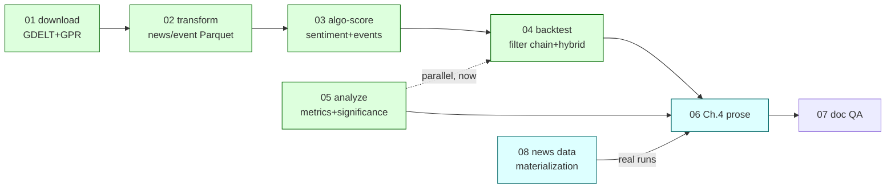

# Global plan — remaining work to TCC final submission

**Purpose.** This is the single entry point for autonomous agents (swarmforge or
otherwise) picking up work on the empirical side of the TCC. It states what is
already done, what remains, in what order, and which spec file owns each piece.
Read this file first; then read only the spec file(s) for the part you are
assigned.

**Sources of truth this plan summarizes (do not duplicate, go read them):**
[`PRD.md`](../../PRD.md) (product/roadmap), [`algo-suite/docs/experiments.md`](../experiments.md) (experiment → command
→ Chapter 4 artifact), [`algo-suite/docs/ch04-deliverables.md`](../ch04-deliverables.md) (Ch04 section →
tool → status), [`algo-suite/docs/technical-debt.md`](../technical-debt.md) (deferred items), each tool's
`algo-suite/algo-<tool>/SPEC.md` (the technical contract — these specs govern;
this plan and the numbered specs below do not override them).

**SCOPE DECISION REVERSED (2026-09-22, user confirmed): Full scope, compressed
schedule, 6 days left (2026-09-23 → 2026-09-29), not 7.** The Medium-scope call
below was written earlier the same day at a relaxed pace; the user has since
confirmed the schedule is now under real pressure and chosen to compress
rather than cut scope (kept struck through below for the audit trail — this is
the second reversal in one day, so read both). The 16-day estimate for spec 03
(`algo-score`) alone does **not** fit in 6 days even alone, let alone with
02+04+05+06 behind it — the user explicitly acknowledged this trade-off
(`16-day/7-day mismatch`) and chose to compress rather than cut scope. That
compression means each spec ships the **minimum slice that produces a real,
non-fake hybrid number**, not the full spec: LM lexicon scorer only in Spec 03
(skip FinBERT — no GPU-inference budget in this window), a 4-filter chain
(trend/indicator/news/risk, skip pattern/capital-sizing nuance) in Spec 04,
skip ablations/deflated-Sharpe-if-time in Spec 05. See `[[project_no_fake_hybrid]]`
memory — a compressed hybrid is still real sentiment + real events, never
price-only mislabeled.

**Go/no-go checkpoint — end of Day 1 (2026-09-23):** if `algo-score` (Spec 03)
is not producing real sentiment/event features on real data by then, revert
immediately to the Medium-scope plan struck through below (05+06 only,
price-only Ch.4, specs 01–04 documented as future work in Ch.5). Do not let
the compression slip cascade past Day 2 — a late Full-scope collapse with no
time to write Medium-scope prose instead is worse than deciding Medium on Day
1. This checkpoint is the fallback's whole point: it stays ready, not deleted.

**New scope item found while specifying 02 (2026-09-22):** GDELT's confirmed
Spec 01 raw fetch (`algo-download` §7a.1) is the **Events table only** — no
article text, only `SOURCEURL`. `algo-score`'s FinBERT/LM sentiment scorer
needs article text. GDELT's **Web News NGrams 3.0** dataset (a separate, free,
public GDELT product — not the Events table) plus the open-source `gdeltnews`
reconstruction package recovers near-full-text (~95% similarity, Fronzetti
Colladon & Vestrelli 2026) with no scraping/paywall/VPN needed. **This is a new
required `algo-download` unit kind, not yet in Spec 01's scope** — Spec 01 is
already past specifier (at hardender). Flagged in [`technical-debt.md`](../technical-debt.md); the
user decides whether to interrupt Spec 01's in-flight pipeline to add it or
queue a fast-follow spec. Compressed Spec 03 (LM lexicon only, per above) can
run on GoldsteinScale/AvgTone event-derived proxies without this if it isn't
landed in time — but that is an **event-derived** signal, not text sentiment,
and must be labeled as such, never as "FinBERT sentiment."

Struck-through: the same-day Medium-scope decision this reverses (kept for audit trail)

~~**HARD DEADLINE UPDATE (2026-09-22): monografia deposit is 2026-09-29 — 7
calendar days from today, and that 7 days must also fit the advisor's review
pass, not just the build.** This supersedes [`PRD.md`](../../PRD.md)'s 2026-09-01/2026-08-24
dates, which are stale (see `project_deadline_pressure` memory). At 7 days
*including* review time, **Full scope is not achievable** — spec 03
(`algo-score`) alone is budgeted 16 days, and specs 02→03→04 are strictly
sequential. **Scope is Medium, decided now, not a freeze-date contingency:**
specs 01–04 (GDELT/GPR download, transform, sentiment/event scoring, filter
chain/hybrid strategy) are **deferred to post-submission future work**,
documented as such in Chapter 5. The only specs in scope for 2026-09-29 are
**05** (finish `algo-analyze` far enough to produce the baseline metrics
table + equity/drawdown figures — deflated Sharpe if time allows, skip
ablation/significance work that needs a hybrid run) and **06** (write
Chapter 4 honestly as a price-only result, per its own §4 Medium-fallback
text).~~

~~**7-day schedule (review-inclusive, not review-then-build):**~~

| Day | Date | Work |
|---|---|---|
| ~~1~~ | ~~2026-09-22~~ | ~~Spec 05 core: `metrics` (Sharpe, max drawdown, hit rate, holding time, turnover) on the existing real EUR/USD 2024-06 baseline run(s).~~ |
| ~~2~~ | ~~2026-09-23~~ | ~~Spec 05 figures (equity curve, drawdown curve, vector PDF, thesis style pack) + deflated Sharpe if it fits.~~ |
| ~~3~~ | ~~2026-09-24~~ | ~~Spec 06 draft: rewrite §sec:experimental-setup (accurate, not the 2026-05-25 stale narrative), write §sec:baseline-results with real numbers, write §sec:hybrid-results/§sec:ablations/§sec:zhang-comparison as explicit "deferred to future work" (Ch.5 pointer), write §sec:experimental-threats.~~ |
| ~~4~~ | ~~2026-09-25~~ | ~~**Send full manuscript to the professor by end of day.** `make verify` + `make pt-scan` clean before sending. This is the latest safe send date to get any review turnaround inside the remaining 4 days.~~ |
| ~~5~~ | ~~2026-09-26~~ | ~~Buffer / keep polishing anything not blocking on the professor (bibliography, figure captions, cross-references) while waiting on feedback.~~ |
| ~~6~~ | ~~2026-09-27~~ | ~~Apply professor's corrections as soon as they arrive — this day is reserved for that, not new writing.~~ |
| ~~7~~ | ~~2026-09-28–29~~ | ~~Final `make verify`/`make rebuild` pass, deposit.~~ |

~~**If the professor's turnaround is unknown, ask them today (Day 1) how much
notice they need** — that answer changes whether Day 4's send date is
realistic or needs to move earlier, which would compress Days 1–3 further.
Do not spend remaining time on specs 01–04 — that time is better spent
hardening 05/06, getting the manuscript in front of the advisor early, and
leaving real slack for their corrections.~~

**6-day compressed Full-scope schedule (2026-09-22 → 2026-09-29):**

| Day | Date | Work |
|---|---|---|
| 0 | 2026-09-22 (today) | Spec 02: `algo-transform` GDELT/GPR decode (events, not news — no article text available, see above) + coverage matrix + window decision. Spec, then build, same day. |
| 1 | 2026-09-23 | Spec 03: `algo-score`, LM lexicon scorer only (no FinBERT), event features (GDELT aggregate + GPR forward-fill). **Go/no-go checkpoint at end of day.** |
| 2 | 2026-09-24 | Spec 04: `algo-backtest` minimal filter chain (trend/indicator/news/risk) + hybrid strategy run on real data, both pairs if time allows (EUR/USD first). |
| 3 | 2026-09-25 | Spec 05: `algo-analyze` metrics on baseline + hybrid runs (Sharpe, drawdown, hit rate; deflated Sharpe if it fits, skip ablations). |
| 4 | 2026-09-26 | Spec 06: Chapter 4 written with real hybrid-vs-baseline numbers. **Send to the professor by end of day** — one day shorter than the original Medium-scope plan's review lead time; flag this compressed turnaround to the professor explicitly. `make verify` + `make pt-scan` clean before sending. |
| 5 | 2026-09-27–28 | Apply professor's corrections as they arrive; polish bibliography/figures/cross-references in parallel. |
| 6 | 2026-09-29 | Final `make verify`/`make rebuild` pass, deposit. |

No slack day is built in. If any day slips, the go/no-go checkpoint (end of
Day 1) is the last safe point to fall back to Medium scope without
endangering the deposit date.

## 1. State as of 2026-09-22

**Done, on real data (2026-05-26 execution pass):** `algo-core` (shared lib),
`algo-download` Dukascopy price adapter, `algo-transform` bi5→minute-QuoteBar
Parquet, `algo-backtest` LEAN integration + two price-only strategies
(`baseline_ma`, `baseline_meanrev`) + the experiment runner, `algo-analyze`
summary table. First real numbers exist: EUR/USD 2024-06, both price-only
baselines lose (expected — see [`algo-suite/docs/first-baseline-results.md`](../first-baseline-results.md)).
**The entire price-only side is complete on real data.**

**Correction (2026-09-22, confirmed by user):** the full 10-year Dukascopy
bulk download (EUR/USD + USD/JPY, 2015-01..2024-12) is **done**, on the NAS
data root (`/media/nas/wellington/mba/algo-suite/data`, per [`conf/algo.yaml`](../../conf/algo.yaml)
— not mounted in this sandbox, verify file counts on the user's machine).
[`scripts/download-prices.sh`](../../scripts/download-prices.sh) is the resumable puller used for this. GDELT/GPR
are confirmed still missing: the Gherkin acceptance specs already exist
(`algo-download/tests/features/{gdelt,gpr}{,_network}.feature`, commit
`837399e`) but `algo_download/adapters/` has no `gdelt/`/`gpr/` code yet —
Spec 01 is spec-first-started, not zero, but still not runnable. **Superseded
by the Full-scope reversal above** — GDELT/GPR/score/hybrid are back in scope
for 2026-09-29, compressed. It also means the baseline (Spec 05) could run
over a much wider real window than the existing June-2024 slice, since the
underlying price data for the full 10 years is now actually on disk; widening
the baseline window is a nice-to-have if the compressed schedule has slack,
never a blocker for the hybrid work above.

**Stale note (below list superseded piece-by-piece since 2026-09-22 — see
inline updates):** most of "everything past a price-only baseline" has since
landed; what's actually still not started is narrower than this list once
implied. Kept for history, corrected in place:
- `algo-download`: GDELT + GPR raw adapters (spec calls them "slice 2/3") —
  **merged** (`algo_download/adapters/{gdelt,gpr}/` are real on `main`, not
  stuck on an unmerged branch).
- `algo-transform`: GDELT/GPR raw → canonical event Parquet, coverage matrix
  ("slice 3") — **built 2026-09-23** (Spec 02); currency-strength stays
  deferred (TD-29, no consumer)
- `algo-score`: **built** — `scoring.py`, `storage.py`, `attribution.py`,
  `scorers/`, `events/*` are all real (not a CLI stub). Never yet *run*
  against real data, though — the NAS data root has no sentiment/event
  Parquet materialized, only `forex/` — that's the actual remaining blocker
  for Spec 04e, not missing code.
- `algo-backtest`: F1 (trend), F2 (indicator), F3 (pattern), F5 (risk-guard),
  F6 (capital-mgmt), the order executor, and the `decisions.parquet` audit
  trail (Spec 04f) are all **built**. Still missing: F4 (news-context filter,
  blocked on the `algo-score` data-materialization gap above), F7 (the
  LightGBM meta-learner), and the hybrid strategy that wires them together.
- `algo-analyze`: **built** (Spec 05, PR #21, merged 2026-09-25) — see the
  "Correction (2026-09-25)" note above for detail.
- [`monografia/chapters/04-experimental-evaluation.tex`](../../../monografia/chapters/04-experimental-evaluation.tex): currently a
  "work in progress" skeleton with every results section a placeholder

**Why this order.** It is a strict pipeline
(`algo-download → algo-transform → algo-score → algo-backtest → algo-analyze`,
[`PRD.md`](../../PRD.md) §5) and each stage's canonical Parquet contract is the next stage's
input. There is no way to build `algo-score` before news Parquet exists, no way
to build the hybrid strategy before `algo-score` emits sentiment/event features,
and no way to write Chapter 4 numbers before a run exists. **Spec 05
(algo-analyze) is the one exception** — its metrics/significance/ablation
machinery can be built and tested now against the *existing* price-only runs
(Experiment 0/1 already produce `trades.parquet`), in parallel with specs
01–04, and simply pointed at the hybrid runs once they exist.

**Correction (2026-09-25):** line 148–149 above is now stale. Spec 05
(`algo-analyze`) is fully built and wired: `metrics` (headline + deflated
Sharpe, per-`docs/experiments.md`-§7.1 plausibility flag), `significance`
(Monte-Carlo Permutation Test), `ablation` (cross-run contribution table,
`--figure`), `figures` (equity/drawdown curves), and `summary` (F2
aggregation) all exist as real CLI commands (`algo-analyze <command>`),
tested end to end (73/73 `make check` scenarios green, `make audit` clean).
This closes the story now at `docs/stories/done/2026-09-25-algo-analyze-metrics-significance/`
(see its `progress.md` and `docs/stories/done/2026-09-25-05e-integration/progress.md`
for what landed and why some of it — `deflated.py` specifically — required
recovering real but previously-unmerged work rather than fresh building).
What this does **not** change: the machinery is proven against synthetic/
fixture runs in tests, not yet run against real hybrid-strategy data, because
the hybrid strategy and its runs don't exist yet (still blocked on Spec 04).
Spec 06 (Chapter 4) is unblocked on the *tooling* side; it still needs real
runs to point the tool at.

**Correction (2026-09-25, Specs 04e/04g/04h):** lines 152–156 above are now
stale. F4 (news-context filter) and F7 (LightGBM sub-models + logistic
meta-learner) are **built and tested against real Spec 03 output** —
`algo-score events --kind gdelt` was run for real (pilot month 2020-01,
44640 rows), and F4's veto path reads that real Parquet through the same
`ParquetRepository` writer/model round-trip Spec 03 uses. F4's per-symbol
*sentiment* half remains best-effort (ABSTAIN-safe), not blocked-and-missing:
full-month real article-text ingestion turned out to cost ~500 GB / ~90
hours at the current `gdelt_ngrams` adapter's throughput (TD-48), an
order-of-magnitude discovery, not a code gap. `chain/terminal.py`'s
`F7TerminalDecision` closes the loop from F7's own `FilterResult` to
`chain.model.Decision`, proven end-to-end against the real F1-F7 chain in
pure Python (`tests/features/filter_chain_mechanics.feature`). `algo-backtest/
strategies/{baseline,hybrid}/config.yaml` + the `extends:` composition loader
(`algo_backtest/strategies.py`) are real. `algos/experiment_zero/
{buyhold,random,perfect_foresight}/main.py` are written (same proven pattern
as `baseline_ma`/`baseline_meanrev`) and registered in `run.py`. **Not done:**
`algos/baseline/main.py` / `algos/hybrid/main.py` — the LEAN-container
wiring that reads a strategy's `config.yaml`, populates `ExecutionState.
features` each bar from live LEAN-native indicators (F1-F3) + `self.
portfolio` (F5/F6) + the real news Parquet (F4) + a persisted meta-learner
artifact (F7), and calls `OrderExecutor` — this is genuinely the largest
remaining piece and was not attempted this pass (resource/scope reasons: the
~10 GB pinned LEAN image, uncertain pip-package availability inside it for
`pyarrow`/`lightgbm`/`scikit-learn`, and avoiding NAS I/O contention with the
concurrent 10-year FX price backfill running in the original working tree).
See `docs/technical-debt.md`'s Spec 04h entry for the itemized remaining
scope. `04-algo-backtest-filter-chain-hybrid` therefore stays in
`docs/stories/planned/`, not moved to `done/` — its real Definition of Done
(a LEAN-container hybrid run) is not met.

**Correction (2026-09-26, Spec 04h closure):** lines 206–219 above are now
stale. `algos/baseline/main.py` and `algos/hybrid/main.py` are **built and
run against the real pinned LEAN container** over real materialized 2015-02
data — the ~10 GB image, `pyarrow`/`lightgbm`/`scikit-learn` availability,
and NAS I/O contention concerns above all resolved without issue. Both are
registered in `run.py`'s `STRATEGIES`. `decisions.parquet` (via a new shared
`chain/decision_recorder.py`) provably joins `trades.json` by `trade_id`
(LEAN's own entry `orderIds[0]`) — the last item in Spec 04h's own remaining
scope. Two real, previously-unknown container-only gaps were found and fixed
along the way: `algo_core.repository`'s eager `DuckDBRepository` import
(the container has no `duckdb`; fixed via lazy `__getattr__`) and an
all-empty `enrichment`/`metadata` batch making pyarrow infer an unwritable
childless struct column (fixed by mapping empty dicts to `None` at the
`FilterResultRow` boundary). Still a wiring smoke test, not a methodology
result — F3's pattern detector, F5/F6's account-risk economics, and F7's
training window are all still placeholders. `04-algo-backtest-filter-chain-
hybrid` moves to `docs/stories/done/` alongside this closure.

**Spec 07 §2 (build-hygiene pass) done, 2026-09-25.** `make pt-scan` clean
(hits are ABNT NBR 6023-required original-language bibliography entries and
`resumo.tex`, not leaked Portuguese prose — the thesis body itself is pure
English); `make verify` clean (86 pages, 0 undefined citations/references);
`make rebuild` succeeds from a clean `build/`; `\includepdf` for
catalog-card/approval-sheet confirmed still correctly commented out. Two real
build blockers fixed along the way: `monografia/main.tex` never loaded
`amsmath` despite Chapter 3 using its `equation*` environment, and loaded a
dead `chemmacros` import (unused chemical-notation package) that isn't
installed on this machine — removed. Two system LaTeX packages installed:
`texlive-publishers` (`abntex2cite.sty`, the ABNT bibliography engine) and
`texlive-lang-portuguese` (babel's `brazil` language file, needed by
`resumo.tex`). Spec 07 §1 (content fixes to Ch.1/Ch.3 hedge-notes) remains
blocked on Spec 06.

**Correction (2026-09-26, story-tracking reconciliation):** the 04e (F4) and 04g (F7) lane
folders sat in `docs/stories/planned/` after their code merged (`ef686f4`/`a1e7b8b`,
2026-09-25). They are now `done/2026-09-25-04e-algo-backtest-news-context-filter/` and
`done/2026-09-25-04g-algo-backtest-meta-learner/`. Both run end to end in the LEAN container
via `algos/hybrid` (Spec 04h). What remains toward submission is data and writing, not
`algo-*` code:
- **Spec 08 (in progress):** GDELT Events is materialized locally for 2015-02..07 (+ the
  2020-01 pilot), and 2015-08 is in progress. GDELT event features exist only for 2015-02 and
  2020-01. GPR has the raw download only. The coverage rule has not produced a window yet.
  TD-56 lets experiments start on the first ~6 months anyway. Details are in
  `in-progress/08-news-event-data-materialization/progress.md`.
- **Spec 06 (planned, unblocked, not started):** every Chapter 4 results section is still
  a placeholder. Next step: build event features for the run months, run baseline and hybrid
  over the out-of-sample months (04h `RUNBOOK.md`), then write.
- **Spec 07:** §2 build hygiene is done (above). §1 waits on Spec 06.
- **Spec 04k (done, including offline parity):** native Double-Smoothed Heikin-Ashi F1 candidate,
  selected by `baseline-dsha`; frozen-model ablation and gauntlet evidence in
  `done/2026-09-26-double-smoothed-heikin-ashi-trend-filter/`. Its spec explicitly
  records the second-round offline training, exchange-local timing fix and native
  parity evidence; no DSHA-retrained performance result is claimed. Package gate green;
  root workspace lint retains the pre-existing TD-55 blocker.

## 2. Spec map

**Status as of 2026-09-26** (the dependency ordering is the original 2026-09-22 plan. The
Status column is current. Story folders are under `docs/stories/{done,in-progress,planned}/`):

| # | Spec file | Tool | Depends on | Status |
|---|---|---|---|---|
| 01 | `01-algo-download-news-sources.md` | `algo-download` | nothing (parallel to 05) | **done** — GDELT+GPR adapters merged |
| 02 | `02-algo-transform-news-events.md` | `algo-transform` | 01 output on disk | **done** (2026-09-23) |
| 03 | `03-algo-score.md` | `algo-score` | 02 output on disk | **done** (code). Run for real on GDELT: event features built for 2015-02 and 2020-01. More months still needed (Spec 08) |
| 04 | `04-algo-backtest-filter-chain-hybrid.md` | `algo-backtest` | 03 output on disk | **done** (2026-09-26). All required lanes are done: 04a order executor, 04b chain mechanics, 04c F1–F3, 04d F5/F6, 04e F4, 04f audit trail, 04g F7, 04h LEAN `algos/{baseline,hybrid}`, plus follow-ups 04i trail-stop fix and 04j money-management gaps. Optional 04k is done with frozen-model ablation evidence and PR #43's config-selected offline training/native parity |
| 05 | `05-algo-analyze-metrics-significance.md` | `algo-analyze` | existing price-only runs (04's baseline is a bonus input, not a blocker) | **done** (PR #21, merged 2026-09-25). Lanes 05a–05f are all in `done/` |
| 06 | `06-monografia-chapter04.md` | `monografia` | 01–05 all landed | **unblocked, not started.** Needs real out-of-sample baseline and hybrid runs first, which need Spec 08's event features for the run months |
| 07 | `07-monografia-document-qa.md` | `monografia` | 06 (for §1 only) | **partial.** §2 build hygiene done 2026-09-25. §1 waits on 06 |
| 08 | `08-news-event-data-materialization` | scripts + `algo-*` CLIs | nothing | **in progress.** GDELT Events 2015-02..07 local, and 2015-08 running. GPR has the raw file only. Coverage window not derived yet. `prepare-news-data.sh` lacks `VERIFY_ONLY` |

*(2026-09-26: 01–05 are done, and green nodes above are done. Spec 08, the real-data runs, and
Spec 06 are the live path. The paragraph below is the original 2026-09-22 guidance.)*
Specs 01 and 05 have no unmet dependency and can be assigned to two agents in
parallel today. Specs 02, 03, 04 are strictly sequential (each is a hard blocker
for the next — do not start one before the prior spec's Definition of Done is
met and its output Parquet exists on disk, or the agent will be building against
a contract that doesn't exist yet). Spec 06 is last.

## 3. House rules every spec inherits (do not repeat per-spec, do not violate)

These come from `/home/wellington/Documents/mba/tcc/CLAUDE.md` and apply to
every spec below without exception:

- **Every test is Gherkin/pytest-bdd.** `.feature` files in `tests/features/`,
  steps in `tests/steps/test_<name>.py`. Never a plain `def test_…()`, not even
  for "pure logic". This is non-negotiable project policy.
- **Fail fast.** No silent defaults, no swallowed exceptions, no fallback
  sentinels. Raise immediately with what failed, why, and how to fix it
  (which param/env var/command). See each tool's SPEC.md §7 (Error handling)
  for the specific failure modes expected of that stage.
- **Docstrings on every function** (one-line summary; `Args:`/`Raises:` only
  where non-obvious from name+type).
- **Code-quality gate is `make check`** (ruff incl. C901 max-complexity 8, mypy
  strict, pytest) — must be green before a spec is done. Run `make audit`
  (dependency CVEs) before moving on, per CLAUDE.md.
- **No magic numbers, no config drift.** Trading-impactful parameters live in
  YAML per the `config_schema` pattern already established (`specs.md` §14.9);
  missing = hard stop, `null` = explicit disable (logged), never a silent
  default for anything that changes a trade decision.
- **Update the tool's own `SPEC.md`, `PRD.md` progress note, and
  `algo-suite/docs/technical-debt.md`** on completion — docs that drift from
  the build mislead the next agent. Do not leave a spec's tool SPEC.md
  describing unbuilt work as if it's still unbuilt once you've built it.
- **English-only**, American spelling (-ize/-or/artifact/analyze/center).
- **Never commit to `master`.** Work on a feature branch per spec (e.g.
  `algo-download-gdelt-gpr`), open a PR. No `git push origin master`, no
  merging — that's the user's call.
- **Stay inside `/home/wellington/Documents/mba/tcc/`.** Never touch sibling
  course directories.

## 4. Reporting back

Each spec's Definition of Done includes: `make check` green, `make audit`
reviewed, the tool's own SPEC.md status line updated, `technical-debt.md`
reviewed (mark satisfied triggers), and — critically — **this file's §1 state
table updated** so the next agent (human or autonomous) reading this plan sees
current reality, not a stale snapshot. A spec is not done until the next agent
can read `00-PLAN.md` alone and know it's done.
