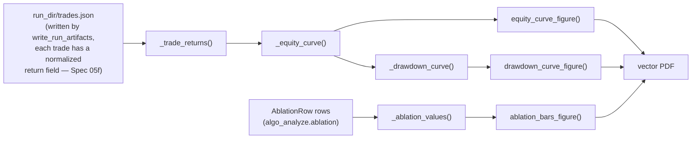

# Lessons learned — Spec 05d: algo-analyze thesis figures

**Sourced from the parallel Spec 05 analysis lanes opened as stacked PRs**
(05b significance, 05c ablation, 05d figures).

**Use the plotting library, not a hand-rolled PDF writer.** The first direction
nearly drifted toward custom PDF output; correcting the lane to matplotlib gave
proper vector PDFs, predictable LaTeX sizing, and much simpler tests.

**A shared style module is worth it once the second figure family is visible.**
`algo_analyze._style` centralizes the Agg backend, rcParams, colors, and figure
size so later thesis plots can reuse the same settings instead of duplicating
plot styling across modules.

**Validate PDF structure, not pixels.** The tests assert that a file is a
non-empty PDF with page structure and no embedded raster image subtype. That
checks the important contract for thesis figures while avoiding brittle pixel
snapshots.

**A stale virtualenv console script can masquerade as a missing dependency.**
`python -m pytest` saw matplotlib while the `pytest` console script did not; the
script shebang pointed at a different checkout. Reinstalling pytest through uv
repaired the script, and fresh worktrees passed normally.

**Fixing a consumer is not the same as proving the producer contract.** The
figures lane now reads `trades.json` rather than the future `trades.parquet`, and
it refuses to treat absolute PnL as fractional return data. That is safer, but
review still found the real completed-run contract incomplete:
`write_run_artifacts()` preserved LEAN closed-trade payloads unchanged and did not
guarantee a normalized fractional `return` field. That gap was first split out as
backlog story
[`05f-normalized-trade-returns`](../2026-09-24-05f-normalized-trade-returns/spec.md),
then landed in this same PR once it became clear no BDD scenario could prove the
figures lane works against a *real* completed run without it — see 05f's own
lessons-learned for why the split didn't hold.

## Data Flow

