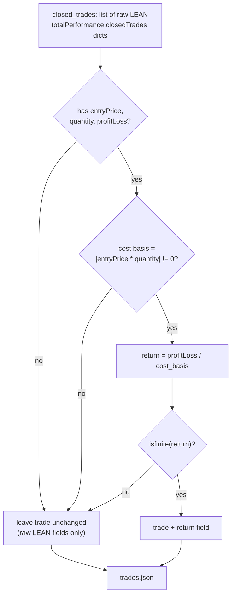
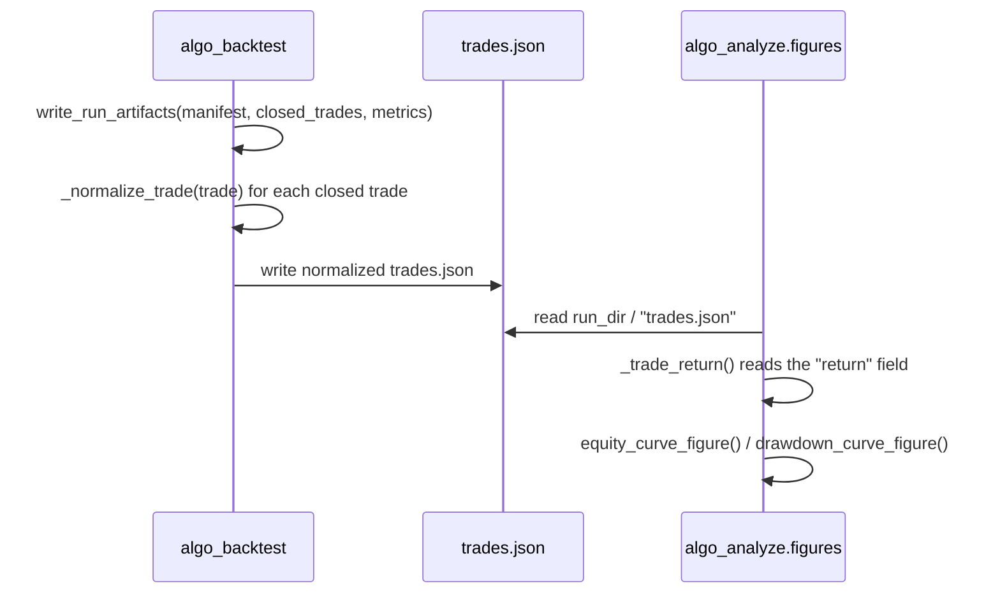

# Spec 05f — normalized trade returns for analysis figures

**Parent context:** Spec 05 (`algo-analyze` metrics/significance) and Spec 05d
(`algo-analyze` thesis figures).
**Status:** done — implemented in PR #11 alongside Spec 05d, after review found the
figures lane needed a real producer contract rather than a separate follow-up PR.
**Created from:** PR #11 review of Spec 05d.
**Implementation:** `algo_backtest.artifacts._normalize_trade` (see
`algo-suite/algo-backtest/src/algo_backtest/artifacts.py`) adds a `return` field to
each closed trade when `entryPrice`, `quantity` and `profitLoss` are present and the
cost basis is non-zero; otherwise the raw LEAN trade is left unchanged. BDD coverage:
`algo-backtest/tests/features/artifacts.feature` ("trade ledger normalizes a
fractional return" rule) and `algo-analyze/tests/features/figures.feature`
("a run produced by write_run_artifacts renders an equity/drawdown curve PDF").

## Problem

Spec 05d now correctly reads the current completed-run trade ledger artifact:

- `run_dir / "trades.json"`

It also correctly refuses to treat absolute PnL fields as fractional returns.
That fixed the previous unsafe behavior where PnL-like columns could be
silently interpreted as per-trade returns and produce misleading equity curves.

However, the current producer contract does not yet guarantee a fractional
trade-return field in `trades.json`.

`algo_backtest.artifacts.write_run_artifacts()` persists LEAN
`totalPerformance.closedTrades` mostly as raw trade objects. The current
producer guarantees a list of trade objects, but not fields such as:

- `return`
- `returns`
- `trade_return`
- `realized_return`

As a result, `algo_analyze.figures.equity_curve_figure()` and
`drawdown_curve_figure()` may still fail on real completed runs even though
their synthetic BDD fixtures pass.

## Review Evidence

Two independent reviews of the updated PR #11 reached the same conclusion:

- `figures.py` no longer reads `trades.parquet`.
- the unsafe PnL fallback is gone.
- the remaining blocker is that real `trades.json` artifacts do not guarantee
  normalized fractional return data.

One reviewer confirmed this with a smoke test using:

```python
write_run_artifacts(..., closed_trades=[{"trade": 0}], ...)
```

Then `equity_curve_figure()` failed with a missing fractional-return-field
`ValueError`. That is better than producing a wrong chart, but it means the
artifact contract still does not support real-run thesis figures.

## Objective

Define and implement a stable producer-side trade-return contract so completed
backtest runs can be analyzed without guessing.

The preferred shape is:

```json
[
  {
    "...": "original LEAN trade fields preserved",
    "return": 0.0123
  }
]
```

Where `return` is a finite fractional per-trade return suitable for equity and
drawdown curves.

## Implementation Options

Preferred option:

1. Add a small normalization layer in `algo-backtest` at artifact write time.
2. Preserve the raw LEAN trade payload.
3. Add a normalized finite fractional `return` field when enough data exists.
4. Fail fast, or record an explicit unsupported shape, when the trade object
   lacks enough data to compute a truthful return.

Alternative option:

1. Define a richer first-class trade artifact schema.
2. Produce that schema beside or instead of raw `closedTrades`.
3. Teach `algo-analyze.figures` to consume only that schema.

Avoid:

- treating absolute `profitLoss`, `pnl`, `netProfit`, or similar values as a
  fractional return without account/notional context.
- adding another synthetic-only `figures.py` happy path that is not tied to the
  producer contract.

## Acceptance Criteria

- `write_run_artifacts()` or an adjacent producer function emits `trades.json`
  entries with a finite fractional `return` field for the completed runs used by
  thesis figures.
- Existing raw LEAN trade information remains available for audit/debugging.
- A BDD test proves the producer writes normalized returns from representative
  LEAN closed-trade payloads.
- A BDD test proves `algo_analyze.figures` can render from a run directory
  created through `write_run_artifacts()`, not by hand-writing synthetic figure
  fixtures.
- Absolute-PnL-only payloads are rejected or explicitly marked unsupported; they
  are not silently interpreted as returns.
- `make -C algo-backtest check` and `make -C algo-analyze check` pass for the
  touched branches.

## Data Flow

Producer-side normalization at artifact write time, so `algo-analyze` never has to
guess a trade's fractional return from LEAN's raw payload:



End-to-end sequence proved by BDD (no hand-written `trades.json` fixture):



## Links

- Blocking review context: PR #11, Spec 05d figures.
- Consuming code: `algo-suite/algo-analyze/src/algo_analyze/figures.py`
- Producer code: `algo-suite/algo-backtest/src/algo_backtest/artifacts.py`
- Current story depending on this: `algo-suite/docs/stories/done/05d-figures/`
