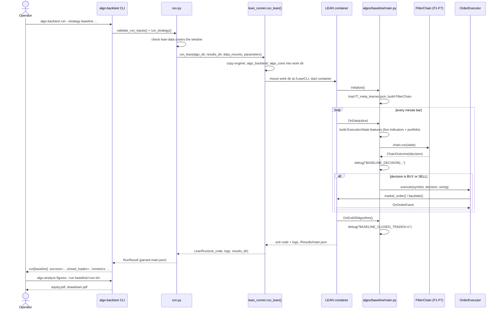
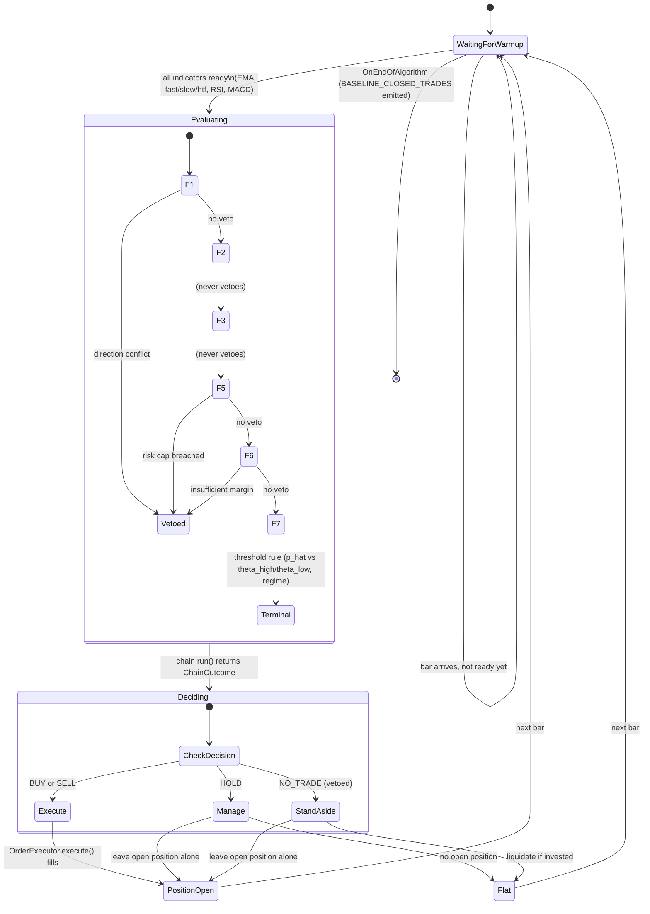

# Runbook: running the `baseline` F1-F7 chain (2026-09-26)

Covers `algos/baseline/main.py` (PR #33) — the F1+F2+F3+F5+F6+F7 chain (no F4/news)
wired into a real LEAN algorithm. **This is a wiring smoke test, not a methodology
result** — see `progress.md`'s 2026-09-26 sections and `docs/technical-debt.md`'s TD-51
for the full list of known simplifications before citing any number this produces.

## 1. Train and persist the F7 meta-learner (once, or whenever the window changes)

```bash
cd algo-suite/algo-backtest
uv run python scripts/train_baseline_meta_learner.py \
    --symbol EURUSD --from 2015-02-02 \
    --train-end 2015-06-30 --validation-end 2015-07-31 --test-end 2016-01-31
```

Same 6-month in-sample / 6-month out-of-sample split as `hybrid` below (Feb–Jun train,
Jul validation, Aug 2015–Jan 2016 held out).

Writes `src/algo_backtest/algos/baseline/f7_meta_learner.json`, loaded at `initialize()`:
a portable, pickle-free model document (`chain/filters/f7_model_io.py` — the LEAN
container's sklearn/LightGBM/numpy are older than the workspace's, so a pickled model
does not load there) with its provenance embedded (window, split, row counts,
input-partition SHA-256s, git revision, library versions). The algorithm logs
`BASELINE_MODEL_SHA256=` at start so a run is traceable to the exact model it loaded;
`algo-backtest run --model PATH` swaps in another model for one run. Boundaries must fall on real trading days — FX markets are closed
weekends, so a span landing entirely on a Saturday/Sunday raises `ValueError` (empty
walk-forward span).

## 2. Run the backtest

```bash
cd algo-suite
uv run algo-backtest run --strategy baseline --symbol EURUSD \
    --from 2015-08-01 --to 2016-01-31 --param size=0.5
```

Prints `run[baseline]: success=... closed_trades=... results=<path>/main.json` plus a
`metrics:` line. `closed_trades=0` is a valid outcome (F7's threshold rule is
conservative), not a failure — check `<results_dir>/log.txt` for `BASELINE_DECISION|...`
lines to confirm the chain actually evaluated every bar (this is exactly what
`run_baseline_chain.feature`'s `@integration` scenario asserts automatically).

## 3. Generate the PDF report

```bash
uv run algo-analyze figures --run baseline/<run-id>
```

Writes `equity.pdf` and `drawdown.pdf` under `<results_dir>/figures/`.

## Sequence diagram: one `run` invocation, end to end



## State diagram: per-bar decision flow



## Known limitations (repeat of `progress.md`/TD-51, kept here for a runbook reader)

- F3's `candlestick_pattern` is always `None` — no real detector wired; F3 ABSTAINs every bar.
- F5/F6's account-risk features (`account_portfolio_at_risk`, `pip_value`,
  `stop_loss_pips`, `margin_per_lot`, ...) use fixed placeholder constants in
  `algos/{baseline,hybrid}/main.py`, not a real ATR/margin model.
- F7's meta-learner is fit on whatever short window `train_{baseline,hybrid}_meta_learner.py`
  is pointed at — mechanically valid, not statistically meaningful.
- F4's (hybrid only) per-symbol sentiment is best-effort/ABSTAIN pending TD-48 — only its
  GDELT event-intensity veto input is real.

## Running `hybrid` (F1-F7 + F4/news) — added 2026-09-26, Spec 04h closure

Same shape as `baseline` above, plus a news-feature training step and mount.

### 1. Build the GDELT event-feature Parquet for the target month (if not already built)

```bash
cd algo-suite
uv run algo-score events --kind gdelt --from 2015-02-01 --to 2016-01-31
```

Build whole months: F4 and the training script need every minute of the window covered
(a gap fails fast with "no GDELT event_intensity ..."), and `algo-backtest run` checks
every touched month's partition exists before starting a container. Each day's GDELT
aggregate only becomes visible at 00:00 UTC the *next* day (no look-ahead; algo-score
SPEC.md §6.2), so the first built day has no value — raw GDELT starts 2015-02-01, hence
windows below start on 2015-02-02.

### 2. Train and persist the F7 meta-learner (includes the NEWS family)

```bash
cd algo-suite/algo-backtest
uv run python scripts/train_hybrid_meta_learner.py \
    --symbol EURUSD --from 2015-02-02 \
    --train-end 2015-06-30 --validation-end 2015-07-31 --test-end 2016-01-31
```

The window (`--from` through `--test-end`) may span any number of months; every
touched month's m1 price and GDELT event-feature partition must exist (missing ones
fail fast). The example uses 6 in-sample months (Feb–Jun train, Jul validation for the
stacker) and keeps Aug 2015–Jan 2016 as the 6 out-of-sample months — run the backtest
in step 3 over that span only, never over the in-sample months.

Writes `src/algo_backtest/algos/hybrid/f7_meta_learner.json` (same portable format);
news features are looked up at each bar's decision time (bar start +
1 minute, LEAN's `self.time`), the same as-of the live algorithm uses.

### 3. Run the backtest (out-of-sample months only)

```bash
cd algo-suite
uv run algo-backtest run --strategy hybrid --symbol EURUSD \
    --from 2015-08-01 --to 2016-01-31 --param size=0.5
```

`run.py`'s `StrategySpec.needs_news_data` flag makes `run_strategy()` additionally mount
only `parquet/events/_features` (and `parquet/sentiment` when it exists) read-only under
the container's `NEWS_DATA_ROOT` (`container_paths.py`), preserving the host layout so
`algo_score`'s path builders resolve unchanged — no manual mount step beyond step 1.

### 4. decisions.parquet / trades.json join

Both `baseline` and `hybrid` now write `<results_dir>/decisions.parquet` at
`on_end_of_algorithm()` (`chain/decision_recorder.py`). Every non-`NO_TRADE` row's
`trade_id` is `None` (no trade open) or a string matching one of `trades.json`'s
`orderIds[0]` values (LEAN's own entry order id) — a real, verifiable foreign key, not
just two files that happen to coexist. The id follows LEAN's flat-to-flat grouping
(`DecisionRecorder.on_fill`): a fill from flat or a reversal starts a new trade id, a
same-side scale-in/out keeps it, only a filled close clears it.
