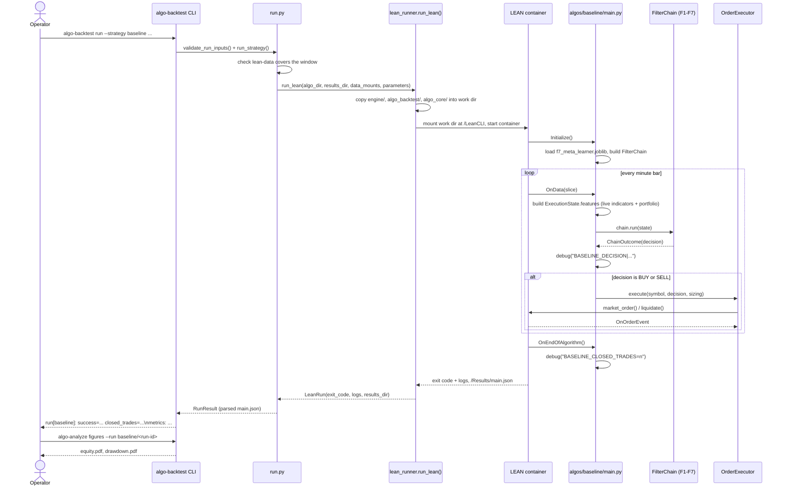
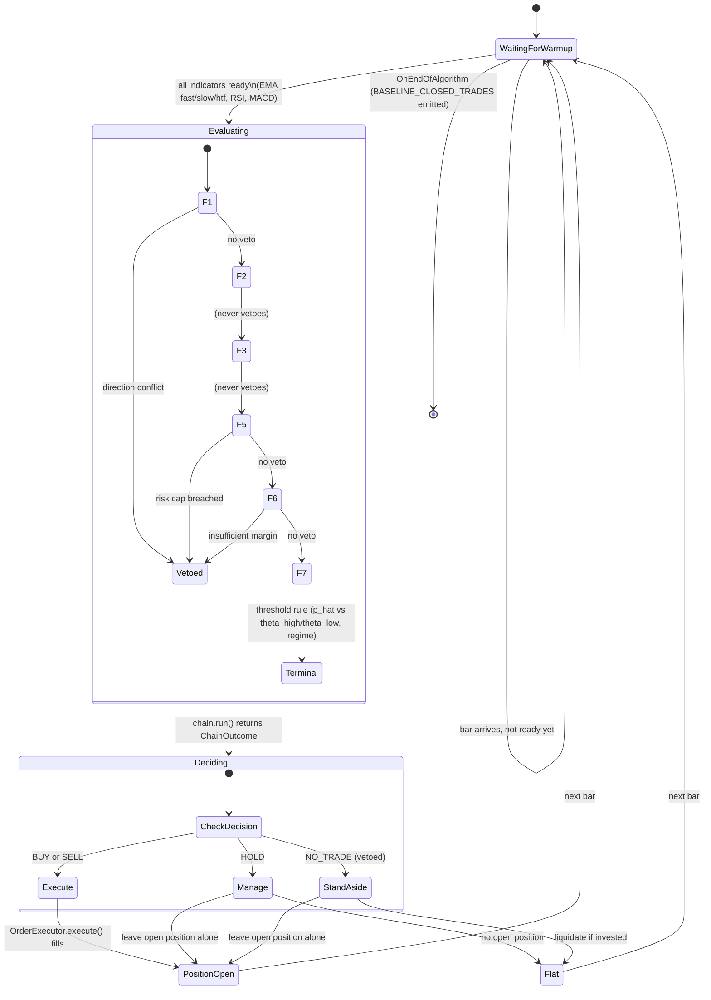

# Runbook: running the `baseline` F1-F7 chain (2026-09-26)

Covers `algos/baseline/main.py` (PR #33) — the F1+F2+F3+F5+F6+F7 chain (no F4/news)
wired into a real LEAN algorithm. **This is a wiring smoke test, not a methodology
result** — see `progress.md`'s 2026-09-26 sections and `docs/technical-debt.md`'s TD-51
for the full list of known simplifications before citing any number this produces.

## 1. Train and persist the F7 meta-learner (once, or whenever the window changes)

```bash
cd algo-suite/algo-backtest
uv run python scripts/train_baseline_meta_learner.py \
    --symbol EURUSD --year 2015 --month 2 \
    --train-end 2015-02-03 --validation-end 2015-02-05 --test-end 2015-02-06
```

Writes `src/algo_backtest/algos/baseline/f7_meta_learner.joblib`, loaded by `main.py` at
`initialize()`. Boundaries must fall on real trading days — FX markets are closed
weekends, so a span landing entirely on a Saturday/Sunday raises `ValueError` (empty
walk-forward span).

## 2. Run the backtest

```bash
cd algo-suite
uv run algo-backtest run --strategy baseline --symbol EURUSD \
    --from 2015-02-02 --to 2015-02-06 --param size=0.5
```

Prints `run[baseline]: success=... closed_trades=... results=<path>/main.json` plus a
`metrics:` line. `closed_trades=0` is a valid outcome (F7's threshold rule is
conservative), not a failure — check `<results_dir>/log.txt` for `BASELINE_DECISION|...`
lines to confirm the chain actually evaluated every bar (this is exactly what
`run_baseline_chain.feature`'s `@integration` scenario asserts automatically).

## 3. Generate the PDF report

```bash
uv run algo-analyze figures --run baseline/<run-id>
```

Writes `equity.pdf` and `drawdown.pdf` under `<results_dir>/figures/`.

## Sequence diagram: one `run` invocation, end to end



## State diagram: per-bar decision flow



## Known limitations (repeat of `progress.md`/TD-51, kept here for a runbook reader)

- F3's `candlestick_pattern` is always `None` — no real detector wired; F3 ABSTAINs every bar.
- F5/F6's account-risk features (`account_portfolio_at_risk`, `pip_value`,
  `stop_loss_pips`, `margin_per_lot`, ...) use fixed placeholder constants in
  `algos/baseline/main.py`, not a real ATR/margin model.
- F7's meta-learner is fit on whatever short window `train_baseline_meta_learner.py` is
  pointed at — mechanically valid, not statistically meaningful.
- `hybrid` (F1-F7 + F4/news) has no `algos/hybrid/main.py` yet — this runbook covers
  `baseline` only.
