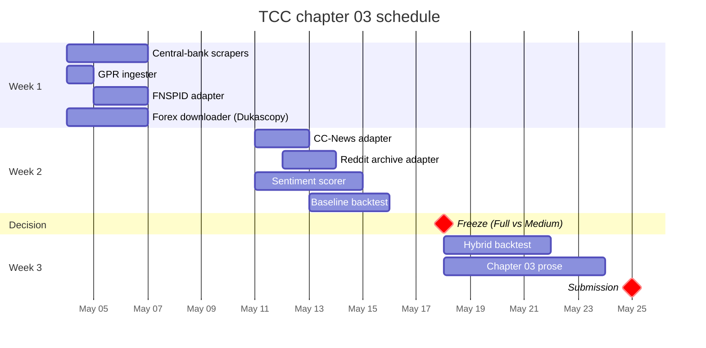
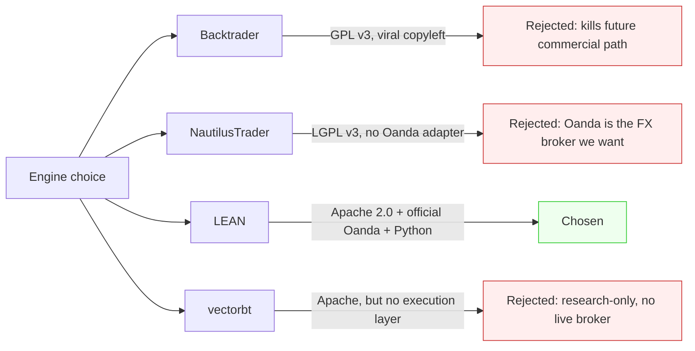
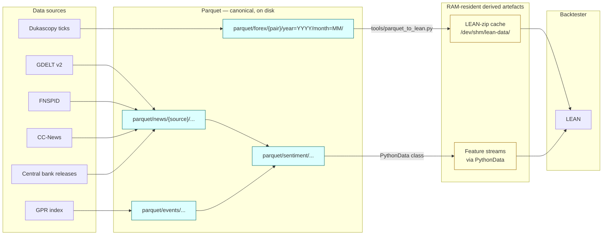
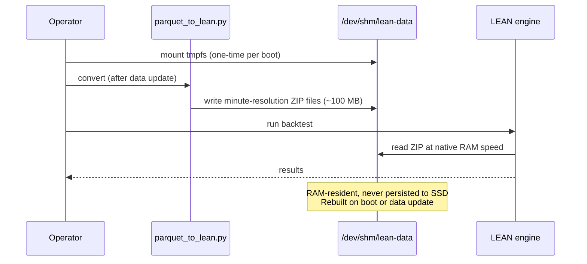
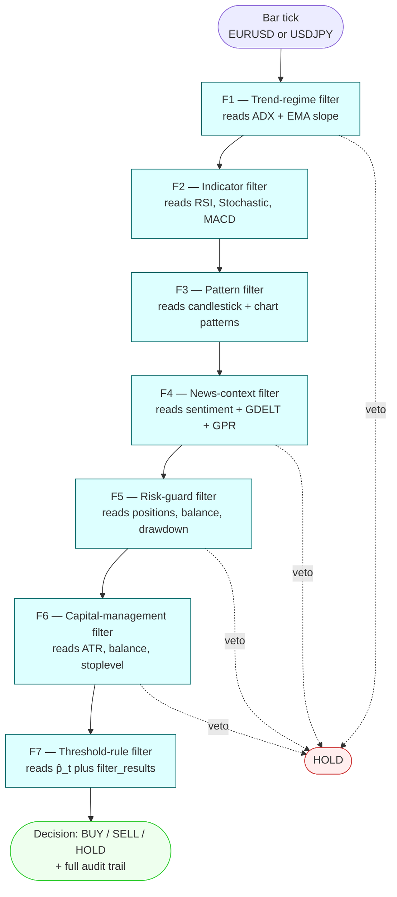

# TCC — Empirical Work Specification

> **⚠️ SUPERSEDED ARCHIVE (do not treat as current).** This 1527-line document was
> split into the live sources of truth and is kept only as a dated-decision
> archive (some dates/numbers here are stale). Current sources:
> - **Product/scope/roadmap** → `PRD.md`
> - **Per-tool technical specs** → `algo-suite/<tool>/SPEC.md`
> - **Design corpus** → `algo-suite/docs/` (incl. `algo-suite-design.md`, `technical-debt.md`)
>
> Do not edit this file for current work; amend the sources above instead. It is
> gitignored (local-only).

This document records the architectural decisions for the empirical work of the
TCC ("Algorithmic Trading Enhanced by AI: Using News, Geopolitical Events and
NLP-Based Sentiment in Forex Decision-Making"). It is the source of truth for
*why* each choice was made, *when* the rule applies, and *how* it is implemented.
Decisions taken on or before 2026-05-04 are listed below; subsequent decisions
amend this file rather than overwrite earlier text.

---

## 1. Submission track and timeline

### 1.1 Track

Track **(a)**, "TCC normal", per the Met III evaluation rubric (`avaliacao.txt`):

- (i) Introduction
- (ii) Theoretical foundation
- (iii) Methodology / Proposal and Development

Chapters 01 and 02 are written. Chapter 03 (Methodology / Proposal and
Development) is the next deliverable.

### 1.2 Submission level

Target **Full** delivery — methodology + ingestion + baseline backtest + at
least one hybrid backtest with sentiment features — with **Medium** as the
contractual fallback (methodology + ingestion + baseline only, hybrid
documented as future work).

### 1.3 Freeze date

**2026-05-18.** If the hybrid backtest is not running cleanly by this date,
scope freezes at Medium and chapter 03 documents the hybrid pipeline as
"implemented, results pending future work." This avoids a panic week before
the 2026-05-25 final submission.



---

## 2. Currency pairs

### 2.1 Decision

Two pairs: **EUR/USD** and **USD/JPY**.

### 2.2 Why two, not one

JPY breaks several assumptions that single-pair code can hide:

- Pip is at the second decimal place (0.01) for USD/JPY versus the fourth
  (0.0001) for EUR/USD.
- Price magnitudes differ by two orders of magnitude.
- Volatility regime differs: USD/JPY is a known carry-trade vehicle; EUR/USD
  is the world's deepest spot pair.

Building for both forces a clean `Pair` abstraction in the price downloader,
the feature layer, and the backtester. A single-pair codebase tends to bake
assumptions into hardcoded constants and quietly couples logic to one
quote convention.

### 2.3 Convention

EUR/USD (USD per euro), USD/JPY (yen per US dollar). The inverse JPY/USD is
non-standard and not used.

---

## 3. Time window

### 3.1 Decision

Target window **2015-02-19 → 2024-12-31** (~10 years). The actual training
window is determined empirically by the data-coverage rule below, not fixed in
advance.

### 3.2 Coverage rule

The training window is the **largest contiguous span where ≥ 2 news corpora
are active for ≥ 80 % of months** within it. The rule is computed after week-1
ingestion. The resulting coverage matrix is published as a figure in chapter
03.

This makes the window choice defensible (data-driven, reproducible) rather
than arbitrary. If three corpora cover the full 10 years cleanly, the window
stays at 10 years. If coverage thins out after, say, 2018, we report a
shorter window with the matrix as evidence.

### 3.3 Why this rule

GDELT 2.0 starts on 2015-02-19, which sets the earliest practical bound. The
10-year ceiling at 2024-12 leaves 2025 unobserved during the TCC build but
available as out-of-sample data for follow-up work. Walk-forward
train/validation/test split is roughly 2015–2022 / 2023 / 2024 (subject to
the empirical rule shifting these bounds).

### 3.4 Forex price-data window

The same 10-year target applies to Dukascopy tick data for EUR/USD and
USD/JPY; coverage is full and uncontroversial across this window.

---

## 4. News data sources

### 4.1 Order of priority

Most-relevant-to-Forex first. Build adapters in this order until time
runs out.

| Order | Source | Coverage | Effort | Phase |
|-------|--------|----------|--------|-------|
| 1 | Central-bank releases (FOMC, ECB, BOJ) | full window | medium (scrapers) | week 1 |
| 2 | **GDELT 2.0** | 2015-02 → present | already built | **done** |
| 3 | GPR index (Caldara & Iacoviello) | full window | trivial (one CSV) | week 1 |
| 4 | FNSPID (Hugging Face) | 1999 → 2023 | low | week 1 |
| 5 | CC-News (CommonCrawl) | 2016-08 → present | medium | week 2 |
| 6 | Reddit archive (Pushshift dumps) | 2008 → 2023 | medium | week 2 if time |
| 7 | StockTwits | varies | low–medium | nice-to-have |
| 8 | Trump Twitter Archive | 2009 → 2021 | low | nice-to-have |
| 9 | Macro/FX RSS & Substack feeds | varies | medium | nice-to-have |

### 4.2 Excluded sources

**Twitter/X (live).** Excluded. Rationale recorded for chapter 03:

> Twitter/X was excluded due to API access restrictions imposed by the
> platform after 2023, which made bulk historical retrieval economically and
> legally infeasible for an academic project. Reddit (via Pushshift archives)
> and StockTwits substitute as social-media-tier sources, and the Trump
> Twitter Archive provides a single-influencer corpus for the 2017–2021
> period.

This is a normal, citeable scoping decision — not a methodological hole.

### 4.3 Why this order

Forex moves on monetary-policy text first and on broad geopolitical risk
second. Central-bank releases have the highest signal-to-noise ratio for FX
of any corpus we can access. GDELT is built and gives broad coverage. GPR is
one CSV. FNSPID is one Hugging Face pull. CC-News and Reddit add volume but
require more filtering. StockTwits, Trump Archive, and RSS feeds are
single-source additions that can sit in chapter 04 (future work) if week 2
runs hot.

---

## 5. Forex price data

### 5.1 Decision

- **Source:** Dukascopy, free demo account.
- **Granularity:** tick data, resampled to minute QuoteBars for backtesting.
- **Window:** same 10-year target, 2015-02 → 2024-12.

### 5.2 Why Dukascopy

Of the realistic 2026 options, Dukascopy is the only broker that lets you
bulk-download tick data from a free demo account back to 2003. EUR/USD and
USD/JPY both have full coverage in our window. The community
`dukascopy-python` package wraps Dukascopy's HTTP data servers cleanly
without requiring the JForex Java terminal.

Alternatives considered and rejected:

| Source | Why rejected |
|--------|--------------|
| HistData.com | No tick data in the recent window; only minute granularity |
| Oanda v20 API | Only ~5 years rolling history |
| TrueFX | Smaller coverage and pair set |
| Interactive Brokers | Paid, rate-limited, no bulk download |

### 5.3 Architecture parallel

`forex-downloader/` is built as a sibling of `news-downloader/`, reusing the
same self-registering adapter pattern: one ABC for the price domain
(`MarketDataSource` or similar), one self-registering subclass per source
(`DukascopyDataSource` first, `HistDataDataSource` and `TrueFXDataSource` as
optional cross-checks), Parquet output mirroring the layout already used by
`news-downloader/`.

### 5.4 Demo accounts

Two demo accounts are referenced at distinct phases:

- **Dukascopy demo** — for historical tick-data download (week 1,
  blocking).
- **OANDA demo** — for future live execution via LEAN's
  `Lean.Brokerages.Oanda` adapter (optional, post-TCC).

A QuantConnect account is **not** required at any phase. The full
account-setup checklist with step-by-step instructions is in §16.

---

## 6. Execution engine

### 6.1 Decision

**LEAN** (QuantConnect open-source engine) with **Python algorithms**.

### 6.2 Why

- **Apache 2.0** licence (zero copyleft, fully commercial-friendly for any
  future product).
- **Official Oanda v20 broker adapter** (`Lean.Brokerages.Oanda`, also
  Apache 2.0).
- **Python algorithm support** (no C# required for a TCC).
- Runs natively on Linux via Docker.

### 6.3 Alternatives considered



### 6.4 Future-Rust escape hatch

If a hot-path module is too slow in Python later, drop down to **Rust via
PyO3**: compile a small Rust crate as a Python module and call it from the
LEAN strategy. PyO3 produces a normal Python extension module; LEAN's Python
embedding does not care that the function it calls is implemented in Rust.
This preserves Apache-only licensing while giving a clean performance escape
route. PyO3 is not used in the TCC build itself.

---

## 7. Storage and data flow

### 7.1 Decision

**Parquet is the canonical layer for everything.** Derived artefacts (the
LEAN-zip cache, in-memory feature streams) are regenerated from Parquet on
demand and are never persisted as duplicates on disk.

### 7.2 Architecture



### 7.3 Why this layout

Three properties matter:

1. **Engine portability.** If we ever swap LEAN for NautilusTrader, a custom
   backtester, or Jupyter EDA, Parquet is universal. LEAN-zip is LEAN-only.
2. **Sentiment-price alignment.** Joining news features to bars at minute
   resolution is a one-line DuckDB query over Parquet. Painful through
   LEAN's ZIP format.
3. **Reproducibility.** The canonical dataset is the Parquet tree. The LEAN
   folder is build output, not source. Lose `/dev/shm/lean-data/` and you
   lose nothing.

### 7.4 Why `/dev/shm` for the LEAN cache

Three constraints sit in tension:

- **No persistent disk duplication.** Tick data is 5–10 GB; duplicating it
  is real disk pain.
- **Native LEAN backtest speed.** LEAN's optimised C# data path is fastest
  with its native ZIP format; Python custom-data classes add per-bar
  boundary cost (~30 % slowdown after eager-load tricks, naively
  1.5–2× slower).
- **Single source of truth.** Only one copy of the data should be
  authoritative.

`/dev/shm` (tmpfs, RAM-backed filesystem on Linux) resolves all three. The
LEAN-zip cache lives in RAM, never touches the SSD, gives native LEAN speed
(RAM I/O actually beats SSD), and is regenerated from Parquet on session
start.



### 7.5 Resolution choice

- **Tick data**: stored in Parquet only (5–10 GB). Used for slippage
  modelling, EDA, and any future tick-level work.
- **Minute QuoteBars**: derived from ticks; stored in Parquet (~100 MB) and
  in the `/dev/shm` LEAN-zip cache (~100 MB, RAM-resident). Backtests run
  at minute resolution.

The TCC strategy fuses minute-or-coarser technical signals with
daily-or-coarser sentiment signals, so minute resolution is the appropriate
backtest granularity. Tick data is kept as the authoritative source but is
not consumed during normal backtest runs.

### 7.6 Operational steps

```bash
# at session start (rebuilds in ~5 s for minute-resolution 10y × 2 pairs):
sudo mount -t tmpfs -o size=2G tmpfs /dev/shm/lean-data
python tools/parquet_to_lean.py \
    --src parquet/forex/ \
    --dst /dev/shm/lean-data/forex/

# in LEAN config: data-folder: /dev/shm/lean-data
```

The mount can be made permanent in `/etc/fstab`; the converter runs after
each new ingestion (e.g., monthly when GDELT or Dukascopy adds a new month),
not before each backtest.

---

## 8. Repository layout

```
tcc/
├── dissertacao/                # LaTeX dissertation (USPSC/abntex2)
│   ├── chapters/
│   │   ├── 01-introduction.tex            # written
│   │   ├── 02-theoretical-foundation.tex  # written
│   │   └── 03-methodology.tex             # in progress
│   └── ...
├── news-downloader/            # existing — bulk news ingestion
│   └── src/adapters/{base.py, gdelt/, ...}
├── forex-downloader/           # NEW — bulk price ingestion (mirrors news-downloader)
│   └── src/adapters/{base.py, dukascopy/, ...}
├── sentiment-scorer/           # NEW — runs FinBERT/etc. over Parquet news
├── tools/
│   ├── parquet_to_lean.py      # converter, writes to /dev/shm
│   └── coverage_matrix.py      # builds the data-coverage figure
├── backtests/                  # LEAN algorithm code (Python)
└── specs.md                    # this file
```

---

## 9. Open items (live list)

- [ ] Open Dukascopy demo account and record API credentials.
- [ ] Open Oanda demo account (for future live-execution work).
- [ ] Decide central-bank scope: full FOMC + ECB + BOJ archives, or
      headline-only.
- [ ] Sentiment model: FinBERT vs. BloombergGPT-derived vs. distilled
      task-specific. To be decided after the week-1 corpus inventory.
- [ ] Fusion architecture: late-fusion is the default per chapter 02; the
      concrete model choice (gradient-boosted classifier, small transformer,
      or stacked) is decided after baseline runs.
- [ ] Coverage matrix figure: produced after week-1 ingestion; drives the
      final window decision.
- [ ] Bibliography additions: FNSPID (arXiv 2024), CC-News (CommonCrawl),
      GPR (Caldara & Iacoviello 2022), Trump Archive (Brown 2021).

---

## 10. Out of scope

The following are noted here so chapter 03 can defer them cleanly:

- Live execution against any broker (Oanda demo notwithstanding) — chapter
  04 / future work.
- Tick-level backtesting — Parquet retains the data; the methodology runs
  at minute resolution.
- Multi-language strategy code (Rust/Go) — Python is the strategy language;
  PyO3 is documented as an escape hatch but not used in the TCC build.
- Twitter/X live ingestion — excluded with rationale recorded in §4.2.
- Cloud (S3, BigQuery) as runtime dependency — bulk-download once, query
  locally remains the project's data architecture (see TCC `CLAUDE.md`).

---

## Amendments — session of 2026-05-04

The following sections record decisions taken on 2026-05-04, after the
initial document was written. They extend the architecture rather than
overwrite earlier decisions.

---

## 11. Strategy architecture: agentic perception, deterministic execution via a configurable layer chain

### 11.1 Pattern

The strategy is a two-stage pipeline. The first stage is the
perception layer (non-deterministic, cached). The second stage is a
configurable chain of layers --- conceptually similar to the
interceptor pattern used by Java EE application servers (and to the
legacy fxmanager-ejb's `TradePlanOrderProcessInterceptor`) --- that
decides BUY / SELL / HOLD.

```
┌──────────────────────────────┐    ┌──────────────────────────────────────────┐
│  AGENTIC PERCEPTION LAYER    │    │  DETERMINISTIC EXECUTION CHAIN           │
│  (non-deterministic + cached)│    │  (configurable, rule-based, auditable)   │
├──────────────────────────────┤    ├──────────────────────────────────────────┤
│  • FOMC parser agent (later) │    │  L1: trend regime filter        │ vote   │
│  • Geopolitical event agent  │───▶│  L2: indicator confirmation     │   │   │
│  • Sentiment scorer (FinBERT)│    │  L3: pattern trigger            │   ▼   │
│  • Pattern detectors         │    │  L4: news context (veto/boost)  │  pass │
│  • TA / indicators           │    │  L5: risk guard                 │  veto │
│  Outputs cached as Parquet   │    │  L6: capital management         │  HOLD │
│                              │    │  L7: threshold rule → BUY/SELL  │       │
└──────────────────────────────┘    └──────────────────────────────────────────┘
   variability lives here              variability ends here; chain is
                                        configured in YAML, layers are pluggable
```

Variability lives in the perception layer (which can include LLMs).
Variability ends in the execution chain, which is rule-based,
reproducible, and configurable without engine code changes.

### 11.2 Why this design

1. **Reproducibility.** Cached perception outputs make backtests
   bit-for-bit deterministic, even if the underlying model is
   non-deterministic.
2. **Auditability.** Every trade has an explicit chain of contributions:
   "L1 said trend=bull, L2 confirmed, L3 detected an engulfing pattern,
   L4 found no veto event, L5 passed (within risk caps), L6 sized at 0.10
   lots, L7 emitted BUY."
3. **Vendor-independence.** Replace the perception model without
   re-engineering the execution layer.
4. **Regulatory acceptability.** Each layer's contribution is inspectable;
   pure agentic systems are not.
5. **Extensibility.** New layers (consensus aggregators, agent vetoes,
   correlation-aware sizing, etc.) can be added by editing the YAML
   chain definition; the engine code is unchanged.

### 11.3 The filter chain

**Naming.** The chain pattern is borrowed from Java EE
*interceptors* (the legacy fxmanager-ejb uses the same idea via
`TradePlanOrderProcessInterceptor`), but we adopt FX-industry
terminology inside the project:

- *Filter* --- one unit in the chain. The term is standard FX
  parlance ("trend filter", "volatility filter", "news filter",
  "spread filter").
- *Filter chain* --- the ordered chain of filters that forms a
  strategy's deterministic execution layer. The term "stack" is also
  acceptable as a less-formal synonym.

The architectural-level terms "perception layer" and "execution
layer" are unaffected; they describe the two halves of the pipeline.

#### 11.3.1 Filter interface and information accumulation

The chain follows the *pipes-and-filters* pattern: as the running
state passes through each filter, the filter both contributes a
recommendation (with reasoning) **and** can enrich the state with
derived information that downstream filters consume. By the time
the state reaches the terminal filter --- the **order executor** ---
it carries the union of every upstream filter's contribution.

Each filter receives the running state and produces a `FilterResult`
that records:

- a **recommendation** (`BUY` / `SELL` / `HOLD` / `NEUTRAL` /
  `ABSTAIN`) --- what this filter would have the strategy do based
  on its own evidence;
- a **reason** --- a human-readable string explaining the
  recommendation ("trend is bull, ADX = 32");
- an optional **confidence** in $[0, 1]$;
- an optional **veto** flag --- if set, short-circuits the rest of
  the chain to HOLD;
- an optional **enrichment** dictionary --- new feature values to
  merge into `state.features` so that downstream filters can read
  them ("trend_score", "proposed_lot_size", "available_margin",
  ...);
- optional **metadata** for filter-specific debugging.

The chain runs filter-by-filter. After each filter, the chain
appends the `FilterResult` to `state.filter_results` and merges the
filter's enrichment into `state.features`. Downstream filters see a
state that has accumulated all upstream enrichments and recommendations.
The order executor, which sits at the end of the chain, has access
to the entire accumulated context --- features, recommendations,
confidences, vetos that did not fire --- and emits the final
BUY/SELL/HOLD decision.

The full `filter_results` list is persisted with every trade as the
audit trail, so each trade carries an explicit chain of "F1 said X
because Y and added feature Z, F2 said W because V and added feature
U, ..., F7 (order executor) decided BUY". This audit trail is the
artefact that makes the deterministic execution claim of §11.2
operational: every backtest entry is explainable down to the
contribution of each filter and the features it added to the
context.

```python
@dataclass
class FilterResult:
    filter_name: str
    recommendation: Recommendation       # BUY | SELL | HOLD | NEUTRAL | ABSTAIN
    reason: str
    confidence: float | None = None
    veto: bool = False
    enrichment: dict = field(default_factory=dict)   # new features for downstream
    metadata: dict = field(default_factory=dict)

@dataclass
class ExecutionState:
    timestamp: datetime
    pair: str
    features: dict                                    # accumulated, enriched in flight
    filter_results: list[FilterResult] = field(default_factory=list)

class FilterChain:
    def run(self, state: ExecutionState) -> tuple[Decision, ExecutionState]:
        for f in self.filters:
            result = f.apply(state)
            state.filter_results.append(result)
            state.features.update(result.enrichment)  # accumulate context
            if result.veto:
                return Decision.NO_TRADE, state
        return self.order_executor.decide(state), state
```

`VETO` and `ABSTAIN` are distinct: a veto is a hard stop ("no trade
regardless of subsequent filters"); an abstain is "no opinion this
bar" (e.g.\ a sentiment filter with no recent articles), and the
chain continues without that filter's vote weighing in.

#### 11.3.1.1 The Decision enum

The chain produces one of four final outcomes per tick. Three are
*engaged* outcomes --- the strategy is actively considering or
managing a position --- and one is the disengaged outcome.

| Decision | Meaning | When |
|---|---|---|
| `BUY` | Open a new long position | Order executor finds entry conditions for long |
| `SELL` | Open a new short position | Order executor finds entry conditions for short |
| `HOLD` | Manage an existing position (trail stop, partial close, no-op tick) | Order executor finds the strategy is engaged with an open position but not opening a new one this tick |
| `NO_TRADE` | Stand aside; no engagement | Any filter vetoes; or the order executor finds no entry criterion is met and there is no existing position to manage |

The expected distribution is heavily skewed: on minute-resolution
data over a typical year, BUY/SELL outcomes are sparse (a handful per
week per pair, by design), HOLD outcomes occur on every tick during
which a position is open, and `NO_TRADE` is the vast majority. The
audit trail accommodates this skew by logging every chain run
uniformly --- volume is tractable (≈ 2 million chain runs over the
full ten-year window per pair, a few gigabytes of compressed
Parquet) --- but downstream analysis queries typically filter for
engaged outcomes (`final_decision != 'NO_TRADE'`) when computing
per-trade metrics.

The order executor is itself just the terminal filter, with the
distinction that its `apply()` always emits one of the four final
decisions (never ABSTAIN) and never vetoes --- by the time the state
arrives at the order executor, every gating decision upstream has
either passed or vetoed, and the executor's job is to interpret the
accumulated context and either place an order, manage an existing
position, or stand aside.

#### 11.3.2 Filters of the TCC's first chain (Strategy A05)

| # | Filter | Source of input | Recommendation behaviour |
|---|---|---|---|
| F1 | Trend-regime filter | TA-structural features (§3.6.1 of the dissertation) | Recommends BUY/SELL aligned with the multi-timeframe trend; vetoes if direction conflicts |
| F2 | Indicator filter | Indicator features (§3.6.2) | Recommends direction confirmed by oscillators; ABSTAIN on no-information bars |
| F3 | Pattern filter | Chart/candlestick pattern features (§3.6.3) | Recommends BUY/SELL on detected pattern; ABSTAIN if no pattern at current bar |
| F4 | News-context filter | Sentiment + event features (§3.6.4 + §3.6.5) | Recommends direction by net sentiment; vetoes on active high-risk events |
| F5 | Risk-guard filter | Account state + open positions | Vetoes if portfolio-at-risk cap, drawdown limits or leverage cap would be breached (§14.8); otherwise PASS |
| F6 | Capital-management filter | Account balance + ATR | Computes lot size by the formula in §14.5; vetoes if margin insufficient |
| F7 | Threshold-rule filter | Meta-learner probability $\hat{p}_t$ from §3.7.1 plus accumulated `filter_results` | Aggregates the recommendation list; emits BUY/SELL/HOLD per the equation in §3.7.2 |

Each filter is a Python class implementing the single-method
interface `apply(state: ExecutionState) -> FilterResult`. Filters
are unit-tested in isolation with synthetic state inputs. Adding,
removing or reordering a filter requires editing `config.yaml`, not
the engine code.

#### 11.3.3 Per-strategy chain diagrams

**Convention.** Every strategy's directory under
`backtests/strategies/<name>/` contains a `README.md` whose first
section is a Mermaid `flowchart` rendering the strategy's filter
chain: each filter is a node, the main edge is "next filter", a
dotted edge to a HOLD terminus is the veto path. The diagram is a
literal-and-friendly statement of the strategy's deterministic logic;
edits to `config.yaml` are reflected in the diagram, and the diagram
is the single most-useful artefact for code-review of a strategy.

The reference diagram for Strategy A05:



A future strategy --- A01--A04 ablations, or a Tier-C variant that
inserts a consensus-aggregator filter between F4 and F5, or any
other re-shuffle --- gets its own Mermaid block in its own README,
edited to match its actual chain. The Mermaid source for each
diagram lives next to the strategy code so that changes to either are
caught in the same code review.

#### 11.3.4 Audit-trail format

The audit trail is persisted alongside each simulated trade in
`backtests/runs/<run-id>/decisions.parquet`, one row per chain
invocation, with columns:

| Column | Type | Notes |
|---|---|---|
| `timestamp` | datetime | bar timestamp at which the chain ran |
| `pair` | string | e.g.\ `EURUSD` |
| `features_hash` | string | hash of the input feature dict for reproducibility |
| `filter_results` | list[struct] | the accumulated `FilterResult` list, structured |
| `final_decision` | string | `BUY` / `SELL` / `HOLD` / `NO_TRADE` |
| `vetoed_by` | string \| null | name of the filter that vetoed, if any |

This makes ex-post analysis natural: for any losing trade, query the
decisions file for that timestamp and read the seven filter
contributions in plain prose. Aggregate analysis ("which filter's
recommendation was most often wrong on losing trades?") is a
one-line DuckDB query.

### 11.4 Four feature families feeding the chain

Following the discretionary trader's mental model, the perception
layer produces signals organised into four feature families that the
chain consumes:

1. **Technical analysis (structural)** --- trend regime, support and
   resistance, swing structure.
2. **Indicators** --- moving averages, MACD, RSI, Stochastic, ATR,
   Bollinger bandwidth, microstructure proxies.
3. **Chart and candlestick patterns** --- Nison candlesticks via
   TA-Lib's `CDL*` functions; classical chart patterns following
   \citeonline{lo2000foundations} and the catalogue of
   \citeonline{bulkowski2005encyclopedia}.
4. **News** --- sentiment scores (FinBERT plus the Loughran--McDonald
   baseline) and event scores (GDELT and the GPR index of
   \citeonline{caldara2022geopolitical}).

The first three are price-derived; the fourth is text-derived. They
feed the layers L1--L4 of the chain respectively.

### 11.5 Future-work tiers as additional layers

The chain pattern accommodates all future-work tiers (described in
chapter 05 of the dissertation) as additions to the chain or to the
perception layer, never as engine redesigns.

| Tier | What it adds | Where it lands |
|---|---|---|
| A | A more capable LLM agent for sentiment scoring | Perception layer; chain unchanged |
| B | Specialist multi-agent perception (FOMC parser, GDELT-GKG agent, …) | Perception layer adds parallel agents; chain unchanged |
| C | Consensus aggregation across heterogeneous agents | New layer in the chain (a "consensus aggregator" layer between L4 and L5, or replacing L4) |
| D | Agents that propose rule modifications | Modifies the YAML configuration of the chain; structure unchanged |

The methodological commitment of the work is preserved across all
tiers: variability lives in the perception layer; the execution chain
is rule-based and reproducible.

---

## 12. Related work positioning

### 12.1 TradingAgents (Xiao et al. 2025)

The most directly comparable contemporary work is **TradingAgents** by
Xiao et al., arXiv:2412.20138, Apache 2.0, at
<https://github.com/TauricResearch/TradingAgents>. Differentiation:

| Dimension | TradingAgents | This work |
|---|---|---|
| Asset class | US equities (NVDA, SPY) | Forex (EUR/USD, USD/JPY) |
| LLM role | Decision agent (LLMs trade) | Feature extractor (LLMs perceive) |
| Execution paradigm | Agentic | **Deterministic** |
| Backtest determinism | Breaks on model updates | Stable — cached features replay identically |
| Validation discipline | Unspecified in README | Walk-forward + purged k-fold + tx-cost modelled |
| Geopolitical/event integration | Generic news | GDELT + GPR explicitly for FX macro drivers |

These are different research programmes. TradingAgents is in the
agentic-execution lineage; this work is in the deterministic-execution
lineage (Tetlock 2007, Loughran--McDonald 2011, López de Prado 2018,
Lo et al. 2000).

### 12.2 Action items derived

- [x] Add `xiao2025tradingagents` to bibliography. *Done 2026-05-04;
      authoritative BibTeX taken directly from the authors' README at
      <https://github.com/TauricResearch/TradingAgents>.*
- [x] Add a paragraph to chapter 02 §2.5 introducing the
      execution-paradigm dimension (agentic vs.\ deterministic) and
      positioning TradingAgents as the agentic-execution exemplar.
      *Done 2026-05-04.*
- [ ] Add forward-pointer in chapter 05 (Future Work) to the
      agentic-perception evolution tiers (§11.4). *Pending — chapter 05
      is currently a stub; will be addressed when chapter 05 is written.*

---

## 13. Reference materials and citations

### 13.1 Local book library

A library of trading and investment books is available locally:

- `/home/wellington/workspace/experiments/books-forex-trading/` — Forex-specific titles (117+ books)
- `/home/wellington/workspace/experiments/some-investment-books/` — broader investment literature

Strict rule: no work is cited until its bibliographic data has been
verified from the actual PDF (title page + copyright page) or from an
authoritative external record (publisher's page, NBER, AAAI, etc.).

### 13.2 Bibliography additions verified during this session

Added to `dissertacao/bib/references.bib`:

- **Lo, Mamaysky, Wang (2000)**, *Foundations of Technical Analysis: Computational Algorithms, Statistical Inference, and Empirical Implementation*, *Journal of Finance* 55(4): 1705--1765. doi:10.1111/0022-1082.00265. Verified via NBER (working paper 7613, March 2000). Used in §3.6.3.
- **Bulkowski (2005)**, *Encyclopedia of Chart Patterns*, 2nd ed., John Wiley & Sons, Hoboken NJ. ISBN 978-0-471-66826-8. Verified directly from PDF copyright page in local library. Used in §3.6.3.
- **Nison (1991)**, *Japanese Candlestick Charting Techniques: A Contemporary Guide to the Ancient Investment Techniques of the Far East*, New York Institute of Finance. ISBN 0-13-931650-7. Verified directly from PDF copyright page in local library. Used in §3.6.3.
- **Dong, Fan, Peng (2024)**, *FNSPID: A Comprehensive Financial News Dataset in Time Series*, arXiv:2402.06698. Verified via arXiv. Used in §3.5.
- **Baumgartner et al. (2020)**, *The Pushshift Reddit Dataset*, AAAI ICWSM 14(1): 830--839. doi:10.1609/icwsm.v14i1.7347. Verified via AAAI. Used in §3.5.

### 13.3 Citation queue (verification pending)

The following references would strengthen the dissertation. Fetch via
USP VPN or check local library before adding:

1. **Brock, Lakonishok, LeBaron (1992)**, *Simple Technical Trading Rules and the Stochastic Properties of Stock Returns*, *Journal of Finance* 47(5): 1731--1764. doi:10.1111/j.1540-6261.1992.tb04681.x. Canonical empirical TA paper.
2. **Park & Irwin (2007)**, *What Do We Know About the Profitability of Technical Analysis?*, *Journal of Economic Surveys* 21(4): 786--826. doi:10.1111/j.1467-6419.2007.00519.x. Survey of TA profitability literature.
3. ~~**Xiao et al. (2025)**, *TradingAgents: Multi-Agents LLM Financial Trading Framework*, arXiv:2412.20138.~~ *Verified 2026-05-04 via the authors' canonical BibTeX in the project README; added to bibliography as `xiao2025tradingagents`.*
4. **Aronson (2007)**, *Evidence-Based Technical Analysis*, Wiley. Available locally; relevant to validation discipline.
5. **Edwards & Magee (2007)**, *Technical Analysis of Stock Trends*, 9th ed. Available locally.

### 13.4 Strategy-source books (not yet citations)

User-flagged books whose strategy content may inform the implementation
of capital management, position sizing or strategy variants:

- *High Probability Trading Strategies* (2008)
- *Naked Forex --- High-Probability Techniques for Trading Without Indicators* (2012)
- *Dual Momentum Investing* (2015)

These remain unverified bibliographically; they become formal citations
only after individual verification from copyright pages.

---

## 14. Legacy code reference

### 14.1 fx-manager (Java, ~2010)

The author's earlier algorithmic-trading system, originally developed
around 2010 to interface with the MetaTrader platform, is hosted at:

- <https://git.disposalqueen.com/algo-trading/fx-manager>

The codebase is **Java**, not MQL4 (the MetaTrader integration sat on
top of a Java middleware layer). The components to be ported into the
Python pipeline are listed below.

### 14.2 Components to port

| Component | Why ported | Target location |
|---|---|---|
| Capital management | Position sizing, exposure caps, ATR-based risk per trade | LEAN strategy module |
| Order execution | Partial-take-profit ladders, trailing stops, slippage handling | LEAN strategy module |
| Risk gates | Per-pair caps, max drawdown circuit-breakers | LEAN strategy module |

### 14.3 Porting discipline

Java rules are translated into Python idioms compatible with LEAN's
algorithm interface. A regression test verifies that the Python port
reproduces the legacy system's trade decisions on identical input
feature streams. The rule layer is reused as a known-good building
block; it is not re-derived in this work.

### 14.4 Out of scope for the port

- Java-specific MetaTrader connectors — replaced by LEAN's native data
  and broker adapters (OANDA v20).
- Java threading model — replaced by LEAN's event-driven Python
  algorithm loop.
- Java GUI components, if any — not needed for backtesting.

### 14.5 Java module map: what to port, what to drop

After reading the fx-manager READMEs (which are notably thorough — module
boundaries, sequence diagrams, formula line numbers, and an explicit
"experimental vs.\ production" labelling are all in place), the port
scope decomposes as follows.

**In scope --- rule logic to port to Python in `backtests/`:**

| Java location | What it provides | Python target |
|---|---|---|
| `fxmanager-ejb/MoneyManagementFacadeBean` | lot-size formula, leverage, reward-risk ratios | `RiskMath` class |
| `fxmanager-ejb/StrategyMoneyManagementFacadeBean` | stop-level stretching, target-by-factor, trail-stop math | `StrategyMath` class |
| `fxmanager-ejb/OpenByArrowOrderFacadeBean` (rule logic) | OPEN_BY_ARROW entry rule | direct entry in LEAN `OnData` |
| `fxmanager-ejb/TrailStopOrderFacadeBean` (rule logic) | trailing-stop trigger and destination math | `TrailStop` class |
| `fxmanager-ejb/ClosePortionOrderFacadeBean` (rule logic) | partial-close laddering | `PartialClose` class |
| `fxmanager-ejb` runtime circuit-breakers (`OrderFailure.DEFAULT_MAX_ATTEMPTS = 5`, `LastArrowCache`, `OpenByArrowOrder.maxLimit = 2`, margin-failure-on-current-candle) | per-trade safeguards | `RiskGuard` class |
| `fxmanager-commons/strategy/*` (`Strategy`, `StrategyOrder`, `SymbolDeployment`) | strategy abstraction tree | `StrategyConfig` dataclass tree |
| `fxmanager-commons` Spring XML (`bean-templates.xml`, `has-strategies-group-a.xml`, `strategy-configuration.xml`) | risk/factor parameters, account-symbol-strategy mapping | YAML config in `backtests/strategies/A05.yaml` |
| `fxmanager-simulator/Strategy01–05` | reference offline-backtest implementations of trend-trading variants | port A01--A05 as Python classes; A05 is the production one |

**Out of scope --- replaced or made redundant by LEAN:**

| Java location | Why we skip |
|---|---|
| EJB / JBoss / EAR / JPA / JMS / AspectJ interceptors | LEAN's `QCAlgorithm` interface replaces this entire infrastructure layer |
| `fxmanager-jpa/` Hibernate entities | LEAN exposes `Trade`/`Order` objects natively; no DB persistence needed in the algorithm |
| `fxmanager-web` + `fxmetatrader-web` (HTTP servlets, long-poll) | LEAN has its own data feed and broker bridge |
| `fxmanager-metatrader` (TCP-socket RPC adapter) | superseded; LEAN's brokerage is OANDA |
| `fxmanager-gui` (Swing) and `trendtrader-manager` (JSF tile system) | no UI in the TCC |
| `fxmanager-monitor-web` (heartbeat WAR) | LEAN's runner handles process health |
| `fxmanager-jobs` (JBoss scheduler-plugin jobs) | LEAN's `Schedule.On()` replaces scheduled tasks |
| `MetatraderFacadeBean`, `FXMetatraderFacadeBean` (MT4 RPC façades) | replaced by `Lean.Brokerages.Oanda` |
| MetaTrader-side `metatrader/experts/`, `metatrader/fxmanager/`, `http51.dll` | not used; data comes from Dukascopy, execution from OANDA |
| `cpp/httpclient`, `cpp/jmetatrader` | flagged "experimental, never deployed" in the top-level README |
| `java/jmetatrader-module`, `java/jtrendtrader-module`, `java/jsendkeys`, `java/fxmetatrader-module` | flagged "experimental research track" or superseded; not part of the live build |

**Key parameters preserved verbatim** (from `bean-templates.xml`,
`has-strategies-group-a.xml`, `strategy-configuration.xml`):

- `risk = 0.03` (3 % of balance per trade).
- `STOP_LEVEL_FACTOR = 1.2` (minimum SL distance multiplier vs.\ broker
  stop level; in `StrategyMoneyManagementFacadeBean.java:21`).
- `OrderFailure.DEFAULT_MAX_ATTEMPTS = 5`.
- `OpenByArrowOrder.maxLimit = 2` (max concurrent arrow trades per
  strategy).
- `LastArrowFacade.isCandleNotUsed()` dedup (one trade per
  symbol/strategy/candle).

**Lot-size formula** (from `MoneyManagementFacadeBean.java:577`):
$$
\mathrm{lotSize} \;=\; \frac{\mathrm{accountBalance} \times \mathrm{risk}}{\mathrm{pipValue} \times \mathrm{stopLossPips}}
$$

**Strategy-money-management formulas** (from
`StrategyMoneyManagementFacadeBean`):

- $\mathrm{targetLevel}_N = \mathrm{entry} \pm \big(|\mathrm{entry} - \mathrm{SL}| \times \mathrm{targetFactor}_N + (\mathrm{targetFactor}_N + 1) \times \mathrm{spread}\big)$
- $\mathrm{trailStopAtLevel}_N = \mathrm{entry} \pm |\mathrm{entry} - \mathrm{SL}| \times \mathrm{trailStopAtLevelFactor}_N$
- $\mathrm{trailStopToLevel}_N = \mathrm{entry} \pm \big(|\mathrm{entry} - \mathrm{SL}| \times \mathrm{trailStopToLevelFactor}_N + \mathrm{spread}\big)$

### 14.6 State-machine collapse

Most of the `TradePlanOrder` state machines (`OPEN_BY_ARROW`,
`CLOSE_BY_ARROW`, `DETECT_TRIGGER`, `DETECT_CLOSE`, `TRAIL_STOP`, etc.)
exist because of the **asynchronous round-trip with MT4** via the
HTTP long-poll. Each state corresponds to "waiting for MT4 to reply"
or "advancing on the next tick". LEAN's broker calls are
synchronous from the algorithm's perspective, and order events arrive
through `OnOrderEvent` rather than through a long-poll wire.

The state machines therefore collapse from many states to few. We
preserve the *semantic* states (has the trigger fired? is the trail-stop
armed? is a partial close pending?) and discard the wait-for-MT4
states. Concretely:

- `HAS_INDICATORS_REQUESTED` → gone (LEAN's built-in indicators are
  synchronously available via `self.RSI(...)`, `self.ATR(...)`, etc.).
- `ORDER_SEND_REQUESTED` / `ORDER_INFO_REQUESTED` → collapsed into
  `self.MarketOrder(...)` plus `OnOrderEvent` callback.
- `WAITING_FEEDBACK` ProcessStatus → not needed; LEAN events are
  synchronous from the strategy's point of view.

### 14.7 Strategy A05 (production) --- concrete parameter set

From `strategy-configuration.xml` and `has-strategies-group-a.xml`,
production runs `strategyA05` on H4 (timeframe = 240) across:

- `EURUSD!`, `USDJPY!`, `AUDUSD!`, `GBPUSD!`
- Two MT4 accounts: `1129185`, `1127362`

With per-trade rules:

| Parameter | Value | Source |
|---|---|---|
| Risk per trade | 3 % of account balance | `bean-templates.xml`: `standardSymbolDeployment.risk` |
| Maximum concurrent arrow trades per strategy | 2 | `openOrderByHasArrow.maxLimit` |
| Stop-loss decrease | 20 % below template | `openOrderByHasArrowOnTrend80SL.stopLossDecrease` |
| Final target | 2.0 × SL distance, close 50 % | `finalTargetFactor`, `finalTargetLotPercentage` |
| Trail-stop arming | at 50 % of way to SL | `trailStopAtLevelFactor` |
| Trail-stop destination | entry $-$ 66 % × SL distance | `trailStopToLevelFactor` |
| Intermediate partial close | 50 % | `closePortionOrder1.lotPercentage` |
| Minimum SL distance | $1.2 \times$ broker `STOP_LEVEL` | `STOP_LEVEL_FACTOR = 1.2` |

USD/JPY has a per-account override that adds `closeByArrowOrder`
activation when the open arrow closes; this is the only documented
deviation from the symmetric configuration.

The TCC port targets `strategyA05` first as the canonical production
strategy. A01--A04 may be ported later as ablations, time permitting.

### 14.8 Risk gaps in the legacy system to address in the port

The fxmanager-ejb README explicitly lists what the legacy system does
**not** enforce. The Python port closes those gaps via a `RiskGuard`
class whose every threshold is a parameter in `config.yaml`. No
threshold is hard-coded in the Python source. Every parameter in the
table below is **trading-impactful** under the policy of §14.9.1 ---
missing it from the YAML is a hard stop.

| Gap | `RiskGuard` parameter | Effect of larger value | Effect of smaller value | Disable sentinel |
|---|---|---|---|---|
| No portfolio-level capital cap | `portfolio_at_risk_cap` (fraction of balance) | More simultaneous trades; higher correlation risk; larger possible drawdowns | Fewer simultaneous trades; better protection against correlated moves; lower capital utilisation | `null` --- no cap |
| No daily drawdown limit | `daily_drawdown_limit` (signed fraction) | More tolerance for losing streaks; risks running through a bad day before the breaker fires | Earlier breaker; protects capital sooner; may exit a recoverable drawdown | `null` --- no daily limit |
| No weekly drawdown limit | `weekly_drawdown_limit` (signed fraction) | More tolerance over a week | Earlier weekly breaker | `null` --- no weekly limit |
| No max-concurrent-trades cap per account | `max_concurrent_trades_per_account` (integer) | More opportunities; more concurrent margin pressure | Fewer simultaneous open positions; tighter execution control | `null` --- no per-account cap |
| No leverage cap | `max_leverage` (positive number) | Higher capital efficiency; higher margin-call risk | Lower capital efficiency; more conservative margin profile | `null` --- no leverage cap |

The numeric values for each parameter are not specified in this
document. They are emitted by the config-generator CLI (§14.9), which
prompts the user with the increase/decrease effects above and persists
the chosen values to `config.yaml`. The runtime refuses to start if
any of these parameters is missing from the YAML; if the user wants to
disable a guard, the YAML must contain the explicit `null` sentinel,
which is logged at startup as `EXPLICITLY DISABLED: <parameter>`.

These additions are not "fixing the legacy system"; they are
risk-management rules any production trading system needs. Chapter 03
§3.10 (Threats to Validity / Reproducibility) documents them as a
methodology contribution rather than an inherited behaviour.

### 14.9 Configuration: policy and the config-generator CLI

**Principle.** No magic numbers in the Python code. Every threshold,
factor, lot multiplier and risk knob lives in `config.yaml`, loaded by
the strategy at `Initialize()` and version-controlled alongside the
strategy code.

#### 14.9.1 Loader policy (hybrid)

Parameters are classified into two impact classes:

- **Trading-impactful** --- anything whose value affects the strategy's
  trade decisions, position sizes, risk profile or simulated PnL
  (everything in §14.5, §14.7 and §14.8). Missing in the YAML is a
  **hard stop**: the runtime refuses to start with an error message
  identifying the parameter, the section it belongs in, the legacy
  value where applicable, and a hint to run `config_generator`.
- **Operational** --- things that affect ergonomics but not strategy
  behaviour (`log_level`, output paths, Parquet compression, etc.).
  Missing in the YAML falls back to a schema-defined default and is
  logged prominently at startup as `USING DEFAULT: <param>=<value>`.

**Explicit-disable** is a third state for parameters that *can* be
turned off (e.g.\ `max_leverage`). The user writes `null` in the YAML;
the schema accepts `null`; the runtime logs
`EXPLICITLY DISABLED: <param>` at startup. Missing and `null` are not
the same thing: missing is an oversight (hard stop), `null` is a
deliberate choice (logged and accepted).

**Schema versioning.** Every YAML carries a `schema_version: <N>` at
the top. When a new required parameter is added the schema bumps to
$N{+}1$, and the runtime refuses to load v$N$ configs with a migration
hint pointing at `config_generator --upgrade old.yaml`. Old configs
never silently start producing different behaviour because a new field
acquired a default.

| Policy | Trading-impactful | Operational | Explicit `null` |
|---|---|---|---|
| Missing in YAML | **Hard stop** with named parameter, legacy value, generator hint | Use schema default; **log it** | n/a |
| Present with value | Validate against schema, use | Validate, use | Use as "feature disabled"; **log it** |
| Schema-version mismatch | Hard stop with `--upgrade` hint | Hard stop with `--upgrade` hint | Hard stop with `--upgrade` hint |

#### 14.9.2 Config-generator CLI

`backtests/tools/config_generator.py` is an interactive CLI that walks
the user through every parameter of a chosen strategy and emits a
YAML file. For each parameter it shows:

- **Name and unit** (e.g.\ `risk_per_trade`, fraction in $[0, 1]$).
- **What it controls** --- one or two sentences linking the parameter
  to the formula or rule that consumes it.
- **Effect of increasing.**
- **Effect of decreasing.**
- **Legacy value** where applicable (the value `strategyA05` used in
  the original Java code).
- **Recommended range** with a brief rationale for the bounds.
- **Disable sentinel** where applicable (`null`).
- **Validation rules** (type, min, max) enforced before the file is
  written.

The user accepts the legacy default by pressing Enter, types a new
value, types `null` for explicit-disable (where allowed), or types `?`
to re-display the explanation. The CLI also supports
`--upgrade old.yaml` mode, which loads an older-schema YAML, asks only
for the parameters added since, and writes the upgraded file with the
new `schema_version`.

#### 14.9.3 Schema as single source of truth

`backtests/tools/config_schema.py` defines every parameter once, as a
typed dataclass with metadata:

```python
@dataclass
class ParameterSpec:
    name: str
    section: str                   # YAML section (risk_math, risk_guard, ...)
    type: type                     # int, float, bool, str
    impact_class: Literal["trading", "operational"]
    can_be_null: bool              # is the explicit-disable sentinel valid?
    null_means: str                # human-readable label when null is used
    default: Any | None            # only meaningful for operational
    legacy_value: Any | None       # value used by strategyA05 if any
    description: str
    increase_effect: str
    decrease_effect: str
    range: tuple[Number, Number] | None
    validators: list[Callable]     # extra rules
```

The same module is read by:

- the **CLI** (to render prompts and explanations),
- the **runtime loader** (to validate `config.yaml` against the
  schema), and
- the **dissertation appendix generator** (to render a parameter
  table from the schema, ensuring that the chapter-level table and
  the runtime behaviour cannot drift).

#### 14.9.4 Sample YAML (informative)

```yaml
schema_version: 1
strategy: a05
description: Trend-following with arrow-signal entry

universe:
  pairs: [EURUSD, USDJPY, AUDUSD, GBPUSD]
  timeframe: H4

risk_math:
  risk_per_trade: 0.03         # legacy A05
  stop_level_factor: 1.2       # legacy A05

strategy_math:
  final_target_factor: 2.0
  final_target_lot_percentage: 0.5
  trail_stop_at_level_factor: 0.5
  trail_stop_to_level_factor: -0.66
  partial_close_lot_percentage: 0.5

risk_guard:
  portfolio_at_risk_cap: 0.06
  daily_drawdown_limit: -0.02
  weekly_drawdown_limit: -0.05
  max_concurrent_trades_per_account: 4
  max_leverage: null           # explicitly disabled, logged at startup

circuit_breakers:
  order_max_attempts: 5        # legacy DEFAULT_MAX_ATTEMPTS
  max_open_arrows_per_strategy: 2  # legacy openOrderByHasArrow.maxLimit
  one_trade_per_candle: true   # legacy LastArrowFacade dedup

operational:
  log_level: INFO              # default; logged as USING DEFAULT
```

The numeric values shown above are illustrative; the canonical YAML
for the TCC is produced by running `config_generator` against the
schema and is not hand-edited.

#### 14.9.5 Strategy inheritance via `extends:`

A child strategy may inherit from a parent strategy by adding an
`extends:` key at the top of its YAML. Inheritance is single-parent
(no multiple inheritance for now); resolution is recursive (a parent
may itself extend a grandparent). Override semantics are per-key:
the child's values replace the parent's values for the keys the
child specifies; all other keys are inherited unchanged. To disable
a feature inherited as enabled, the child sets the key to `null`,
which is processed by §14.9.1's explicit-disable rule. To opt back
in to a feature the parent disables, the child sets a concrete
value.

```yaml
# strategies/a05_aggressive/config.yaml
schema_version: 1
strategy: a05_aggressive
extends: a05
description: A05 with looser portfolio risk caps for aggressive deployment

risk_guard:
  portfolio_at_risk_cap: 0.10        # was 0.06 in a05
  max_leverage: 50.0                  # was null (disabled) in a05
# every other parameter inherited from a05/config.yaml
```

The child YAML stores only the differences; this keeps strategy
variants short, makes the override surface obvious in code review,
and makes a Tier-C consensus variant a four-line file that adds one
filter and tweaks one threshold.

The loader resolves `extends:` chains depth-first into a single
flattened parameter map before validating against the schema. A
cycle in `extends:` is a hard error at load time. The flattened
map is the input to validation, so the schema-level required/optional
distinction (§14.9.1) is enforced after inheritance has resolved
every key.

#### 14.9.6 Startup parameter log with provenance

At strategy startup, before the first bar is processed, the loader
prints every effective parameter grouped by provenance. The five
provenance categories are:

- `from <strategy>` --- explicitly set in this strategy's YAML;
- `inherited from <parent_strategy>` --- resolved through the
  `extends:` chain and not overridden;
- `schema default (operational)` --- not present anywhere in the
  YAML chain, falling back to the schema's default for an
  operational parameter (§14.9.1);
- `EXPLICITLY DISABLED` --- value is `null` (deliberate disable);
- `env-var override` --- a recognised environment variable
  superseded any value above for this run.

The log groups by provenance and shows the previous value in
parentheses where overrides apply, so a code-reviewer can see at a
glance what is unique about a given variant.

```
=== Strategy: a05_aggressive — startup ===

  ─── from a05_aggressive (overrides parent) ───
    risk_guard.portfolio_at_risk_cap = 0.10           (was 0.06 in a05)
    risk_guard.max_leverage = 50.0                    (was null/EXPLICITLY DISABLED in a05)
    description = "A05 with looser portfolio risk caps..."

  ─── inherited from a05 ───
    risk_math.risk_per_trade = 0.03
    risk_math.stop_level_factor = 1.2
    strategy_math.final_target_factor = 2.0
    strategy_math.final_target_lot_percentage = 0.5
    strategy_math.trail_stop_at_level_factor = 0.5
    strategy_math.trail_stop_to_level_factor = -0.66
    strategy_math.partial_close_lot_percentage = 0.5
    risk_guard.daily_drawdown_limit = -0.02
    risk_guard.weekly_drawdown_limit = -0.05
    risk_guard.max_concurrent_trades_per_account = 4
    circuit_breakers.order_max_attempts = 5
    circuit_breakers.max_open_arrows_per_strategy = 2
    circuit_breakers.one_trade_per_candle = true
    universe.pairs = [EURUSD, USDJPY, AUDUSD, GBPUSD]
    universe.timeframe = H4
    schema_version = 1

  ─── schema default (operational) ───
    operational.parquet_compression = zstd
    operational.run_dir = backtests/runs/

  ─── env-var override ───
    operational.log_level = DEBUG                     (was INFO via schema default; env DUKAS_LOG_LEVEL=DEBUG)
```

The same log is also written verbatim into the run's output directory
as `<run_dir>/parameters.txt`, so every backtest result carries an
explicit, human-readable record of the parameter set that produced
it. The `features_hash` column of the audit trail (§11.3.4) refers
to the input feature stream; the `parameters.txt` covers the
strategy parameters; together they make every backtest fully
reproducible.

### 14.10 Proposed Python module layout

```
backtests/
├── strategies/
│   └── a05/
│       ├── strategy.py        # LEAN QCAlgorithm subclass — Initialize + OnData + OnOrderEvent
│       ├── risk_math.py       # ported from MoneyManagementFacadeBean
│       ├── strategy_math.py   # ported from StrategyMoneyManagementFacadeBean
│       ├── trail_stop.py      # ported from TrailStopOrderFacadeBean rule logic
│       ├── close_portion.py   # ported from ClosePortionOrderFacadeBean rule logic
│       ├── risk_guard.py      # NEW: portfolio-level guards (§14.8 gaps)
│       └── config.yaml        # generated by tools/config_generator.py
├── tools/
│   ├── config_generator.py    # CLI entry point (typer or click based)
│   ├── config_schema.py       # parameter definitions with metadata; single source of truth
│   └── config_loader.py       # runtime loader implementing §14.9.1 policy
└── tests/
    ├── unit/
    │   ├── test_risk_math.py
    │   ├── test_strategy_math.py
    │   ├── test_config_schema.py
    │   └── test_config_loader.py
    └── regression/
        └── fixtures/          # input feature streams + expected Java decisions
```

The regression suite is the linchpin: each Python module under test is
fed an input fixture (a synthetic price-plus-indicator stream) and
its decision is compared against the decision the Java code is
expected to produce on the same fixture. Fixtures are derived from
the Java unit tests where they exist; otherwise they are
hand-constructed edge-case scenarios. The aim is not bit-for-bit
Java replication (impossible; FP arithmetic, currency-pair info
lookup conventions and asynchronous timing all differ) but
rule-equivalent behaviour: same direction, same lot size to within a
documented tolerance, same trail-stop trigger conditions.

### 14.11 Open items

- [ ] Confirm that A05 is the only strategy variant we port for the
      TCC, or whether A01--A04 ablations are also in scope. *Default:
      A05 only; A01--A04 deferred to chapter 04 ablation if time
      permits.*
- [ ] Implement `tools/config_schema.py` with one `ParameterSpec`
      entry per parameter from §14.5, §14.7 and §14.8.
- [ ] Implement `tools/config_loader.py` enforcing the §14.9.1
      policy (trading-impactful hard stop, operational default-with-log,
      `null` as explicit-disable, schema-version check).
- [ ] Implement `tools/config_generator.py` with interactive prompts,
      `--upgrade` mode, and validation against the schema.
- [ ] Translate `bean-templates.xml`, `has-strategies-group-a.xml`,
      `strategy-configuration.xml` into the schema, then run
      `config_generator` to emit the canonical
      `backtests/strategies/a05/config.yaml`.
- [ ] Capture regression-test fixtures from any Java unit tests that
      exist (the parent POM disables surefire, but tests under
      `trendtrader-test/` may still be readable as reference inputs).
- [ ] Decide the **recommended ranges** the CLI shows for each
      `RiskGuard` parameter during prompting (the user picks the
      value; the recommended range guides the choice).

---

## 15. Diagram and presentation pipeline (pending decision)

User has expressed intent to use Mermaid as the canonical diagram source
for both Forgejo/IDE Markdown previews and the LaTeX dissertation PDF.
`mmdc` (mermaid-cli 11.12) and Node 20 are already installed locally.

Proposed pipeline (not yet built — awaiting explicit go-ahead):

- `dissertacao/diagrams/*.mmd` is the canonical source.
- `make diagrams` runs `mmdc -i x.mmd -o build/diagrams/x.pdf -t neutral -b transparent --pdfFit`.
- LaTeX uses `\includegraphics{build/diagrams/x}` to embed.
- Forgejo/IDE Markdown render the same `.mmd` blocks inline via their
  native Mermaid renderers.

Single source, three render targets. Decision deferred to a later
session.

---

## 16. Account setup and onboarding checklist

This section is the operational manual for getting from a fresh
installation to a runnable backtest. It complements §5 (Forex price
data) and §6 (Execution engine) by recording the concrete setup steps.

### 16.1 What is required

| Account / tool | Why needed | Phase |
|---|---|---|
| Dukascopy demo account | Historical tick-data download (EUR/USD + USD/JPY) | Week 1, blocking |
| Docker + LEAN CLI | Backtester runtime | Week 1, blocking |
| OANDA demo account | Live/paper execution via LEAN's brokerage adapter | Post-TCC, optional |

### 16.2 What is NOT needed

- **QuantConnect account (any tier).** LEAN runs locally in Docker via
  the LEAN CLI; no upstream account is required. QC's hosted dataset
  marketplace does not include Forex anyway, so no leverage is lost by
  skipping it.
- **MetaTrader, JForex, FXCM Trader and similar broker GUIs.** The only
  data path is Dukascopy's HTTP data servers, accessed programmatically
  by the `forex-downloader` adapter.
- **Paid market-data subscriptions.** All data sources used (Dukascopy,
  GDELT, GPR, FNSPID, CC-News, Reddit Pushshift, central-bank archives)
  are free.

### 16.3 Dukascopy demo account

Two access paths exist; the demo account is the recommended one for
bulk historical retrieval.

1. Navigate to the Dukascopy site (<https://www.dukascopy.com/>) and
   follow the link to "Demo trading account".
2. Complete the short registration form (name, email, country, phone).
   No document upload, no credit card, no funds required.
3. Confirm the email link; receive demo credentials (login + password)
   by email.
4. Record the credentials in `forex-downloader/config.yaml` under
   `sources.dukascopy.credentials`, or set the environment variables
   `DUKASCOPY_LOGIN` and `DUKASCOPY_PASSWORD`. The config file is
   excluded from version control.

The same credentials authenticate the `dukascopy-python` library (or
the JForex API directly) against the historical data servers; the
JForex Java GUI need not be installed or run.

A no-account fallback path exists (Dukascopy's public datafeed URLs)
but is rate-limited and is not relied upon for the ten-year bulk pull.

### 16.4 OANDA demo account (optional, post-TCC)

For future live or paper execution via LEAN's `Lean.Brokerages.Oanda`
adapter:

1. Visit <https://www.oanda.com/forex-trading/practice/> (or the
   country-specific URL) and complete the registration form.
2. Activate the account via email.
3. Log into the v20 dashboard, navigate to "Manage API Access", and
   generate a personal access token.
4. Record the token and the account ID; both are required by LEAN's
   brokerage configuration.

Demo accounts are time-limited (typically 90 days, renewable). For TCC
purposes the OANDA demo can stay closed until live-execution work
begins.

### 16.5 LEAN CLI installation

LEAN runs locally via Docker; no QuantConnect account is required.

1. Install Docker. On Ubuntu:
   ```bash
   sudo apt install docker.io
   sudo usermod -aG docker $USER
   ```
   Log out and back in for the group change to take effect.
2. Install the LEAN CLI:
   ```bash
   pip install lean
   ```
3. Inside the project's `backtests/` directory, scaffold the LEAN
   configuration:
   ```bash
   lean init
   ```
4. Edit `lean.json` to set `data-folder` to `/dev/shm/lean-data/`,
   matching the tmpfs cache from §7.4.
5. Verify with `lean --version` and a trivial `lean backtest` of an
   empty algorithm.

### 16.6 Tmpfs mount for the LEAN cache

The LEAN-zip cache lives in RAM (§7.4). Mount tmpfs at session start:

```bash
sudo mkdir -p /dev/shm/lean-data
sudo mount -t tmpfs -o size=2G tmpfs /dev/shm/lean-data
```

To make the mount persist across reboots, add the corresponding entry
to `/etc/fstab`:

```
tmpfs  /dev/shm/lean-data  tmpfs  defaults,size=2G  0  0
```

### 16.7 End-to-end onboarding checklist

For a fresh setup, in order:

- [ ] Open Dukascopy demo account (§16.3).
- [ ] Install Docker (§16.5).
- [ ] `pip install lean` (§16.5).
- [ ] `lean init` in project root (§16.5).
- [ ] Configure `lean.json` data-folder to `/dev/shm/lean-data/`
      (§16.5).
- [ ] Mount tmpfs (§16.6).
- [ ] Add Dukascopy credentials to `forex-downloader/config.yaml`
      (§16.3).
- [ ] Run the smoke test described in the §9 open items (1 month of
      EUR/USD, end-to-end Dukascopy → Parquet → tmpfs → LEAN backtest).
- [ ] (Optional, post-TCC) Open OANDA demo account and configure the
      LEAN brokerage (§16.4).

### 16.8 Credentials handling

- `forex-downloader/config.yaml` and `lean.json` (under the LEAN
  project) hold sensitive credentials. Both are listed in `.gitignore`.
- Environment-variable overrides are honoured for both, so CI or
  ephemeral runs can avoid touching files.
- No credentials of any kind are committed to the repository.

---

## 17. Configuration format conventions

YAML is the preferred configuration format throughout the project.
XML is avoided in new code.

- All strategy configuration uses YAML, loaded by
  `tools/config_loader.py` per the policy of §14.9.1, with the
  inheritance semantics of §14.9.5 and the provenance log of
  §14.9.6.
- `news-downloader/config.yaml` and `forex-downloader/config.yaml`
  use YAML with `ruamel.yaml` round-trip preservation, so that
  machine-managed `state:` blocks coexist with hand-edited
  configuration without reformatting comments.
- LEAN's `lean.json` is JSON (the engine's native format); it is
  acceptable because it is the engine's own configuration and is not
  produced by this project.
- The legacy `bean-templates.xml`, `has-strategies-group-a.xml` and
  `strategy-configuration.xml` from fxmanager are translated to a
  single YAML during the port (§14.5, §14.9.4, §14.11).

Rationale: YAML is more readable than XML at the project's scale,
supports comments natively, and is round-trip preservable by
`ruamel.yaml` (already a dependency of `news-downloader`). XML adds
verbosity and namespace ceremony without commensurate benefit at the
project's scale.

---

*This file is the architectural source of truth for the TCC's empirical work.
Amend by appending dated entries; do not rewrite earlier decisions in place.*
