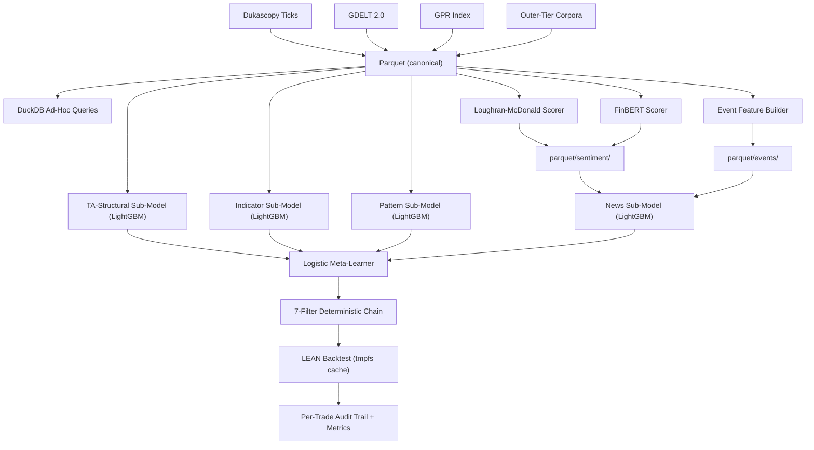
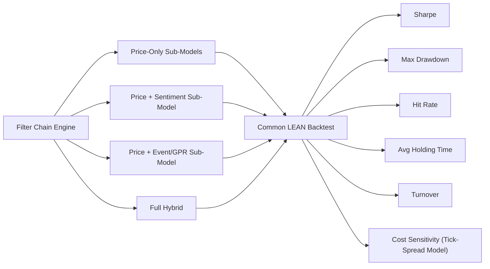
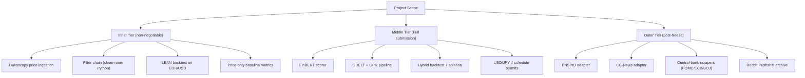

# TCC State Snapshot — Methodology Freeze

> This document is a snapshot of the TCC at methodology freeze. It records what was decided, what is implemented, and how the work positions itself against the closest published prior art. Forward-looking contemplation (open hyperparameter choices, future-work tiers, hypothetical extensions) is out of scope here and lives either in Chapter 05 of the dissertation or in a separate working session reserved for that purpose.
>
> **Authority note (updated 2026-05-24):** where this snapshot describes the storage/compute architecture, it is superseded by `algo-suite/docs/parquet-evaluation.md` (split storage, one feature engine, read-through cache) and by `PRD.md` for scope and timeline. Those documents are authoritative; older phrasing below is kept only as historical record.

## Shape of the Work

The TCC is an empirical-engineering comparison between a price-only baseline and a hybrid Forex trading strategy that adds point-in-time text-derived sentiment and event/regime features. The comparison runs on EUR/USD and USD/JPY over 2015–2024 under a combinatorial purged $k$-fold protocol with explicit embargo and a single held-out test pass (López de Prado, 2018).

The closest published prior art is Zhang et al. (2025), "MacroAlpha." Chapter 03 declares six axes of divergence from that work up front: validation protocol, temporal resolution, price-side feature breadth, text-side feature breadth, decision architecture, and execution path / license.

## Research Question (committed)

> Does adding point-in-time text-derived sentiment features and GDELT/GPR event-regime features improve a rules-based Forex trading strategy over a price-only baseline on EUR/USD and USD/JPY, after realistic transaction costs, under a combinatorial purged $k$-fold protocol?

## Scope (committed)

| Axis | Decision |
| --- | --- |
| Pairs | EUR/USD + USD/JPY |
| Window | 2015-02-19 to 2024-12-31 (10 years; lower bound = GDELT 2.0 launch) |
| Training span | 2015–2022 |
| Validation span | 2023 |
| Held-out test span | 2024 (single pass per variant) |
| Baseline | Price-only filter chain (same engine, news sub-model disabled) |
| Lexicon scorer | Loughran–McDonald |
| Transformer scorer | FinBERT (ProsusAI and Yang variants both evaluated) |
| Event source | GDELT 2.0 (GKG primary) |
| Regime index | Caldara & Iacoviello (2022) GPR, daily, forward-filled to minute grid |
| Outer-tier corpora | FNSPID, CC-News, FOMC/ECB/BOJ releases, Reddit Pushshift |

## Stack (committed)

- **Canonical storage (source of truth):** Apache Parquet, partitioned `year=YYYY/month=MM/`. DuckDB for ad-hoc queries.
- **Execution store:** durable `lean-data/` (LEAN-native), materialized once from Parquet and reused across the backtest sweep — derived, never regenerated per run. Optional `/dev/shm/lean-data/` tmpfs copy as a read accelerator (~100 MB per pair at minute resolution). Ticks stay Parquet-only.
- **Compute model:** one mode-agnostic feature/scorer engine behind a read-through cache (compute each bar exactly once, reuse otherwise) — identical in backtest and live, so no train/serve skew; cache backend pluggable (in-process LRU / file default; containerized service optional later).
- **Price source:** Dukascopy tick data (free demo-account access, full 2015–2024 window, both pairs). HistData and TrueFX as cross-checks.
- **Execution engine:** QuantConnect LEAN, Apache 2.0, Python algorithm interface, official OANDA brokerage adapter. Rejected: Backtrader (GPL v3), NautilusTrader (no OANDA adapter, LGPL v3), Vectorbt (no live-execution layer).
- **Sub-model architecture:** LightGBM per family.
- **Fusion:** late fusion via a logistic-regression meta-learner over four sub-model probabilities.
- **Validation:** combinatorial purged $k$-fold with embargo, walk-forward training.

## Feature Stack (committed)

Four families enter the input space.

- **TA-structural** — trend-regime (ADX + EMA slope), support/resistance (rolling extrema, pivot points), swing structure (ZigZag).
- **Indicators** — MAs, MACD, RSI, stochastic, ATR, realized volatility, Bollinger bandwidth, tick-count, bid/ask spread.
- **Patterns** — candlesticks via TA-Lib (Doji, Hammer, Engulfing, Morning/Evening Star, Three White Soldiers, Three Black Crows, …, ~60 patterns) + classical chart patterns via Lo et al. (2000) kernel-regression detection (head-and-shoulders, double tops/bottoms, triangles, flags).
- **News** — sentence-level scores from Loughran–McDonald and FinBERT, length-weighted to article, confidence-weighted to minute bucket. Event features from GDELT GKG + Events (CAMEO category counts, tone, Goldstein) and GPR.

All features computed with strict point-in-time discipline. Sentiment features advanced one minute relative to the price grid to prevent look-ahead leakage from publication-timestamp harmonization.

## Decision Architecture (committed)

Two-phase pipeline.

**Phase 1 — late fusion.** Four LightGBM sub-models (TA-structural, indicators, patterns, news) each emit a calibrated probability of an upward move at horizon $H$. A logistic-regression meta-learner combines the four into a single $\hat{p}_t \in [0,1]$.

**Phase 2 — deterministic filter chain.** Seven filters in sequence: trend-regime, indicator, pattern, news-context (vetoes on active high-risk events), risk-guard (drawdown / leverage / portfolio-at-risk caps), capital-management (lot size + margin check), terminal threshold. Terminal rule:

```
decision_t = BUY  if p_hat_t > theta_high and r_t = bull and v_t = 0
           = SELL if p_hat_t < theta_low  and r_t = bear and v_t = 0
           = HOLD otherwise
```

Thresholds calibrated on the validation span, held fixed on the test span. Every trade carries a full filter-by-filter audit trail. Chain configurable via YAML.

Two strategy variants share an identical meta-learner and filter chain; the only difference is whether the news sub-model's probability enters the meta-learner.

## Methodological Commitment

The central commitment is **agentic perception, deterministic execution**. The perception layer may be non-deterministic (FinBERT today, larger foundation models later) because its outputs are computed once and then read deterministically through the read-through cache and the materialized execution store at backtest time. The filter chain is rule-based, point-in-time-correct, and fully reproducible.

This separation is what makes future perception upgrades additive rather than architectural rewrites.

## Layered MVP

The build is sequenced as a layered MVP so the contribution survives at every point on the schedule.

- **Inner tier (non-negotiable):** price ingestion (Dukascopy → Parquet), deterministic filter chain, LEAN backtest on EUR/USD. Output: price-only baseline metrics.
- **Middle tier (Full submission):** FinBERT + GDELT + GPR. Output: hybrid metrics + ablation against the inner tier.
- **Outer tier (post-freeze if time allows):** FNSPID, CC-News, central-bank releases, Reddit Pushshift, Trump Twitter Archive, StockTwits. Deferred items documented as future work in Chapter 04 rather than as silent omissions.

Intermediate methodology delivery: **2026-05-25** (completed). Final submission: **2026-09-01**; scope freeze ~late August 2026 (exact date TBC). If the hybrid backtest is not running cleanly by the freeze, scope falls to Medium and Chapter 03 documents the hybrid pipeline as "implemented, results pending future work."

## Implementation Status at Methodology Freeze

| Component | Status |
| --- | --- |
| `news-downloader/` GDELT adapter | Implemented and runnable. Self-registering adapter pattern, Parquet output, YAML config + state round-trip via `ruamel.yaml`. |
| Other news adapters (FNSPID, CC-News, central banks, GPR, Reddit) | Planned. Parallel implementations following the same `NewsDataSource` ABC. |
| Forex price downloader | Planned sibling sub-project (`forex-downloader/`, not yet created). Dukascopy first. |
| Sentiment scorer pipeline | Planned. Writes to `parquet/sentiment/`. |
| Event feature builder | Planned. Writes to `parquet/events/`. |
| LightGBM sub-models + meta-learner | Planned. |
| Filter chain | Planned. Clean-room Python from author's prior MetaTrader-era domain knowledge. |
| LEAN integration | Planned. Parquet-to-LEAN converter + `PythonData` streaming. |
| Chapter 01 (Introduction) | Written. |
| Chapter 02 (Theoretical Foundation) | Written. |
| Chapter 03 (Methodology) | Written and frozen. |
| Chapter 04 (Experimental Evaluation) | Section placeholders enumerated; content pending engineering runs. |
| Chapter 05 (Conclusion) | Written, including future-work tiers A–D and MVP-to-production roadmap. |

## Definition of Success

Any of the following constitutes a defensible result:

- better risk-adjusted return than the baseline
- lower drawdown
- better behavior during high-news or high-risk regimes
- improvement only for specific pairs or specific regimes
- no improvement, with a disciplined explanation of why the added complexity did not justify itself

A negative result is valid when the protocol is rigorous and the implementation is auditable. The filter-by-filter audit trail is the mechanism that makes a negative result interpretable.

---

## Mermaid Diagrams

### 1. Committed System Architecture



### 2. Ablation Design



### 3. Layered MVP Scope at Freeze



## Review, 2026-09-28 (Stories 19/21/22 implementation push)

Worktree `docs/monograph-19-21-22` at `0f503be`, read-only review ahead of Chapters 4/5 receiving Story 19/21/22 results. `algo-suite/PRD.md` records the deposit deadline as **2026-09-29 (tomorrow relative to this review)**; `algo-suite/CLAUDE.md`'s "Submission track" line still says "Final submission 2026-05-25" and this snapshot's own header dates are explicitly historical — both are stale against PRD.md's own correction. Flagging this first because it changes how the remaining findings should be triaged.

### 1. Build health

`make rebuild`: clean full build, exit 0, **131 pages**. `make verify`: **zero undefined citations**. `make pt-scan`: one genuine leftover-Portuguese phrase in the body, everything else in the flagged-word list is expected (bibliography entries citing Portuguese-language sources by their original titles, the required pt-BR Resumo, the catalog card).

- **Real fix needed:** `chapters/03-methodology.tex:352` (filter F8, extended-filter set) — "pattern list (expansível até $\sim$60 padrões do TA-Lib)" is untranslated Portuguese inside English body text.
- Two more English-only slips pt-scan's accent-only scan doesn't catch: `chapters/01-introduction.tex` cites `\citeauthor{vanhelden2021fx}, Tabela~6, p.~35` ("Tabela" → "Table"); `bib/references.bib`'s `kassis2026skills` entry has `urlaccessdate = {26 set. 2026}` ("set." → "Sep.").

### 2. Consistency against the committed Scope/Stack/Feature/Decision rows above

This snapshot is a frozen methodology-freeze record (its own header defers to `PRD.md` and `parquet-evaluation.md` for anything about schedule/architecture), so "direction" is read here as the committed rows above, checked against the current manuscript + evidence.

| Item | Status | Note |
| --- | --- | --- |
| Research question / H1 on the 2024 test span | **Not yet addressed** | Ch.1's H1 (`chapters/01-introduction.tex`) is literally scoped to "the 2024 test span"; every result Chapter 4 reports is 2015–2017 (six-month pilot, then March 2016–Feb 2017). Chapter 4 correctly labels this exploratory, but Ch.1 doesn't acknowledge that the stated test span is out of reach given the deposit date above. |
| EUR/USD + USD/JPY | **Partially addressed** | Architecture is pair-agnostic and the commitment is stated; all Chapter 4 evidence is EUR/USD only, USD/JPY unrun. |
| Lexicon (Loughran–McDonald) + Transformer (FinBERT) scorers | **Not yet addressed** | Ch.4 states text sentiment is absent throughout; only the GDELT event-intensity (Goldstein) scalar is live. |
| GDELT 2.0, GKG primary | **Partially addressed** | Implemented path uses GDELT Events (event intensity), not GKG-derived sentiment; §3.6.7 (`subsec:why-event-index`) explains this as a deliberate, documented schedule trade-off, not silent drift. |
| Caldara–Iacoviello GPR index | **Not yet addressed** | Not present in any Ch.4 run. |
| Outer-tier corpora (FNSPID, CC-News, central banks, Reddit) | **Not yet addressed** | Still "planned" in §3.5; consistent with the layered-MVP graceful-degradation plan this snapshot itself describes. |
| Storage/compute stack (Parquet canonical, materialized `lean-data/`, read-through cache, LEAN pinned engine) | **Addressed** | §3.3 and §3.9 match the running system; Ch.4 evidence (hash-pinned engine image, materializer parity tests) corroborates it. |
| Decision architecture (5 sub-models, late fusion, F1–F7 chain) | **Addressed (core), partial (extended F8–F20)** | F1–F7 run in every reported cell; F3 has a real TA-Lib detector only in the newer H4 cells (predecessor pilot's F3 config was inert); F8–F20 are specified in §3.8.2 but only F8/F3-equivalent TA-Lib detection is actually exercised so far. |
| Definition of success (incl. "no improvement, with a disciplined explanation") | **Addressed** | Chapters 4–5 report exactly this outcome for the reproduced one-year study, with an auditable, registered-before-viewing trail — the strongest point of alignment between this snapshot's stated intent and what was actually built. |

### 3. Chapter 3's new "Adaptive Recency-Weighted Retraining" subsection (`subsec:adaptive-retraining`, lines 429–457)

Reads well in place: it opens by referring back to the walk-forward protocol stated just above it, uses the same F7/terminal-filter and combiner vocabulary as the rest of the chapter, and reuses the Politis–Romano stationary-bootstrap citation already established in §3.10.1 rather than introducing a new method. It matches Chapter 5's forward-reference to "five policies (frozen, thresholds refreshed, rolling, expanding, exponentially weighted)" verbatim in ordering. No claim in it contradicts anything stated elsewhere in Chapter 3 or in the abstract (the abstract doesn't mention retraining at all, which is fine — it's a secondary study, not part of the H1 claim).

One gap: it isn't cross-referenced from Table~\ref{tab:experiments} ("Numbered Experiments," nine rows). A reader moving from this new subsection straight into that table may wonder whether the retraining study is an implicit tenth experiment. A one-line pointer either way (e.g., "reported separately from the numbered experiments above") would close it.

### 4. Chapter 4/5 readiness for Stories 19/21/22

Chapter 4 is **not** the skeleton `algo-suite/CLAUDE.md` still describes ("work in progress... section plan only, no results yet") — that line is stale. The chapter is a dense, dated, evidence-linked report running through a reproduced one-year, twelve-cell comparison ("session 2"), and it already states its central finding as a disciplined negative result. Two sections remain literal placeholders: §4.2 "Data Coverage" and §4.10 "Comparison with Closest Prior Art" (both "\textit{To be added in the final version}"). Given the deposit date noted above, these need to be either filled or explicitly carried as a known gap in the final submission, not left silently pending.

Chapter 1's closing "Document Structure" paragraph (last paragraph of `chapters/01-introduction.tex`) still says the experimental chapter "will be completed for the final submission, once the empirical results... have been produced" — that describes the intermediate-submission state and is now stale against Chapter 4's actual content; it should be rewritten to describe what the final chapter contains.

Nothing in Chapters 4–5 pre-commits to a direction for the Story 19/21/22 results: the four registered follow-ups in §5.2 (`subsec:future-registered`) — adaptive retraining, confluence chain, exogenous-market features, and the price-action/momentum/Ichimoku contest — are framed as open, registered hypotheses against "the baseline these studies must beat," not as claims of a particular outcome. That framing is safe to build on regardless of what Stories 19/21/22 find.

### Summary for the team lead

- Build: 131 pages, 0 undefined citations, pt-scan clean apart from one real leftover-Portuguese phrase (§3.8.2, F8) plus two accent-less English-only slips ("Tabela," "set.").
- Direction tally: 2 fully addressed, 3 partially addressed, 5 not yet addressed (table above) — all consistent with the declared layered-MVP schedule, nothing silently dropped.
- Top findings: (1) the 2026-09-29 deposit deadline in `PRD.md` contradicts the stale `2026-05-25` line in `algo-suite/CLAUDE.md` and isn't reflected anywhere in this file; (2) H1 as worded targets the 2024 test span, which no run has touched; (3) Chapter 4 is already a full evidence-backed report, not a skeleton — two "to be added" sections remain; (4) Chapter 1's structure paragraph is stale relative to Chapter 4's actual content; (5) the new retraining subsection is solid but not cross-referenced from the numbered-experiments table.

