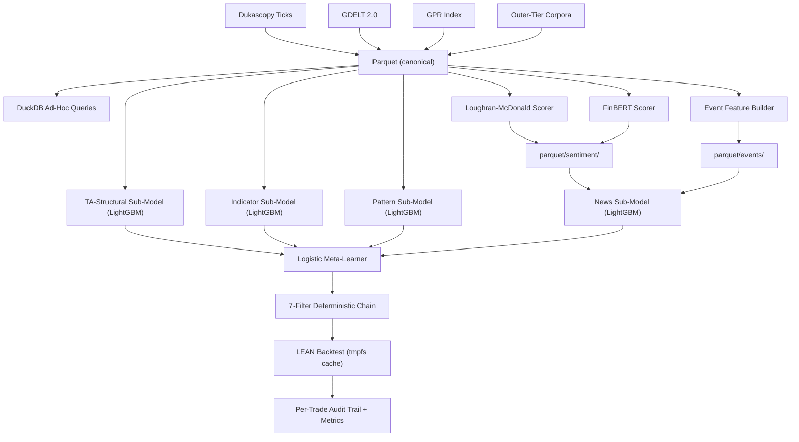
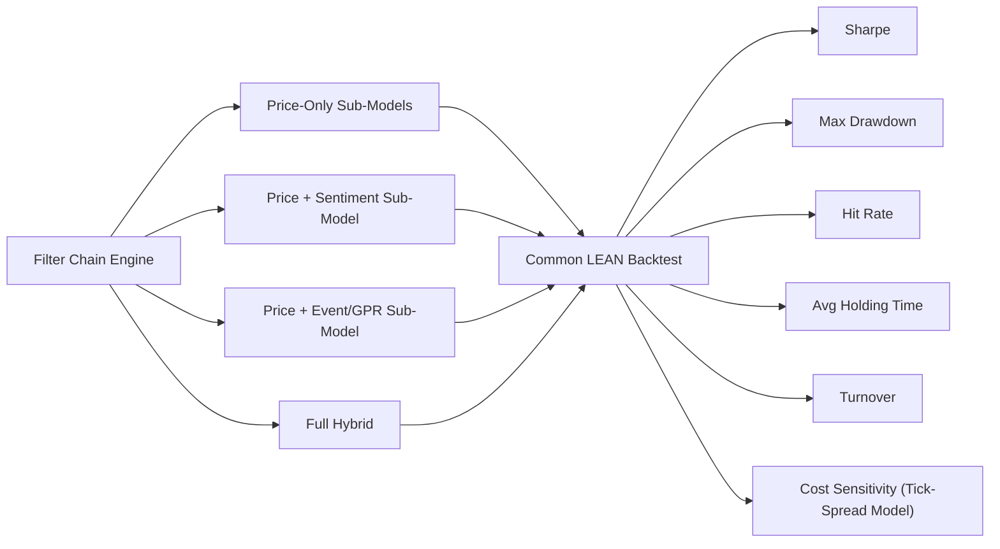
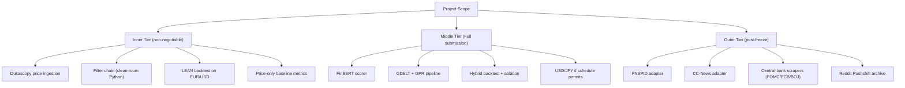

# TCC State Snapshot — Methodology Freeze

> This document is a snapshot of the TCC at methodology freeze. It records what was decided, what is implemented, and how the work positions itself against the closest published prior art. Forward-looking contemplation (open hyperparameter choices, future-work tiers, hypothetical extensions) is out of scope here and lives either in Chapter 05 of the dissertation or in a separate working session reserved for that purpose.
>
> **Authority note (updated 2026-05-24):** where this snapshot describes the storage/compute architecture, it is superseded by `algo-suite/docs/parquet-evaluation.md` (split storage, one feature engine, read-through cache) and by `PRD.md` for scope and timeline. Those documents are authoritative; older phrasing below is kept only as historical record.

## Shape of the Work

The TCC is an empirical-engineering comparison between a price-only baseline and a hybrid Forex trading strategy that adds point-in-time text-derived sentiment and event/regime features. The comparison runs on EUR/USD and USD/JPY over 2015–2024 under a combinatorial purged $k$-fold protocol with explicit embargo and a single held-out test pass (López de Prado, 2018).

The closest published prior art is Zhang et al. (2025), "MacroAlpha." Chapter 03 declares six axes of divergence from that work up front: validation protocol, temporal resolution, price-side feature breadth, text-side feature breadth, decision architecture, and execution path / license.

## Research Question (committed)

> Does adding point-in-time text-derived sentiment features and GDELT/GPR event-regime features improve a rules-based Forex trading strategy over a price-only baseline on EUR/USD and USD/JPY, after realistic transaction costs, under a combinatorial purged $k$-fold protocol?

## Scope (committed)

| Axis | Decision |
| --- | --- |
| Pairs | EUR/USD + USD/JPY |
| Window | 2015-02-19 to 2024-12-31 (10 years; lower bound = GDELT 2.0 launch) |
| Training span | 2015–2022 |
| Validation span | 2023 |
| Held-out test span | 2024 (single pass per variant) |
| Baseline | Price-only filter chain (same engine, news sub-model disabled) |
| Lexicon scorer | Loughran–McDonald |
| Transformer scorer | FinBERT (ProsusAI and Yang variants both evaluated) |
| Event source | GDELT 2.0 (GKG primary) |
| Regime index | Caldara & Iacoviello (2022) GPR, daily, forward-filled to minute grid |
| Outer-tier corpora | FNSPID, CC-News, FOMC/ECB/BOJ releases, Reddit Pushshift |

## Stack (committed)

- **Canonical storage (source of truth):** Apache Parquet, partitioned `year=YYYY/month=MM/`. DuckDB for ad-hoc queries.
- **Execution store:** durable `lean-data/` (LEAN-native), materialized once from Parquet and reused across the backtest sweep — derived, never regenerated per run. Optional `/dev/shm/lean-data/` tmpfs copy as a read accelerator (~100 MB per pair at minute resolution). Ticks stay Parquet-only.
- **Compute model:** one mode-agnostic feature/scorer engine behind a read-through cache (compute each bar exactly once, reuse otherwise) — identical in backtest and live, so no train/serve skew; cache backend pluggable (in-process LRU / file default; containerized service optional later).
- **Price source:** Dukascopy tick data (free demo-account access, full 2015–2024 window, both pairs). HistData and TrueFX as cross-checks.
- **Execution engine:** QuantConnect LEAN, Apache 2.0, Python algorithm interface, official OANDA brokerage adapter. Rejected: Backtrader (GPL v3), NautilusTrader (no OANDA adapter, LGPL v3), Vectorbt (no live-execution layer).
- **Sub-model architecture:** LightGBM per family.
- **Fusion:** late fusion via a logistic-regression meta-learner over four sub-model probabilities.
- **Validation:** combinatorial purged $k$-fold with embargo, walk-forward training.

## Feature Stack (committed)

Four families enter the input space.

- **TA-structural** — trend-regime (ADX + EMA slope), support/resistance (rolling extrema, pivot points), swing structure (ZigZag).
- **Indicators** — MAs, MACD, RSI, stochastic, ATR, realized volatility, Bollinger bandwidth, tick-count, bid/ask spread.
- **Patterns** — candlesticks via TA-Lib (Doji, Hammer, Engulfing, Morning/Evening Star, Three White Soldiers, Three Black Crows, …, ~60 patterns) + classical chart patterns via Lo et al. (2000) kernel-regression detection (head-and-shoulders, double tops/bottoms, triangles, flags).
- **News** — sentence-level scores from Loughran–McDonald and FinBERT, length-weighted to article, confidence-weighted to minute bucket. Event features from GDELT GKG + Events (CAMEO category counts, tone, Goldstein) and GPR.

All features computed with strict point-in-time discipline. Sentiment features advanced one minute relative to the price grid to prevent look-ahead leakage from publication-timestamp harmonization.

## Decision Architecture (committed)

Two-phase pipeline.

**Phase 1 — late fusion.** Four LightGBM sub-models (TA-structural, indicators, patterns, news) each emit a calibrated probability of an upward move at horizon $H$. A logistic-regression meta-learner combines the four into a single $\hat{p}_t \in [0,1]$.

**Phase 2 — deterministic filter chain.** Seven filters in sequence: trend-regime, indicator, pattern, news-context (vetoes on active high-risk events), risk-guard (drawdown / leverage / portfolio-at-risk caps), capital-management (lot size + margin check), terminal threshold. Terminal rule:

```
decision_t = BUY  if p_hat_t > theta_high and r_t = bull and v_t = 0
           = SELL if p_hat_t < theta_low  and r_t = bear and v_t = 0
           = HOLD otherwise
```

Thresholds calibrated on the validation span, held fixed on the test span. Every trade carries a full filter-by-filter audit trail. Chain configurable via YAML.

Two strategy variants share an identical meta-learner and filter chain; the only difference is whether the news sub-model's probability enters the meta-learner.

## Methodological Commitment

The central commitment is **agentic perception, deterministic execution**. The perception layer may be non-deterministic (FinBERT today, larger foundation models later) because its outputs are computed once and then read deterministically through the read-through cache and the materialized execution store at backtest time. The filter chain is rule-based, point-in-time-correct, and fully reproducible.

This separation is what makes future perception upgrades additive rather than architectural rewrites.

## Layered MVP

The build is sequenced as a layered MVP so the contribution survives at every point on the schedule.

- **Inner tier (non-negotiable):** price ingestion (Dukascopy → Parquet), deterministic filter chain, LEAN backtest on EUR/USD. Output: price-only baseline metrics.
- **Middle tier (Full submission):** FinBERT + GDELT + GPR. Output: hybrid metrics + ablation against the inner tier.
- **Outer tier (post-freeze if time allows):** FNSPID, CC-News, central-bank releases, Reddit Pushshift, Trump Twitter Archive, StockTwits. Deferred items documented as future work in Chapter 04 rather than as silent omissions.

Intermediate methodology delivery: **2026-05-25** (completed). Final submission: **2026-09-01**; scope freeze ~late August 2026 (exact date TBC). If the hybrid backtest is not running cleanly by the freeze, scope falls to Medium and Chapter 03 documents the hybrid pipeline as "implemented, results pending future work."

## Implementation Status at Methodology Freeze

| Component | Status |
| --- | --- |
| `news-downloader/` GDELT adapter | Implemented and runnable. Self-registering adapter pattern, Parquet output, YAML config + state round-trip via `ruamel.yaml`. |
| Other news adapters (FNSPID, CC-News, central banks, GPR, Reddit) | Planned. Parallel implementations following the same `NewsDataSource` ABC. |
| Forex price downloader | Planned sibling sub-project (`forex-downloader/`, not yet created). Dukascopy first. |
| Sentiment scorer pipeline | Planned. Writes to `parquet/sentiment/`. |
| Event feature builder | Planned. Writes to `parquet/events/`. |
| LightGBM sub-models + meta-learner | Planned. |
| Filter chain | Planned. Clean-room Python from author's prior MetaTrader-era domain knowledge. |
| LEAN integration | Planned. Parquet-to-LEAN converter + `PythonData` streaming. |
| Chapter 01 (Introduction) | Written. |
| Chapter 02 (Theoretical Foundation) | Written. |
| Chapter 03 (Methodology) | Written and frozen. |
| Chapter 04 (Experimental Evaluation) | Section placeholders enumerated; content pending engineering runs. |
| Chapter 05 (Conclusion) | Written, including future-work tiers A–D and MVP-to-production roadmap. |

## Definition of Success

Any of the following constitutes a defensible result:

- better risk-adjusted return than the baseline
- lower drawdown
- better behavior during high-news or high-risk regimes
- improvement only for specific pairs or specific regimes
- no improvement, with a disciplined explanation of why the added complexity did not justify itself

A negative result is valid when the protocol is rigorous and the implementation is auditable. The filter-by-filter audit trail is the mechanism that makes a negative result interpretable.

---

## Mermaid Diagrams

### 1. Committed System Architecture



### 2. Ablation Design



### 3. Layered MVP Scope at Freeze


